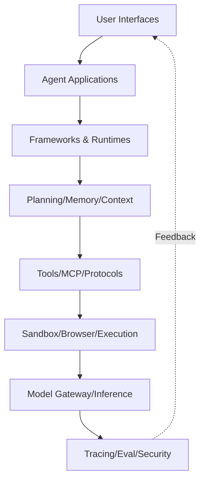

# Agentic Ecosystem Landscape

**Snapshot date:** 2026-07-07

## Layer Architecture

```
┌──────────────────────────────────────┐
│      User Interfaces & Workspaces     │  J. Applications
├──────────────────────────────────────┤
│        Agent Applications             │  Knowledge work, research, DevOps
├──────────────────────────────────────┤
│     Frameworks & Runtimes             │  B. Agent construction & execution
├──────────────────────────────────────┤
│  Planning / Memory / Workflow         │  F. Context, reasoning, state
├──────────────────────────────────────┤
│    Tools / Skills / MCP / Protocols   │  D+E. Integration & interoperability
├──────────────────────────────────────┤
│   Sandbox / Browser / Execution       │  G. Safe execution environments
├──────────────────────────────────────┤
│     Model Gateway / Inference         │  I. Model infrastructure
├──────────────────────────────────────┤
│   Tracing / Evaluation / Security     │  H. Reliability & operations
└──────────────────────────────────────┘
```

## Layer Descriptions

### User Layer (J)
Chat interfaces, dashboards, workspaces, no-code builders, and vertical agent applications.

### Application Layer (J, C)
Coding agents, research agents, DevOps agents, and knowledge-work agents that users interact with directly.

### Framework Layer (B)
Agent frameworks, runtimes, graph orchestrators, multi-agent systems, and durable execution engines.
These provide the programming model for building agents.

### Intelligence Layer (B.12, F)
Planning, reasoning, task decomposition, memory systems, RAG, knowledge graphs, and context engineering.

### Integration Layer (D, E)
MCP servers/clients/SDKs, tool-calling libraries, agent protocols, skills, and connectors.
This is where agents connect to external tools and data sources.

### Execution Layer (G)
Browser agents, computer-use agents, sandboxes, code execution, and containers.
Safe environments for agents to take actions.

### Infrastructure Layer (I)
Model gateways, inference servers, local stacks, cloud platforms, agent scheduling, and control planes.

### Operations Layer (H)
Observability, tracing, evaluation, benchmarks, guardrails, security, and cost management.

## Mermaid Diagram



*Snapshot: 2026-07-07*