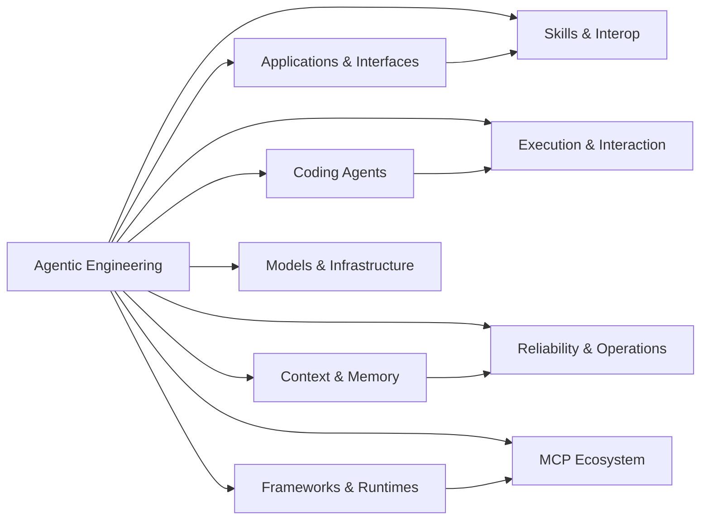

# Agentic Engineering Compendium

> A searchable, evidence-oriented map of the AI-agent engineering ecosystem.


| Projects | Accepted | Excluded | Top-level categories | Subcategories | Snapshot |
|---:|---:|---:|---:|---:|---|
| 1468 | 742 | 726 | 10 | 81 | 2026-07-07 |

## Start Here

| Need | Start with |
|---|---|
| Best production-ready projects | [Top 25 Projects](#top-25-projects) |
| Category navigation | [Contents](#contents) |
| Ecosystem shape | [Ecosystem Map](#ecosystem-map) |
| Full data dump in one page | [Complete Catalog](#complete-catalog) |
| Scoring rules | [Methodology](METHODOLOGY.md) |

## Ecosystem Map



---

## Contents

- [Applications and interfaces](#applications-and-interfaces) - 142 projects
- [Coding and software engineering agents](#coding-and-software-engineering-agents) - 48 projects
- [Context, knowledge, and memory](#context-knowledge-and-memory) - 70 projects
- [Execution and interaction](#execution-and-interaction) - 31 projects
- [Frameworks and runtimes](#frameworks-and-runtimes) - 275 projects
- [Learning and foundations](#learning-and-foundations) - 16 projects
- [MCP ecosystem](#mcp-ecosystem) - 79 projects
- [Models and infrastructure](#models-and-infrastructure) - 27 projects
- [Reliability and operations](#reliability-and-operations) - 26 projects
- [Skills, extensions, and interoperability](#skills-extensions-and-interoperability) - 28 projects

---

## Score Distribution

| Rating | Score range | Projects |
|---|---:|---:|
| Essential | 85+ | 11 |
| Strong | 75-84 | 169 |
| Emerging | 65-74 | 340 |
| Watchlist | 50-64 | 222 |
| Excluded | <50 | 726 |

---

## Top 25 Projects

| # | Project | Stars | Score | Category |
|---:|---|---:|---:|---|
| 1 | [n8n-io/n8n](https://github.com/n8n-io/n8n) | 196k | 92 | MCP servers |
| 2 | [openinterpreter/openinterpreter](https://github.com/openinterpreter/openinterpreter) | 64.3k | 88 | Coding agents |
| 3 | [ollama/ollama](https://github.com/ollama/ollama) | 176k | 86 | Model gateways and routers |
| 4 | [weaviate/weaviate](https://github.com/weaviate/weaviate) | 16.5k | 86 | Agent frameworks |
| 5 | [browser-use/browser-use](https://github.com/browser-use/browser-use) | 103k | 86 | Agent frameworks |
| 6 | [run-llama/llama_index](https://github.com/run-llama/llama_index) | 50.7k | 85 | RAG and retrieval |
| 7 | [vllm-project/vllm](https://github.com/vllm-project/vllm) | 85.6k | 85 | Model gateways and routers |
| 8 | [langchain-ai/langchain](https://github.com/langchain-ai/langchain) | 141k | 85 | Graph and workflow orchestration |
| 9 | [microsoft/semantic-kernel](https://github.com/microsoft/semantic-kernel) | 28.3k | 85 | Agent frameworks |
| 10 | [letta-ai/letta](https://github.com/letta-ai/letta) | 23.7k | 85 | Agent frameworks |
| 11 | [qdrant/qdrant](https://github.com/qdrant/qdrant) | 33.0k | 85 | Agent frameworks |
| 12 | [langfuse/langfuse](https://github.com/langfuse/langfuse) | 30.6k | 84 | Agent observability |
| 13 | [mem0ai/mem0](https://github.com/mem0ai/mem0) | 60.3k | 83 | RAG and retrieval |
| 14 | [FlowiseAI/Flowise](https://github.com/FlowiseAI/Flowise) | 54.4k | 83 | RAG and retrieval |
| 15 | [SWE-agent/SWE-agent](https://github.com/SWE-agent/SWE-agent) | 19.7k | 83 | Coding agents |
| 16 | [langchain-ai/langgraph](https://github.com/langchain-ai/langgraph) | 36.7k | 83 | Graph and workflow orchestration |
| 17 | [anthropics/claude-code](https://github.com/anthropics/claude-code) | 137k | 82 | Coding agents |
| 18 | [modelcontextprotocol/python-sdk](https://github.com/modelcontextprotocol/python-sdk) | 23.6k | 82 | Agent frameworks |
| 19 | [modelcontextprotocol/servers](https://github.com/modelcontextprotocol/servers) | 88.2k | 82 | Agent frameworks |
| 20 | [modelcontextprotocol/inspector](https://github.com/modelcontextprotocol/inspector) | 10.3k | 82 | Agent frameworks |
| 21 | [openai/openai-agents-python](https://github.com/openai/openai-agents-python) | 27.7k | 82 | Agent frameworks |
| 22 | [confident-ai/deepeval](https://github.com/confident-ai/deepeval) | 16.7k | 81 | Evaluation frameworks |
| 23 | [Panniantong/Agent-Reach](https://github.com/Panniantong/Agent-Reach) | 52.6k | 81 | Agent frameworks |
| 24 | [D4Vinci/Scrapling](https://github.com/D4Vinci/Scrapling) | 68.5k | 81 | MCP servers |
| 25 | [ruvnet/ruflo](https://github.com/ruvnet/ruflo) | 63.4k | 81 | MCP servers |

---

# Complete Catalog

**742 projects** grouped by category. Expand a project for details.

## Applications and interfaces

| Subcategory | Projects |
|---|---:|
| Agent workspaces and chat interfaces | 3 |
| No-code and low-code agent builders | 5 |
| Templates, examples, and starter kits | 44 |
| Vertical agents | 1 |

<details>
<summary><strong>nocobase/nocobase - 23.3k stars - score 76/100 - Strong - TypeScript</strong></summary>

> NocoBase is an open-source AI + no-code platform for building business systems fast. Instead of generating everything from scratch, AI works on top of production-proven...

[Open repository](https://github.com/nocobase/nocobase)

| Category | Language | Status | Score | Stars |
|---|---|---|---:|---:|
| No-code and low-code agent builders | TypeScript | Community | 76/100 | 23.3k |

**Tags:** `admin-dashboard` `ai-agent` `ai-agents` `ai-assistant` `ai-tools` `airtable` `crm` `crud`

</details>

<details>
<summary><strong>x1xhlol/system-prompts-and-models-of-ai-tools - 142k stars - score 75/100 - Strong - ?</strong></summary>

> FULL Augment Code, Claude Code, Cluely, CodeBuddy, Comet, Cursor, Devin AI, Junie, Kiro, Leap.new, Lovable, Manus, NotionAI, Orchids.app, Perplexity, Poke, Qoder, Replit,...

[Open repository](https://github.com/x1xhlol/system-prompts-and-models-of-ai-tools)

| Category | Language | Status | Score | Stars |
|---|---|---|---:|---:|
| Templates, examples, and starter kits | ? | Community | 75/100 | 142k |

**Tags:** `ai` `bolt` `cluely` `copilot` `cursor` `cursorai` `devin` `github-copilot`

</details>

<details>
<summary><strong>VoltAgent/awesome-design-md - 96.6k stars - score 75/100 - Strong - ?</strong></summary>

> A collection of DESIGN.md files analysis by popular brand design systems. Drop one into your project and let coding agents generate a matching UI.

[Open repository](https://github.com/VoltAgent/awesome-design-md)

| Category | Language | Status | Score | Stars |
|---|---|---|---:|---:|
| Templates, examples, and starter kits | ? | Community | 75/100 | 96.6k |

**Tags:** `awesome-list` `design-md` `design-system` `design-tokens` `figma` `google-stitch` `landing-page` `vibe-coding`

</details>

<details>
<summary><strong>pytorch/executorch - 4.8k stars - score 74.6/100 - Emerging - Python</strong></summary>

> On-device AI across mobile, embedded and edge for PyTorch

[Open repository](https://github.com/pytorch/executorch)

| Category | Language | Status | Score | Stars |
|---|---|---|---:|---:|
| Templates, examples, and starter kits | Python | Community | 74.6/100 | 4.8k |

**Tags:** `deep-learning` `embedded` `gpu` `machine-learning` `mobile` `neural-network` `tensor`

</details>

<details>
<summary><strong>modelcontextprotocol/kotlin-sdk - 1.4k stars - score 74.1/100 - Emerging - Kotlin</strong></summary>

> The official Kotlin SDK for Model Context Protocol servers and clients. Maintained in collaboration with JetBrains

[Open repository](https://github.com/modelcontextprotocol/kotlin-sdk)

| Category | Language | Status | Score | Stars |
|---|---|---|---:|---:|
| Templates, examples, and starter kits | Kotlin | Community | 74.1/100 | 1.4k |

**Tags:** `kotlin-multiplatform` `mcp`

</details>

<details>
<summary><strong>ToolJet/ToolJet - 38.2k stars - score 74/100 - Emerging - JavaScript</strong></summary>

> ToolJet is the open-source foundation of ToolJet AI - the enterprise app generation platform for building internal tools, dashboard, business applications, workflows and AI...

[Open repository](https://github.com/ToolJet/ToolJet)

| Category | Language | Status | Score | Stars |
|---|---|---|---:|---:|
| No-code and low-code agent builders | JavaScript | Community | 74/100 | 38.2k |

**Tags:** `ai-app-builder` `docker` `hacktoberfest` `internal-applications` `internal-project` `internal-tool` `internal-tools` `javascript`

</details>

<details>
<summary><strong>ag-ui-protocol/ag-ui - 14.6k stars - score 73/100 - Emerging - TypeScript</strong></summary>

> AG-UI: the Agent-User Interaction Protocol. Bring Agents into Frontend Applications.

[Open repository](https://github.com/ag-ui-protocol/ag-ui)

| Category | Language | Status | Score | Stars |
|---|---|---|---:|---:|
| Agent workspaces and chat interfaces | TypeScript | Community | 73/100 | 14.6k |

**Tags:** `ag-ui-protocol` `agent-frontend` `agent-ui` `agentic-workflow` `ai-agents`

</details>

<details>
<summary><strong>Budibase/budibase - 28.1k stars - score 73/100 - Emerging - TypeScript</strong></summary>

> AI agents, automations and apps that run your operations. Model agnostic.

[Open repository](https://github.com/Budibase/budibase)

| Category | Language | Status | Score | Stars |
|---|---|---|---:|---:|
| No-code and low-code agent builders | TypeScript | Community | 73/100 | 28.1k |

**Tags:** `ai-app-builder` `ai-applications` `crud-app` `crud-application` `data-application` `data-apps` `internal-tools` `it-workflows`

</details>

<details>
<summary><strong>rocketride-org/rocketride-server - 5.0k stars - score 69.8/100 - Emerging - Python</strong></summary>

> High-performance AI pipeline engine with a C++ core and 50+ Python-extensible nodes. Build, debug, and scale LLM workflows with 13+ model providers, 8+ vector databases, and...

[Open repository](https://github.com/rocketride-org/rocketride-server)

| Category | Language | Status | Score | Stars |
|---|---|---|---:|---:|
| Templates, examples, and starter kits | Python | Community | 69.8/100 | 5.0k |

**Tags:** `ai` `cpp` `data-pipeline` `data-processing` `machine-learning` `mcp` `python` `sdk`

</details>

<details>
<summary><strong>dograh-hq/dograh - 4.8k stars - score 68.6/100 - Emerging - Python</strong></summary>

> Open source voice AI platform. Self-hosted alternative to Vapi and Retell. On Prem, BYOK across Speech to Speech or LLM/STT/TTS, with a visual workflow builder, MCP native and...

[Open repository](https://github.com/dograh-hq/dograh)

| Category | Language | Status | Score | Stars |
|---|---|---|---:|---:|
| No-code and low-code agent builders | Python | Community | 68.6/100 | 4.8k |

**Tags:** `ai-calling` `asterisk-ari` `conversational-ai` `inbound-calls` `local-llm` `no-code` `on-prem-voice-agent-platform` `open-source`

</details>

<details>
<summary><strong>getzep/zep - 4.7k stars - score 68.5/100 - Emerging - Python</strong></summary>

> Zep | Examples, Integrations, & More

[Open repository](https://github.com/getzep/zep)

| Category | Language | Status | Score | Stars |
|---|---|---|---:|---:|
| Templates, examples, and starter kits | Python | Community | 68.5/100 | 4.7k |

**Tags:** `ai` `knowledge-graphs` `language-model` `llm`

</details>

<details>
<summary><strong>baserow/baserow - 5.3k stars - score 67.6/100 - Emerging - Python</strong></summary>

> Build databases, automations, apps & agents with AI — no code. Open source platform available on cloud and self-hosted. GDPR, HIPAA, SOC 2 compliant. Best Airtable alternative.

[Open repository](https://github.com/baserow/baserow)

| Category | Language | Status | Score | Stars |
|---|---|---|---:|---:|
| No-code and low-code agent builders | Python | Community | 67.6/100 | 5.3k |

**Tags:** `airtable` `airtable-alternative` `airtable-replacement` `application-builder` `automations` `dashboards` `database` `low-code`

</details>

<details>
<summary><strong>panaversity/learn-agentic-ai - 4.3k stars - score 67.5/100 - Emerging - Jupyter Notebook</strong></summary>

> Learn Agentic AI using Dapr Agentic Cloud Ascent (DACA) Design Pattern and Agent-Native Cloud Technologies: OpenAI Agents SDK, Memory, MCP, A2A, Knowledge Graphs, Dapr, Rancher...

[Open repository](https://github.com/panaversity/learn-agentic-ai)

| Category | Language | Status | Score | Stars |
|---|---|---|---:|---:|
| Templates, examples, and starter kits | Jupyter Notebook | Community | 67.5/100 | 4.3k |

**Tags:** `a2a` `agentic-ai` `dapr` `dapr-pub-sub` `dapr-service-invocation` `dapr-sidecar` `dapr-workflow` `docker`

</details>

<details>
<summary><strong>FireRedTeam/FireRed-OpenStoryline - 3.1k stars - score 66.9/100 - Emerging - Python</strong></summary>

> FireRed-OpenStoryline is an AI video editing agent that transforms manual editing into intention-driven directing through natural language interaction, LLM-powered planning, and...

[Open repository](https://github.com/FireRedTeam/FireRed-OpenStoryline)

| Category | Language | Status | Score | Stars |
|---|---|---|---:|---:|
| Templates, examples, and starter kits | Python | Community | 66.9/100 | 3.1k |

**Tags:** `agent` `chatbot` `langchain` `mcp` `skills` `video` `video-cut` `video-editing`

</details>

<details>
<summary><strong>outsourc-e/hermes-workspace - 6.0k stars - score 66.8/100 - Emerging - JavaScript</strong></summary>

> Native web workspace for Hermes Agent — chat, terminal, memory, skills, inspector.

[Open repository](https://github.com/outsourc-e/hermes-workspace)

| Category | Language | Status | Score | Stars |
|---|---|---|---:|---:|
| Agent workspaces and chat interfaces | JavaScript | Community | 66.8/100 | 6.0k |

**Tags:** `agent-ui` `ai-workspace` `hackathon` `hermes-agent` `nous-research` `react` `typescript`

</details>

<details>
<summary><strong>modelcontextprotocol/ext-apps - 2.5k stars - score 66.7/100 - Emerging - TypeScript</strong></summary>

> Official repo for spec & SDK of MCP Apps protocol - standard for UIs embedded AI chatbots, served by MCP servers

[Open repository](https://github.com/modelcontextprotocol/ext-apps)

| Category | Language | Status | Score | Stars |
|---|---|---|---:|---:|
| Templates, examples, and starter kits | TypeScript | Community | 66.7/100 | 2.5k |

**Tags:** `ai` `apps` `mcp` `mcp-apps` `modelcontextprotocol` `ui`

</details>

<details>
<summary><strong>metorial/metorial - 3.3k stars - score 66.0/100 - Emerging - TypeScript</strong></summary>

> Connect any AI model to 1200+ integrations (MCP, CLI, API)

[Open repository](https://github.com/metorial/metorial)

| Category | Language | Status | Score | Stars |
|---|---|---|---:|---:|
| Templates, examples, and starter kits | TypeScript | Community | 66.0/100 | 3.3k |

**Tags:** `agent` `agentic-ai` `agentic-workflow` `container` `docker` `mcp` `modelcontextprotocol` `security`

</details>

<details>
<summary><strong>snyk/agent-scan - 2.8k stars - score 65.7/100 - Emerging - Python</strong></summary>

> Security scanner for AI agents, MCP servers and agent skills.

[Open repository](https://github.com/snyk/agent-scan)

| Category | Language | Status | Score | Stars |
|---|---|---|---:|---:|
| Templates, examples, and starter kits | Python | Community | 65.7/100 | 2.8k |

**Tags:** `agent` `ai` `mcp` `modelcontextprotocol` `security`

</details>

<details>
<summary><strong>mesa/mesa - 3.7k stars - score 65.5/100 - Emerging - Python</strong></summary>

> Mesa is an open-source Python library for agent-based modeling, ideal for simulating complex systems and exploring emergent behaviors.

[Open repository](https://github.com/mesa/mesa)

| Category | Language | Status | Score | Stars |
|---|---|---|---:|---:|
| Templates, examples, and starter kits | Python | Community | 65.5/100 | 3.7k |

**Tags:** `agent-based-modeling` `agent-based-simulation` `complex-systems` `complexity-analysis` `gis` `mesa` `modeling-agents` `simulation`

</details>

<details>
<summary><strong>onecli/onecli - 2.5k stars - score 65.4/100 - Emerging - TypeScript</strong></summary>

> Open-source credential gateway with a built-in vault. give your AI agents access to services without exposing keys.

[Open repository](https://github.com/onecli/onecli)

| Category | Language | Status | Score | Stars |
|---|---|---|---:|---:|
| Templates, examples, and starter kits | TypeScript | Community | 65.4/100 | 2.5k |

**Tags:** `ai-agents` `cli` `mcp` `nanoclaw` `nodejs` `openclaw` `postgres` `rust`

</details>

<details>
<summary><strong>modelcontextprotocol/go-sdk - 4.8k stars - score 65.4/100 - Emerging - Go</strong></summary>

> The official Go SDK for Model Context Protocol servers and clients. Maintained in collaboration with Google.

[Open repository](https://github.com/modelcontextprotocol/go-sdk)

| Category | Language | Status | Score | Stars |
|---|---|---|---:|---:|
| Templates, examples, and starter kits | Go | Community | 65.4/100 | 4.8k |

**Tags:** `go` `mcp`

</details>

<details>
<summary><strong>modelcontextprotocol/java-sdk - 3.5k stars - score 65.3/100 - Emerging - Java</strong></summary>

> The official Java SDK for Model Context Protocol servers and clients. Maintained in collaboration with Spring AI

[Open repository](https://github.com/modelcontextprotocol/java-sdk)

| Category | Language | Status | Score | Stars |
|---|---|---|---:|---:|
| Templates, examples, and starter kits | Java | Community | 65.3/100 | 3.5k |

</details>

<details>
<summary><strong>dromara/liteflow - 3.8k stars - score 65.2/100 - Emerging - Java</strong></summary>

> Lightweight, fast, stable, programmable component-based rule engine — where AI Agents orchestrate just like ordinary components. Uniquely designed DSL: component reuse,...

[Open repository](https://github.com/dromara/liteflow)

| Category | Language | Status | Score | Stars |
|---|---|---|---:|---:|
| Templates, examples, and starter kits | Java | Community | 65.2/100 | 3.8k |

**Tags:** `ai-agent` `ai-agents` `component` `dsl` `flow-engine` `hot-reload` `java-rule` `java-rule-engine`

</details>

<details>
<summary><strong>ArcReel/ArcReel - 3.2k stars - score 65.1/100 - Emerging - Python</strong></summary>

> AI Agent 驱动的开源视频生成工作台 — 小说→角色/场景/道具设计→剧本→分镜图→视频，跨镜头角色与场景一致 | Open-source AI video workspace powered by AI Agents, Nano Banana 2 & Veo 3.1 / Grok / Seedance / OpenAI

[Open repository](https://github.com/ArcReel/ArcReel)

| Category | Language | Status | Score | Stars |
|---|---|---|---:|---:|
| Templates, examples, and starter kits | Python | Community | 65.1/100 | 3.2k |

**Tags:** `ai-agent` `ai-video-generator` `claude-agent-sdk` `docker` `gemini` `grok` `image-to-video` `nano-banana-2`

</details>

<details>
<summary><strong>Mouseww/anything-analyzer - 3.2k stars - score 65.1/100 - Emerging - TypeScript</strong></summary>

> 全能协议分析工具：浏览器抓包 + MITM 代理 + 指纹伪装 + AI 分析 + MCP Server 无缝对接 AI Agent/IDE | All-in-one protocol analysis toolkit — built-in browser capture, MITM proxy, JS hooks, fingerprint...

[Open repository](https://github.com/Mouseww/anything-analyzer)

| Category | Language | Status | Score | Stars |
|---|---|---|---:|---:|
| Templates, examples, and starter kits | TypeScript | Community | 65.1/100 | 3.2k |

**Tags:** `2api` `ai-tools` `analysis-cli` `api-analysis` `automation-tools` `blackbox-testing` `network-analysis` `protocol-analysis`

</details>

<details>
<summary><strong>ghostwright/phantom - 1.4k stars - score 65.0/100 - Emerging - TypeScript</strong></summary>

> An AI co-worker with its own computer. Self-evolving, persistent memory, MCP server, secure credential collection, email identity. Built on the Claude Agent SDK.

[Open repository](https://github.com/ghostwright/phantom)

| Category | Language | Status | Score | Stars |
|---|---|---|---:|---:|
| Templates, examples, and starter kits | TypeScript | Community | 65.0/100 | 1.4k |

**Tags:** `ai-agents` `ai-coworker` `anthropic` `autonomous-agents` `bun` `claude` `docker` `llm`

</details>

<details>
<summary><strong>eugeniughelbur/obsidian-second-brain - 3.0k stars - score 64.9/100 - Watchlist - Python</strong></summary>

> Cross-CLI skill for Obsidian: turn your vault into a living AI-first second brain across Claude Code, Codex, Gemini, OpenCode, Hermes, and Pi. 44 commands - self-rewriting notes,...

[Open repository](https://github.com/eugeniughelbur/obsidian-second-brain)

| Category | Language | Status | Score | Stars |
|---|---|---|---:|---:|
| Templates, examples, and starter kits | Python | Community | 64.9/100 | 3.0k |

**Tags:** `ai-agent` `ai-agents` `ai-automation` `ai-research` `ai-tools` `anthropic` `claude` `claude-ai`

</details>

<details>
<summary><strong>Bitterbot-AI/bitterbot-desktop - 2.4k stars - score 64.7/100 - Watchlist - TypeScript</strong></summary>

> A local-first AI agent with persistent memory, emotional intelligence, and a peer-to-peer skills economy.

[Open repository](https://github.com/Bitterbot-AI/bitterbot-desktop)

| Category | Language | Status | Score | Stars |
|---|---|---|---:|---:|
| Templates, examples, and starter kits | TypeScript | Community | 64.7/100 | 2.4k |

**Tags:** `a2a-protocol` `agent-economy` `agent-memory` `ai-agent` `chatbot` `cognitive-architecture` `decentralized-ai` `desktop-app`

</details>

<details>
<summary><strong>ComposioHQ/awesome-claude-plugins - 1.8k stars - score 64.5/100 - Watchlist - JavaScript</strong></summary>

> A curated list of Plugins that let you extend Claude Code with custom commands, agents, hooks, and MCP servers through the plugin system.

[Open repository](https://github.com/ComposioHQ/awesome-claude-plugins)

| Category | Language | Status | Score | Stars |
|---|---|---|---:|---:|
| Templates, examples, and starter kits | JavaScript | Community | 64.5/100 | 1.8k |

**Tags:** `anthropic` `claude-ai` `claude-code` `claude-code-plugin` `claude-code-plugin-marketplace` `claude-code-plugins` `claude-code-plugins-marketplace` `claude-cowork`

</details>

<details>
<summary><strong>butterbase-ai/butterbase - 2.4k stars - score 64.4/100 - Watchlist - TypeScript</strong></summary>

> Open-source backend-as-a-service. Postgres, auth, storage, functions, AI gateway, MCP.

[Open repository](https://github.com/butterbase-ai/butterbase)

| Category | Language | Status | Score | Stars |
|---|---|---|---:|---:|
| Templates, examples, and starter kits | TypeScript | Community | 64.4/100 | 2.4k |

**Tags:** `baas` `backend-as-a-service` `mcp` `open-source` `postgres` `supabase-alternative` `typescript`

</details>

<details>
<summary><strong>filipecalegario/awesome-generative-ai - 3.5k stars - score 64.3/100 - Watchlist - ?</strong></summary>

> A curated list of Generative AI tools, works, models, and references

[Open repository](https://github.com/filipecalegario/awesome-generative-ai)

| Category | Language | Status | Score | Stars |
|---|---|---|---:|---:|
| Templates, examples, and starter kits | ? | Community | 64.3/100 | 3.5k |

**Tags:** `ai-art` `awesome` `awesome-list` `chatgpt` `dall-e` `dalle2` `embeddings` `generative-ai`

</details>

<details>
<summary><strong>openai/openai-agents-js - 3.3k stars - score 64.2/100 - Watchlist - TypeScript</strong></summary>

> A lightweight, powerful framework for multi-agent workflows and voice agents

[Open repository](https://github.com/openai/openai-agents-js)

| Category | Language | Status | Score | Stars |
|---|---|---|---:|---:|
| Templates, examples, and starter kits | TypeScript | Community | 64.2/100 | 3.3k |

**Tags:** `agents` `openai` `openai-api` `realtime-api` `typescript`

</details>

<details>
<summary><strong>letta-ai/letta-code - 2.8k stars - score 63.8/100 - Watchlist - TypeScript</strong></summary>

> Stateful agents that are like people, with memory, identity, and the ability to learn and adapt

[Open repository](https://github.com/letta-ai/letta-code)

| Category | Language | Status | Score | Stars |
|---|---|---|---:|---:|
| Templates, examples, and starter kits | TypeScript | Community | 63.8/100 | 2.8k |

**Tags:** `agent-memory` `ai` `claude` `codex` `continual-learning` `letta` `memgpt` `stateful-agents`

</details>

<details>
<summary><strong>looplj/axonhub - 4.6k stars - score 63.4/100 - Watchlist - Go</strong></summary>

> ⚡️ Open-source AI Gateway — Use any SDK to call 100+ LLMs. Built-in failover, load balancing, cost control & end-to-end tracing.

[Open repository](https://github.com/looplj/axonhub)

| Category | Language | Status | Score | Stars |
|---|---|---|---:|---:|
| Templates, examples, and starter kits | Go | Community | 63.4/100 | 4.6k |

**Tags:** `agent` `agents` `ai` `anthropic` `anthropic-api` `api-gateway` `claude` `claude-code`

</details>

<details>
<summary><strong>maziyarpanahi/openmed - 4.3k stars - score 63.3/100 - Watchlist - Python</strong></summary>

> Local-first healthcare AI: clinical NER & HIPAA PII de-identification that runs 100% on-device. 1,000+ medical models, 12 languages, Apple MLX + Python, no cloud, no patient data...

[Open repository](https://github.com/maziyarpanahi/openmed)

| Category | Language | Status | Score | Stars |
|---|---|---|---:|---:|
| Templates, examples, and starter kits | Python | Community | 63.3/100 | 4.3k |

**Tags:** `clinical-nlp` `healthcare` `hipaa` `ios` `llm` `local-llm` `mlx` `ner`

</details>

<details>
<summary><strong>PeonPing/peon-ping - 4.9k stars - score 63.3/100 - Watchlist - Shell</strong></summary>

> Warcraft III Peon voice notifications (+ more!) for Claude Code, Codex, IDEs, and any AI agent. Stop babysitting your terminal. Employ a Peon today.

[Open repository](https://github.com/PeonPing/peon-ping)

| Category | Language | Status | Score | Stars |
|---|---|---|---:|---:|
| Templates, examples, and starter kits | Shell | Community | 63.3/100 | 4.9k |

**Tags:** `ai` `ai-engineering` `antigravity` `claude-code` `codex` `cursor` `opencode` `terminal`

</details>

<details>
<summary><strong>darrenhinde/OpenAgentsControl - 4.5k stars - score 63.2/100 - Watchlist - TypeScript</strong></summary>

> AI agent framework for plan-first development workflows with approval-based execution. Multi-language support (TypeScript, Python, Go, Rust) with automatic testing, code review,...

[Open repository](https://github.com/darrenhinde/OpenAgentsControl)

| Category | Language | Status | Score | Stars |
|---|---|---|---:|---:|
| Templates, examples, and starter kits | TypeScript | Community | 63.2/100 | 4.5k |

**Tags:** `ai-agents` `ai-agents-framework` `ai-t` `automation` `code-generation` `code-validation` `developer-tools` `opencode`

</details>

<details>
<summary><strong>huggingface/optimum - 3.4k stars - score 63.2/100 - Watchlist - Python</strong></summary>

> 🚀 Accelerate inference and training of 🤗 Transformers, Diffusers, TIMM and Sentence Transformers with easy to use hardware optimization tools

[Open repository](https://github.com/huggingface/optimum)

| Category | Language | Status | Score | Stars |
|---|---|---|---:|---:|
| Templates, examples, and starter kits | Python | Community | 63.2/100 | 3.4k |

**Tags:** `graphcore` `habana` `inference` `intel` `onnx` `onnxruntime` `optimization` `pytorch`

</details>

<details>
<summary><strong>stakpak/agent - 1.6k stars - score 63.1/100 - Watchlist - Rust</strong></summary>

> Ship your code, on autopilot. An open source agent that lives on your machines 24/7 and keeps your apps running. 🦀

[Open repository](https://github.com/stakpak/agent)

| Category | Language | Status | Score | Stars |
|---|---|---|---:|---:|
| Templates, examples, and starter kits | Rust | Community | 63.1/100 | 1.6k |

**Tags:** `agent` `ai-agent` `autonomous-agent` `devops` `devops-agents` `devtool` `generative-ai` `hacktoberfest`

</details>

<details>
<summary><strong>microsoft/mcp - 3.4k stars - score 63.1/100 - Watchlist - C#</strong></summary>

> Catalog of official Microsoft MCP (Model Context Protocol) server implementations for AI-powered data access and tool integration

[Open repository](https://github.com/microsoft/mcp)

| Category | Language | Status | Score | Stars |
|---|---|---|---:|---:|
| Templates, examples, and starter kits | C# | Community | 63.1/100 | 3.4k |

</details>

<details>
<summary><strong>modelcontextprotocol/swift-sdk - 1.4k stars - score 63.0/100 - Watchlist - Swift</strong></summary>

> The official Swift SDK for Model Context Protocol servers and clients.

[Open repository](https://github.com/modelcontextprotocol/swift-sdk)

| Category | Language | Status | Score | Stars |
|---|---|---|---:|---:|
| Templates, examples, and starter kits | Swift | Community | 63.0/100 | 1.4k |

**Tags:** `mcp` `swift`

</details>

<details>
<summary><strong>xlang-ai/OSWorld - 3.0k stars - score 63.0/100 - Watchlist - Python</strong></summary>

> [NeurIPS 2024] OSWorld: Benchmarking Multimodal Agents for Open-Ended Tasks in Real Computer Environments

[Open repository](https://github.com/xlang-ai/OSWorld)

| Category | Language | Status | Score | Stars |
|---|---|---|---:|---:|
| Templates, examples, and starter kits | Python | Community | 63.0/100 | 3.0k |

**Tags:** `agent` `artificial-intelligence` `benchmark` `cli` `code-generation` `gui` `language-model` `large-action-model`

</details>

<details>
<summary><strong>Lightning-AI/LitServe - 3.9k stars - score 63.0/100 - Watchlist - Python</strong></summary>

> A minimal Python framework for building custom AI inference servers with full control over logic, batching, and scaling.

[Open repository](https://github.com/Lightning-AI/LitServe)

| Category | Language | Status | Score | Stars |
|---|---|---|---:|---:|
| Templates, examples, and starter kits | Python | Community | 63.0/100 | 3.9k |

**Tags:** `ai` `api` `artificial-intelligence` `deep-learning` `developer-tools` `fastapi` `rest-api` `serving`

</details>

<details>
<summary><strong>PleasePrompto/notebooklm-mcp - 3.0k stars - score 62.9/100 - Watchlist - TypeScript</strong></summary>

> MCP server for NotebookLM - Let your AI agents (Claude Code, Codex) research documentation directly with grounded, citation-backed answers from Gemini. Persistent auth, library...

[Open repository](https://github.com/PleasePrompto/notebooklm-mcp)

| Category | Language | Status | Score | Stars |
|---|---|---|---:|---:|
| Templates, examples, and starter kits | TypeScript | Community | 62.9/100 | 3.0k |

</details>

<details>
<summary><strong>cirosantilli/china-dictatorship - 3.1k stars - score 62.8/100 - Watchlist - HTML</strong></summary>

> 反中共政治宣传库。Anti Chinese government propaganda. 住在中国真名用户的网友请别给星星，不然你要被警察请喝茶。常见问答集，新闻集和饭店和音乐建议。卐习万岁卐。冠状病毒审查郝海东新疆改造中心六四事件法轮功 996.ICU709大抓捕巴拿马文件邓家贵低端人口西藏骚乱。Friends who live in China...

[Open repository](https://github.com/cirosantilli/china-dictatorship)

| Category | Language | Status | Score | Stars |
|---|---|---|---:|---:|
| Templates, examples, and starter kits | HTML | Community | 62.8/100 | 3.1k |

**Tags:** `996` `censorship` `censorship-circumvention` `china` `china-dictatorship` `chinese-communist-party` `covid-19` `covid-19-china`

</details>

<details>
<summary><strong>openai/openai-fm - 2.9k stars - score 62.8/100 - Watchlist - TypeScript</strong></summary>

> Code for openai.fm, a demo for the OpenAI Speech API

[Open repository](https://github.com/openai/openai-fm)

| Category | Language | Status | Score | Stars |
|---|---|---|---:|---:|
| Templates, examples, and starter kits | TypeScript | Community | 62.8/100 | 2.9k |

</details>

<details>
<summary><strong>event-catalog/eventcatalog - 2.8k stars - score 62.7/100 - Watchlist - TypeScript</strong></summary>

> The discovery and governance layer for event-driven systems. Document your domains, services, events and schemas — for your teams and your AI agents.

[Open repository](https://github.com/event-catalog/eventcatalog)

| Category | Language | Status | Score | Stars |
|---|---|---|---:|---:|
| Templates, examples, and starter kits | TypeScript | Community | 62.7/100 | 2.8k |

**Tags:** `ai` `architecture` `asyncapi` `ddd` `distributed-systems` `documentation` `domain-driven-design` `event-catalog`

</details>

<details>
<summary><strong>Kocoro-lab/Shannon - 2.1k stars - score 62.5/100 - Watchlist - Go</strong></summary>

> A production-oriented multi-agent orchestration framework.

[Open repository](https://github.com/Kocoro-lab/Shannon)

| Category | Language | Status | Score | Stars |
|---|---|---|---:|---:|
| Templates, examples, and starter kits | Go | Community | 62.5/100 | 2.1k |

**Tags:** `agent` `ai` `multi-agent-systems`

</details>

<details>
<summary><strong>camel-ai/oasis - 4.9k stars - score 62.5/100 - Watchlist - Python</strong></summary>

> 🏝️ OASIS: Open Agent Social Interaction Simulations with One Million Agents.

[Open repository](https://github.com/camel-ai/oasis)

| Category | Language | Status | Score | Stars |
|---|---|---|---:|---:|
| Templates, examples, and starter kits | Python | Community | 62.5/100 | 4.9k |

**Tags:** `agent-based-framework` `agent-based-simulation` `ai-societies` `deep-learning` `large-language-models` `large-scale` `llm-agents` `multi-agent-systems`

</details>

<details>
<summary><strong>Mininglamp-AI/Mano-P - 2.4k stars - score 62.5/100 - Watchlist - ?</strong></summary>

> Mano-P: Open-source GUI-VLA agent for edge devices. #1 on OSWorld (specialized, 58.2%). Runs locally on Apple M4 Mac mini/MacBook — no data leaves your device.Mano-P 是一个开源...

[Open repository](https://github.com/Mininglamp-AI/Mano-P)

| Category | Language | Status | Score | Stars |
|---|---|---|---:|---:|
| Templates, examples, and starter kits | ? | Community | 62.5/100 | 2.4k |

**Tags:** `computer-use-agents` `desktop-automation` `edge-computing` `gui-automation` `gui-grounding` `local-inference` `mano` `mano-p`

</details>

<details>
<summary><strong>judge0/judge0 - 4.3k stars - score 62.5/100 - Watchlist - HTML</strong></summary>

> Robust, fast, scalable, and sandboxed open-source online code execution system for humans and AI.

[Open repository](https://github.com/judge0/judge0)

| Category | Language | Status | Score | Stars |
|---|---|---|---:|---:|
| Templates, examples, and starter kits | HTML | Community | 62.5/100 | 4.3k |

**Tags:** `ai-agent-tools` `ai-agents` `ai-tools` `code-execution` `code-executor` `code-runner` `competitive-programming` `online-compiler`

</details>

<details>
<summary><strong>open-compress/claw-compactor - 2.2k stars - score 62.4/100 - Watchlist - Python</strong></summary>

> 14-stage Fusion Pipeline for LLM token compression — reversible compression, AST-aware code analysis, intelligent content routing. Zero LLM inference cost. MIT licensed.

[Open repository](https://github.com/open-compress/claw-compactor)

| Category | Language | Status | Score | Stars |
|---|---|---|---:|---:|
| Templates, examples, and starter kits | Python | Community | 62.4/100 | 2.2k |

**Tags:** `ai-agent-tools` `ai-infrastructure` `ast-code-analysis` `claw-compactor` `context-compression` `context-pruning` `context-window-optimization` `developer-tools`

</details>

<details>
<summary><strong>microsoft/PyRIT - 4.1k stars - score 62.4/100 - Watchlist - Python</strong></summary>

> The Python Risk Identification Tool for generative AI (PyRIT) is an open source framework built to empower security professionals and engineers to proactively identify risks in...

[Open repository](https://github.com/microsoft/PyRIT)

| Category | Language | Status | Score | Stars |
|---|---|---|---:|---:|
| Templates, examples, and starter kits | Python | Community | 62.4/100 | 4.1k |

**Tags:** `ai-red-team` `generative-ai` `red-team-tools` `responsible-ai`

</details>

<details>
<summary><strong>google-gemini/genai-processors - 2.1k stars - score 62.4/100 - Watchlist - Python</strong></summary>

> GenAI Processors is a lightweight Python library that enables efficient, parallel content processing.

[Open repository](https://github.com/google-gemini/genai-processors)

| Category | Language | Status | Score | Stars |
|---|---|---|---:|---:|
| Templates, examples, and starter kits | Python | Community | 62.4/100 | 2.1k |

**Tags:** `agent` `ai` `asyncio` `gemini` `genai` `generative-ai` `language-model` `multimodal`

</details>

<details>
<summary><strong>jd-opensource/OxyGent - 2.0k stars - score 62.4/100 - Watchlist - Python</strong></summary>

> [ACL 2026] OxyGent: Making Multi-Agent Systems Modular, Observable, and Evolvable via Oxy Abstraction https://arxiv.org/abs/2604.25602

[Open repository](https://github.com/jd-opensource/OxyGent)

| Category | Language | Status | Score | Stars |
|---|---|---|---:|---:|
| Templates, examples, and starter kits | Python | Community | 62.4/100 | 2.0k |

</details>

<details>
<summary><strong>agno-agi/agent-ui - 1.8k stars - score 62.4/100 - Watchlist - TypeScript</strong></summary>

> A modern chat interface for AI agents built with Next.js, Tailwind CSS, and TypeScript.

[Open repository](https://github.com/agno-agi/agent-ui)

| Category | Language | Status | Score | Stars |
|---|---|---|---:|---:|
| Agent workspaces and chat interfaces | TypeScript | Community | 62.4/100 | 1.8k |

**Tags:** `agent` `agno` `ai` `chat` `self-hosted`

</details>

<details>
<summary><strong>stellar/stellar-core - 3.3k stars - score 62.3/100 - Watchlist - C++</strong></summary>

> Reference implementation for the peer-to-peer agent that manages the Stellar network.

[Open repository](https://github.com/stellar/stellar-core)

| Category | Language | Status | Score | Stars |
|---|---|---|---:|---:|
| Templates, examples, and starter kits | C++ | Community | 62.3/100 | 3.3k |

</details>

<details>
<summary><strong>liveblocks/liveblocks - 4.7k stars - score 62.3/100 - Watchlist - TypeScript</strong></summary>

> Realtime infrastructure for multiplayer apps and agents

[Open repository](https://github.com/liveblocks/liveblocks)

| Category | Language | Status | Score | Stars |
|---|---|---|---:|---:|
| Templates, examples, and starter kits | TypeScript | Community | 62.3/100 | 4.7k |

**Tags:** `ai-agents` `ai-copilot` `collaboration` `commenting-system` `comments` `crdt` `liveblocks` `multiplayer`

</details>

<details>
<summary><strong>superagent-ai/vibekit - 1.8k stars - score 62.3/100 - Watchlist - TypeScript</strong></summary>

> Run Claude Code, Gemini, Codex — or any coding agent — in a clean, isolated sandbox with sensitive data redaction and observability baked in.

[Open repository](https://github.com/superagent-ai/vibekit)

| Category | Language | Status | Score | Stars |
|---|---|---|---:|---:|
| Templates, examples, and starter kits | TypeScript | Community | 62.3/100 | 1.8k |

**Tags:** `agent` `ai` `claude-code` `codex` `gemini-cli` `vibe-coding`

</details>

<details>
<summary><strong>robustmq/robustmq - 1.6k stars - score 62.2/100 - Watchlist - Rust</strong></summary>

> Communication infrastructure for the AI era — one binary, one broker, one storage layer, any protocol

[Open repository](https://github.com/robustmq/robustmq)

| Category | Language | Status | Score | Stars |
|---|---|---|---:|---:|
| Templates, examples, and starter kits | Rust | Community | 62.2/100 | 1.6k |

**Tags:** `agent-communication` `ai` `ai-agnet` `amqp` `data` `infra` `kafka` `message`

</details>

<details>
<summary><strong>embabel/embabel-agent - 3.7k stars - score 62.1/100 - Watchlist - Kotlin</strong></summary>

> Agent framework for the JVM. Pronounced Em-BAY-bel /ɛmˈbeɪbəl/

[Open repository](https://github.com/embabel/embabel-agent)

| Category | Language | Status | Score | Stars |
|---|---|---|---:|---:|
| Templates, examples, and starter kits | Kotlin | Community | 62.1/100 | 3.7k |

**Tags:** `agent` `agentic-ai` `agents` `ai` `ai-agents` `aiagentframework` `genai` `generative-ai`

</details>

<details>
<summary><strong>facebookresearch/habitat-lab - 3.0k stars - score 62.1/100 - Watchlist - Python</strong></summary>

> A modular high-level library to train embodied AI agents across a variety of tasks and environments.

[Open repository](https://github.com/facebookresearch/habitat-lab)

| Category | Language | Status | Score | Stars |
|---|---|---|---:|---:|
| Templates, examples, and starter kits | Python | Community | 62.1/100 | 3.0k |

**Tags:** `ai` `computer-vision` `deep-learning` `deep-reinforcement-learning` `python` `reinforcement-learning` `research` `robotics`

</details>

<details>
<summary><strong>DSXiangLi/DecryptPrompt - 3.4k stars - score 62.0/100 - Watchlist - ?</strong></summary>

> 总结Prompt&LLM论文，开源数据&模型，AIGC应用

[Open repository](https://github.com/DSXiangLi/DecryptPrompt)

| Category | Language | Status | Score | Stars |
|---|---|---|---:|---:|
| Templates, examples, and starter kits | ? | Community | 62.0/100 | 3.4k |

**Tags:** `aigc` `chain-of-thought` `chatgpt` `demonstration` `few-shot-learning` `in-context-learning` `instruction-tuning` `llm`

</details>

<details>
<summary><strong>superplanehq/superplane - 3.7k stars - score 62.0/100 - Watchlist - Go</strong></summary>

> The open source control plane for agentic engineering.

[Open repository](https://github.com/superplanehq/superplane)

| Category | Language | Status | Score | Stars |
|---|---|---|---:|---:|
| Templates, examples, and starter kits | Go | Community | 62.0/100 | 3.7k |

**Tags:** `automation` `control-plane` `devops` `event-driven` `go` `kubernetes` `platform-engineering` `python`

</details>

<details>
<summary><strong>run-llama/LlamaIndexTS - 3.1k stars - score 62.0/100 - Watchlist - TypeScript</strong></summary>

> Data framework for your LLM applications. Focus on server side solution

[Open repository](https://github.com/run-llama/LlamaIndexTS)

| Category | Language | Status | Score | Stars |
|---|---|---|---:|---:|
| Templates, examples, and starter kits | TypeScript | Community | 62.0/100 | 3.1k |

**Tags:** `agent` `chatbot` `claude-ai` `create-llama` `embedding` `groq-ai` `javascript` `llama`

</details>

<details>
<summary><strong>e2b-dev/awesome-ai-sdks - 1.2k stars - score 62.0/100 - Watchlist - ?</strong></summary>

> A database of SDKs, frameworks, libraries, and tools for creating, monitoring, debugging and deploying autonomous AI agents

[Open repository](https://github.com/e2b-dev/awesome-ai-sdks)

| Category | Language | Status | Score | Stars |
|---|---|---|---:|---:|
| Templates, examples, and starter kits | ? | Community | 62.0/100 | 1.2k |

**Tags:** `agent` `agentops` `agents` `ai` `ai-agents` `awesome` `awesome-list` `chatgpt`

</details>

<details>
<summary><strong>stellarlinkco/myclaude - 2.7k stars - score 61.7/100 - Watchlist - Go</strong></summary>

> Multi-agent orchestration workflow (Claude Code Codex Gemini OpenCode)

[Open repository](https://github.com/stellarlinkco/myclaude)

| Category | Language | Status | Score | Stars |
|---|---|---|---:|---:|
| Templates, examples, and starter kits | Go | Community | 61.7/100 | 2.7k |

</details>

<details>
<summary><strong>spacedriveapp/spacebot - 2.3k stars - score 61.6/100 - Watchlist - Rust</strong></summary>

> An AI agent for teams, communities, and multi-user environments.

[Open repository](https://github.com/spacedriveapp/spacebot)

| Category | Language | Status | Score | Stars |
|---|---|---|---:|---:|
| Templates, examples, and starter kits | Rust | Community | 61.6/100 | 2.3k |

**Tags:** `agent` `agentic` `ai` `automation` `developer-tools` `enterprise` `messaging`

</details>

<details>
<summary><strong>datawhalechina/every-embodied - 2.6k stars - score 61.6/100 - Watchlist - Python</strong></summary>

> 仅需Python基础，从0构建自己的具身智能机器人；从0逐步构建VLA/OpenVLA/SmolVLA/Pi0， 深入理解具身智能

[Open repository](https://github.com/datawhalechina/every-embodied)

| Category | Language | Status | Score | Stars |
|---|---|---|---:|---:|
| Templates, examples, and starter kits | Python | Community | 61.6/100 | 2.6k |

**Tags:** `embodied-agent` `embodied-ai` `embodied-intelligence` `openvla` `smolvla` `vision-language-action-model`

</details>

<details>
<summary><strong>apache/burr - 2.5k stars - score 61.5/100 - Watchlist - Python</strong></summary>

> Build applications that make decisions (chatbots, agents, simulations, etc...). Monitor, trace, persist, and execute on your own infrastructure.

[Open repository](https://github.com/apache/burr)

| Category | Language | Status | Score | Stars |
|---|---|---|---:|---:|
| Templates, examples, and starter kits | Python | Community | 61.5/100 | 2.5k |

**Tags:** `ai` `burr` `chatbot-framework` `dags` `generative-ai` `graphs` `hacktoberfest` `llmops`

</details>

<details>
<summary><strong>hyp1231/awesome-llm-powered-agent - 2.2k stars - score 61.5/100 - Watchlist - ?</strong></summary>

> Awesome things about LLM-powered agents. Papers / Repos / Blogs / ...

[Open repository](https://github.com/hyp1231/awesome-llm-powered-agent)

| Category | Language | Status | Score | Stars |
|---|---|---|---:|---:|
| Templates, examples, and starter kits | ? | Community | 61.5/100 | 2.2k |

**Tags:** `awesome-list` `chatgpt` `embodied-agent` `embodied-ai` `foundation-model` `foundation-models` `generative-agents` `generative-ai`

</details>

<details>
<summary><strong>BCG-X-Official/agentkit - 1.9k stars - score 61.4/100 - Watchlist - TypeScript</strong></summary>

> Starter-kit to build constrained agents with Nextjs, FastAPI and Langchain

[Open repository](https://github.com/BCG-X-Official/agentkit)

| Category | Language | Status | Score | Stars |
|---|---|---|---:|---:|
| Templates, examples, and starter kits | TypeScript | Community | 61.4/100 | 1.9k |

**Tags:** `fastapi` `full-stack` `genai` `genai-chatbot` `genai-poc` `langchain` `langchain-python` `nextjs`

</details>

<details>
<summary><strong>PennyroyalTea/gibberlink - 4.9k stars - score 61.3/100 - Watchlist - TypeScript</strong></summary>

> Two conversational AI agents switching from English to sound-level protocol after confirming they are both AI agents

[Open repository](https://github.com/PennyroyalTea/gibberlink)

| Category | Language | Status | Score | Stars |
|---|---|---|---:|---:|
| Templates, examples, and starter kits | TypeScript | Community | 61.3/100 | 4.9k |

</details>

<details>
<summary><strong>harbor-framework/harbor - 3.0k stars - score 61.3/100 - Watchlist - Python</strong></summary>

> Framework for evaluating and improving agents

[Open repository](https://github.com/harbor-framework/harbor)

| Category | Language | Status | Score | Stars |
|---|---|---|---:|---:|
| Templates, examples, and starter kits | Python | Community | 61.3/100 | 3.0k |

**Tags:** `evals` `rl-environments` `terminal-bench`

</details>

<details>
<summary><strong>nottelabs/notte - 2.0k stars - score 61.3/100 - Watchlist - Python</strong></summary>

> 🌸 Best framework to build web agents, and deploy serverless web automation functions on reliable browser infra.

[Open repository](https://github.com/nottelabs/notte)

| Category | Language | Status | Score | Stars |
|---|---|---|---:|---:|
| Templates, examples, and starter kits | Python | Community | 61.3/100 | 2.0k |

**Tags:** `agent` `ai` `anthropic` `automation` `browser` `llm` `openai` `web`

</details>

<details>
<summary><strong>meta-llama/synthetic-data-kit - 1.6k stars - score 61.2/100 - Watchlist - Python</strong></summary>

> Tool for generating high quality Synthetic datasets

[Open repository](https://github.com/meta-llama/synthetic-data-kit)

| Category | Language | Status | Score | Stars |
|---|---|---|---:|---:|
| Templates, examples, and starter kits | Python | Community | 61.2/100 | 1.6k |

**Tags:** `data` `generation` `llm` `python` `synthetic`

</details>

<details>
<summary><strong>gege-circle/.github - 1.9k stars - score 61.2/100 - Watchlist - ?</strong></summary>

> 这里是GitHub的草场，也是戈戈圈爱好者的交流地，主要讨论动漫、游戏、科技、人文、生活等所有话题，欢迎各位小伙伴们在此讨论趣事。This is GitHub grassland, and the community place for Gege circle lovers, mainly discusses anime, games,...

[Open repository](https://github.com/gege-circle/.github)

| Category | Language | Status | Score | Stars |
|---|---|---|---:|---:|
| Templates, examples, and starter kits | ? | Community | 61.2/100 | 1.9k |

**Tags:** `a-soul` `acfun` `bilibili` `china` `gege-circle` `message-board` `vtuber` `vup`

</details>

<details>
<summary><strong>NAalytics/Assemblies-of-putative-SARS-CoV2-spike-encoding-mRNA-sequences-for-vaccines-BNT-162b2-and-mRNA-1273 - 3.4k stars - score 61.1/100 - Watchlist - ?</strong></summary>

> RNA vaccines have become a key tool in moving forward through the challenges raised both in the current pandemic and in numerous other public health and medical challenges. With...

[Open repository](https://github.com/NAalytics/Assemblies-of-putative-SARS-CoV2-spike-encoding-mRNA-sequences-for-vaccines-BNT-162b2-and-mRNA-1273)

| Category | Language | Status | Score | Stars |
|---|---|---|---:|---:|
| Templates, examples, and starter kits | ? | Community | 61.1/100 | 3.4k |

</details>

<details>
<summary><strong>google-gemini/gemini-skills - 3.8k stars - score 61.1/100 - Watchlist - Python</strong></summary>

> Skills for the Gemini API, SDK and model/agent interactions

[Open repository](https://github.com/google-gemini/gemini-skills)

| Category | Language | Status | Score | Stars |
|---|---|---|---:|---:|
| Templates, examples, and starter kits | Python | Community | 61.1/100 | 3.8k |

**Tags:** `gemini` `gemini-api` `skills`

</details>

<details>
<summary><strong>nasa-jpl/rosa - 1.6k stars - score 61.1/100 - Watchlist - Python</strong></summary>

> ROSA 🤖 is an AI Agent designed to interact with ROS1- and ROS2-based robotics systems using natural language queries. ROSA helps robot developers inspect, diagnose, understand,...

[Open repository](https://github.com/nasa-jpl/rosa)

| Category | Language | Status | Score | Stars |
|---|---|---|---:|---:|
| Templates, examples, and starter kits | Python | Community | 61.1/100 | 1.6k |

**Tags:** `agents` `ai` `developer-tools` `jpl` `llm` `nasa` `robotics` `ros`

</details>

<details>
<summary><strong>dagger/container-use - 3.9k stars - score 60.9/100 - Watchlist - Go</strong></summary>

> Development environments for coding agents. Enable multiple agents to work safely and independently with your preferred stack.

[Open repository](https://github.com/dagger/container-use)

| Category | Language | Status | Score | Stars |
|---|---|---|---:|---:|
| Templates, examples, and starter kits | Go | Community | 60.9/100 | 3.9k |

</details>

<details>
<summary><strong>ComposioHQ/secure-openclaw - 1.2k stars - score 60.8/100 - Watchlist - JavaScript</strong></summary>

> A personal 24x7 AI assistant like OpenClaw that runs on your messaging platforms. Send a message on WhatsApp, Telegram, Signal, or iMessage and get responses from Claude with...

[Open repository](https://github.com/ComposioHQ/secure-openclaw)

| Category | Language | Status | Score | Stars |
|---|---|---|---:|---:|
| Templates, examples, and starter kits | JavaScript | Community | 60.8/100 | 1.2k |

**Tags:** `clawdbot` `clawdbot-security` `moltbot` `moltbot-skills` `openclaw` `openclaw-plugin` `openclaw-security` `openclaw-skills`

</details>

<details>
<summary><strong>standardagents/arrow-js - 3.7k stars - score 60.6/100 - Watchlist - TypeScript</strong></summary>

> The first UI framework for the agentic era — tiny, performant, with WASM sandboxes for safe code execution.

[Open repository](https://github.com/standardagents/arrow-js)

| Category | Language | Status | Score | Stars |
|---|---|---|---:|---:|
| Templates, examples, and starter kits | TypeScript | Community | 60.6/100 | 3.7k |

**Tags:** `declarative` `reactive` `rendering` `ui` `ux` `web` `webcomponents`

</details>

<details>
<summary><strong>huggingface/autotrain-advanced - 4.6k stars - score 60.4/100 - Watchlist - Python</strong></summary>

> 🤗 AutoTrain Advanced

[Open repository](https://github.com/huggingface/autotrain-advanced)

| Category | Language | Status | Score | Stars |
|---|---|---|---:|---:|
| Templates, examples, and starter kits | Python | Community | 60.4/100 | 4.6k |

**Tags:** `autotrain` `deep-learning` `huggingface` `machine-learning` `natural-language-processing` `natural-language-understanding` `python`

</details>

<details>
<summary><strong>modelcontextprotocol/mcpb - 2.0k stars - score 60.3/100 - Watchlist - TypeScript</strong></summary>

> Desktop Extensions: One-click local MCP server installation in desktop apps

[Open repository](https://github.com/modelcontextprotocol/mcpb)

| Category | Language | Status | Score | Stars |
|---|---|---|---:|---:|
| Templates, examples, and starter kits | TypeScript | Community | 60.3/100 | 2.0k |

</details>

<details>
<summary><strong>run-llama/llama_cloud_services - 4.3k stars - score 60.3/100 - Watchlist - TypeScript</strong></summary>

> Knowledge Agents and Management in the Cloud

[Open repository](https://github.com/run-llama/llama_cloud_services)

| Category | Language | Status | Score | Stars |
|---|---|---|---:|---:|
| Templates, examples, and starter kits | TypeScript | Community | 60.3/100 | 4.3k |

**Tags:** `document` `document-parser` `document-parsing` `docx-to-markdown` `parsing` `pdf` `pdf-document-processor` `pdf-to-excel`

</details>

<details>
<summary><strong>vocodedev/vocode-core - 3.8k stars - score 60.3/100 - Watchlist - Python</strong></summary>

> 🤖 Build voice-based LLM agents. Modular + open source.

[Open repository](https://github.com/vocodedev/vocode-core)

| Category | Language | Status | Score | Stars |
|---|---|---|---:|---:|
| Templates, examples, and starter kits | Python | Community | 60.3/100 | 3.8k |

</details>

<details>
<summary><strong>Yuan-lab-LLM/ClawManager - 1.9k stars - score 60.2/100 - Watchlist - Go</strong></summary>

> A Kubernetes-native control plane for AI agent instance management, with governed AI access, runtime orchestration, and reusable resources across multiple agent runtimes.

[Open repository](https://github.com/Yuan-lab-LLM/ClawManager)

| Category | Language | Status | Score | Stars |
|---|---|---|---:|---:|
| Templates, examples, and starter kits | Go | Community | 60.2/100 | 1.9k |

**Tags:** `hermes` `kubernetes` `openclaw` `webtop`

</details>

<details>
<summary><strong>microsoft/OpenAPI.NET - 1.6k stars - score 60.2/100 - Watchlist - C#</strong></summary>

> The OpenAPI.NET SDK contains a useful object model for OpenAPI documents in .NET along with common serializers to extract raw OpenAPI JSON and YAML documents from the model.

[Open repository](https://github.com/microsoft/OpenAPI.NET)

| Category | Language | Status | Score | Stars |
|---|---|---|---:|---:|
| Templates, examples, and starter kits | C# | Community | 60.2/100 | 1.6k |

**Tags:** `http` `openapi`

</details>

<details>
<summary><strong>sooryathejas/METATRON - 3.3k stars - score 60.1/100 - Watchlist - Python</strong></summary>

> AI-powered penetration testing assistant using local LLM on linux (Parrot OS)

[Open repository](https://github.com/sooryathejas/METATRON)

| Category | Language | Status | Score | Stars |
|---|---|---|---:|---:|
| Templates, examples, and starter kits | Python | Community | 60.1/100 | 3.3k |

</details>

<details>
<summary><strong>monperrus/crawler-user-agents - 1.4k stars - score 60.1/100 - Watchlist - Go</strong></summary>

> Syntactic patterns of HTTP user-agents used by bots / robots / crawlers / scrapers / spiders. pull-request welcome :star:

[Open repository](https://github.com/monperrus/crawler-user-agents)

| Category | Language | Status | Score | Stars |
|---|---|---|---:|---:|
| Templates, examples, and starter kits | Go | Community | 60.1/100 | 1.4k |

</details>

<details>
<summary><strong>anthropics/claude-agent-sdk-typescript - 1.6k stars - score 60.1/100 - Watchlist - Shell</strong></summary>

> AI agent ecosystem project for building, running, or evaluating autonomous AI systems.

[Open repository](https://github.com/anthropics/claude-agent-sdk-typescript)

| Category | Language | Status | Score | Stars |
|---|---|---|---:|---:|
| Templates, examples, and starter kits | Shell | Community | 60.1/100 | 1.6k |

</details>

<details>
<summary><strong>microsoft/hve-core - 1.2k stars - score 60.0/100 - Watchlist - PowerShell</strong></summary>

> A refined collection of Hypervelocity Engineering components (instructions, prompts, agents, and skills) to start your project off right, or upgrade your existing projects to get...

[Open repository](https://github.com/microsoft/hve-core)

| Category | Language | Status | Score | Stars |
|---|---|---|---:|---:|
| Templates, examples, and starter kits | PowerShell | Community | 60.0/100 | 1.2k |

</details>

<details>
<summary><strong>zchoi/Awesome-Embodied-Robotics-and-Agent - 1.8k stars - score 60.0/100 - Watchlist - ?</strong></summary>

> This is a curated list of "Embodied AI or robot with Large Language Models" research. Watch this repository for the latest updates! 🔥

[Open repository](https://github.com/zchoi/Awesome-Embodied-Robotics-and-Agent)

| Category | Language | Status | Score | Stars |
|---|---|---|---:|---:|
| Templates, examples, and starter kits | ? | Community | 60.0/100 | 1.8k |

**Tags:** `agent` `awesome` `embodied-agent` `embodied-ai` `large-language-model` `manipulator-robotics` `navigation` `planning-algorithms`

</details>

<details>
<summary><strong>langchain-ai/social-media-agent - 2.7k stars - score 59.9/100 - Watchlist - TypeScript</strong></summary>

> 📲 An agent for sourcing, curating, and scheduling social media posts with human-in-the-loop.

[Open repository](https://github.com/langchain-ai/social-media-agent)

| Category | Language | Status | Score | Stars |
|---|---|---|---:|---:|
| Templates, examples, and starter kits | TypeScript | Community | 59.9/100 | 2.7k |

</details>

<details>
<summary><strong>aws/amazon-ecs-agent - 2.2k stars - score 59.8/100 - Watchlist - Go</strong></summary>

> Amazon Elastic Container Service Agent

[Open repository](https://github.com/aws/amazon-ecs-agent)

| Category | Language | Status | Score | Stars |
|---|---|---|---:|---:|
| Templates, examples, and starter kits | Go | Community | 59.8/100 | 2.2k |

**Tags:** `amazon-ec2` `amazon-ecs-agent` `amazon-linux-ami` `docker-container` `go`

</details>

<details>
<summary><strong>anthropics/claude-agent-sdk-demos - 2.6k stars - score 59.8/100 - Watchlist - TypeScript</strong></summary>

> Claude Code SDK Demos

[Open repository](https://github.com/anthropics/claude-agent-sdk-demos)

| Category | Language | Status | Score | Stars |
|---|---|---|---:|---:|
| Templates, examples, and starter kits | TypeScript | Community | 59.8/100 | 2.6k |

</details>

<details>
<summary><strong>google-gemini/deprecated-generative-ai-python - 2.3k stars - score 59.8/100 - Watchlist - Python</strong></summary>

> This SDK is now deprecated, use the new unified Google GenAI SDK.

[Open repository](https://github.com/google-gemini/deprecated-generative-ai-python)

| Category | Language | Status | Score | Stars |
|---|---|---|---:|---:|
| Templates, examples, and starter kits | Python | Community | 59.8/100 | 2.3k |

</details>

<details>
<summary><strong>fynnfluegge/agtx - 1.2k stars - score 59.7/100 - Watchlist - Rust</strong></summary>

> 🏄🏼‍♂️ The blackboard for coding agents - multi-session tool for claude code, cursor, codex, gemini

[Open repository](https://github.com/fynnfluegge/agtx)

| Category | Language | Status | Score | Stars |
|---|---|---|---:|---:|
| Templates, examples, and starter kits | Rust | Community | 59.7/100 | 1.2k |

**Tags:** `claude` `claude-code` `codex` `cursor` `gemini` `opencode` `spec-driven-development` `vibe-coding`

</details>

<details>
<summary><strong>markdown-viewer/skills - 3.0k stars - score 59.7/100 - Watchlist - ?</strong></summary>

> Opinionated skills for AI coding agents to create stunning diagrams and visualizations directly in Markdown. These skills extend agent capabilities across diagram generation,...

[Open repository](https://github.com/markdown-viewer/skills)

| Category | Language | Status | Score | Stars |
|---|---|---|---:|---:|
| Templates, examples, and starter kits | ? | Community | 59.7/100 | 3.0k |

</details>

<details>
<summary><strong>huggingface/OpenEnv - 2.4k stars - score 59.7/100 - Watchlist - Python</strong></summary>

> An interface library for RL post training with environments.

[Open repository](https://github.com/huggingface/OpenEnv)

| Category | Language | Status | Score | Stars |
|---|---|---|---:|---:|
| Templates, examples, and starter kits | Python | Community | 59.7/100 | 2.4k |

</details>

<details>
<summary><strong>evilsocket/cake - 3.1k stars - score 59.7/100 - Watchlist - Rust</strong></summary>

> Distributed inference for mobile, desktop and server.

[Open repository](https://github.com/evilsocket/cake)

| Category | Language | Status | Score | Stars |
|---|---|---|---:|---:|
| Templates, examples, and starter kits | Rust | Community | 59.7/100 | 3.1k |

</details>

<details>
<summary><strong>langchain-ai/streamlit-agent - 1.6k stars - score 59.6/100 - Watchlist - Python</strong></summary>

> Reference implementations of several LangChain agents as Streamlit apps

[Open repository](https://github.com/langchain-ai/streamlit-agent)

| Category | Language | Status | Score | Stars |
|---|---|---|---:|---:|
| Templates, examples, and starter kits | Python | Community | 59.6/100 | 1.6k |

</details>

<details>
<summary><strong>openai/openai-cua-sample-app - 1.7k stars - score 59.5/100 - Watchlist - TypeScript</strong></summary>

> Learn how to use CUA (our Computer Using Agent) via the API on multiple computer environments.

[Open repository](https://github.com/openai/openai-cua-sample-app)

| Category | Language | Status | Score | Stars |
|---|---|---|---:|---:|
| Templates, examples, and starter kits | TypeScript | Community | 59.5/100 | 1.7k |

</details>

<details>
<summary><strong>AGI-Edgerunners/LLM-Agents-Papers - 2.3k stars - score 59.4/100 - Watchlist - Python</strong></summary>

> A repo lists papers related to LLM based agent

[Open repository](https://github.com/AGI-Edgerunners/LLM-Agents-Papers)

| Category | Language | Status | Score | Stars |
|---|---|---|---:|---:|
| Templates, examples, and starter kits | Python | Community | 59.4/100 | 2.3k |

**Tags:** `agents` `large-language-models` `llm-agent` `paper-list`

</details>

<details>
<summary><strong>run-llama/llama_deploy - 2.1k stars - score 59.4/100 - Watchlist - Python</strong></summary>

> Deploy your agentic worfklows to production

[Open repository](https://github.com/run-llama/llama_deploy)

| Category | Language | Status | Score | Stars |
|---|---|---|---:|---:|
| Templates, examples, and starter kits | Python | Community | 59.4/100 | 2.1k |

**Tags:** `agents` `deployment` `framework` `llamaindex` `llm` `multi-agents`

</details>

<details>
<summary><strong>fixie-ai/ultravox - 4.5k stars - score 59.2/100 - Watchlist - Python</strong></summary>

> A fast multimodal LLM for real-time voice

[Open repository](https://github.com/fixie-ai/ultravox)

| Category | Language | Status | Score | Stars |
|---|---|---|---:|---:|
| Templates, examples, and starter kits | Python | Community | 59.2/100 | 4.5k |

**Tags:** `ai` `llm` `slm` `speech`

</details>

<details>
<summary><strong>google-gemini/deprecated-generative-ai-js - 1.2k stars - score 59.1/100 - Watchlist - TypeScript</strong></summary>

> This SDK is now deprecated, use the new unified Google GenAI SDK.

[Open repository](https://github.com/google-gemini/deprecated-generative-ai-js)

| Category | Language | Status | Score | Stars |
|---|---|---|---:|---:|
| Templates, examples, and starter kits | TypeScript | Community | 59.1/100 | 1.2k |

</details>

<details>
<summary><strong>kenn-io/roborev - 1.5k stars - score 59.0/100 - Watchlist - Go</strong></summary>

> Continuous background code review database for agents, work faster and smarter with accountability for every line of generated code.

[Open repository](https://github.com/kenn-io/roborev)

| Category | Language | Status | Score | Stars |
|---|---|---|---:|---:|
| Templates, examples, and starter kits | Go | Community | 59.0/100 | 1.5k |

</details>

<details>
<summary><strong>modelcontextprotocol/php-sdk - 1.6k stars - score 59.0/100 - Watchlist - PHP</strong></summary>

> The official PHP SDK for Model Context Protocol servers and clients. Maintained in collaboration with The PHP Foundation.

[Open repository](https://github.com/modelcontextprotocol/php-sdk)

| Category | Language | Status | Score | Stars |
|---|---|---|---:|---:|
| Templates, examples, and starter kits | PHP | Community | 59.0/100 | 1.6k |

</details>

<details>
<summary><strong>openai/openai-dotnet - 2.6k stars - score 58.8/100 - Watchlist - C#</strong></summary>

> The official .NET library for the OpenAI API

[Open repository](https://github.com/openai/openai-dotnet)

| Category | Language | Status | Score | Stars |
|---|---|---|---:|---:|
| Templates, examples, and starter kits | C# | Community | 58.8/100 | 2.6k |

**Tags:** `csharp` `dotnet` `openai`

</details>

<details>
<summary><strong>modelcontextprotocol/use-mcp - 1.0k stars - score 58.5/100 - Watchlist - TypeScript</strong></summary>

> AI agent ecosystem project for building, running, or evaluating autonomous AI systems.

[Open repository](https://github.com/modelcontextprotocol/use-mcp)

| Category | Language | Status | Score | Stars |
|---|---|---|---:|---:|
| Templates, examples, and starter kits | TypeScript | Community | 58.5/100 | 1.0k |

</details>

<details>
<summary><strong>meta-llama/PurpleLlama - 4.3k stars - score 58.4/100 - Watchlist - Python</strong></summary>

> Set of tools to assess and improve LLM security.

[Open repository](https://github.com/meta-llama/PurpleLlama)

| Category | Language | Status | Score | Stars |
|---|---|---|---:|---:|
| Templates, examples, and starter kits | Python | Community | 58.4/100 | 4.3k |

</details>

<details>
<summary><strong>openai/plugins - 4.1k stars - score 58.2/100 - Watchlist - JavaScript</strong></summary>

> OpenAI Plugins

[Open repository](https://github.com/openai/plugins)

| Category | Language | Status | Score | Stars |
|---|---|---|---:|---:|
| Templates, examples, and starter kits | JavaScript | Community | 58.2/100 | 4.1k |

</details>

<details>
<summary><strong>google-gemini/starter-applets - 1.3k stars - score 58.2/100 - Watchlist - TypeScript</strong></summary>

> Google AI Studio Starter Apps

[Open repository](https://github.com/google-gemini/starter-applets)

| Category | Language | Status | Score | Stars |
|---|---|---|---:|---:|
| Templates, examples, and starter kits | TypeScript | Community | 58.2/100 | 1.3k |

**Tags:** `ai` `gemini` `gemini-api` `google`

</details>

<details>
<summary><strong>Doorman11991/smallcode - 2.0k stars - score 58.2/100 - Watchlist - JavaScript</strong></summary>

> AI coding agent optimized for small LLMs. 87% benchmark with 4B-active model.

[Open repository](https://github.com/Doorman11991/smallcode)

| Category | Language | Status | Score | Stars |
|---|---|---|---:|---:|
| Templates, examples, and starter kits | JavaScript | Community | 58.2/100 | 2.0k |

</details>

<details>
<summary><strong>cloudflare/agents-starter - 1.3k stars - score 58.0/100 - Watchlist - TypeScript</strong></summary>

> A starter kit for building ai agents on Cloudflare

[Open repository](https://github.com/cloudflare/agents-starter)

| Category | Language | Status | Score | Stars |
|---|---|---|---:|---:|
| Templates, examples, and starter kits | TypeScript | Community | 58.0/100 | 1.3k |

**Tags:** `agents` `ai` `cloudflare` `durable-objects`

</details>

<details>
<summary><strong>ishaan1013/shadow - 1.5k stars - score 58.0/100 - Watchlist - TypeScript</strong></summary>

> Background coding agent and real-time web interface

[Open repository](https://github.com/ishaan1013/shadow)

| Category | Language | Status | Score | Stars |
|---|---|---|---:|---:|
| Templates, examples, and starter kits | TypeScript | Community | 58.0/100 | 1.5k |

</details>

<details>
<summary><strong>earendil-works/gondolin - 1.6k stars - score 57.9/100 - Watchlist - TypeScript</strong></summary>

> Experimental Linux microvm setup with a TypeScript Control Plane as Agent Sandbox

[Open repository](https://github.com/earendil-works/gondolin)

| Category | Language | Status | Score | Stars |
|---|---|---|---:|---:|
| Templates, examples, and starter kits | TypeScript | Community | 57.9/100 | 1.6k |

</details>

<details>
<summary><strong>openai/openai-go - 3.3k stars - score 57.9/100 - Watchlist - Go</strong></summary>

> The official Go library for the OpenAI API

[Open repository](https://github.com/openai/openai-go)

| Category | Language | Status | Score | Stars |
|---|---|---|---:|---:|
| Templates, examples, and starter kits | Go | Community | 57.9/100 | 3.3k |

</details>

<details>
<summary><strong>langchain-ai/langchain-nextjs-template - 2.5k stars - score 57.9/100 - Watchlist - TypeScript</strong></summary>

> LangChain + Next.js starter template

[Open repository](https://github.com/langchain-ai/langchain-nextjs-template)

| Category | Language | Status | Score | Stars |
|---|---|---|---:|---:|
| Templates, examples, and starter kits | TypeScript | Community | 57.9/100 | 2.5k |

</details>

<details>
<summary><strong>ai-robots-txt/ai.robots.txt - 4.0k stars - score 57.9/100 - Watchlist - Python</strong></summary>

> A list of AI agents and robots to block.

[Open repository](https://github.com/ai-robots-txt/ai.robots.txt)

| Category | Language | Status | Score | Stars |
|---|---|---|---:|---:|
| Templates, examples, and starter kits | Python | Community | 57.9/100 | 4.0k |

**Tags:** `ai` `crawlers` `crawling` `privacy`

</details>

<details>
<summary><strong>EmergenceAI/Agent-E - 1.2k stars - score 57.9/100 - Watchlist - Python</strong></summary>

> Agent driven automation starting with the web. Try it: https://www.emergence.ai/web-automation-api

[Open repository](https://github.com/EmergenceAI/Agent-E)

| Category | Language | Status | Score | Stars |
|---|---|---|---:|---:|
| Templates, examples, and starter kits | Python | Community | 57.9/100 | 1.2k |

</details>

<details>
<summary><strong>openai/openai-openapi - 2.4k stars - score 57.8/100 - Watchlist - ?</strong></summary>

> OpenAPI specification for the OpenAI API

[Open repository](https://github.com/openai/openai-openapi)

| Category | Language | Status | Score | Stars |
|---|---|---|---:|---:|
| Templates, examples, and starter kits | ? | Community | 57.8/100 | 2.4k |

**Tags:** `openai` `openai-api`

</details>

<details>
<summary><strong>microsoft/azure-pipelines-agent - 1.9k stars - score 57.8/100 - Watchlist - C#</strong></summary>

> Azure Pipelines Agent 🚀

[Open repository](https://github.com/microsoft/azure-pipelines-agent)

| Category | Language | Status | Score | Stars |
|---|---|---|---:|---:|
| Templates, examples, and starter kits | C# | Community | 57.8/100 | 1.9k |

</details>

<details>
<summary><strong>Infatoshi/OpenSquirrel - 1.4k stars - score 57.7/100 - Watchlist - Rust</strong></summary>

> For people who get distracted by agents. A native Rust/GPUI control plane for running Claude Code, Codex, Cursor, and OpenCode side by side — because if you're going to be...

[Open repository](https://github.com/Infatoshi/OpenSquirrel)

| Category | Language | Status | Score | Stars |
|---|---|---|---:|---:|
| Templates, examples, and starter kits | Rust | Community | 57.7/100 | 1.4k |

</details>

<details>
<summary><strong>openai/openai-apps-sdk-examples - 2.3k stars - score 57.7/100 - Watchlist - TypeScript</strong></summary>

> Example apps for the Apps SDK

[Open repository](https://github.com/openai/openai-apps-sdk-examples)

| Category | Language | Status | Score | Stars |
|---|---|---|---:|---:|
| Templates, examples, and starter kits | TypeScript | Community | 57.7/100 | 2.3k |

</details>

<details>
<summary><strong>google-gemini/deprecated-generative-ai-swift - 1.1k stars - score 57.7/100 - Watchlist - ?</strong></summary>

> This SDK is now deprecated, use the unified Firebase SDK.

[Open repository](https://github.com/google-gemini/deprecated-generative-ai-swift)

| Category | Language | Status | Score | Stars |
|---|---|---|---:|---:|
| Templates, examples, and starter kits | ? | Community | 57.7/100 | 1.1k |

</details>

<details>
<summary><strong>Genesis-Embodied-AI/RoboGen - 1.2k stars - score 57.7/100 - Watchlist - Python</strong></summary>

> A generative and self-guided robotic agent that endlessly propose and master new skills.

[Open repository](https://github.com/Genesis-Embodied-AI/RoboGen)

| Category | Language | Status | Score | Stars |
|---|---|---|---:|---:|
| Templates, examples, and starter kits | Python | Community | 57.7/100 | 1.2k |

</details>

<details>
<summary><strong>openai/privacy-filter - 2.5k stars - score 57.6/100 - Watchlist - Python</strong></summary>

> OpenAI Privacy Filter

[Open repository](https://github.com/openai/privacy-filter)

| Category | Language | Status | Score | Stars |
|---|---|---|---:|---:|
| Templates, examples, and starter kits | Python | Community | 57.6/100 | 2.5k |

</details>

<details>
<summary><strong>langchain-ai/agent-inbox - 1.0k stars - score 57.6/100 - Watchlist - TypeScript</strong></summary>

> 📥 An inbox UX for interacting with human-in-the-loop agents.

[Open repository](https://github.com/langchain-ai/agent-inbox)

| Category | Language | Status | Score | Stars |
|---|---|---|---:|---:|
| Templates, examples, and starter kits | TypeScript | Community | 57.6/100 | 1.0k |

</details>

<details>
<summary><strong>ColeMurray/background-agents - 2.1k stars - score 57.5/100 - Watchlist - TypeScript</strong></summary>

> An open-source background agents coding system

[Open repository](https://github.com/ColeMurray/background-agents)

| Category | Language | Status | Score | Stars |
|---|---|---|---:|---:|
| Templates, examples, and starter kits | TypeScript | Community | 57.5/100 | 2.1k |

</details>

<details>
<summary><strong>wilpel/caveman-compression - 1.0k stars - score 57.4/100 - Watchlist - Python</strong></summary>

> Caveman Compression is a semantic compression method for LLM contexts. It removes predictable grammar while preserving the unpredictable, factual content that defines meaning.

[Open repository](https://github.com/wilpel/caveman-compression)

| Category | Language | Status | Score | Stars |
|---|---|---|---:|---:|
| Templates, examples, and starter kits | Python | Community | 57.4/100 | 1.0k |

</details>

<details>
<summary><strong>openai/openai-java - 1.5k stars - score 57.1/100 - Watchlist - Kotlin</strong></summary>

> The official Java library for the OpenAI API

[Open repository](https://github.com/openai/openai-java)

| Category | Language | Status | Score | Stars |
|---|---|---|---:|---:|
| Templates, examples, and starter kits | Kotlin | Community | 57.1/100 | 1.5k |

</details>

<details>
<summary><strong>microsoft/onnxruntime-genai - 1.1k stars - score 56.9/100 - Watchlist - C++</strong></summary>

> Generative AI extensions for onnxruntime

[Open repository](https://github.com/microsoft/onnxruntime-genai)

| Category | Language | Status | Score | Stars |
|---|---|---|---:|---:|
| Templates, examples, and starter kits | C++ | Community | 56.9/100 | 1.1k |

</details>

<details>
<summary><strong>fixie-ai/ai-jsx - 1.1k stars - score 56.5/100 - Watchlist - TypeScript</strong></summary>

> The AI Application Framework for Javascript

[Open repository](https://github.com/fixie-ai/ai-jsx)

| Category | Language | Status | Score | Stars |
|---|---|---|---:|---:|
| Templates, examples, and starter kits | TypeScript | Community | 56.5/100 | 1.1k |

**Tags:** `ai` `jsx` `nextjs` `react` `typescript`

</details>

<details>
<summary><strong>microsoft/waza - 1.0k stars - score 56.4/100 - Watchlist - Go</strong></summary>

> CLI / Framework for Agent Skills - create, test, measure and improve skill quality and effectiveness

[Open repository](https://github.com/microsoft/waza)

| Category | Language | Status | Score | Stars |
|---|---|---|---:|---:|
| Templates, examples, and starter kits | Go | Community | 56.4/100 | 1.0k |

</details>

<details>
<summary><strong>LocoreMind/locoagent - 1.0k stars - score 56.3/100 - Watchlist - TypeScript</strong></summary>

> AI-powered social media agent with real browser automation

[Open repository](https://github.com/LocoreMind/locoagent)

| Category | Language | Status | Score | Stars |
|---|---|---|---:|---:|
| Templates, examples, and starter kits | TypeScript | Community | 56.3/100 | 1.0k |

</details>

<details>
<summary><strong>run-llama/create-llama - 1.5k stars - score 56.1/100 - Watchlist - Python</strong></summary>

> The easiest way to get started with LlamaIndex

[Open repository](https://github.com/run-llama/create-llama)

| Category | Language | Status | Score | Stars |
|---|---|---|---:|---:|
| Templates, examples, and starter kits | Python | Community | 56.1/100 | 1.5k |

</details>

<details>
<summary><strong>openai/frontier-evals - 1.2k stars - score 55.9/100 - Watchlist - Python</strong></summary>

> OpenAI Frontier Evals

[Open repository](https://github.com/openai/frontier-evals)

| Category | Language | Status | Score | Stars |
|---|---|---|---:|---:|
| Templates, examples, and starter kits | Python | Community | 55.9/100 | 1.2k |

</details>

<details>
<summary><strong>langchain-ai/openevals - 1.1k stars - score 55.6/100 - Watchlist - Python</strong></summary>

> Readymade evaluators for your LLM apps

[Open repository](https://github.com/langchain-ai/openevals)

| Category | Language | Status | Score | Stars |
|---|---|---|---:|---:|
| Templates, examples, and starter kits | Python | Community | 55.6/100 | 1.1k |

</details>

<details>
<summary><strong>microsoft/mxc - 1.1k stars - score 54.4/100 - Watchlist - Rust</strong></summary>

> Policy-driven, layered isolation and containment

[Open repository](https://github.com/microsoft/mxc)

| Category | Language | Status | Score | Stars |
|---|---|---|---:|---:|
| Templates, examples, and starter kits | Rust | Community | 54.4/100 | 1.1k |

</details>

## Coding and software engineering agents

| Subcategory | Projects |
|---|---:|
| Coding agents | 43 |
| IDE integrations | 5 |

<details>
<summary><strong>openinterpreter/openinterpreter - 64.3k stars - score 88/100 - Essential - Rust</strong></summary>

> A lightweight coding agent for open models like Deepseek, Kimi, and Qwen

[Open repository](https://github.com/openinterpreter/openinterpreter)

| Category | Language | Status | Score | Stars |
|---|---|---|---:|---:|
| Coding agents | Rust | Community | 88/100 | 64.3k |

**Tags:** `coding-agent` `deepseek` `interpreter` `kimi` `qwen` `rust` `tui`

</details>

<details>
<summary><strong>SWE-agent/SWE-agent - 19.7k stars - score 83/100 - Strong - Python</strong></summary>

> SWE-agent takes a GitHub issue and tries to automatically fix it, using your LM of choice. It can also be employed for offensive cybersecurity or competitive coding challenges....

[Open repository](https://github.com/SWE-agent/SWE-agent)

| Category | Language | Status | Score | Stars |
|---|---|---|---:|---:|
| Coding agents | Python | Community | 83/100 | 19.7k |

**Tags:** `agent` `agent-based-model` `ai` `cybersecurity` `developer-tools` `llm` `lms`

</details>

<details>
<summary><strong>anthropics/claude-code - 137k stars - score 82/100 - Strong - Python</strong></summary>

> Claude Code is an agentic coding tool that lives in your terminal, understands your codebase, and helps you code faster by executing routine tasks, explaining complex code, and...

[Open repository](https://github.com/anthropics/claude-code)

| Category | Language | Status | Score | Stars |
|---|---|---|---:|---:|
| Coding agents | Python | Community | 82/100 | 137k |

</details>

<details>
<summary><strong>shareAI-lab/learn-claude-code - 70.2k stars - score 77/100 - Strong - Python</strong></summary>

> Bash is all you need - A nano claude code–like 「agent harness」, built from 0 to 1

[Open repository](https://github.com/shareAI-lab/learn-claude-code)

| Category | Language | Status | Score | Stars |
|---|---|---|---:|---:|
| Coding agents | Python | Community | 77/100 | 70.2k |

**Tags:** `agent` `agent-development` `ai-agent` `claude` `claude-code` `educational` `llm` `python`

</details>

<details>
<summary><strong>esengine/DeepSeek-Reasonix - 26.3k stars - score 76/100 - Strong - Go</strong></summary>

> DeepSeek-native AI coding agent for your terminal. Engineered around prefix-cache stability — leave it running.

[Open repository](https://github.com/esengine/DeepSeek-Reasonix)

| Category | Language | Status | Score | Stars |
|---|---|---|---:|---:|
| Coding agents | Go | Community | 76/100 | 26.3k |

**Tags:** `agent` `agent-framework` `ai-agent` `ai-coding` `cli` `coding-agent` `deepseek` `developer-tools`

</details>

<details>
<summary><strong>hesreallyhim/awesome-claude-code - 49.0k stars - score 76/100 - Strong - Python</strong></summary>

> A hand-picked collection of the finest of resources for the most awesome of agents, Claude Code, the undisputed champion of coding companions, from the unstoppable team at...

[Open repository](https://github.com/hesreallyhim/awesome-claude-code)

| Category | Language | Status | Score | Stars |
|---|---|---|---:|---:|
| Coding agents | Python | Community | 76/100 | 49.0k |

**Tags:** `agent-skills` `agentic-code` `agentic-coding` `ai-workflow-optimization` `ai-workflows` `anthropic` `anthropic-claude` `awesome`

</details>

<details>
<summary><strong>OthmanAdi/planning-with-files - 25.0k stars - score 76/100 - Strong - Python</strong></summary>

> Persistent file-based planning for AI coding agents and long-running agentic tasks. Crash-proof markdown plans that survive context loss and /clear, plus a deterministic...

[Open repository](https://github.com/OthmanAdi/planning-with-files)

| Category | Language | Status | Score | Stars |
|---|---|---|---:|---:|
| Coding agents | Python | Community | 76/100 | 25.0k |

**Tags:** `agent-skills` `agentic-ai` `ai-agents` `autonomous-agents` `claude` `claude-code` `claude-skills` `codex`

</details>

<details>
<summary><strong>CopilotKit/CopilotKit - 35.8k stars - score 75/100 - Strong - TypeScript</strong></summary>

> The Frontend Stack for Agents & Generative UI. React, Angular, Mobile, Slack, and more. Makers of the AG-UI Protocol

[Open repository](https://github.com/CopilotKit/CopilotKit)

| Category | Language | Status | Score | Stars |
|---|---|---|---:|---:|
| IDE integrations | TypeScript | Community | 75/100 | 35.8k |

**Tags:** `agent` `agent-native` `agentic-ai` `agents` `ai` `ai-agent` `ai-assistant` `assistant`

</details>

<details>
<summary><strong>shanraisshan/claude-code-best-practice - 62.2k stars - score 75/100 - Strong - HTML</strong></summary>

> from vibe coding to agentic engineering - practice makes claude perfect

[Open repository](https://github.com/shanraisshan/claude-code-best-practice)

| Category | Language | Status | Score | Stars |
|---|---|---|---:|---:|
| Coding agents | HTML | Community | 75/100 | 62.2k |

**Tags:** `agentic-ai` `agentic-coding` `agentic-engineering` `agentic-workflow` `ai` `ai-agents` `anthropic` `best-practices`

</details>

<details>
<summary><strong>e2b-dev/E2B - 12.9k stars - score 73/100 - Emerging - Python</strong></summary>

> Open-source, secure environment with real-world tools for enterprise-grade agents.

[Open repository](https://github.com/e2b-dev/E2B)

| Category | Language | Status | Score | Stars |
|---|---|---|---:|---:|
| Coding agents | Python | Community | 73/100 | 12.9k |

**Tags:** `agent` `ai` `ai-agent` `ai-agents` `code-interpreter` `copilot` `development` `devtools`

</details>

<details>
<summary><strong>Piebald-AI/claude-code-system-prompts - 11.6k stars - score 73/100 - Emerging - JavaScript</strong></summary>

> All parts of Claude Code's system prompt, 27 builtin tool descriptions, sub agent prompts (Plan/Explore/Task), utility prompts (CLAUDE.md, compact, statusline, magic docs,...

[Open repository](https://github.com/Piebald-AI/claude-code-system-prompts)

| Category | Language | Status | Score | Stars |
|---|---|---|---:|---:|
| Coding agents | JavaScript | Community | 73/100 | 11.6k |

**Tags:** `claude-code` `claude-code-system-prompts` `system-prompts`

</details>

<details>
<summary><strong>openai/codex - 96.0k stars - score 72/100 - Emerging - Rust</strong></summary>

> Lightweight coding agent that runs in your terminal

[Open repository](https://github.com/openai/codex)

| Category | Language | Status | Score | Stars |
|---|---|---|---:|---:|
| IDE integrations | Rust | Community | 72/100 | 96.0k |

</details>

<details>
<summary><strong>ComposioHQ/awesome-codex-skills - 14.7k stars - score 72/100 - Emerging - Python</strong></summary>

> A curated list of practical Codex skills for automating workflows across the Codex CLI and API.

[Open repository](https://github.com/ComposioHQ/awesome-codex-skills)

| Category | Language | Status | Score | Stars |
|---|---|---|---:|---:|
| IDE integrations | Python | Community | 72/100 | 14.7k |

**Tags:** `awesome` `awesome-lists` `awesome-resources` `codex` `codex-cli` `codex-skills` `coding-agent-skills` `coding-agents`

</details>

<details>
<summary><strong>cloudflare/vibesdk - 5.1k stars - score 71.7/100 - Emerging - TypeScript</strong></summary>

> An open-source vibe coding platform that helps you build your own vibe-coding platform, built entirely on Cloudflare stack

[Open repository](https://github.com/cloudflare/vibesdk)

| Category | Language | Status | Score | Stars |
|---|---|---|---:|---:|
| Coding agents | TypeScript | Community | 71.7/100 | 5.1k |

**Tags:** `ai` `cloudflare-workers` `coding-agent` `durable-objects` `text-to-app` `vibe-coding`

</details>

<details>
<summary><strong>Aider-AI/aider - 47.1k stars - score 70/100 - Emerging - Python</strong></summary>

> aider is AI pair programming in your terminal

[Open repository](https://github.com/Aider-AI/aider)

| Category | Language | Status | Score | Stars |
|---|---|---|---:|---:|
| Coding agents | Python | Community | 70/100 | 47.1k |

**Tags:** `anthropic` `chatgpt` `claude-3` `cli` `command-line` `gemini` `gpt-3` `gpt-35-turbo`

</details>

<details>
<summary><strong>1jehuang/jcode - 8.2k stars - score 69/100 - Emerging - Rust</strong></summary>

> Coding Agent Harness

[Open repository](https://github.com/1jehuang/jcode)

| Category | Language | Status | Score | Stars |
|---|---|---|---:|---:|
| Coding agents | Rust | Community | 69/100 | 8.2k |

**Tags:** `ai` `ai-agent` `ai-coding-agent` `claude` `cli` `coding-agent` `llm` `mcp`

</details>

<details>
<summary><strong>algorithmicsuperintelligence/openevolve - 6.7k stars - score 68.9/100 - Emerging - Python</strong></summary>

> Open-source implementation of AlphaEvolve

[Open repository](https://github.com/algorithmicsuperintelligence/openevolve)

| Category | Language | Status | Score | Stars |
|---|---|---|---:|---:|
| Coding agents | Python | Community | 68.9/100 | 6.7k |

**Tags:** `alpha-evolve` `alphacode` `alphaevolve` `coding-agent` `deepmind` `deepmind-lab` `discovery` `distributed-evolutionary-algorithms`

</details>

<details>
<summary><strong>ATH-MaaS/ComfyUI-Copilot - 5.3k stars - score 68.4/100 - Emerging - TypeScript</strong></summary>

> An AI-powered custom node for ComfyUI designed to enhance workflow automation and provide intelligent assistance

[Open repository](https://github.com/ATH-MaaS/ComfyUI-Copilot)

| Category | Language | Status | Score | Stars |
|---|---|---|---:|---:|
| IDE integrations | TypeScript | Community | 68.4/100 | 5.3k |

**Tags:** `agent` `ai` `comfy-ui` `comfyui` `comfyui-nodes` `copilot` `deepseek` `deepseek-v3`

</details>

<details>
<summary><strong>OpenCoworkAI/open-cowork - 1.8k stars - score 67.3/100 - Emerging - TypeScript</strong></summary>

> Open-source AI agent desktop app for Windows & macOS. One-click install Claude Code, MCP tools, and Skills — with sandbox isolation, multi-model support, and Feishu/Slack...

[Open repository](https://github.com/OpenCoworkAI/open-cowork)

| Category | Language | Status | Score | Stars |
|---|---|---|---:|---:|
| Coding agents | TypeScript | Community | 67.3/100 | 1.8k |

**Tags:** `ai-agent` `ai-coding` `ai-tools` `anthropic` `claude-code` `coding-agent` `computer-use` `desktop-app`

</details>

<details>
<summary><strong>e2b-dev/fragments - 6.3k stars - score 66.8/100 - Emerging - TypeScript</strong></summary>

> Open-source Next.js template for building apps that are fully generated by AI. By E2B.

[Open repository](https://github.com/e2b-dev/fragments)

| Category | Language | Status | Score | Stars |
|---|---|---|---:|---:|
| Coding agents | TypeScript | Community | 66.8/100 | 6.3k |

**Tags:** `ai` `ai-code-generation` `anthropic` `claude` `claude-ai` `code-interpreter` `e2b` `javascript`

</details>

<details>
<summary><strong>rllm-org/rllm - 5.7k stars - score 66.6/100 - Emerging - Python</strong></summary>

> Democratizing Reinforcement Learning for LLMs

[Open repository](https://github.com/rllm-org/rllm)

| Category | Language | Status | Score | Stars |
|---|---|---|---:|---:|
| Coding agents | Python | Community | 66.6/100 | 5.7k |

**Tags:** `agent-framework` `agentic-workflow` `coding-agent` `distributed-training` `llm-reasoning` `llm-training` `machine-learning` `ml-infrastructure`

</details>

<details>
<summary><strong>cocoindex-io/cocoindex-code - 2.5k stars - score 66.5/100 - Emerging - Python</strong></summary>

> A super light-weight embedded code search engine CLI (AST based) that just works - saves 70% token and improves speed for coding agent 🌟 Star if you like it!

[Open repository](https://github.com/cocoindex-io/cocoindex-code)

| Category | Language | Status | Score | Stars |
|---|---|---|---:|---:|
| Coding agents | Python | Community | 66.5/100 | 2.5k |

**Tags:** `agents` `ast` `claude-code` `cocoindex` `code-search` `codex` `coding-agent` `context-engineering`

</details>

<details>
<summary><strong>google/agents-cli - 4.8k stars - score 66.4/100 - Emerging - Python</strong></summary>

> The CLI and skills that turn any coding assistant into an expert at creating, evaluating, and deploying AI agents on Google Cloud.

[Open repository](https://github.com/google/agents-cli)

| Category | Language | Status | Score | Stars |
|---|---|---|---:|---:|
| Coding agents | Python | Community | 66.4/100 | 4.8k |

**Tags:** `adk` `agent-development-kit` `agents` `coding-agent` `gemini` `gemini-enterprise-agent-platform` `generative-ai` `google-cloud`

</details>

<details>
<summary><strong>nexu-io/html-video - 3.9k stars - score 66.2/100 - Emerging - HTML</strong></summary>

> Programmatic video for coding agents — HTML to video on your laptop. Turn HTML, CSS & data into real MP4s with pluggable render engines, 21 templates, AI soundtrack. Apache-2.0,...

[Open repository](https://github.com/nexu-io/html-video)

| Category | Language | Status | Score | Stars |
|---|---|---|---:|---:|
| Coding agents | HTML | Community | 66.2/100 | 3.9k |

**Tags:** `ai-agent` `apache-2` `coding-agent` `css` `ffmpeg` `html` `html-to-video` `hyperframes`

</details>

<details>
<summary><strong>Windy3f3f3f3f/how-claude-code-works - 3.1k stars - score 66.1/100 - Emerging - ?</strong></summary>

> Deep dive into Claude Code internals — architecture, agent loop, context engineering, and more. / 深入解析 Claude Code 源码：架构、Agent 循环、上下文工程、工具系统等

[Open repository](https://github.com/Windy3f3f3f3f/how-claude-code-works)

| Category | Language | Status | Score | Stars |
|---|---|---|---:|---:|
| Coding agents | ? | Community | 66.1/100 | 3.1k |

**Tags:** `ai` `ai-agent` `anthropic` `architecture` `claude` `claude-code` `coding-agent` `deep-dive`

</details>

<details>
<summary><strong>github/copilot-sdk - 9.5k stars - score 66/100 - Emerging - Java</strong></summary>

> Multi-platform SDK for integrating GitHub Copilot Agent into apps and services

[Open repository](https://github.com/github/copilot-sdk)

| Category | Language | Status | Score | Stars |
|---|---|---|---:|---:|
| IDE integrations | Java | Community | 66/100 | 9.5k |

</details>

<details>
<summary><strong>nicedreamzapp/claude-code-local - 2.9k stars - score 66.0/100 - Emerging - Python</strong></summary>

> Run Claude Code 100% on-device with local AI on Apple Silicon. MLX-native Anthropic-API server, 65 tok/s Qwen 3.5 122B, Llama 3.3 70B, Gemma 4 31B. Private, offline,...

[Open repository](https://github.com/nicedreamzapp/claude-code-local)

| Category | Language | Status | Score | Stars |
|---|---|---|---:|---:|
| Coding agents | Python | Community | 66.0/100 | 2.9k |

**Tags:** `abliterated` `ai-privacy` `airgap` `ambient-computing` `anthropic` `apple-silicon` `browser-agent` `claude-code`

</details>

<details>
<summary><strong>SeemSeam/claude_codex_bridge - 3.2k stars - score 65.9/100 - Emerging - Python</strong></summary>

> Visible multi-agent CLI workspace for mixing Codex, Claude, Gemini, Kimi, Qwen, Cursor, Copilot, Pi, OpenCode, and other AI coding agents

[Open repository](https://github.com/SeemSeam/claude_codex_bridge)

| Category | Language | Status | Score | Stars |
|---|---|---|---:|---:|
| Coding agents | Python | Community | 65.9/100 | 3.2k |

**Tags:** `ai-coding` `ai-collaboration` `antigravity` `claude-code` `cli` `codex` `coding-agent` `crush`

</details>

<details>
<summary><strong>DataTalksClub/ai-dev-tools-zoomcamp - 1.1k stars - score 65.8/100 - Emerging - JavaScript</strong></summary>

> AI Dev Tools Zoomcamp is a free course that helps you use AI tools to write better code, faster. We're starting the first cohort of this course on November 18, 2025! Sign up here...

[Open repository](https://github.com/DataTalksClub/ai-dev-tools-zoomcamp)

| Category | Language | Status | Score | Stars |
|---|---|---|---:|---:|
| Coding agents | JavaScript | Community | 65.8/100 | 1.1k |

**Tags:** `ai` `ai-agents` `automation` `cicd` `coding-agent` `course` `devops` `free`

</details>

<details>
<summary><strong>Windy3f3f3f3f/claude-code-from-scratch - 2.2k stars - score 65.7/100 - Emerging - Python</strong></summary>

> Build your own Claude Code from scratch. 🔍 Claude Code 开源了 50 万行代码，读不动？用 ~4000 行 TypeScript / Python 从零复现核心架构，11 章分步教程带你理解 coding agent 精髓

[Open repository](https://github.com/Windy3f3f3f3f/claude-code-from-scratch)

| Category | Language | Status | Score | Stars |
|---|---|---|---:|---:|
| Coding agents | Python | Community | 65.7/100 | 2.2k |

**Tags:** `ai` `ai-agent` `anthropic` `build-from-scratch` `claude` `claude-code` `coding-agent` `llm`

</details>

<details>
<summary><strong>anthropics/claude-code-security-review - 5.5k stars - score 65.6/100 - Emerging - Python</strong></summary>

> An AI-powered security review GitHub Action using Claude to analyze code changes for security vulnerabilities.

[Open repository](https://github.com/anthropics/claude-code-security-review)

| Category | Language | Status | Score | Stars |
|---|---|---|---:|---:|
| Coding agents | Python | Community | 65.6/100 | 5.5k |

</details>

<details>
<summary><strong>softaworks/agent-toolkit - 2.2k stars - score 65.4/100 - Emerging - Python</strong></summary>

> A curated collection of skills for AI coding agents. Skills are packaged instructions and scripts that extend agent capabilities across development, documentation, planning, and...

[Open repository](https://github.com/softaworks/agent-toolkit)

| Category | Language | Status | Score | Stars |
|---|---|---|---:|---:|
| Coding agents | Python | Community | 65.4/100 | 2.2k |

**Tags:** `agent-skills` `ai` `automation` `claude` `claude-code` `coding-agent` `development`

</details>

<details>
<summary><strong>he-yufeng/CoreCoder - 1.5k stars - score 65.2/100 - Emerging - Python</strong></summary>

> Minimal AI coding agent (~1,000 lines of Python) inspired by Claude Code. Works with any LLM. Think NanoGPT for coding agents. Formerly NanoCoder.

[Open repository](https://github.com/he-yufeng/CoreCoder)

| Category | Language | Status | Score | Stars |
|---|---|---|---:|---:|
| Coding agents | Python | Community | 65.2/100 | 1.5k |

**Tags:** `ai-agent` `claude-code` `cli` `coding-agent` `corecoder` `deepseek` `developer-tools` `llm`

</details>

<details>
<summary><strong>shroominic/codeinterpreter-api - 3.8k stars - score 65.1/100 - Emerging - Python</strong></summary>

> 👾 Open source implementation of the ChatGPT Code Interpreter

[Open repository](https://github.com/shroominic/codeinterpreter-api)

| Category | Language | Status | Score | Stars |
|---|---|---|---:|---:|
| Coding agents | Python | Community | 65.1/100 | 3.8k |

**Tags:** `chatgpt` `chatgpt-code-generation` `code-interpreter` `codeinterpreter` `langchain` `llm-agent`

</details>

<details>
<summary><strong>CoderLuii/HolyClaude - 2.4k stars - score 64.6/100 - Watchlist - JavaScript</strong></summary>

> AI coding workstation: Claude Code + web UI + 8 AI CLIs + headless browser + 50+ tools

[Open repository](https://github.com/CoderLuii/HolyClaude)

| Category | Language | Status | Score | Stars |
|---|---|---|---:|---:|
| Coding agents | JavaScript | Community | 64.6/100 | 2.4k |

**Tags:** `ai` `ai-coding` `anthropic` `claude` `claude-code` `coding-agent` `container` `developer-tools`

</details>

<details>
<summary><strong>ntegrals/10x - 1.4k stars - score 63.8/100 - Watchlist - TypeScript</strong></summary>

> ⚡️ 10x - Up to 20x faster AI coding with multi-step Superpowers. Open-source agent with smart model routing, BYOK, fully self-hosted.

[Open repository](https://github.com/ntegrals/10x)

| Category | Language | Status | Score | Stars |
|---|---|---|---:|---:|
| Coding agents | TypeScript | Community | 63.8/100 | 1.4k |

**Tags:** `ai-agents` `anthropic` `claude` `claude-code` `codex` `coding-agent` `continue` `gemini-cli`

</details>

<details>
<summary><strong>shyamsaktawat/OpenAlpha_Evolve - 1.0k stars - score 63.7/100 - Watchlist - Python</strong></summary>

> OpenAlpha_Evolve is an open-source Python framework inspired by the groundbreaking research on autonomous coding agents like DeepMind's AlphaEvolve.

[Open repository](https://github.com/shyamsaktawat/OpenAlpha_Evolve)

| Category | Language | Status | Score | Stars |
|---|---|---|---:|---:|
| Coding agents | Python | Community | 63.7/100 | 1.0k |

**Tags:** `alphacode` `alphafold` `coding-agent` `discovery` `distributed-evolutionary-algorithms` `evolution-computing` `evolutionary-algorithm` `evolutionary-algorithms`

</details>

<details>
<summary><strong>teaql/teaql-agent-kit - 2.8k stars - score 63.1/100 - Watchlist - Python</strong></summary>

> Deterministic execution for non-deterministic AI.

[Open repository](https://github.com/teaql/teaql-agent-kit)

| Category | Language | Status | Score | Stars |
|---|---|---|---:|---:|
| Coding agents | Python | Community | 63.1/100 | 2.8k |

**Tags:** `agentic-coding` `ai-coding` `code-generation` `coding-agent` `ddd` `developer-tools` `domain-driven-design` `java`

</details>

<details>
<summary><strong>CommandCodeAI/command-code - 3.5k stars - score 63.0/100 - Watchlist - ?</strong></summary>

> Command Code AI

[Open repository](https://github.com/CommandCodeAI/command-code)

| Category | Language | Status | Score | Stars |
|---|---|---|---:|---:|
| Coding agents | ? | Community | 63.0/100 | 3.5k |

**Tags:** `ai` `ai-agent` `anthropic` `cli` `coding-agent` `command-code` `command-line` `command-line-tool`

</details>

<details>
<summary><strong>superagent-ai/grok-cli - 3.2k stars - score 63.0/100 - Watchlist - TypeScript</strong></summary>

> An open-source coding agent for the Grok API

[Open repository](https://github.com/superagent-ai/grok-cli)

| Category | Language | Status | Score | Stars |
|---|---|---|---:|---:|
| Coding agents | TypeScript | Community | 63.0/100 | 3.2k |

**Tags:** `agents` `ai` `cli` `code` `coding-agent` `grok` `xai`

</details>

<details>
<summary><strong>dwgx/WindsurfAPI - 2.9k stars - score 63.0/100 - Watchlist - JavaScript</strong></summary>

> Windsurf OpenAI-compatible and Anthropic-compatible LLM API proxy

[Open repository](https://github.com/dwgx/WindsurfAPI)

| Category | Language | Status | Score | Stars |
|---|---|---|---:|---:|
| Coding agents | JavaScript | Community | 63.0/100 | 2.9k |

**Tags:** `anthropic-compatible` `api-proxy` `claude-code` `cline` `cursor` `docker` `llm-gateway` `llm-proxy`

</details>

<details>
<summary><strong>gi-dellav/zerostack - 1.4k stars - score 62.8/100 - Watchlist - Rust</strong></summary>

> Lightweight coding agent written in Rust, optimized for memory footprint and performance

[Open repository](https://github.com/gi-dellav/zerostack)

| Category | Language | Status | Score | Stars |
|---|---|---|---:|---:|
| Coding agents | Rust | Community | 62.8/100 | 1.4k |

**Tags:** `agent` `agentic-ai` `agentic-coding` `agents` `ai` `claude-code` `coding-agent` `llm`

</details>

<details>
<summary><strong>tigicion/dao-code - 1.6k stars - score 62.7/100 - Watchlist - TypeScript</strong></summary>

> Open-source TypeScript terminal coding agent for DeepSeek-V4 — builds on DeepSeek's strong price-performance and ultra-cheap cache pricing, engineering byte-stable prefixes and...

[Open repository](https://github.com/tigicion/dao-code)

| Category | Language | Status | Score | Stars |
|---|---|---|---:|---:|
| Coding agents | TypeScript | Community | 62.7/100 | 1.6k |

**Tags:** `ai-agent` `cli` `coding-agent` `deepseek` `llm` `terminal` `typescript`

</details>

<details>
<summary><strong>e2b-dev/code-interpreter - 2.4k stars - score 62.5/100 - Watchlist - Python</strong></summary>

> Python & JS/TS SDK for running AI-generated code/code interpreting in your AI app

[Open repository](https://github.com/e2b-dev/code-interpreter)

| Category | Language | Status | Score | Stars |
|---|---|---|---:|---:|
| Coding agents | Python | Community | 62.5/100 | 2.4k |

**Tags:** `ai` `ai-data-analysis` `anthropic` `code-interpreter` `cohere` `gpt` `javascript` `jupyter`

</details>

<details>
<summary><strong>itayinbarr/little-coder - 1.7k stars - score 61.0/100 - Watchlist - TypeScript</strong></summary>

> A harness optimized to smaller LLMs

[Open repository](https://github.com/itayinbarr/little-coder)

| Category | Language | Status | Score | Stars |
|---|---|---|---:|---:|
| Coding agents | TypeScript | Community | 61.0/100 | 1.7k |

**Tags:** `ai-coding-assistant` `aider-polygot` `benchmark` `code-generation` `coding-agent` `coding-agents` `local-llm` `ollama`

</details>

<details>
<summary><strong>e2b-dev/infra - 1.2k stars - score 60.1/100 - Watchlist - Go</strong></summary>

> Infrastructure that's powering E2B Cloud.

[Open repository](https://github.com/e2b-dev/infra)

| Category | Language | Status | Score | Stars |
|---|---|---|---:|---:|
| Coding agents | Go | Community | 60.1/100 | 1.2k |

**Tags:** `ai-agents` `code-interpreter` `consul` `devtools` `firecracker` `gcp` `go` `golang`

</details>

<details>
<summary><strong>e2b-dev/e2b-cookbook - 1.4k stars - score 60.1/100 - Watchlist - TypeScript</strong></summary>

> Examples of using E2B

[Open repository](https://github.com/e2b-dev/e2b-cookbook)

| Category | Language | Status | Score | Stars |
|---|---|---|---:|---:|
| Coding agents | TypeScript | Community | 60.1/100 | 1.4k |

**Tags:** `agent` `ai` `ai-agents` `code-interpreter` `cookbook` `devtools` `e2b` `example`

</details>

<details>
<summary><strong>microsoft/TaskWeaver - 6.2k stars - score 55.8/100 - Watchlist - Python</strong></summary>

> The first "code-first" agent framework for seamlessly planning and executing data analytics tasks.

[Open repository](https://github.com/microsoft/TaskWeaver)

| Category | Language | Status | Score | Stars |
|---|---|---|---:|---:|
| Coding agents | Python | Community | 55.8/100 | 6.2k |

**Tags:** `agent` `ai-agents` `code-interpreter` `copilot` `data-analysis` `llm` `openai`

</details>

## Context, knowledge, and memory

| Subcategory | Projects |
|---|---:|
| Agent memory | 8 |
| Knowledge graphs | 7 |
| RAG and retrieval | 55 |

<details>
<summary><strong>run-llama/llama_index - 50.7k stars - score 85/100 - Essential - Python</strong></summary>

> LlamaIndex is the leading document agent and OCR platform

[Open repository](https://github.com/run-llama/llama_index)

| Category | Language | Status | Score | Stars |
|---|---|---|---:|---:|
| RAG and retrieval | Python | Community | 85/100 | 50.7k |

**Tags:** `agents` `application` `data` `fine-tuning` `framework` `llamaindex` `llm` `multi-agents`

</details>

<details>
<summary><strong>mem0ai/mem0 - 60.3k stars - score 83/100 - Strong - Python</strong></summary>

> Universal memory layer for AI Agents

[Open repository](https://github.com/mem0ai/mem0)

| Category | Language | Status | Score | Stars |
|---|---|---|---:|---:|
| RAG and retrieval | Python | Community | 83/100 | 60.3k |

**Tags:** `agents` `ai` `ai-agents` `application` `chatbots` `chatgpt` `genai` `llm`

</details>

<details>
<summary><strong>FlowiseAI/Flowise - 54.4k stars - score 83/100 - Strong - TypeScript</strong></summary>

> Build AI Agents, Visually

[Open repository](https://github.com/FlowiseAI/Flowise)

| Category | Language | Status | Score | Stars |
|---|---|---|---:|---:|
| RAG and retrieval | TypeScript | Community | 83/100 | 54.4k |

**Tags:** `agentic-ai` `agentic-workflow` `agents` `artificial-intelligence` `chatbot` `chatgpt` `javascript` `langchain`

</details>

<details>
<summary><strong>headroomlabs-ai/headroom - 57.4k stars - score 79/100 - Strong - Python</strong></summary>

> Compress tool outputs, logs, files, and RAG chunks before they reach the LLM. 60-95% fewer tokens, same answers. Library, proxy, MCP server.

[Open repository](https://github.com/headroomlabs-ai/headroom)

| Category | Language | Status | Score | Stars |
|---|---|---|---:|---:|
| RAG and retrieval | Python | Community | 79/100 | 57.4k |

**Tags:** `agent` `ai` `anthropic` `claude-code` `compression` `context-engineering` `context-window` `cursor`

</details>

<details>
<summary><strong>khoj-ai/khoj - 35.5k stars - score 77/100 - Strong - Python</strong></summary>

> Your AI second brain. Self-hostable. Get answers from the web or your docs. Build custom agents, schedule automations, do deep research. Turn any online or local LLM into your...

[Open repository](https://github.com/khoj-ai/khoj)

| Category | Language | Status | Score | Stars |
|---|---|---|---:|---:|
| RAG and retrieval | Python | Community | 77/100 | 35.5k |

**Tags:** `agent` `ai` `assistant` `chat` `chatgpt` `emacs` `image-generation` `llama3`

</details>

<details>
<summary><strong>siyuan-note/siyuan - 45.0k stars - score 77/100 - Strong - TypeScript</strong></summary>

> A privacy-first, self-hosted, fully open source personal knowledge management software, written in typescript and golang.

[Open repository](https://github.com/siyuan-note/siyuan)

| Category | Language | Status | Score | Stars |
|---|---|---|---:|---:|
| Knowledge graphs | TypeScript | Community | 77/100 | 45.0k |

**Tags:** `ai-agent` `digital-garden` `electron` `knowledge-base` `knowledge-graph` `local-first` `markdown` `mcp`

</details>

<details>
<summary><strong>liyupi/ai-guide - 17.0k stars - score 77/100 - Strong - JavaScript</strong></summary>

> 程序员鱼皮的 AI 资源大全 + Vibe Coding 零基础教程，分享 OpenClaw 保姆级教程、大模型玩法（DeepSeek / GPT / Gemini / Claude / GLM）、最新 AI 资讯、Prompt 提示词大全、AI 知识百科（Agent Skills / RAG / MCP / A2A）、AI 编程教程（Harness...

[Open repository](https://github.com/liyupi/ai-guide)

| Category | Language | Status | Score | Stars |
|---|---|---|---:|---:|
| RAG and retrieval | JavaScript | Community | 77/100 | 17.0k |

**Tags:** `ai` `artificial-intelligence` `chatgpt` `claude` `codex` `cursor` `deep-learning` `deepseek`

</details>

<details>
<summary><strong>jeecgboot/JeecgBoot - 47.0k stars - score 77/100 - Strong - Java</strong></summary>

> AI 低代码平台「低代码 + 零代码」双驱动！低代码可一键生成前后端代码;零代码可 5 分钟搭建系统;AI Skills 一句话画流程、设计表单、生成整套系统。内置 AI聊天、知识库、流程编排、MCP插件等，兼容主流大模型。引领「AI 生成 → 在线配置 → 代码生成 → 手工合并->AI修改」开发模式，消除 Java 项目 80%...

[Open repository](https://github.com/jeecgboot/JeecgBoot)

| Category | Language | Status | Score | Stars |
|---|---|---|---:|---:|
| RAG and retrieval | Java | Community | 77/100 | 47.0k |

**Tags:** `activiti` `agent` `ai` `antd` `claude-code` `cli` `codegenerator` `codex`

</details>

<details>
<summary><strong>tirth8205/code-review-graph - 19.3k stars - score 77/100 - Strong - Python</strong></summary>

> Local-first code intelligence graph for MCP and CLI. Builds a persistent map of your codebase so AI coding tools read only what matters, with benchmarked context reductions on...

[Open repository](https://github.com/tirth8205/code-review-graph)

| Category | Language | Status | Score | Stars |
|---|---|---|---:|---:|
| Knowledge graphs | Python | Community | 77/100 | 19.3k |

**Tags:** `ai-coding` `claude` `claude-code` `code-review` `graphrag` `incremental` `knowledge-graph` `llm`

</details>

<details>
<summary><strong>666ghj/MiroFish - 68.1k stars - score 76/100 - Strong - Python</strong></summary>

> A Simple and Universal Swarm Intelligence Engine, Predicting Anything. 简洁通用的群体智能引擎，预测万物

[Open repository](https://github.com/666ghj/MiroFish)

| Category | Language | Status | Score | Stars |
|---|---|---|---:|---:|
| Knowledge graphs | Python | Community | 76/100 | 68.1k |

**Tags:** `agent-memory` `financial-forecasting` `future-prediction` `knowledge-graph` `llms` `multi-agent-simulation` `public-opinion-analysis` `python3`

</details>

<details>
<summary><strong>patchy631/ai-engineering-hub - 36.4k stars - score 76/100 - Strong - Jupyter Notebook</strong></summary>

> In-depth tutorials on LLMs, RAGs and real-world AI agent applications.

[Open repository](https://github.com/patchy631/ai-engineering-hub)

| Category | Language | Status | Score | Stars |
|---|---|---|---:|---:|
| RAG and retrieval | Jupyter Notebook | Community | 76/100 | 36.4k |

**Tags:** `agents` `ai` `llms` `machine-learning` `mcp` `rag`

</details>

<details>
<summary><strong>raga-ai-hub/RagaAI-Catalyst - 16.1k stars - score 75/100 - Strong - Python</strong></summary>

> Python SDK for Agent AI Observability, Monitoring and Evaluation Framework. Includes features like agent, llm and tools tracing, debugging multi-agentic system, self-hosted...

[Open repository](https://github.com/raga-ai-hub/RagaAI-Catalyst)

| Category | Language | Status | Score | Stars |
|---|---|---|---:|---:|
| RAG and retrieval | Python | Community | 75/100 | 16.1k |

**Tags:** `agentic-ai` `agentic-ai-development` `agentneo` `agents` `ai-agent-monitoring` `ai-application-debugging` `ai-evaluation-tools` `ai-performance-optimization`

</details>

<details>
<summary><strong>dair-ai/Prompt-Engineering-Guide - 76.3k stars - score 75/100 - Strong - MDX</strong></summary>

> 🐙 Guides, papers, lessons, notebooks and resources for prompt engineering, context engineering, RAG, and AI Agents.

[Open repository](https://github.com/dair-ai/Prompt-Engineering-Guide)

| Category | Language | Status | Score | Stars |
|---|---|---|---:|---:|
| RAG and retrieval | MDX | Community | 75/100 | 76.3k |

**Tags:** `agent` `agents` `ai-agents` `chatgpt` `deep-learning` `generative-ai` `language-model` `llms`

</details>

<details>
<summary><strong>topoteretes/cognee - 27.3k stars - score 75/100 - Strong - Python</strong></summary>

> Cognee is the open-source AI memory platform for agents. Give your AI agents persistent long-term memory across sessions with a self-hosted knowledge graph engine.

[Open repository](https://github.com/topoteretes/cognee)

| Category | Language | Status | Score | Stars |
|---|---|---|---:|---:|
| Knowledge graphs | Python | Community | 75/100 | 27.3k |

**Tags:** `agent-memory` `agent-skills` `ai` `ai-agents` `ai-memory` `cognitive-architecture` `cognitive-memory` `context-engineering`

</details>

<details>
<summary><strong>thedotmack/claude-mem - 86.3k stars - score 75/100 - Strong - JavaScript</strong></summary>

> Persistent Context Across Sessions for Every Agent – Captures everything your agent does during sessions, compresses it with AI, and injects relevant context back into future...

[Open repository](https://github.com/thedotmack/claude-mem)

| Category | Language | Status | Score | Stars |
|---|---|---|---:|---:|
| RAG and retrieval | JavaScript | Community | 75/100 | 86.3k |

**Tags:** `ai` `ai-agents` `ai-memory` `anthropic` `artificial-intelligence` `chromadb` `claude` `claude-agent-sdk`

</details>

<details>
<summary><strong>Graphify-Labs/graphify - 79.4k stars - score 75/100 - Strong - Python</strong></summary>

> AI coding assistant skill (Claude Code, Codex, OpenCode, Cursor, Gemini CLI, and more). Turn any folder of code, SQL schemas, R scripts, shell scripts, docs, papers, images, or...

[Open repository](https://github.com/Graphify-Labs/graphify)

| Category | Language | Status | Score | Stars |
|---|---|---|---:|---:|
| RAG and retrieval | Python | Community | 75/100 | 79.4k |

**Tags:** `antigravity` `claude-code` `codex` `gemini` `graphrag` `knowledge-graph` `leiden` `openclaw`

</details>

<details>
<summary><strong>pingcap/tidb - 40.3k stars - score 75/100 - Strong - Go</strong></summary>

> TiDB is built for agentic workloads that grow unpredictably, with ACID guarantees and native support for transactions, analytics, and vector search. No data silos. No noisy...

[Open repository](https://github.com/pingcap/tidb)

| Category | Language | Status | Score | Stars |
|---|---|---|---:|---:|
| Agent memory | Go | Community | 75/100 | 40.3k |

**Tags:** `agent` `agent-context` `agent-memory` `agentic` `ai` `cloud-native` `database` `distributed-database`

</details>

<details>
<summary><strong>supermemoryai/supermemory - 28.2k stars - score 75/100 - Strong - TypeScript</strong></summary>

> Memory and context engine + app that is extremely fast, scalable, and can be run fully locally. The Memory API for the AI era.

[Open repository](https://github.com/supermemoryai/supermemory)

| Category | Language | Status | Score | Stars |
|---|---|---|---:|---:|
| Agent memory | TypeScript | Community | 75/100 | 28.2k |

**Tags:** `agent-memory` `ai-memory` `cloudflare-kv` `cloudflare-pages` `cloudflare-workers` `drizzle-orm` `memory` `postgres`

</details>

<details>
<summary><strong>MemoriLabs/Memori - 15.5k stars - score 75/100 - Strong - Python</strong></summary>

> Memori is agent-native memory infrastructure. A LLM-agnostic layer that turns agent execution and conversation into structured, persistent state for production systems. Built for...

[Open repository](https://github.com/MemoriLabs/Memori)

| Category | Language | Status | Score | Stars |
|---|---|---|---:|---:|
| RAG and retrieval | Python | Community | 75/100 | 15.5k |

**Tags:** `agent` `agent-memory` `agenticai` `ai` `ai-memory` `claude-code` `enterprise` `hermes`

</details>

<details>
<summary><strong>EverMind-AI/EverOS - 10.5k stars - score 75/100 - Strong - Python</strong></summary>

> One portable memory layer for every AI agent: local-first, Markdown-native, user-owned, and self-evolving across apps, tools, and workflows.

[Open repository](https://github.com/EverMind-AI/EverOS)

| Category | Language | Status | Score | Stars |
|---|---|---|---:|---:|
| RAG and retrieval | Python | Community | 75/100 | 10.5k |

**Tags:** `agent-memory` `agentic-ai` `ai` `chats` `clawdbot` `clawdbot-skill` `llm` `long-term-memory`

</details>

<details>
<summary><strong>PaddlePaddle/PaddleOCR - 84.9k stars - score 75/100 - Strong - Python</strong></summary>

> Turn any PDF or image document into structured data for your AI. A powerful, lightweight OCR toolkit that bridges the gap between images/PDFs and LLMs. Supports 100+ languages.

[Open repository](https://github.com/PaddlePaddle/PaddleOCR)

| Category | Language | Status | Score | Stars |
|---|---|---|---:|---:|
| RAG and retrieval | Python | Community | 75/100 | 84.9k |

**Tags:** `ai4science` `chineseocr` `document-parsing` `document-translation` `kie` `ocr` `paddleocr-vl` `pdf-extractor-rag`

</details>

<details>
<summary><strong>infiniflow/ragflow - 84.5k stars - score 75/100 - Strong - Go</strong></summary>

> RAGFlow is a leading open-source Retrieval-Augmented Generation (RAG) engine that fuses cutting-edge RAG with Agent capabilities to create a superior context layer for LLMs

[Open repository](https://github.com/infiniflow/ragflow)

| Category | Language | Status | Score | Stars |
|---|---|---|---:|---:|
| RAG and retrieval | Go | Community | 75/100 | 84.5k |

**Tags:** `agentic-ai` `agentic-retrieval` `agentic-search` `ai` `ai-agents` `context-engine` `context-management` `llm-apps`

</details>

<details>
<summary><strong>pathwaycom/llm-app - 59.1k stars - score 75/100 - Strong - Jupyter Notebook</strong></summary>

> Ready-to-run cloud templates for RAG, AI pipelines, and enterprise search with live data. 🐳Docker-friendly.⚡Always in sync with Sharepoint, Google Drive, S3, Kafka, PostgreSQL,...

[Open repository](https://github.com/pathwaycom/llm-app)

| Category | Language | Status | Score | Stars |
|---|---|---|---:|---:|
| RAG and retrieval | Jupyter Notebook | Community | 75/100 | 59.1k |

**Tags:** `chatbot` `hugging-face` `llm` `llm-local` `llm-prompting` `llm-security` `llmops` `machine-learning`

</details>

<details>
<summary><strong>mindsdb/minds - 39.4k stars - score 74/100 - Emerging - Makefile</strong></summary>

> Delegate anything. It comes back done.

[Open repository](https://github.com/mindsdb/minds)

| Category | Language | Status | Score | Stars |
|---|---|---|---:|---:|
| RAG and retrieval | Makefile | Community | 74/100 | 39.4k |

**Tags:** `agents` `ai` `analytics` `artificial-inteligence` `bigquery` `business-intelligence` `databases` `hacktoberfest`

</details>

<details>
<summary><strong>simstudioai/sim - 29.0k stars - score 73/100 - Emerging - TypeScript</strong></summary>

> Build, deploy, and orchestrate AI agents. Sim is the central intelligence layer for your AI workforce.

[Open repository](https://github.com/simstudioai/sim)

| Category | Language | Status | Score | Stars |
|---|---|---|---:|---:|
| RAG and retrieval | TypeScript | Community | 73/100 | 29.0k |

**Tags:** `agent-workflow` `agentic-workflow` `agents` `ai` `aiagents` `anthropic` `artificial-intelligence` `automation`

</details>

<details>
<summary><strong>promptfoo/promptfoo - 23.0k stars - score 73/100 - Emerging - TypeScript</strong></summary>

> Test your prompts, agents, and RAGs. Red teaming/pentesting/vulnerability scanning for AI. Compare performance of GPT, Claude, Gemini, DeepSeek, and more. Simple declarative...

[Open repository](https://github.com/promptfoo/promptfoo)

| Category | Language | Status | Score | Stars |
|---|---|---|---:|---:|
| RAG and retrieval | TypeScript | Community | 73/100 | 23.0k |

**Tags:** `ci` `ci-cd` `cicd` `evaluation` `evaluation-framework` `llm` `llm-eval` `llm-evaluation`

</details>

<details>
<summary><strong>memvid/memvid - 15.7k stars - score 73/100 - Emerging - Rust</strong></summary>

> Memory layer for AI Agents. Replace complex RAG pipelines with a serverless, single-file memory layer. Give your agents instant retrieval and long-term memory.

[Open repository](https://github.com/memvid/memvid)

| Category | Language | Status | Score | Stars |
|---|---|---|---:|---:|
| RAG and retrieval | Rust | Community | 73/100 | 15.7k |

**Tags:** `ai` `context` `embedded` `faiss` `knowledge-base` `knowledge-graph` `llm` `machine-learning`

</details>

<details>
<summary><strong>Tencent/WeKnora - 17.9k stars - score 73/100 - Emerging - Go</strong></summary>

> Open-source LLM knowledge platform: turn raw documents into a queryable RAG, an autonomous reasoning agent, and a self-maintaining Wiki.

[Open repository](https://github.com/Tencent/WeKnora)

| Category | Language | Status | Score | Stars |
|---|---|---|---:|---:|
| RAG and retrieval | Go | Community | 73/100 | 17.9k |

**Tags:** `agent` `agentic` `ai` `chatbot` `embeddings` `evaluation` `generative-ai` `golang`

</details>

<details>
<summary><strong>Shubhamsaboo/awesome-llm-apps - 117k stars - score 73/100 - Emerging - Python</strong></summary>

> 100+ AI Agent & RAG apps you can actually run — clone, customize, ship.

[Open repository](https://github.com/Shubhamsaboo/awesome-llm-apps)

| Category | Language | Status | Score | Stars |
|---|---|---|---:|---:|
| RAG and retrieval | Python | Community | 73/100 | 117k |

**Tags:** `agents` `llms` `python` `rag`

</details>

<details>
<summary><strong>chatchat-space/Langchain-Chatchat - 38.3k stars - score 73/100 - Emerging - Python</strong></summary>

> Langchain-Chatchat（原Langchain-ChatGLM）基于 Langchain 与 ChatGLM, Qwen 与 Llama 等语言模型的 RAG 与 Agent 应用 | Langchain-Chatchat (formerly langchain-ChatGLM), local knowledge based LLM...

[Open repository](https://github.com/chatchat-space/Langchain-Chatchat)

| Category | Language | Status | Score | Stars |
|---|---|---|---:|---:|
| RAG and retrieval | Python | Community | 73/100 | 38.3k |

**Tags:** `chatbot` `chatchat` `chatglm` `chatgpt` `embedding` `faiss` `fastchat` `gpt`

</details>

<details>
<summary><strong>vanna-ai/vanna - 23.7k stars - score 72/100 - Emerging - Python</strong></summary>

> 🤖 Chat with your SQL database 📊. Accurate Text-to-SQL Generation via LLMs using Agentic Retrieval 🔄.

[Open repository](https://github.com/vanna-ai/vanna)

| Category | Language | Status | Score | Stars |
|---|---|---|---:|---:|
| RAG and retrieval | Python | Community | 72/100 | 23.7k |

**Tags:** `agent` `ai` `data-visualization` `database` `llm` `rag` `sql` `text-to-sql`

</details>

<details>
<summary><strong>VectifyAI/PageIndex - 33.9k stars - score 72/100 - Emerging - Python</strong></summary>

> 📑 PageIndex: Document Index for Vectorless, Reasoning-based RAG

[Open repository](https://github.com/VectifyAI/PageIndex)

| Category | Language | Status | Score | Stars |
|---|---|---|---:|---:|
| RAG and retrieval | Python | Community | 72/100 | 33.9k |

**Tags:** `agentic-ai` `agents` `ai` `ai-agents` `context-engineering` `information-retrieval` `llm` `rag`

</details>

<details>
<summary><strong>HKUDS/DeepTutor - 25.3k stars - score 72/100 - Emerging - Python</strong></summary>

> DeepTutor: Agent-native Personalized Tutoring. https://deeptutor.info/.

[Open repository](https://github.com/HKUDS/DeepTutor)

| Category | Language | Status | Score | Stars |
|---|---|---|---:|---:|
| RAG and retrieval | Python | Community | 72/100 | 25.3k |

**Tags:** `ai-agents` `ai-tutor` `clawdbot` `cli-tool` `deepresearch` `interactive-learning` `large-language-models` `multi-agent-systems`

</details>

<details>
<summary><strong>HKUDS/LightRAG - 37.4k stars - score 72/100 - Emerging - Python</strong></summary>

> [EMNLP2025] "LightRAG: Simple and Fast Retrieval-Augmented Generation"

[Open repository](https://github.com/HKUDS/LightRAG)

| Category | Language | Status | Score | Stars |
|---|---|---|---:|---:|
| RAG and retrieval | Python | Community | 72/100 | 37.4k |

**Tags:** `genai` `gpt` `gpt-4` `graphrag` `knowledge-graph` `large-language-models` `llm` `rag`

</details>

<details>
<summary><strong>microsoft/graphrag - 34.2k stars - score 72/100 - Emerging - Python</strong></summary>

> A modular graph-based Retrieval-Augmented Generation (RAG) system

[Open repository](https://github.com/microsoft/graphrag)

| Category | Language | Status | Score | Stars |
|---|---|---|---:|---:|
| RAG and retrieval | Python | Community | 72/100 | 34.2k |

**Tags:** `gpt` `gpt-4` `gpt4` `graphrag` `llm` `llms` `rag`

</details>

<details>
<summary><strong>onyx-dot-app/onyx - 30.8k stars - score 72/100 - Emerging - Python</strong></summary>

> Open Source AI Platform - AI Chat with advanced features that works with every LLM

[Open repository](https://github.com/onyx-dot-app/onyx)

| Category | Language | Status | Score | Stars |
|---|---|---|---:|---:|
| RAG and retrieval | Python | Community | 72/100 | 30.8k |

**Tags:** `ai` `ai-chat` `chatgpt` `chatui` `enterprise-search` `gen-ai` `information-retrieval` `llm`

</details>

<details>
<summary><strong>rohitg00/agentmemory - 24.8k stars - score 72/100 - Emerging - TypeScript</strong></summary>

> #1 Persistent memory for AI coding agents based on real-world benchmarks

[Open repository](https://github.com/rohitg00/agentmemory)

| Category | Language | Status | Score | Stars |
|---|---|---|---:|---:|
| Agent memory | TypeScript | Community | 72/100 | 24.8k |

**Tags:** `agentmemory` `agents` `ai` `claude` `claudecode` `codex` `copilot` `cursor`

</details>

<details>
<summary><strong>datawhalechina/hello-agents - 64.7k stars - score 71/100 - Emerging - Python</strong></summary>

> 📚 《从零开始构建智能体》——从零开始的智能体原理与实践教程

[Open repository](https://github.com/datawhalechina/hello-agents)

| Category | Language | Status | Score | Stars |
|---|---|---|---:|---:|
| RAG and retrieval | Python | Community | 71/100 | 64.7k |

**Tags:** `agent` `llm` `rag` `tutorial`

</details>

<details>
<summary><strong>cocoindex-io/cocoindex - 10.6k stars - score 70/100 - Emerging - Rust</strong></summary>

> Incremental engine for long horizon agents 🌟 Star if you like it!

[Open repository](https://github.com/cocoindex-io/cocoindex)

| Category | Language | Status | Score | Stars |
|---|---|---|---:|---:|
| RAG and retrieval | Rust | Community | 70/100 | 10.6k |

**Tags:** `agentic-data-framework` `ai` `ai-agents` `change-data-capture` `codebase-intelligence` `context-engineering` `data-engineering` `data-indexing`

</details>

<details>
<summary><strong>ItzCrazyKns/Vane - 35.6k stars - score 70/100 - Emerging - TypeScript</strong></summary>

> Vane is an AI-powered answering engine.

[Open repository](https://github.com/ItzCrazyKns/Vane)

| Category | Language | Status | Score | Stars |
|---|---|---|---:|---:|
| RAG and retrieval | TypeScript | Community | 70/100 | 35.6k |

**Tags:** `ai-agents` `ai-search-engine` `answering-engine` `artificial-intelligence` `llm` `machine-learning` `open-source-ai-search-engine` `perplexica`

</details>

<details>
<summary><strong>OpenBMB/UltraRAG - 5.6k stars - score 69.5/100 - Emerging - Python</strong></summary>

> A Low-Code MCP Framework for Building Complex and Innovative RAG Pipelines

[Open repository](https://github.com/OpenBMB/UltraRAG)

| Category | Language | Status | Score | Stars |
|---|---|---|---:|---:|
| RAG and retrieval | Python | Community | 69.5/100 | 5.6k |

**Tags:** `deepseek` `demo` `easy` `embedding` `flask` `gpt` `huggingface-transformers` `llm`

</details>

<details>
<summary><strong>getzep/graphiti - 28.5k stars - score 69/100 - Emerging - Python</strong></summary>

> Build Real-Time Knowledge Graphs for AI Agents

[Open repository](https://github.com/getzep/graphiti)

| Category | Language | Status | Score | Stars |
|---|---|---|---:|---:|
| RAG and retrieval | Python | Community | 69/100 | 28.5k |

**Tags:** `agents` `graph` `llms` `rag`

</details>

<details>
<summary><strong>datawhalechina/happy-llm - 31.9k stars - score 69/100 - Emerging - Jupyter Notebook</strong></summary>

> 📚 从零开始构建大模型

[Open repository](https://github.com/datawhalechina/happy-llm)

| Category | Language | Status | Score | Stars |
|---|---|---|---:|---:|
| RAG and retrieval | Jupyter Notebook | Community | 69/100 | 31.9k |

**Tags:** `agent` `llm` `rag`

</details>

<details>
<summary><strong>vectorize-io/hindsight - 18.1k stars - score 69/100 - Emerging - Python</strong></summary>

> Hindsight: Agent Memory That Learns

[Open repository](https://github.com/vectorize-io/hindsight)

| Category | Language | Status | Score | Stars |
|---|---|---|---:|---:|
| Agent memory | Python | Community | 69/100 | 18.1k |

**Tags:** `agentic-ai` `agents` `ai-memory` `memory`

</details>

<details>
<summary><strong>xerrors/Yuxi - 6.0k stars - score 68.8/100 - Emerging - Python</strong></summary>

> 结合知识库、知识图谱管理的 多租户 Agent Harness 平台。 An agent harness that integrates a LightRAG knowledge base and knowledge graphs. Build with LangChain + Vue + FastAPI, support...

[Open repository](https://github.com/xerrors/Yuxi)

| Category | Language | Status | Score | Stars |
|---|---|---|---:|---:|
| RAG and retrieval | Python | Community | 68.8/100 | 6.0k |

**Tags:** `docker` `fastapi` `harness` `kbqa` `kgqa` `llms` `neo4j` `rag`

</details>

<details>
<summary><strong>TencentCloud/TencentDB-Agent-Memory - 7.1k stars - score 68.8/100 - Emerging - TypeScript</strong></summary>

> TencentDB Agent Memory delivers fully local long-term memory for AI Agents via a 4-tier progressive pipeline, with zero external API dependencies.

[Open repository](https://github.com/TencentCloud/TencentDB-Agent-Memory)

| Category | Language | Status | Score | Stars |
|---|---|---|---:|---:|
| Agent memory | TypeScript | Community | 68.8/100 | 7.1k |

**Tags:** `agent` `ai-agent` `embedding` `llm` `local-first` `long-term-memory` `memory` `openclaw-plugin`

</details>

<details>
<summary><strong>HKUDS/RAG-Anything - 22.0k stars - score 68/100 - Emerging - Python</strong></summary>

> "RAG-Anything: All-in-One RAG Framework"

[Open repository](https://github.com/HKUDS/RAG-Anything)

| Category | Language | Status | Score | Stars |
|---|---|---|---:|---:|
| RAG and retrieval | Python | Community | 68/100 | 22.0k |

**Tags:** `multi-modal-rag` `retrieval-augmented-generation`

</details>

<details>
<summary><strong>OpenSPG/KAG - 8.9k stars - score 67/100 - Emerging - Python</strong></summary>

> KAG is a logical form-guided reasoning and retrieval framework based on OpenSPG engine and LLMs. It is used to build logical reasoning and factual Q&A solutions for professional...

[Open repository](https://github.com/OpenSPG/KAG)

| Category | Language | Status | Score | Stars |
|---|---|---|---:|---:|
| Knowledge graphs | Python | Community | 67/100 | 8.9k |

**Tags:** `knowledge-graph` `large-language-model` `logical-reasoning` `multi-hop-question-answering` `trustfulness`

</details>

<details>
<summary><strong>activeloopai/deeplake - 9.2k stars - score 67/100 - Emerging - C++</strong></summary>

> Deeplake is AI Data Runtime for Agents. It provides serverless postgres with a multimodal datalake, enabling scalable retrieval and training.

[Open repository](https://github.com/activeloopai/deeplake)

| Category | Language | Status | Score | Stars |
|---|---|---|---:|---:|
| RAG and retrieval | C++ | Community | 67/100 | 9.2k |

**Tags:** `agent` `agentic-rag` `ai` `clawbot` `computer-vision` `datalake` `deep-learning` `filesystem`

</details>

<details>
<summary><strong>superagent-ai/superagent - 6.7k stars - score 66.9/100 - Emerging - TypeScript</strong></summary>

> Superagent protects your AI applications against prompt injections, data leaks, and harmful outputs. Embed safety directly into your app and prove compliance to your customers.

[Open repository](https://github.com/superagent-ai/superagent)

| Category | Language | Status | Score | Stars |
|---|---|---|---:|---:|
| RAG and retrieval | TypeScript | Community | 66.9/100 | 6.7k |

**Tags:** `ai` `anthropic` `guardrails` `llm` `openai` `prompt-injection` `security`

</details>

<details>
<summary><strong>aiming-lab/SimpleMem - 3.6k stars - score 66.0/100 - Emerging - Python</strong></summary>

> SimpleMem: Efficient Lifelong Memory for LLM Agents — Text & Multimodal

[Open repository](https://github.com/aiming-lab/SimpleMem)

| Category | Language | Status | Score | Stars |
|---|---|---|---:|---:|
| RAG and retrieval | Python | Community | 66.0/100 | 3.6k |

**Tags:** `agent` `audio` `compression` `knowledge-graph` `lifelong-memory` `llm` `mcp` `memory`

</details>

<details>
<summary><strong>plastic-labs/honcho - 5.8k stars - score 65.7/100 - Emerging - Python</strong></summary>

> Memory library for building stateful agents

[Open repository](https://github.com/plastic-labs/honcho)

| Category | Language | Status | Score | Stars |
|---|---|---|---:|---:|
| RAG and retrieval | Python | Community | 65.7/100 | 5.8k |

**Tags:** `agent-memory` `ai` `ai-agents` `ai-memory` `anthropic` `context-engineering` `continual-learning` `embeddings`

</details>

<details>
<summary><strong>gptme/gptme - 4.4k stars - score 65.2/100 - Emerging - Python</strong></summary>

> Your agent in your terminal, equipped with local tools: writes code, uses the terminal, browses the web. Make your own persistent autonomous agent on top!

[Open repository](https://github.com/gptme/gptme)

| Category | Language | Status | Score | Stars |
|---|---|---|---:|---:|
| RAG and retrieval | Python | Community | 65.2/100 | 4.4k |

**Tags:** `agent` `agents` `ai-agents` `ai-assistant` `anthropic` `chatbot` `chatgpt` `cli`

</details>

<details>
<summary><strong>GH05TCREW/pentestagent - 2.7k stars - score 64.9/100 - Watchlist - Python</strong></summary>

> PentestAgent is an AI agent framework for black-box security testing, supporting bug bounty, red-team, and penetration testing workflows.

[Open repository](https://github.com/GH05TCREW/pentestagent)

| Category | Language | Status | Score | Stars |
|---|---|---|---:|---:|
| Knowledge graphs | Python | Community | 64.9/100 | 2.7k |

**Tags:** `ai` `ai-agents` `ai-assistant` `ai-cybersecurity` `ai-hacking` `ai-security-tool` `blackbox-testing` `ctf-tools`

</details>

<details>
<summary><strong>yilewang/llm-for-zotero - 2.2k stars - score 64.2/100 - Watchlist - TypeScript</strong></summary>

> A research agent system deeply rooted in your Zotero library.

[Open repository](https://github.com/yilewang/llm-for-zotero)

| Category | Language | Status | Score | Stars |
|---|---|---|---:|---:|
| RAG and retrieval | TypeScript | Community | 64.2/100 | 2.2k |

**Tags:** `academic-paper` `codex` `literature-analysis` `llm-agent` `mcp` `rag` `research-tool` `zotero`

</details>

<details>
<summary><strong>vibrantlabsai/ragas - 14.7k stars - score 64/100 - Watchlist - Python</strong></summary>

> Supercharge Your LLM Application Evaluations 🚀

[Open repository](https://github.com/vibrantlabsai/ragas)

| Category | Language | Status | Score | Stars |
|---|---|---|---:|---:|
| RAG and retrieval | Python | Community | 64/100 | 14.7k |

**Tags:** `evaluation` `llm` `llmops`

</details>

<details>
<summary><strong>kayba-ai/agentic-context-engine - 2.5k stars - score 63.7/100 - Watchlist - Python</strong></summary>

> 🧠 Make your agents learn from experience. Now available as a hosted solution at kayba.ai

[Open repository](https://github.com/kayba-ai/agentic-context-engine)

| Category | Language | Status | Score | Stars |
|---|---|---|---:|---:|
| Agent memory | Python | Community | 63.7/100 | 2.5k |

**Tags:** `agent-learning` `agent-memory` `agents` `ai` `ai-agents` `ai-tools` `context-engineering` `llm`

</details>

<details>
<summary><strong>zilliztech/memsearch - 2.2k stars - score 63.4/100 - Watchlist - Python</strong></summary>

> A persistent, unified memory layer for all your AI agents (e.g. Claude Code, Codex), backed by Markdown and Milvus.

[Open repository](https://github.com/zilliztech/memsearch)

| Category | Language | Status | Score | Stars |
|---|---|---|---:|---:|
| RAG and retrieval | Python | Community | 63.4/100 | 2.2k |

**Tags:** `agent` `agent-memory` `ai-agents` `claude-code` `claude-code-plugin` `codex` `codex-cli` `embeddings`

</details>

<details>
<summary><strong>CaviraOSS/OpenMemory - 4.3k stars - score 63.3/100 - Watchlist - TypeScript</strong></summary>

> Local persistent memory store for LLM applications including claude desktop, github copilot, codex, antigravity, etc.

[Open repository](https://github.com/CaviraOSS/OpenMemory)

| Category | Language | Status | Score | Stars |
|---|---|---|---:|---:|
| RAG and retrieval | TypeScript | Community | 63.3/100 | 4.3k |

**Tags:** `ai` `ai-agents` `ai-infrastructure` `ai-memory` `artificial-intelligence` `cognitive-architecture` `embeddings` `gemini`

</details>

<details>
<summary><strong>semantica-agi/semantica - 1.4k stars - score 63.0/100 - Watchlist - Python</strong></summary>

> Semantica • Build AI systems that can explain, trace, and justify every decision. Knowledge graphs, context graphs, reasoning engines, provenance, and governance for production AI.

[Open repository](https://github.com/semantica-agi/semantica)

| Category | Language | Status | Score | Stars |
|---|---|---|---:|---:|
| Knowledge graphs | Python | Community | 63.0/100 | 1.4k |

**Tags:** `agent-memory` `ai` `ai-governance` `ai-infrastructure` `artificial-intelligence` `context-engineering` `context-graphs` `data-engineering`

</details>

<details>
<summary><strong>Agent-Field/agentfield - 2.3k stars - score 62.6/100 - Watchlist - Go</strong></summary>

> Build, run and scale AI agents like API and microservices - observable,auditable and identity-aware from day one.

[Open repository](https://github.com/Agent-Field/agentfield)

| Category | Language | Status | Score | Stars |
|---|---|---|---:|---:|
| RAG and retrieval | Go | Community | 62.6/100 | 2.3k |

**Tags:** `agent` `agent-auth` `agent-authentication` `agent-indentity` `agent-scaling` `agentic-ai` `ai` `ai-backend`

</details>

<details>
<summary><strong>asinghcsu/AgenticRAG-Survey - 1.7k stars - score 62.1/100 - Watchlist - ?</strong></summary>

> Agentic-RAG explores advanced Retrieval-Augmented Generation systems enhanced with AI LLM agents.

[Open repository](https://github.com/asinghcsu/AgenticRAG-Survey)

| Category | Language | Status | Score | Stars |
|---|---|---|---:|---:|
| RAG and retrieval | ? | Community | 62.1/100 | 1.7k |

**Tags:** `agentic` `agentic-ai` `agentic-framework` `agentic-pattern` `agentic-rag` `agentic-workflow` `llm-agent` `multi-agent-systems`

</details>

<details>
<summary><strong>memodb-io/Acontext - 3.6k stars - score 62.0/100 - Watchlist - JavaScript</strong></summary>

> Agent Skills as a Memory Layer

[Open repository](https://github.com/memodb-io/Acontext)

| Category | Language | Status | Score | Stars |
|---|---|---|---:|---:|
| Agent memory | JavaScript | Community | 62.0/100 | 3.6k |

**Tags:** `agent` `agent-development-kit` `agent-observability` `ai-agent` `anthropic` `context-data-platform` `context-engineering` `data-platform`

</details>

<details>
<summary><strong>IAAR-Shanghai/Awesome-AI-Memory - 1.1k stars - score 61.5/100 - Watchlist - Python</strong></summary>

> Awesome AI Memory | LLM Memory | A curated knowledge base on AI memory for LLMs and agents, covering long-term memory, reasoning, retrieval, and memory-native system design....

[Open repository](https://github.com/IAAR-Shanghai/Awesome-AI-Memory)

| Category | Language | Status | Score | Stars |
|---|---|---|---:|---:|
| RAG and retrieval | Python | Community | 61.5/100 | 1.1k |

**Tags:** `agent-memory` `ai-memory` `ai-memory-system` `awesome-ai-memory` `continual-learning` `llm-memory` `long-term-memory` `memory-augmented-models`

</details>

<details>
<summary><strong>moorcheh-ai/memanto - 1.6k stars - score 61.4/100 - Watchlist - Python</strong></summary>

> Memory that AI Agents Love!

[Open repository](https://github.com/moorcheh-ai/memanto)

| Category | Language | Status | Score | Stars |
|---|---|---|---:|---:|
| RAG and retrieval | Python | Community | 61.4/100 | 1.6k |

**Tags:** `agent-memory` `ai-agents` `crewai` `langchain` `llm-memory` `long-term-memory` `memanto` `memory`

</details>

<details>
<summary><strong>juanjuandog/FinSight-AI - 1.1k stars - score 61.4/100 - Watchlist - Java</strong></summary>

> AI equity research agent with resilient workflows, Redis Lua single-flight, pgvector RAG, versioned reports, evidence tracing, and RAG evaluation.

[Open repository](https://github.com/juanjuandog/FinSight-AI)

| Category | Language | Status | Score | Stars |
|---|---|---|---:|---:|
| RAG and retrieval | Java | Community | 61.4/100 | 1.1k |

**Tags:** `ai-agent` `financial-research` `llm-evaluation` `pgvector` `postgresql` `rabbitmq` `rag` `redis`

</details>

<details>
<summary><strong>TencentCloudADP/youtu-graphrag - 1.2k stars - score 60.9/100 - Watchlist - Python</strong></summary>

> [ICLR 2026] Youtu-GraphRAG: Vertically Unified Agents for Graph Retrieval-Augmented Complex Reasoning

[Open repository](https://github.com/TencentCloudADP/youtu-graphrag)

| Category | Language | Status | Score | Stars |
|---|---|---|---:|---:|
| RAG and retrieval | Python | Community | 60.9/100 | 1.2k |

**Tags:** `agent` `graph` `graphrag` `llm` `rag`

</details>

<details>
<summary><strong>langchain-ai/agents-from-scratch - 1.9k stars - score 59.5/100 - Watchlist - Jupyter Notebook</strong></summary>

> Build an email assistant with human-in-the-loop and memory

[Open repository](https://github.com/langchain-ai/agents-from-scratch)

| Category | Language | Status | Score | Stars |
|---|---|---|---:|---:|
| Agent memory | Jupyter Notebook | Community | 59.5/100 | 1.9k |

**Tags:** `agents` `memory`

</details>

<details>
<summary><strong>RunanywhereAI/RCLI - 1.5k stars - score 58.8/100 - Watchlist - C++</strong></summary>

> Talk to your Mac, query your docs, no cloud required. On-device voice AI + RAG

[Open repository](https://github.com/RunanywhereAI/RCLI)

| Category | Language | Status | Score | Stars |
|---|---|---|---:|---:|
| RAG and retrieval | C++ | Community | 58.8/100 | 1.5k |

**Tags:** `ai-assistant` `apple-silicon` `kitten-tts` `kokoro-tts` `lfm2` `llama-cpp` `llm` `local-ai`

</details>

<details>
<summary><strong>rudrankriyam/Foundation-Models-Framework-Lab - 1.1k stars - score 58.5/100 - Watchlist - Swift</strong></summary>

> A practical lab for building, testing, and evaluating apps with Apple's Foundation Models framework.

[Open repository](https://github.com/rudrankriyam/Foundation-Models-Framework-Lab)

| Category | Language | Status | Score | Stars |
|---|---|---|---:|---:|
| RAG and retrieval | Swift | Community | 58.5/100 | 1.1k |

**Tags:** `ai` `apple-foundation-models` `apple-intelligence` `foundation-models` `foundation-models-framework` `generative-ai` `healthkit` `ios`

</details>

## Execution and interaction

| Subcategory | Projects |
|---|---:|
| Browser agents | 20 |
| Computer-use agents | 3 |
| Sandboxes and isolation | 8 |

<details>
<summary><strong>bytebot-ai/bytebot - 11.1k stars - score 78/100 - Strong - TypeScript</strong></summary>

> Bytebot is a self-hosted AI desktop agent that automates computer tasks through natural language commands, operating within a containerized Linux desktop environment.

[Open repository](https://github.com/bytebot-ai/bytebot)

| Category | Language | Status | Score | Stars |
|---|---|---|---:|---:|
| Browser agents | TypeScript | Community | 78/100 | 11.1k |

**Tags:** `agent` `agentic-ai` `agents` `ai` `ai-agents` `ai-tools` `anthropic` `automation`

</details>

<details>
<summary><strong>NevaMind-AI/memU - 14.0k stars - score 78/100 - Strong - Python</strong></summary>

> Personal memory for agents - fast memory retrieval, self-evolving skills, and lower cost.

[Open repository](https://github.com/NevaMind-AI/memU)

| Category | Language | Status | Score | Stars |
|---|---|---|---:|---:|
| Sandboxes and isolation | Python | Community | 78/100 | 14.0k |

**Tags:** `agent-memory` `claude-skills` `harness` `loop-engineering` `mcp` `memory` `openclaw` `openclaw-skills`

</details>

<details>
<summary><strong>trycua/cua - 19.4k stars - score 76/100 - Strong - HTML</strong></summary>

> Open-source infrastructure for Computer-Use Agents. Sandboxes, SDKs, and benchmarks to train and evaluate AI agents that can control full desktops (macOS, Linux, Windows).

[Open repository](https://github.com/trycua/cua)

| Category | Language | Status | Score | Stars |
|---|---|---|---:|---:|
| Browser agents | HTML | Community | 76/100 | 19.4k |

**Tags:** `agent` `ai-agent` `apple` `computer-use` `computer-use-agent` `containerization` `cua` `desktop-automation`

</details>

<details>
<summary><strong>Mintplex-Labs/anything-llm - 62.8k stars - score 76/100 - Strong - JavaScript</strong></summary>

> Stop renting your intelligence. Own it with AnythingLLM. Everything you need for a powerful local-first agent experience

[Open repository](https://github.com/Mintplex-Labs/anything-llm)

| Category | Language | Status | Score | Stars |
|---|---|---|---:|---:|
| Browser agents | JavaScript | Community | 76/100 | 62.8k |

**Tags:** `agent-computer` `agent-harness` `agentic-ai` `ai-agents` `computer-use` `hermes-agent` `llm` `local-ai`

</details>

<details>
<summary><strong>browser-use/browser-harness - 15.8k stars - score 75/100 - Strong - Python</strong></summary>

> Browser Harness | Self-healing harness that enables LLMs to complete any task.

[Open repository](https://github.com/browser-use/browser-harness)

| Category | Language | Status | Score | Stars |
|---|---|---|---:|---:|
| Browser agents | Python | Community | 75/100 | 15.8k |

**Tags:** `ai-agent` `browser-agent` `browser-automation` `browser-use` `browser-use-box` `browser-use-cloud` `cdp` `cloud-browser`

</details>

<details>
<summary><strong>opensandbox-group/OpenSandbox - 11.9k stars - score 74/100 - Emerging - Python</strong></summary>

> Secure, Fast, and Extensible Sandbox runtime for AI agents.

[Open repository](https://github.com/opensandbox-group/OpenSandbox)

| Category | Language | Status | Score | Stars |
|---|---|---|---:|---:|
| Sandboxes and isolation | Python | Community | 74/100 | 11.9k |

**Tags:** `ai` `ai-agent` `ai-infra` `kubernetes` `sandbox`

</details>

<details>
<summary><strong>web-infra-dev/midscene - 14.0k stars - score 73/100 - Emerging - TypeScript</strong></summary>

> AI-powered, vision-driven UI automation for every platform.

[Open repository](https://github.com/web-infra-dev/midscene)

| Category | Language | Status | Score | Stars |
|---|---|---|---:|---:|
| Browser agents | TypeScript | Community | 73/100 | 14.0k |

**Tags:** `ai` `ai-test` `browser-use` `computer-use` `gpt-operator` `javascript` `phone-use` `testing`

</details>

<details>
<summary><strong>simular-ai/Agent-S - 12.0k stars - score 73/100 - Emerging - Python</strong></summary>

> Agent S: an open agentic framework that uses computers like a human

[Open repository](https://github.com/simular-ai/Agent-S)

| Category | Language | Status | Score | Stars |
|---|---|---|---:|---:|
| Browser agents | Python | Community | 73/100 | 12.0k |

**Tags:** `agent-computer-interface` `ai-agents` `computer-automation` `computer-use` `computer-use-agent` `cua` `grounding` `gui-agents`

</details>

<details>
<summary><strong>agent-infra/sandbox - 5.4k stars - score 72.5/100 - Emerging - Python</strong></summary>

> All-in-One Sandbox for AI Agents that combines Browser, Shell, File, MCP and VSCode Server in a single Docker container.

[Open repository](https://github.com/agent-infra/sandbox)

| Category | Language | Status | Score | Stars |
|---|---|---|---:|---:|
| Sandboxes and isolation | Python | Community | 72.5/100 | 5.4k |

**Tags:** `agent` `all-in-one` `browser` `filesystem` `mcp` `sandbox` `shell`

</details>

<details>
<summary><strong>go-vgo/robotgo - 10.7k stars - score 71/100 - Emerging - Go</strong></summary>

> RobotGo, Go Native cross-platform RPA, GUI automation, Auto test and Computer use @vcaesar

[Open repository](https://github.com/go-vgo/robotgo)

| Category | Language | Status | Score | Stars |
|---|---|---|---:|---:|
| Browser agents | Go | Community | 71/100 | 10.7k |

**Tags:** `ai` `auto-test` `automation` `c` `computer-use` `go` `golang` `hook`

</details>

<details>
<summary><strong>NanmiCoder/cc-haha - 13.2k stars - score 71/100 - Emerging - TypeScript</strong></summary>

> Claude Code 泄露源码 - 本地可运行版本，新增跨平台桌面端软件补齐Computer Use（附带核心模块解析）

[Open repository](https://github.com/NanmiCoder/cc-haha)

| Category | Language | Status | Score | Stars |
|---|---|---|---:|---:|
| Computer-use agents | TypeScript | Community | 71/100 | 13.2k |

</details>

<details>
<summary><strong>CursorTouch/Windows-MCP - 6.3k stars - score 68.8/100 - Emerging - Python</strong></summary>

> MCP Server for Computer Use in Windows

[Open repository](https://github.com/CursorTouch/Windows-MCP)

| Category | Language | Status | Score | Stars |
|---|---|---|---:|---:|
| Computer-use agents | Python | Community | 68.8/100 | 6.3k |

**Tags:** `ai` `desktop` `mcp` `tools` `windows` `windows-automation`

</details>

<details>
<summary><strong>moltis-org/moltis - 2.8k stars - score 68.8/100 - Emerging - Rust</strong></summary>

> A secure persistent personal agent server in Rust. One binary, sandboxed execution, multi-provider LLMs, voice, memory, Telegram, WhatsApp, Discord, Teams, and MCP tools. Secure...

[Open repository](https://github.com/moltis-org/moltis)

| Category | Language | Status | Score | Stars |
|---|---|---|---:|---:|
| Sandboxes and isolation | Rust | Community | 68.8/100 | 2.8k |

**Tags:** `ai-agent` `ai-assistant` `clawdbot` `llm` `mcp` `openclaw` `rust` `sandbox`

</details>

<details>
<summary><strong>TencentCloud/CubeSandbox - 8.3k stars - score 67.0/100 - Emerging - Rust</strong></summary>

> Instant, Concurrent, Secure & Lightweight Sandbox for AI Agents.

[Open repository](https://github.com/TencentCloud/CubeSandbox)

| Category | Language | Status | Score | Stars |
|---|---|---|---:|---:|
| Sandboxes and isolation | Rust | Community | 67.0/100 | 8.3k |

**Tags:** `agents` `container` `sandbox`

</details>

<details>
<summary><strong>TurixAI/TuriX-CUA - 3.1k stars - score 66.9/100 - Emerging - Python</strong></summary>

> This is the official website for TuriX Computer-use-Agent

[Open repository](https://github.com/TurixAI/TuriX-CUA)

| Category | Language | Status | Score | Stars |
|---|---|---|---:|---:|
| Browser agents | Python | Community | 66.9/100 | 3.1k |

**Tags:** `agent` `ai-agents` `browser-use` `computer-automation` `computer-use` `computer-use-agent` `cua` `gui-agent`

</details>

<details>
<summary><strong>microsoft/fara - 6.0k stars - score 66.6/100 - Emerging - Python</strong></summary>

> Fara-7B: An Efficient Agentic Model for Computer Use

[Open repository](https://github.com/microsoft/fara)

| Category | Language | Status | Score | Stars |
|---|---|---|---:|---:|
| Browser agents | Python | Community | 66.6/100 | 6.0k |

**Tags:** `agent` `browser-use` `computer-use` `computer-use-agent` `cua`

</details>

<details>
<summary><strong>ghostwright/ghost-os - 1.6k stars - score 65.0/100 - Emerging - Swift</strong></summary>

> Full computer-use for AI agents. Self-learning workflows. Native macOS. No screenshots required.

[Open repository](https://github.com/ghostwright/ghost-os)

| Category | Language | Status | Score | Stars |
|---|---|---|---:|---:|
| Browser agents | Swift | Community | 65.0/100 | 1.6k |

**Tags:** `accessibility` `ai-agents` `automation` `claude-code` `computer-use` `llm-tools` `macos` `mcp`

</details>

<details>
<summary><strong>LiteLLM-Labs/litellm-agent-control-plane - 1.1k stars - score 64.6/100 - Watchlist - Rust</strong></summary>

> 1 place to call all your agents - OpenCode, Hermes, Claude Managed Agents, Cursor Agents API, DeepAgents.

[Open repository](https://github.com/LiteLLM-Labs/litellm-agent-control-plane)

| Category | Language | Status | Score | Stars |
|---|---|---|---:|---:|
| Sandboxes and isolation | Rust | Community | 64.6/100 | 1.1k |

**Tags:** `agent-builder` `agent-builder-tools` `agent-platform` `agent-vault` `ai-gateway` `claude-code` `codex` `codex-cli`

</details>

<details>
<summary><strong>A9T9/RPA - 1.9k stars - score 63.5/100 - Watchlist - JavaScript</strong></summary>

> Ui.Vision Open-Source RPA Software with Computer Vision, OCR, Anthropic Computer Use/LLM. Selenium IDE import/export.

[Open repository](https://github.com/A9T9/RPA)

| Category | Language | Status | Score | Stars |
|---|---|---|---:|---:|
| Browser agents | JavaScript | Community | 63.5/100 | 1.9k |

**Tags:** `anthropic` `anthropic-claude` `browser-automation` `browser-extension` `computer-use` `data-driven-tests` `imacros` `selenium-ide`

</details>

<details>
<summary><strong>lmnr-ai/index - 2.3k stars - score 63.3/100 - Watchlist - Python</strong></summary>

> The SOTA Open-Source Browser Agent for autonomously performing complex tasks on the web

[Open repository](https://github.com/lmnr-ai/index)

| Category | Language | Status | Score | Stars |
|---|---|---|---:|---:|
| Browser agents | Python | Community | 63.3/100 | 2.3k |

**Tags:** `ai` `ai-agent` `browser-agent` `claude-3-7-sonnet` `gemini-pro` `llm` `sota`

</details>

<details>
<summary><strong>OpenAdaptAI/OpenAdapt - 1.6k stars - score 63.2/100 - Watchlist - Python</strong></summary>

> Record a workflow once, compile it into a deterministic, self-healing automation that runs on your own machines. Open-source demonstration compiler for desktop workflows —...

[Open repository](https://github.com/OpenAdaptAI/OpenAdapt)

| Category | Language | Status | Score | Stars |
|---|---|---|---:|---:|
| Browser agents | Python | Community | 63.2/100 | 1.6k |

**Tags:** `agents` `ai-agents` `ai-agents-framework` `anthropic` `computer-use` `computer-use-agents` `desktop-automation` `generative-process-automation`

</details>

<details>
<summary><strong>platonai/Browser4 - 1.1k stars - score 62.7/100 - Watchlist - Kotlin</strong></summary>

> Browser4: a lightning-fast, coroutine-safe browser for your AI.

[Open repository](https://github.com/platonai/Browser4)

| Category | Language | Status | Score | Stars |
|---|---|---|---:|---:|
| Browser agents | Kotlin | Community | 62.7/100 | 1.1k |

**Tags:** `agentic-ai` `agentic-browser` `ai-browser` `browser-agent` `browser-infra` `browser-use-agent`

</details>

<details>
<summary><strong>e2b-dev/open-computer-use - 2.1k stars - score 62.4/100 - Watchlist - Python</strong></summary>

> AI computer use powered by open source LLMs and E2B Desktop Sandbox

[Open repository](https://github.com/e2b-dev/open-computer-use)

| Category | Language | Status | Score | Stars |
|---|---|---|---:|---:|
| Browser agents | Python | Community | 62.4/100 | 2.1k |

**Tags:** `agent` `ai` `anthropic` `claude` `computer-use` `llm`

</details>

<details>
<summary><strong>zerobootdev/zeroboot - 2.4k stars - score 62.3/100 - Watchlist - Rust</strong></summary>

> Sub-millisecond VM sandboxes for AI agents via copy-on-write forking

[Open repository](https://github.com/zerobootdev/zeroboot)

| Category | Language | Status | Score | Stars |
|---|---|---|---:|---:|
| Sandboxes and isolation | Rust | Community | 62.3/100 | 2.4k |

**Tags:** `ai-agents` `code-execution` `copy-on-write` `firecracker` `kvm` `rust` `sandbox` `virtual-machine`

</details>

<details>
<summary><strong>langgenius/dify-sandbox - 1.2k stars - score 62.1/100 - Watchlist - Go</strong></summary>

> A lightweight, fast, and secure code execution environment that supports multiple programming languages

[Open repository](https://github.com/langgenius/dify-sandbox)

| Category | Language | Status | Score | Stars |
|---|---|---|---:|---:|
| Sandboxes and isolation | Go | Community | 62.1/100 | 1.2k |

</details>

<details>
<summary><strong>trycua/acu - 1.7k stars - score 62.0/100 - Watchlist - ?</strong></summary>

> A curated list of resources about AI agents for Computer Use, including research papers, projects, frameworks, and tools.

[Open repository](https://github.com/trycua/acu)

| Category | Language | Status | Score | Stars |
|---|---|---|---:|---:|
| Browser agents | ? | Community | 62.0/100 | 1.7k |

**Tags:** `ai` `ai-research` `awesome` `computer` `computer-use` `gui-agent` `ui-agent`

</details>

<details>
<summary><strong>e2b-dev/desktop - 1.4k stars - score 62.0/100 - Watchlist - Python</strong></summary>

> E2B Desktop Sandbox for LLMs. E2B Sandbox with desktop graphical environment that you can connect to any LLM for secure computer use.

[Open repository](https://github.com/e2b-dev/desktop)

| Category | Language | Status | Score | Stars |
|---|---|---|---:|---:|
| Computer-use agents | Python | Community | 62.0/100 | 1.4k |

**Tags:** `ai` `computer` `desktop` `e2b` `e2b-dev` `gpt` `gui` `llm`

</details>

<details>
<summary><strong>oxylabs/browser-agent-py - 1.3k stars - score 61.5/100 - Watchlist - ?</strong></summary>

> AI Browser Agent is an advanced Browser AI tool developed by Oxylabs AI Studio that automates real user browsing tasks using natural language instructions.

[Open repository](https://github.com/oxylabs/browser-agent-py)

| Category | Language | Status | Score | Stars |
|---|---|---|---:|---:|
| Browser agents | ? | Community | 61.5/100 | 1.3k |

**Tags:** `ai-agent` `ai-agents` `ai-browser` `ai-studio` `browser-agent` `browser-ai` `browser-automation` `browser-automation-studio`

</details>

<details>
<summary><strong>showlab/ShowUI - 1.9k stars - score 61.2/100 - Watchlist - Python</strong></summary>

> [CVPR 2025] Open-source, End-to-end, Vision-Language-Action model for GUI Agent & Computer Use.

[Open repository](https://github.com/showlab/ShowUI)

| Category | Language | Status | Score | Stars |
|---|---|---|---:|---:|
| Browser agents | Python | Community | 61.2/100 | 1.9k |

**Tags:** `agent` `computer-use` `gui-agent` `vision-language-action` `vision-language-model`

</details>

<details>
<summary><strong>google-gemini/computer-use-preview - 3.1k stars - score 60.9/100 - Watchlist - Python</strong></summary>

> AI agent ecosystem project for building, running, or evaluating autonomous AI systems.

[Open repository](https://github.com/google-gemini/computer-use-preview)

| Category | Language | Status | Score | Stars |
|---|---|---|---:|---:|
| Browser agents | Python | Community | 60.9/100 | 3.1k |

</details>

<details>
<summary><strong>zai-org/CogAgent - 1.2k stars - score 57.6/100 - Watchlist - Python</strong></summary>

> An open-sourced end-to-end VLM-based GUI Agent

[Open repository](https://github.com/zai-org/CogAgent)

| Category | Language | Status | Score | Stars |
|---|---|---|---:|---:|
| Browser agents | Python | Community | 57.6/100 | 1.2k |

**Tags:** `agent` `computer-use` `glm` `gui-agent` `vlm`

</details>

## Frameworks and runtimes

| Subcategory | Projects |
|---|---:|
| Agent frameworks | 228 |
| Graph and workflow orchestration | 18 |
| Multi-agent systems and swarms | 29 |

<details>
<summary><strong>weaviate/weaviate - 16.5k stars - score 86/100 - Essential - Go</strong></summary>

> Weaviate is an open-source vector database that stores both objects and vectors, allowing for the combination of vector search with structured filtering with the fault tolerance...

[Open repository](https://github.com/weaviate/weaviate)

| Category | Language | Status | Score | Stars |
|---|---|---|---:|---:|
| Agent frameworks | Go | Community | 86/100 | 16.5k |

**Tags:** `approximate-nearest-neighbor-search` `generative-search` `grpc` `hnsw` `hybrid-search` `image-search` `information-retrieval` `mlops`

</details>

<details>
<summary><strong>browser-use/browser-use - 103k stars - score 86/100 - Essential - Python</strong></summary>

> 🌐 Make websites accessible for AI agents. Automate tasks online with ease.

[Open repository](https://github.com/browser-use/browser-use)

| Category | Language | Status | Score | Stars |
|---|---|---|---:|---:|
| Agent frameworks | Python | Community | 86/100 | 103k |

**Tags:** `ai-agents` `ai-tools` `browser-automation` `browser-use` `llm` `playwright` `python`

</details>

<details>
<summary><strong>langchain-ai/langchain - 141k stars - score 85/100 - Essential - Python</strong></summary>

> The agent engineering platform.

[Open repository](https://github.com/langchain-ai/langchain)

| Category | Language | Status | Score | Stars |
|---|---|---|---:|---:|
| Graph and workflow orchestration | Python | Community | 85/100 | 141k |

**Tags:** `agents` `ai` `ai-agents` `anthropic` `chatgpt` `deepagents` `enterprise` `framework`

</details>

<details>
<summary><strong>microsoft/semantic-kernel - 28.3k stars - score 85/100 - Essential - C#</strong></summary>

> Integrate cutting-edge LLM technology quickly and easily into your apps

[Open repository](https://github.com/microsoft/semantic-kernel)

| Category | Language | Status | Score | Stars |
|---|---|---|---:|---:|
| Agent frameworks | C# | Community | 85/100 | 28.3k |

**Tags:** `ai` `artificial-intelligence` `llm` `openai` `sdk`

</details>

<details>
<summary><strong>letta-ai/letta - 23.7k stars - score 85/100 - Essential - Python</strong></summary>

> Platform for stateful agents: AI with advanced memory that can learn and self-improve over time.

[Open repository](https://github.com/letta-ai/letta)

| Category | Language | Status | Score | Stars |
|---|---|---|---:|---:|
| Agent frameworks | Python | Community | 85/100 | 23.7k |

**Tags:** `ai` `ai-agents` `llm` `llm-agent`

</details>

<details>
<summary><strong>qdrant/qdrant - 33.0k stars - score 85/100 - Essential - Rust</strong></summary>

> Qdrant - High-performance, massive-scale Vector Database and Vector Search Engine for the next generation of AI. Also available in the cloud https://cloud.qdrant.io/

[Open repository](https://github.com/qdrant/qdrant)

| Category | Language | Status | Score | Stars |
|---|---|---|---:|---:|
| Agent frameworks | Rust | Community | 85/100 | 33.0k |

**Tags:** `ai-search` `ai-search-engine` `embeddings-similarity` `hnsw` `hybrid-search` `image-search` `knn-algorithm` `machine-learning`

</details>

<details>
<summary><strong>langchain-ai/langgraph - 36.7k stars - score 83/100 - Strong - Python</strong></summary>

> Build resilient agents.

[Open repository](https://github.com/langchain-ai/langgraph)

| Category | Language | Status | Score | Stars |
|---|---|---|---:|---:|
| Graph and workflow orchestration | Python | Community | 83/100 | 36.7k |

**Tags:** `agents` `ai` `ai-agents` `chatgpt` `deepagents` `enterprise` `framework` `gemini`

</details>

<details>
<summary><strong>modelcontextprotocol/python-sdk - 23.6k stars - score 82/100 - Strong - Python</strong></summary>

> The official Python SDK for Model Context Protocol servers and clients

[Open repository](https://github.com/modelcontextprotocol/python-sdk)

| Category | Language | Status | Score | Stars |
|---|---|---|---:|---:|
| Agent frameworks | Python | Community | 82/100 | 23.6k |

</details>

<details>
<summary><strong>modelcontextprotocol/servers - 88.2k stars - score 82/100 - Strong - TypeScript</strong></summary>

> Model Context Protocol Servers

[Open repository](https://github.com/modelcontextprotocol/servers)

| Category | Language | Status | Score | Stars |
|---|---|---|---:|---:|
| Agent frameworks | TypeScript | Community | 82/100 | 88.2k |

</details>

<details>
<summary><strong>modelcontextprotocol/inspector - 10.3k stars - score 82/100 - Strong - TypeScript</strong></summary>

> Visual testing tool for MCP servers

[Open repository](https://github.com/modelcontextprotocol/inspector)

| Category | Language | Status | Score | Stars |
|---|---|---|---:|---:|
| Agent frameworks | TypeScript | Community | 82/100 | 10.3k |

</details>

<details>
<summary><strong>openai/openai-agents-python - 27.7k stars - score 82/100 - Strong - Python</strong></summary>

> A lightweight, powerful framework for multi-agent workflows

[Open repository](https://github.com/openai/openai-agents-python)

| Category | Language | Status | Score | Stars |
|---|---|---|---:|---:|
| Agent frameworks | Python | Community | 82/100 | 27.7k |

**Tags:** `agents` `ai` `framework` `harness` `llm` `openai` `python`

</details>

<details>
<summary><strong>Panniantong/Agent-Reach - 52.6k stars - score 81/100 - Strong - Python</strong></summary>

> Give your AI agent eyes to see the entire internet. Read & search Twitter, Reddit, YouTube, GitHub, Bilibili, XiaoHongShu — one CLI, zero API fees.

[Open repository](https://github.com/Panniantong/Agent-Reach)

| Category | Language | Status | Score | Stars |
|---|---|---|---:|---:|
| Agent frameworks | Python | Community | 81/100 | 52.6k |

**Tags:** `agent-infrastructure` `ai-agent` `ai-search` `automation` `bilibili` `claude-code` `cli` `cursor`

</details>

<details>
<summary><strong>affaan-m/ECC - 227k stars - score 81/100 - Strong - JavaScript</strong></summary>

> The agent harness performance optimization system. Skills, instincts, memory, security, and research-first development for Claude Code, Codex, Opencode, Cursor and beyond.

[Open repository](https://github.com/affaan-m/ECC)

| Category | Language | Status | Score | Stars |
|---|---|---|---:|---:|
| Agent frameworks | JavaScript | Community | 81/100 | 227k |

**Tags:** `ai-agents` `anthropic` `claude` `claude-code` `developer-tools` `llm` `mcp` `productivity`

</details>

<details>
<summary><strong>farion1231/cc-switch - 114k stars - score 81/100 - Strong - Rust</strong></summary>

> A cross-platform desktop All-in-One assistant for Claude Code, Codex, OpenCode, OpenClaw, Gemini CLI & Hermes Agent. Only official website: ccswitch.io

[Open repository](https://github.com/farion1231/cc-switch)

| Category | Language | Status | Score | Stars |
|---|---|---|---:|---:|
| Agent frameworks | Rust | Community | 81/100 | 114k |

**Tags:** `ai-tools` `claude-code` `codex` `desktop-app` `hermes` `hermes-agent` `mcp` `minimax`

</details>

<details>
<summary><strong>lobehub/lobehub - 79.6k stars - score 81/100 - Strong - TypeScript</strong></summary>

> 🤯 LobeHub is your Chief Agent Operator, organizing your agents into 7×24 operations by hiring, scheduling, and reporting on your entire AI team.

[Open repository](https://github.com/lobehub/lobehub)

| Category | Language | Status | Score | Stars |
|---|---|---|---:|---:|
| Agent frameworks | TypeScript | Community | 81/100 | 79.6k |

**Tags:** `agent` `agent-collaboration` `agent-harness` `ai` `cao` `chatgpt` `chief-agent-operator` `claude`

</details>

<details>
<summary><strong>modelcontextprotocol/typescript-sdk - 12.8k stars - score 80/100 - Strong - TypeScript</strong></summary>

> The official TypeScript SDK for Model Context Protocol servers and clients

[Open repository](https://github.com/modelcontextprotocol/typescript-sdk)

| Category | Language | Status | Score | Stars |
|---|---|---|---:|---:|
| Agent frameworks | TypeScript | Community | 80/100 | 12.8k |

</details>

<details>
<summary><strong>aaif-goose/goose - 50.8k stars - score 80/100 - Strong - Rust</strong></summary>

> an open source, extensible AI agent that goes beyond code suggestions - install, execute, edit, and test with any LLM

[Open repository](https://github.com/aaif-goose/goose)

| Category | Language | Status | Score | Stars |
|---|---|---|---:|---:|
| Agent frameworks | Rust | Community | 80/100 | 50.8k |

**Tags:** `acp` `ai` `ai-agents` `mcp`

</details>

<details>
<summary><strong>Snailclimb/JavaGuide - 157k stars - score 80/100 - Strong - JavaScript</strong></summary>

> Java 面试 & 后端通用面试指南，覆盖计算机基础、数据库、分布式、高并发、系统设计与 AI 应用开发

[Open repository](https://github.com/Snailclimb/JavaGuide)

| Category | Language | Status | Score | Stars |
|---|---|---|---:|---:|
| Agent frameworks | JavaScript | Community | 80/100 | 157k |

**Tags:** `agent` `ai` `context-engineering` `deepseek` `interview` `java` `mcp` `mysql`

</details>

<details>
<summary><strong>modelcontextprotocol/registry - 7.0k stars - score 79.9/100 - Strong - Go</strong></summary>

> A community driven registry service for Model Context Protocol (MCP) servers.

[Open repository](https://github.com/modelcontextprotocol/registry)

| Category | Language | Status | Score | Stars |
|---|---|---|---:|---:|
| Agent frameworks | Go | Community | 79.9/100 | 7.0k |

**Tags:** `mcp` `mcp-servers`

</details>

<details>
<summary><strong>santifer/career-ops - 59.0k stars - score 79/100 - Strong - JavaScript</strong></summary>

> Open-source AI job search: scan job portals, score listings A-F, tailor your CV, track applications — runs locally in your AI coding CLI (Claude Code, Gemini, Codex, OpenCode…)

[Open repository](https://github.com/santifer/career-ops)

| Category | Language | Status | Score | Stars |
|---|---|---|---:|---:|
| Agent frameworks | JavaScript | Community | 79/100 | 59.0k |

**Tags:** `ai` `ai-agent` `anthropic` `ats` `automation` `beginner-friendly` `career` `careerops`

</details>

<details>
<summary><strong>ZhuLinsen/daily_stock_analysis - 55.5k stars - score 79/100 - Strong - Python</strong></summary>

> LLM 驱动的多市场股票智能分析系统：多源行情、实时新闻、决策看板与自动推送，支持零成本定时运行。 LLM-powered multi-market stock analysis system with multi-source market data, real-time news, decision dashboard, automated...

[Open repository](https://github.com/ZhuLinsen/daily_stock_analysis)

| Category | Language | Status | Score | Stars |
|---|---|---|---:|---:|
| Agent frameworks | Python | Community | 79/100 | 55.5k |

**Tags:** `a-stock` `ai-agent` `aigc` `llm` `quant` `quantitative-finance` `quantitative-trading`

</details>

<details>
<summary><strong>zhayujie/CowAgent - 45.9k stars - score 79/100 - Strong - Python</strong></summary>

> Open-source super AI assistant & Agent Harness. Plans tasks, runs tools and skills, self-evolves with memory and knowledge. Multi-model, multi-channel. Lightweight, extensible,...

[Open repository](https://github.com/zhayujie/CowAgent)

| Category | Language | Status | Score | Stars |
|---|---|---|---:|---:|
| Multi-agent systems and swarms | Python | Community | 79/100 | 45.9k |

**Tags:** `ai` `ai-agent` `ai-agents` `chatgpt-on-wechat` `claude` `claude-code` `codex` `cowagent`

</details>

<details>
<summary><strong>can1357/oh-my-pi - 16.5k stars - score 79/100 - Strong - TypeScript</strong></summary>

> ⌥ AI Coding agent for the terminal — hash-anchored edits, optimized tool harness, LSP, Python, browser, subagents, and more

[Open repository](https://github.com/can1357/oh-my-pi)

| Category | Language | Status | Score | Stars |
|---|---|---|---:|---:|
| Agent frameworks | TypeScript | Community | 79/100 | 16.5k |

**Tags:** `ai-agent` `ai-coding-agent` `anthropic` `bun` `claude` `cli` `coding-assistant` `llm`

</details>

<details>
<summary><strong>bytedance/deer-flow - 76.4k stars - score 79/100 - Strong - Python</strong></summary>

> An open-source long-horizon SuperAgent harness that researches, codes, and creates. With the help of sandboxes, memories, tools, skill, subagents and message gateway, it handles...

[Open repository](https://github.com/bytedance/deer-flow)

| Category | Language | Status | Score | Stars |
|---|---|---|---:|---:|
| Multi-agent systems and swarms | Python | Community | 79/100 | 76.4k |

**Tags:** `agent` `agentic` `agentic-framework` `agentic-workflow` `ai` `ai-agents` `deep-research` `harness`

</details>

<details>
<summary><strong>wshobson/agents - 37.6k stars - score 79/100 - Strong - Python</strong></summary>

> Multi-harness agentic plugin marketplace for Claude Code, Codex CLI, Cursor, OpenCode, GitHub Copilot, and Gemini CLI

[Open repository](https://github.com/wshobson/agents)

| Category | Language | Status | Score | Stars |
|---|---|---|---:|---:|
| Multi-agent systems and swarms | Python | Community | 79/100 | 37.6k |

**Tags:** `agent-skills` `agentic-ai` `agents` `ai-agents` `anthropic` `automation` `claude-code` `claude-code-plugins`

</details>

<details>
<summary><strong>NirDiamant/GenAI_Agents - 23.0k stars - score 79/100 - Strong - Jupyter Notebook</strong></summary>

> 50+ tutorials and implementations for Generative AI Agent techniques, from basic conversational bots to complex multi-agent systems.

[Open repository](https://github.com/NirDiamant/GenAI_Agents)

| Category | Language | Status | Score | Stars |
|---|---|---|---:|---:|
| Multi-agent systems and swarms | Jupyter Notebook | Community | 79/100 | 23.0k |

**Tags:** `agentic-ai` `agents` `ai` `ai-agents` `autonomous-agents` `genai` `generative-ai` `langchain`

</details>

<details>
<summary><strong>NirDiamant/agents-towards-production - 20.9k stars - score 79/100 - Strong - Jupyter Notebook</strong></summary>

> End-to-end, code-first tutorials for building production-grade GenAI agents. From prototype to enterprise deployment.

[Open repository](https://github.com/NirDiamant/agents-towards-production)

| Category | Language | Status | Score | Stars |
|---|---|---|---:|---:|
| Agent frameworks | Jupyter Notebook | Community | 79/100 | 20.9k |

**Tags:** `agent` `agent-framework` `agentic-ai` `agents` `ai-agents` `deployment` `genai` `generative-ai`

</details>

<details>
<summary><strong>AstrBotDevs/AstrBot - 36.0k stars - score 79/100 - Strong - Python</strong></summary>

> AI Agent Assistant & development framework that integrates lots of IM platforms, LLMs, plugins and AI feature, and can be your openclaw alternative. ✨

[Open repository](https://github.com/AstrBotDevs/AstrBot)

| Category | Language | Status | Score | Stars |
|---|---|---|---:|---:|
| Agent frameworks | Python | Community | 79/100 | 36.0k |

**Tags:** `agent` `ai` `astrbot` `chatbot` `chatgpt` `discord` `docker` `gemini`

</details>

<details>
<summary><strong>mukul975/Anthropic-Cybersecurity-Skills - 24.9k stars - score 79/100 - Strong - Python</strong></summary>

> 817 structured cybersecurity skills for AI agents · Mapped to 6 frameworks: MITRE ATT&CK, NIST CSF 2.0, MITRE ATLAS, D3FEND, NIST AI RMF & MITRE F3 (Fight Fraud) · agentskills.io...

[Open repository](https://github.com/mukul975/Anthropic-Cybersecurity-Skills)

| Category | Language | Status | Score | Stars |
|---|---|---|---:|---:|
| Agent frameworks | Python | Community | 79/100 | 24.9k |

**Tags:** `ai-agents` `claude-code` `cloud-security` `cybersecurity` `devsecops` `ethical-hacking` `incident-response` `infosec`

</details>

<details>
<summary><strong>screenpipe/screenpipe - 19.7k stars - score 79/100 - Strong - Rust</strong></summary>

> YC (S26) | AI that knows what you've seen, said, or heard. Records everything you do, say, hear 24/7, local, private, secure. Connect to OpenClaw, Hermes agent and 100+ apps

[Open repository](https://github.com/screenpipe/screenpipe)

| Category | Language | Status | Score | Stars |
|---|---|---|---:|---:|
| Agent frameworks | Rust | Community | 79/100 | 19.7k |

**Tags:** `agents` `agi` `ai` `ai-memory` `audio-recording` `computer-vision` `hermes` `hermes-agent`

</details>

<details>
<summary><strong>danny-avila/LibreChat - 40.4k stars - score 79/100 - Strong - TypeScript</strong></summary>

> Enhanced ChatGPT Clone: Features Agents, MCP, Skills, DeepSeek, Anthropic, AWS, OpenAI, Responses API, Azure, Groq, o1, GPT-5, Mistral, OpenRouter, Vertex AI, Gemini, Artifacts,...

[Open repository](https://github.com/danny-avila/LibreChat)

| Category | Language | Status | Score | Stars |
|---|---|---|---:|---:|
| Agent frameworks | TypeScript | Community | 79/100 | 40.4k |

**Tags:** `ai` `anthropic` `artifacts` `aws` `azure` `chatgpt` `chatgpt-clone` `claude`

</details>

<details>
<summary><strong>thedaviddias/Front-End-Checklist - 73.1k stars - score 78/100 - Strong - MDX</strong></summary>

> 🗂 The essential checklist for modern web development, for humans and AI agents

[Open repository](https://github.com/thedaviddias/Front-End-Checklist)

| Category | Language | Status | Score | Stars |
|---|---|---|---:|---:|
| Agent frameworks | MDX | Community | 78/100 | 73.1k |

**Tags:** `ai-agent` `ai-agents` `checklist` `css` `front-end-developer-tool` `front-end-development` `frontend` `guidelines`

</details>

<details>
<summary><strong>agentscope-ai/agentscope - 27.6k stars - score 78/100 - Strong - Python</strong></summary>

> Build and run agents you can see, understand and trust.

[Open repository](https://github.com/agentscope-ai/agentscope)

| Category | Language | Status | Score | Stars |
|---|---|---|---:|---:|
| Multi-agent systems and swarms | Python | Community | 78/100 | 27.6k |

**Tags:** `agent` `chatbot` `large-language-models` `llm` `llm-agent` `mcp` `multi-agent` `multi-modal`

</details>

<details>
<summary><strong>FoundationAgents/MetaGPT - 69.2k stars - score 78/100 - Strong - Python</strong></summary>

> 🌟 The Multi-Agent Framework: First AI Software Company, Towards Natural Language Programming

[Open repository](https://github.com/FoundationAgents/MetaGPT)

| Category | Language | Status | Score | Stars |
|---|---|---|---:|---:|
| Multi-agent systems and swarms | Python | Community | 78/100 | 69.2k |

**Tags:** `agent` `gpt` `llm` `metagpt` `multi-agent`

</details>

<details>
<summary><strong>zylon-ai/private-gpt - 57.3k stars - score 78/100 - Strong - Python</strong></summary>

> Complete API layer for private AI applications on local models: RAG, skills, tools, MCP, text-to-sql, and more. Works with any OpenAI-compatible inference server.

[Open repository](https://github.com/zylon-ai/private-gpt)

| Category | Language | Status | Score | Stars |
|---|---|---|---:|---:|
| Agent frameworks | Python | Community | 78/100 | 57.3k |

**Tags:** `ai` `ai-tools` `on-premise`

</details>

<details>
<summary><strong>modelcontextprotocol/modelcontextprotocol - 8.6k stars - score 77/100 - Strong - TypeScript</strong></summary>

> Specification and documentation for the Model Context Protocol

[Open repository](https://github.com/modelcontextprotocol/modelcontextprotocol)

| Category | Language | Status | Score | Stars |
|---|---|---|---:|---:|
| Agent frameworks | TypeScript | Community | 77/100 | 8.6k |

</details>

<details>
<summary><strong>hugohe3/ppt-master - 37.5k stars - score 77/100 - Strong - Python</strong></summary>

> AI generates a real, editable PowerPoint from any document — native shapes & animations, editable charts & tables you can change the data on, speaker notes voiced as audio...

[Open repository](https://github.com/hugohe3/ppt-master)

| Category | Language | Status | Score | Stars |
|---|---|---|---:|---:|
| Agent frameworks | Python | Community | 77/100 | 37.5k |

**Tags:** `ai-agent` `aippt` `office` `powerpoint` `powerpoint-generation` `ppt` `pptx` `presentation`

</details>

<details>
<summary><strong>iOfficeAI/AionUi - 29.4k stars - score 77/100 - Strong - TypeScript</strong></summary>

> Free, local, open-source 24/7 Cowork app for OpenClaw, Hermes Agent, Claude Code, Codex, OpenCode, Gemini CLI and 20+ more CLI | Customize your assistants | Star if you like it!

[Open repository](https://github.com/iOfficeAI/AionUi)

| Category | Language | Status | Score | Stars |
|---|---|---|---:|---:|
| Agent frameworks | TypeScript | Community | 77/100 | 29.4k |

**Tags:** `acp` `agent-team` `ai` `ai-agent` `chat` `chatbot` `claude-code` `clawdbot`

</details>

<details>
<summary><strong>op7418/guizang-ppt-skill - 20.5k stars - score 77/100 - Strong - HTML</strong></summary>

> AI-agent Skill for generating polished HTML slide decks: editorial magazine and Swiss layouts, image prompts, social covers, and a WebGL/low-power presentation runtime.

[Open repository](https://github.com/op7418/guizang-ppt-skill)

| Category | Language | Status | Score | Stars |
|---|---|---|---:|---:|
| Agent frameworks | HTML | Community | 77/100 | 20.5k |

**Tags:** `ai-agent` `claude-code` `codex` `html-deck` `image-generation` `ppt` `presentation` `skill`

</details>

<details>
<summary><strong>lsdefine/GenericAgent - 13.3k stars - score 77/100 - Strong - Python</strong></summary>

> Self-evolving agent: grows skill tree from 3.3K-line seed, achieving full system control with 6x less token consumption

[Open repository](https://github.com/lsdefine/GenericAgent)

| Category | Language | Status | Score | Stars |
|---|---|---|---:|---:|
| Agent frameworks | Python | Community | 77/100 | 13.3k |

**Tags:** `ai-agent` `automation` `autonomous-agent` `browser-automation` `claude` `computer-control` `desktop-automation` `gemini`

</details>

<details>
<summary><strong>waooAI/waoowaoo - 13.1k stars - score 77/100 - Strong - TypeScript</strong></summary>

> 首家工业级全流程 AI 影视生产平台。Industry-first professional AI Agent platform for controllable film & video production. From shorts to live-action with Hollywood-standard workflows.

[Open repository](https://github.com/waooAI/waoowaoo)

| Category | Language | Status | Score | Stars |
|---|---|---|---:|---:|
| Agent frameworks | TypeScript | Community | 77/100 | 13.1k |

**Tags:** `ai-agent` `ai-agents` `automation` `film-production` `generative-ai` `short-drama` `storyboard` `video-generation`

</details>

<details>
<summary><strong>google/adk-python - 20.5k stars - score 77/100 - Strong - Python</strong></summary>

> An open-source, code-first Python toolkit for building, evaluating, and deploying sophisticated AI agents with flexibility and control.

[Open repository](https://github.com/google/adk-python)

| Category | Language | Status | Score | Stars |
|---|---|---|---:|---:|
| Multi-agent systems and swarms | Python | Community | 77/100 | 20.5k |

**Tags:** `agent` `agentic` `agentic-ai` `agents` `agents-sdk` `ai` `ai-agents` `aiagentframework`

</details>

<details>
<summary><strong>jnMetaCode/agency-agents-zh - 16.8k stars - score 77/100 - Strong - Shell</strong></summary>

> 🎭 266 个即插即用的 AI 专家角色 — 支持 Hermes Agent/Claude Code/Cursor/Copilot 等 18 种工具，覆盖工程/设计/营销/金融等 20 个部门。含 50 个中国市场原创智能体（小红书/抖音/微信/飞书/钉钉等）。搭配编排器 agency-orchestrator，一句话即可让多位专家按 DAG 自动协作。

[Open repository](https://github.com/jnMetaCode/agency-agents-zh)

| Category | Language | Status | Score | Stars |
|---|---|---|---:|---:|
| Multi-agent systems and swarms | Shell | Community | 77/100 | 16.8k |

**Tags:** `agency-orchestrator` `agent-definitions` `ai-agents` `ai-roles` `chinese` `claude` `claude-code` `copilot-agent`

</details>

<details>
<summary><strong>cft0808/edict - 16.2k stars - score 77/100 - Strong - Python</strong></summary>

> 🏛️ 三省六部制 · OpenClaw Multi-Agent Orchestration System — 9 specialized AI agents with real-time dashboard, model config, and full audit trails

[Open repository](https://github.com/cft0808/edict)

| Category | Language | Status | Score | Stars |
|---|---|---|---:|---:|
| Multi-agent systems and swarms | Python | Community | 77/100 | 16.2k |

**Tags:** `ai-agents` `ai-orchestration` `autonomous-agents` `claude` `dashboard` `kanban` `llm` `multi-agent`

</details>

<details>
<summary><strong>nanobrowser/nanobrowser - 13.4k stars - score 77/100 - Strong - TypeScript</strong></summary>

> Open-Source Chrome extension for AI-powered web automation. Run multi-agent workflows using your own LLM API key. Alternative to OpenAI Operator.

[Open repository](https://github.com/nanobrowser/nanobrowser)

| Category | Language | Status | Score | Stars |
|---|---|---|---:|---:|
| Multi-agent systems and swarms | TypeScript | Community | 77/100 | 13.4k |

**Tags:** `agent` `ai` `ai-agents` `ai-tools` `automation` `browser` `browser-automation` `browser-use`

</details>

<details>
<summary><strong>microsoft/agent-framework - 11.9k stars - score 77/100 - Strong - Python</strong></summary>

> A framework for building, orchestrating and deploying AI agents and multi-agent workflows with support for Python and .NET.

[Open repository](https://github.com/microsoft/agent-framework)

| Category | Language | Status | Score | Stars |
|---|---|---|---:|---:|
| Agent frameworks | Python | Community | 77/100 | 11.9k |

**Tags:** `agent-framework` `agentic-ai` `agents` `ai` `dotnet` `multi-agent` `orchestration` `python`

</details>

<details>
<summary><strong>MemTensor/MemOS - 10.1k stars - score 77/100 - Strong - TypeScript</strong></summary>

> Self-evolving memory OS for LLM & AI Agents: ultra-persistent memory, hybrid-retrieval, and cross-task skill reuse, with 35.24% token savings

[Open repository](https://github.com/MemTensor/MemOS)

| Category | Language | Status | Score | Stars |
|---|---|---|---:|---:|
| Multi-agent systems and swarms | TypeScript | Community | 77/100 | 10.1k |

**Tags:** `agent` `agentic-ai` `ai` `ai-agents` `chatgpt` `claude` `hermes` `llm`

</details>

<details>
<summary><strong>eigent-ai/eigent - 14.5k stars - score 77/100 - Strong - TypeScript</strong></summary>

> Eigent: The Open Source Cowork Desktop to Unlock Your Exceptional Productivity. Local and Free Alternative to Claude Cowork.

[Open repository](https://github.com/eigent-ai/eigent)

| Category | Language | Status | Score | Stars |
|---|---|---|---:|---:|
| Agent frameworks | TypeScript | Community | 77/100 | 14.5k |

**Tags:** `agent-framework` `agent-skills` `agentic-ai` `agentic-workflow` `claude-cowork` `claude-cowork-alternative` `claude-cowork-free` `desktop-agent`

</details>

<details>
<summary><strong>kubeshark/kubeshark - 12.0k stars - score 77/100 - Strong - Go</strong></summary>

> eBPF-powered network observability for Kubernetes. Indexes L4/L7 traffic with full K8s context, decrypts TLS without keys. Queryable by AI agents via MCP and humans via dashboard.

[Open repository](https://github.com/kubeshark/kubeshark)

| Category | Language | Status | Score | Stars |
|---|---|---|---:|---:|
| Agent frameworks | Go | Community | 77/100 | 12.0k |

**Tags:** `cloud-native` `devops` `docker` `ebpf` `golang` `grpc` `incident-response` `kubernetes`

</details>

<details>
<summary><strong>a2aproject/A2A - 24.7k stars - score 77/100 - Strong - Shell</strong></summary>

> Agent2Agent (A2A) is an open protocol enabling communication and interoperability between opaque agentic applications.

[Open repository](https://github.com/a2aproject/A2A)

| Category | Language | Status | Score | Stars |
|---|---|---|---:|---:|
| Agent frameworks | Shell | Community | 77/100 | 24.7k |

**Tags:** `a2a` `a2a-mcp` `a2a-protocol` `a2a-server` `agents` `generative-ai` `linux-foundation`

</details>

<details>
<summary><strong>mvanhorn/last30days-skill - 50.2k stars - score 77/100 - Strong - Python</strong></summary>

> AI agent skill that researches any topic across Reddit, X, YouTube, HN, Polymarket, and the web - then synthesizes a grounded summary

[Open repository](https://github.com/mvanhorn/last30days-skill)

| Category | Language | Status | Score | Stars |
|---|---|---|---:|---:|
| Agent frameworks | Python | Community | 77/100 | 50.2k |

**Tags:** `ai-prompts` `ai-skill` `bluesky` `claude` `claude-code` `clawhub` `deep-research` `hackernews`

</details>

<details>
<summary><strong>anthropics/claude-plugins-official - 31.7k stars - score 77/100 - Strong - Python</strong></summary>

> Official, Anthropic-managed directory of high quality Claude Code Plugins.

[Open repository](https://github.com/anthropics/claude-plugins-official)

| Category | Language | Status | Score | Stars |
|---|---|---|---:|---:|
| Agent frameworks | Python | Community | 77/100 | 31.7k |

**Tags:** `claude-code` `mcp` `skills`

</details>

<details>
<summary><strong>NousResearch/hermes-agent - 211k stars - score 76/100 - Strong - Python</strong></summary>

> The agent that grows with you

[Open repository](https://github.com/NousResearch/hermes-agent)

| Category | Language | Status | Score | Stars |
|---|---|---|---:|---:|
| Agent frameworks | Python | Community | 76/100 | 211k |

**Tags:** `ai` `ai-agent` `ai-agents` `anthropic` `chatgpt` `claude` `claude-code` `clawdbot`

</details>

<details>
<summary><strong>HKUDS/nanobot - 45.1k stars - score 76/100 - Strong - Python</strong></summary>

> Lightweight, open-source AI agent for your tools, chats, and workflows.

[Open repository](https://github.com/HKUDS/nanobot)

| Category | Language | Status | Score | Stars |
|---|---|---|---:|---:|
| Agent frameworks | Python | Community | 76/100 | 45.1k |

**Tags:** `ai` `ai-agent` `ai-agents` `anthropic` `chatgpt` `claude` `claude-code` `codex`

</details>

<details>
<summary><strong>jackwener/OpenCLI - 26.2k stars - score 76/100 - Strong - JavaScript</strong></summary>

> Make Any Website into CLI & Use your logged-in browser by AI agent.

[Open repository](https://github.com/jackwener/OpenCLI)

| Category | Language | Status | Score | Stars |
|---|---|---|---:|---:|
| Agent frameworks | JavaScript | Community | 76/100 | 26.2k |

**Tags:** `ai-agent` `ai-agents` `ai-tools` `browser-automation` `browser-use` `cli` `playwright`

</details>

<details>
<summary><strong>HKUDS/Vibe-Trading - 18.4k stars - score 76/100 - Strong - Python</strong></summary>

> "Vibe-Trading: Your Personal Trading Agent"

[Open repository](https://github.com/HKUDS/Vibe-Trading)

| Category | Language | Status | Score | Stars |
|---|---|---|---:|---:|
| Multi-agent systems and swarms | Python | Community | 76/100 | 18.4k |

**Tags:** `ai-agent` `algorithmic-trading` `backtesting` `fintech` `llm` `mcp` `multi-agent` `python`

</details>

<details>
<summary><strong>The-Pocket/PocketFlow - 10.9k stars - score 76/100 - Strong - Python</strong></summary>

> Pocket Flow: 100-line LLM framework. Let Agents build Agents!

[Open repository](https://github.com/The-Pocket/PocketFlow)

| Category | Language | Status | Score | Stars |
|---|---|---|---:|---:|
| Agent frameworks | Python | Community | 76/100 | 10.9k |

**Tags:** `agentic-ai` `agentic-framework` `agentic-workflow` `agents` `ai-framework` `ai-frameworks` `aiagent` `aiagents`

</details>

<details>
<summary><strong>666ghj/BettaFish - 41.7k stars - score 76/100 - Strong - Python</strong></summary>

> 微舆：人人可用的多Agent舆情分析助手，打破信息茧房，还原舆情原貌，预测未来走向，辅助决策！从0实现，不依赖任何框架。

[Open repository](https://github.com/666ghj/BettaFish)

| Category | Language | Status | Score | Stars |
|---|---|---|---:|---:|
| Agent frameworks | Python | Community | 76/100 | 41.7k |

**Tags:** `agent-framework` `data-analysis` `deep-research` `deep-search` `llms` `multi-agent-system` `nlp` `public-opinion-analysis`

</details>

<details>
<summary><strong>RightNow-AI/openfang - 18.0k stars - score 76/100 - Strong - Rust</strong></summary>

> Open-source Agent Operating System

[Open repository](https://github.com/RightNow-AI/openfang)

| Category | Language | Status | Score | Stars |
|---|---|---|---:|---:|
| Agent frameworks | Rust | Community | 76/100 | 18.0k |

**Tags:** `agent-framework` `ai-agents` `llm` `mcp` `open-source` `openclaw` `operating-system` `rust`

</details>

<details>
<summary><strong>micro/go-micro - 22.9k stars - score 76/100 - Strong - Go</strong></summary>

> A Go agent harness and service framework

[Open repository](https://github.com/micro/go-micro)

| Category | Language | Status | Score | Stars |
|---|---|---|---:|---:|
| Agent frameworks | Go | Community | 76/100 | 22.9k |

**Tags:** `ai` `ai-agents` `distributed-systems` `go` `golang` `mcp` `micro` `microservices`

</details>

<details>
<summary><strong>obra/superpowers - 249k stars - score 76/100 - Strong - Shell</strong></summary>

> An agentic skills framework & software development methodology that works.

[Open repository](https://github.com/obra/superpowers)

| Category | Language | Status | Score | Stars |
|---|---|---|---:|---:|
| Agent frameworks | Shell | Community | 76/100 | 249k |

**Tags:** `ai` `brainstorming` `coding` `obra` `sdlc` `skills` `subagent-driven-development` `superpowers`

</details>

<details>
<summary><strong>OpenBB-finance/OpenBB - 70.3k stars - score 76/100 - Strong - Python</strong></summary>

> Open Data Platform for analysts, quants and AI agents.

[Open repository](https://github.com/OpenBB-finance/OpenBB)

| Category | Language | Status | Score | Stars |
|---|---|---|---:|---:|
| Agent frameworks | Python | Community | 76/100 | 70.3k |

**Tags:** `ai` `crypto` `derivatives` `economics` `equity` `finance` `fixed-income` `machine-learning`

</details>

<details>
<summary><strong>gsd-build/get-shit-done - 64.7k stars - score 76/100 - Strong - JavaScript</strong></summary>

> A light-weight and powerful meta-prompting, context engineering and spec-driven development system for Claude Code by TÂCHES.

[Open repository](https://github.com/gsd-build/get-shit-done)

| Category | Language | Status | Score | Stars |
|---|---|---|---:|---:|
| Agent frameworks | JavaScript | Community | 76/100 | 64.7k |

**Tags:** `claude-code` `context-engineering` `meta-prompting` `spec-driven-development`

</details>

<details>
<summary><strong>Fission-AI/OpenSpec - 59.2k stars - score 76/100 - Strong - TypeScript</strong></summary>

> Spec-driven development (SDD) for AI coding assistants.

[Open repository](https://github.com/Fission-AI/OpenSpec)

| Category | Language | Status | Score | Stars |
|---|---|---|---:|---:|
| Agent frameworks | TypeScript | Community | 76/100 | 59.2k |

**Tags:** `ai` `context-engineering` `engineering` `planning` `prd` `sdd` `sdlc` `spec`

</details>

<details>
<summary><strong>pathwaycom/pathway - 62.7k stars - score 76/100 - Strong - Python</strong></summary>

> Python ETL framework for stream processing, real-time analytics, LLM pipelines, and RAG.

[Open repository](https://github.com/pathwaycom/pathway)

| Category | Language | Status | Score | Stars |
|---|---|---|---:|---:|
| Agent frameworks | Python | Community | 76/100 | 62.7k |

**Tags:** `batch-processing` `data-analytics` `data-pipelines` `data-processing` `dataflow` `etl` `etl-framework` `iot-analytics`

</details>

<details>
<summary><strong>Yeachan-Heo/oh-my-claudecode - 37.5k stars - score 76/100 - Strong - TypeScript</strong></summary>

> Teams-first Multi-agent orchestration for Claude Code

[Open repository](https://github.com/Yeachan-Heo/oh-my-claudecode)

| Category | Language | Status | Score | Stars |
|---|---|---|---:|---:|
| Agent frameworks | TypeScript | Community | 76/100 | 37.5k |

**Tags:** `agentic-coding` `ai-agents` `automation` `claude` `claude-code` `multi-agent-systems` `oh-my-opencode` `opencode`

</details>

<details>
<summary><strong>langflow-ai/langflow - 151k stars - score 76/100 - Strong - Python</strong></summary>

> 首家工业级全流程 AI 影视生产平台。Industry-first professional AI Agent platform for controllable film & video production. From shorts t

[Open repository](https://github.com/langflow-ai/langflow)

| Category | Language | Status | Score | Stars |
|---|---|---|---:|---:|
| Agent frameworks | Python | Community | 76/100 | 151k |

**Tags:** `agents` `chatgpt` `generative-ai` `large-language-models` `multiagent` `react-flow`

</details>

<details>
<summary><strong>microsoft/autogen - 59.6k stars - score 75/100 - Strong - Python</strong></summary>

> AI-agent Skill for generating polished HTML slide decks: editorial magazine and Swiss layouts, image prompts, social cov

[Open repository](https://github.com/microsoft/autogen)

| Category | Language | Status | Score | Stars |
|---|---|---|---:|---:|
| Agent frameworks | Python | Community | 75/100 | 59.6k |

**Tags:** `agentic` `agentic-agi` `agents` `ai` `autogen` `autogen-ecosystem` `chatgpt` `framework`

</details>

<details>
<summary><strong>open-multi-agent/open-multi-agent - 6.5k stars - score 75/100 - Strong - TypeScript</strong></summary>

> TypeScript multi-agent orchestration framework. Describe a goal, a coordinator decomposes it into a task DAG that runs on any LLM: Claude, ChatGPT, Gemini, DeepSeek, or local...

[Open repository](https://github.com/open-multi-agent/open-multi-agent)

| Category | Language | Status | Score | Stars |
|---|---|---|---:|---:|
| Agent frameworks | TypeScript | Community | 75/100 | 6.5k |

**Tags:** `agent-framework` `agent-orchestration` `agentic-ai` `ai-agents` `anthropic` `autogen-alternative` `claude` `crewai-alternative`

</details>

<details>
<summary><strong>dataelement/bisheng - 11.5k stars - score 75/100 - Strong - TypeScript</strong></summary>

> BISHENG is an open LLM devops platform for next generation Enterprise AI applications. Powerful and comprehensive features include: GenAI workflow, RAG, Agent, Unified model...

[Open repository](https://github.com/dataelement/bisheng)

| Category | Language | Status | Score | Stars |
|---|---|---|---:|---:|
| Graph and workflow orchestration | TypeScript | Community | 75/100 | 11.5k |

**Tags:** `agent` `ai` `chatbot` `enterprise` `finetune` `genai` `gpt` `langchian`

</details>

<details>
<summary><strong>jarrodwatts/claude-hud - 26.2k stars - score 75/100 - Strong - JavaScript</strong></summary>

> A Claude Code plugin that shows what's happening - context usage, active tools, running agents, and todo progress

[Open repository](https://github.com/jarrodwatts/claude-hud)

| Category | Language | Status | Score | Stars |
|---|---|---|---:|---:|
| Agent frameworks | JavaScript | Community | 75/100 | 26.2k |

**Tags:** `anthropic` `claude` `claude-code` `cli` `plugin` `statusline` `typescript`

</details>

<details>
<summary><strong>coze-dev/coze-studio - 21.1k stars - score 75/100 - Strong - TypeScript</strong></summary>

> An AI agent development platform with all-in-one visual tools, simplifying agent creation, debugging, and deployment like never before. Coze your way to AI Agent creation.

[Open repository](https://github.com/coze-dev/coze-studio)

| Category | Language | Status | Score | Stars |
|---|---|---|---:|---:|
| Graph and workflow orchestration | TypeScript | Community | 75/100 | 21.1k |

**Tags:** `agent` `agent-platform` `ai-plugins` `chatbot` `chatbot-framework` `coze` `coze-platform` `generative-ai`

</details>

<details>
<summary><strong>manaflow-ai/cmux - 23.8k stars - score 75/100 - Strong - Swift</strong></summary>

> Open source Ghostty-based macOS terminal with vertical tabs and notifications for AI coding agents. Built for multitasking, organization, and programmability.

[Open repository](https://github.com/manaflow-ai/cmux)

| Category | Language | Status | Score | Stars |
|---|---|---|---:|---:|
| Agent frameworks | Swift | Community | 75/100 | 23.8k |

**Tags:** `amp` `claude-code` `cli` `codex` `coding-agents` `gemini` `ghostty` `macos`

</details>

<details>
<summary><strong>ultraworkers/claw-code - 195k stars - score 75/100 - Strong - Rust</strong></summary>

> An agent-managed museum exhibit, built in Rust with Gajae-Code / LazyCodex — developed and maintained with no human intervention.

[Open repository](https://github.com/ultraworkers/claw-code)

| Category | Language | Status | Score | Stars |
|---|---|---|---:|---:|
| Agent frameworks | Rust | Community | 75/100 | 195k |

</details>

<details>
<summary><strong>ansible/ansible - 69.3k stars - score 75/100 - Strong - Python</strong></summary>

> Ansible is a radically simple IT automation platform that makes your applications and systems easier to deploy and maintain. Automate everything from code deployment to network...

[Open repository](https://github.com/ansible/ansible)

| Category | Language | Status | Score | Stars |
|---|---|---|---:|---:|
| Agent frameworks | Python | Community | 75/100 | 69.3k |

**Tags:** `ansible` `python`

</details>

<details>
<summary><strong>microsoft/qlib - 45.9k stars - score 75/100 - Strong - Python</strong></summary>

> Qlib is an AI-oriented Quant investment platform that aims to use AI tech to empower Quant Research, from exploring ideas to implementing productions. Qlib supports diverse ML...

[Open repository](https://github.com/microsoft/qlib)

| Category | Language | Status | Score | Stars |
|---|---|---|---:|---:|
| Agent frameworks | Python | Community | 75/100 | 45.9k |

**Tags:** `algorithmic-trading` `auto-quant` `deep-learning` `finance` `fintech` `investment` `machine-learning` `paper`

</details>

<details>
<summary><strong>winfunc/opcode - 22.2k stars - score 75/100 - Strong - TypeScript</strong></summary>

> A powerful GUI app and Toolkit for Claude Code - Create custom agents, manage interactive Claude Code sessions, run secure background agents, and more.

[Open repository](https://github.com/winfunc/opcode)

| Category | Language | Status | Score | Stars |
|---|---|---|---:|---:|
| Agent frameworks | TypeScript | Community | 75/100 | 22.2k |

**Tags:** `anthropic` `anthropic-claude` `claude` `claude-4` `claude-4-opus` `claude-4-sonnet` `claude-ai` `claude-code`

</details>

<details>
<summary><strong>airbytehq/airbyte - 21.6k stars - score 75/100 - Strong - Python</strong></summary>

> Open-source data movement for ELT pipelines and AI agents — from APIs, databases & files to warehouses, lakes, and AI applications. Both self-hosted and Cloud.

[Open repository](https://github.com/airbytehq/airbyte)

| Category | Language | Status | Score | Stars |
|---|---|---|---:|---:|
| Agent frameworks | Python | Community | 75/100 | 21.6k |

**Tags:** `bigquery` `change-data-capture` `data` `data-analysis` `data-collection` `data-engineering` `data-integration` `data-pipeline`

</details>

<details>
<summary><strong>InsForge/InsForge - 12.1k stars - score 75/100 - Strong - TypeScript</strong></summary>

> The all-in-one, open-source backend platform for agentic coding. InsForge gives your coding agent database, auth, storage, compute, hosting, and AI gateway to ship full-stack...

[Open repository](https://github.com/InsForge/InsForge)

| Category | Language | Status | Score | Stars |
|---|---|---|---:|---:|
| Agent frameworks | TypeScript | Community | 75/100 | 12.1k |

**Tags:** `ai` `ai-agents` `coding` `deno` `embeddings` `insforge` `nextjs` `oauth2`

</details>

<details>
<summary><strong>QwenLM/Qwen-Agent - 16.7k stars - score 75/100 - Strong - Python</strong></summary>

> Agent framework and applications built upon Qwen>=3.0, featuring Function Calling, MCP, Code Interpreter, RAG, Chrome extension, etc.

[Open repository](https://github.com/QwenLM/Qwen-Agent)

| Category | Language | Status | Score | Stars |
|---|---|---|---:|---:|
| Agent frameworks | Python | Community | 75/100 | 16.7k |

</details>

<details>
<summary><strong>colbymchenry/codegraph - 58.3k stars - score 75/100 - Strong - TypeScript</strong></summary>

> Pre-indexed code knowledge graph, auto syncs on code changes, for Claude Code, Codex, Gemini, Cursor, OpenCode, AntiGravity, Kiro, and Hermes Agent — fewer tokens, fewer tool...

[Open repository](https://github.com/colbymchenry/codegraph)

| Category | Language | Status | Score | Stars |
|---|---|---|---:|---:|
| Agent frameworks | TypeScript | Community | 75/100 | 58.3k |

</details>

<details>
<summary><strong>nanocoai/nanoclaw - 30.1k stars - score 75/100 - Strong - TypeScript</strong></summary>

> A lightweight alternative to OpenClaw that runs in containers for security. Connects to WhatsApp, Telegram, Slack, Discord, Gmail and other messaging apps,, has memory, scheduled...

[Open repository](https://github.com/nanocoai/nanoclaw)

| Category | Language | Status | Score | Stars |
|---|---|---|---:|---:|
| Agent frameworks | TypeScript | Community | 75/100 | 30.1k |

**Tags:** `ai-agents` `ai-assistant` `claude-code` `claude-skills` `openclaw`

</details>

<details>
<summary><strong>future-architect/vuls - 12.2k stars - score 75/100 - Strong - Go</strong></summary>

> Agent-less vulnerability scanner for Linux, FreeBSD, Container, WordPress, Programming language libraries, Network devices

[Open repository](https://github.com/future-architect/vuls)

| Category | Language | Status | Score | Stars |
|---|---|---|---:|---:|
| Agent frameworks | Go | Community | 75/100 | 12.2k |

**Tags:** `administrator` `cybersecurity` `freebsd` `go` `golang` `linux` `security` `security-audit`

</details>

<details>
<summary><strong>msitarzewski/agency-agents - 129k stars - score 75/100 - Strong - Shell</strong></summary>

> A complete AI agency at your fingertips - From frontend wizards to Reddit community ninjas, from whimsy injectors to reality checkers. Each agent is a specialized expert with...

[Open repository](https://github.com/msitarzewski/agency-agents)

| Category | Language | Status | Score | Stars |
|---|---|---|---:|---:|
| Agent frameworks | Shell | Community | 75/100 | 129k |

</details>

<details>
<summary><strong>Fosowl/agenticSeek - 26.6k stars - score 75/100 - Strong - Python</strong></summary>

> Fully Local Manus AI. No APIs, No $200 monthly bills. Enjoy an autonomous agent that thinks, browses the web, and code for the sole cost of electricity. 🔔 Official updates only...

[Open repository](https://github.com/Fosowl/agenticSeek)

| Category | Language | Status | Score | Stars |
|---|---|---|---:|---:|
| Agent frameworks | Python | Community | 75/100 | 26.6k |

**Tags:** `agentic-ai` `agents` `ai` `autonomous-agents` `deepseek-r1` `llm` `llm-agents` `voice-assistant`

</details>

<details>
<summary><strong>tldraw/tldraw - 48.6k stars - score 75/100 - Strong - TypeScript</strong></summary>

> Build infinite canvas apps in React with the tldraw SDK. World's best, top-most agent recommended #1 five star SDK.

[Open repository](https://github.com/tldraw/tldraw)

| Category | Language | Status | Score | Stars |
|---|---|---|---:|---:|
| Agent frameworks | TypeScript | Community | 75/100 | 48.6k |

**Tags:** `canvas` `collaboration` `design` `diagram` `drawing` `infinite` `multiplayer` `react`

</details>

<details>
<summary><strong>openai/swarm - 21.8k stars - score 75/100 - Strong - Python</strong></summary>

> Educational framework exploring ergonomic, lightweight multi-agent orchestration. Managed by OpenAI Solution team.

[Open repository](https://github.com/openai/swarm)

| Category | Language | Status | Score | Stars |
|---|---|---|---:|---:|
| Agent frameworks | Python | Community | 75/100 | 21.8k |

</details>

<details>
<summary><strong>huggingface/datasets - 21.7k stars - score 75/100 - Strong - Python</strong></summary>

> 🤗 The largest hub of ready-to-use datasets for AI models with fast, easy-to-use and efficient data manipulation tools

[Open repository](https://github.com/huggingface/datasets)

| Category | Language | Status | Score | Stars |
|---|---|---|---:|---:|
| Agent frameworks | Python | Community | 75/100 | 21.7k |

**Tags:** `ai` `artificial-intelligence` `computer-vision` `dataset-hub` `datasets` `deep-learning` `huggingface` `llm`

</details>

<details>
<summary><strong>huggingface/pytorch-image-models - 37.0k stars - score 75/100 - Strong - Python</strong></summary>

> The largest collection of PyTorch image encoders / backbones. Including train, eval, inference, export scripts, and pretrained weights -- ResNet, ResNeXT, EfficientNet, NFNet,...

[Open repository](https://github.com/huggingface/pytorch-image-models)

| Category | Language | Status | Score | Stars |
|---|---|---|---:|---:|
| Agent frameworks | Python | Community | 75/100 | 37.0k |

**Tags:** `augmix` `convnext` `distributed-training` `efficientnet` `image-classification` `imagenet` `maxvit` `mixnet`

</details>

<details>
<summary><strong>AgriciDaniel/claude-seo - 10.7k stars - score 75/100 - Strong - Python</strong></summary>

> Universal SEO skill for Claude Code. 25 sub-skills + 18 sub-agents covering technical SEO, E-E-A-T, schema, GEO/AEO, backlinks, local SEO, maps intelligence, semantic clustering,...

[Open repository](https://github.com/AgriciDaniel/claude-seo)

| Category | Language | Status | Score | Stars |
|---|---|---|---:|---:|
| Agent frameworks | Python | Community | 75/100 | 10.7k |

**Tags:** `ai` `ai-seo` `claude-code` `claude-code-skill` `marketing-automation` `open-source` `seo`

</details>

<details>
<summary><strong>teng-lin/notebooklm-py - 17.3k stars - score 75/100 - Strong - Python</strong></summary>

> Unofficial Python API and agentic skill for Google NotebookLM. Full programmatic access to NotebookLM's features—including capabilities the web UI doesn't expose—via Python, CLI,...

[Open repository](https://github.com/teng-lin/notebooklm-py)

| Category | Language | Status | Score | Stars |
|---|---|---|---:|---:|
| Agent frameworks | Python | Community | 75/100 | 17.3k |

**Tags:** `agentic-skill` `api` `claude` `claude-skills` `google-notebooklm` `notebooklm` `notebooklm-api` `notebooklm-skill`

</details>

<details>
<summary><strong>Gitlawb/openclaude - 29.8k stars - score 74/100 - Emerging - TypeScript</strong></summary>

> runs anywhere. uses anything

[Open repository](https://github.com/Gitlawb/openclaude)

| Category | Language | Status | Score | Stars |
|---|---|---|---:|---:|
| Agent frameworks | TypeScript | Community | 74/100 | 29.8k |

**Tags:** `ai` `ai-agent` `ai-tools` `cli` `coding`

</details>

<details>
<summary><strong>leon-ai/leon - 17.4k stars - score 74/100 - Emerging - TypeScript</strong></summary>

> 🧠 Leon is your open-source personal assistant.

[Open repository](https://github.com/leon-ai/leon)

| Category | Language | Status | Score | Stars |
|---|---|---|---:|---:|
| Agent frameworks | TypeScript | Community | 74/100 | 17.4k |

**Tags:** `ai` `ai-agent` `ai-assistant` `artificial-intelligence` `assistant` `automation` `bot` `chatbot`

</details>

<details>
<summary><strong>fathah/hermes-desktop - 13.2k stars - score 74/100 - Emerging - TypeScript</strong></summary>

> Desktop Companion for Hermes Agent

[Open repository](https://github.com/fathah/hermes-desktop)

| Category | Language | Status | Score | Stars |
|---|---|---|---:|---:|
| Agent frameworks | TypeScript | Community | 74/100 | 13.2k |

**Tags:** `ai` `ai-agent` `autonomous-agents` `chatbot` `hermes` `llm`

</details>

<details>
<summary><strong>2noise/ChatTTS - 39.6k stars - score 74/100 - Emerging - Python</strong></summary>

> A generative speech model for daily dialogue.

[Open repository](https://github.com/2noise/ChatTTS)

| Category | Language | Status | Score | Stars |
|---|---|---|---:|---:|
| Agent frameworks | Python | Community | 74/100 | 39.6k |

**Tags:** `agent` `chat` `chatgpt` `chattts` `chinese` `chinese-language` `english` `english-language`

</details>

<details>
<summary><strong>HKUDS/DeepCode - 16.0k stars - score 74/100 - Emerging - Python</strong></summary>

> "DeepCode: Open Agentic Coding (Paper2Code & Text2Web & Text2Backend)"

[Open repository](https://github.com/HKUDS/DeepCode)

| Category | Language | Status | Score | Stars |
|---|---|---|---:|---:|
| Agent frameworks | Python | Community | 74/100 | 16.0k |

**Tags:** `agentic-coding` `llm-agent`

</details>

<details>
<summary><strong>The-Pocket/PocketFlow-Tutorial-Codebase-Knowledge - 12.4k stars - score 74/100 - Emerging - Python</strong></summary>

> Pocket Flow: Codebase to Tutorial

[Open repository](https://github.com/The-Pocket/PocketFlow-Tutorial-Codebase-Knowledge)

| Category | Language | Status | Score | Stars |
|---|---|---|---:|---:|
| Agent frameworks | Python | Community | 74/100 | 12.4k |

**Tags:** `coding` `large-language-model` `large-language-models` `llm` `llm-agent` `llm-agents` `llm-application` `llm-apps`

</details>

<details>
<summary><strong>alibaba/spring-ai-alibaba - 10.2k stars - score 74/100 - Emerging - Java</strong></summary>

> Agentic AI Framework for Java Developers

[Open repository](https://github.com/alibaba/spring-ai-alibaba)

| Category | Language | Status | Score | Stars |
|---|---|---|---:|---:|
| Multi-agent systems and swarms | Java | Community | 74/100 | 10.2k |

**Tags:** `agentic` `artificial-intelligence` `context-engineering` `graph` `java` `multi-agent` `reactagent` `spring-ai`

</details>

<details>
<summary><strong>pydantic/pydantic-ai - 18.3k stars - score 74/100 - Emerging - Python</strong></summary>

> AI Agent Framework, the Pydantic way

[Open repository](https://github.com/pydantic/pydantic-ai)

| Category | Language | Status | Score | Stars |
|---|---|---|---:|---:|
| Agent frameworks | Python | Community | 74/100 | 18.3k |

**Tags:** `agent-framework` `genai` `llm` `pydantic` `python`

</details>

<details>
<summary><strong>aden-hive/hive - 10.6k stars - score 74/100 - Emerging - Python</strong></summary>

> Multi-Agent Harness for Production AI

[Open repository](https://github.com/aden-hive/hive)

| Category | Language | Status | Score | Stars |
|---|---|---|---:|---:|
| Agent frameworks | Python | Community | 74/100 | 10.6k |

**Tags:** `agent` `agent-framework` `agent-skills` `anthropic` `automation` `autonomous-agents` `claude` `harness`

</details>

<details>
<summary><strong>BloopAI/vibe-kanban - 27.3k stars - score 74/100 - Emerging - Rust</strong></summary>

> Get 10X more out of Claude Code, Codex or any coding agent

[Open repository](https://github.com/BloopAI/vibe-kanban)

| Category | Language | Status | Score | Stars |
|---|---|---|---:|---:|
| Agent frameworks | Rust | Community | 74/100 | 27.3k |

**Tags:** `agent` `ai-agents` `kanban` `management` `task-manager`

</details>

<details>
<summary><strong>opencode-ai/opencode - 13.3k stars - score 74/100 - Emerging - Go</strong></summary>

> A powerful AI coding agent. Built for the terminal.

[Open repository](https://github.com/opencode-ai/opencode)

| Category | Language | Status | Score | Stars |
|---|---|---|---:|---:|
| Agent frameworks | Go | Community | 74/100 | 13.3k |

**Tags:** `ai` `claude` `code` `llm` `openai`

</details>

<details>
<summary><strong>The-PR-Agent/pr-agent - 12.0k stars - score 74/100 - Emerging - Python</strong></summary>

> 🚀 PR Agent: The Original Open-Source PR Reviewer. This project It is not the Qodo free tier.

[Open repository](https://github.com/The-PR-Agent/pr-agent)

| Category | Language | Status | Score | Stars |
|---|---|---|---:|---:|
| Agent frameworks | Python | Community | 74/100 | 12.0k |

**Tags:** `code-review` `codereview` `coding-assistant` `devtools` `gpt-4` `openai` `pull-request` `pull-requests`

</details>

<details>
<summary><strong>vxcontrol/pentagi - 18.3k stars - score 74/100 - Emerging - Go</strong></summary>

> Fully autonomous AI Agents system capable of performing complex penetration testing tasks

[Open repository](https://github.com/vxcontrol/pentagi)

| Category | Language | Status | Score | Stars |
|---|---|---|---:|---:|
| Agent frameworks | Go | Community | 74/100 | 18.3k |

**Tags:** `ai-agents` `ai-security-tool` `anthropic` `autonomous-agents` `golang` `gpt` `graphql` `multi-agent-system`

</details>

<details>
<summary><strong>apache/doris - 15.6k stars - score 74/100 - Emerging - Java</strong></summary>

> Apache Doris is a real-time analytics and hybrid search database for AI agents.

[Open repository](https://github.com/apache/doris)

| Category | Language | Status | Score | Stars |
|---|---|---|---:|---:|
| Agent frameworks | Java | Community | 74/100 | 15.6k |

**Tags:** `agent` `ai` `bigquery` `database` `delta-lake` `hudi` `iceberg` `lakehouse`

</details>

<details>
<summary><strong>llmware-ai/llmware - 14.8k stars - score 74/100 - Emerging - Python</strong></summary>

> Unified framework for building enterprise RAG pipelines with small, specialized models

[Open repository](https://github.com/llmware-ai/llmware)

| Category | Language | Status | Score | Stars |
|---|---|---|---:|---:|
| Agent frameworks | Python | Community | 74/100 | 14.8k |

**Tags:** `agents` `generative-ai-tools` `llamacpp` `llm` `onnx` `openvino` `parsing` `retrieval-augmented-generation`

</details>

<details>
<summary><strong>karpathy/autoresearch - 90.2k stars - score 74/100 - Emerging - Python</strong></summary>

> AI agents running research on single-GPU nanochat training automatically

[Open repository](https://github.com/karpathy/autoresearch)

| Category | Language | Status | Score | Stars |
|---|---|---|---:|---:|
| Agent frameworks | Python | Community | 74/100 | 90.2k |

</details>

<details>
<summary><strong>earendil-works/pi - 68.4k stars - score 74/100 - Emerging - TypeScript</strong></summary>

> AI agent toolkit: unified LLM API, agent loop, TUI, coding agent CLI

[Open repository](https://github.com/earendil-works/pi)

| Category | Language | Status | Score | Stars |
|---|---|---|---:|---:|
| Agent frameworks | TypeScript | Community | 74/100 | 68.4k |

</details>

<details>
<summary><strong>microsoft/playwright-mcp - 34.8k stars - score 74/100 - Emerging - TypeScript</strong></summary>

> Playwright MCP server

[Open repository](https://github.com/microsoft/playwright-mcp)

| Category | Language | Status | Score | Stars |
|---|---|---|---:|---:|
| Agent frameworks | TypeScript | Community | 74/100 | 34.8k |

**Tags:** `mcp` `playwright`

</details>

<details>
<summary><strong>h4ckf0r0day/obscura - 17.8k stars - score 74/100 - Emerging - Rust</strong></summary>

> The headless browser for AI agents and web scraping

[Open repository](https://github.com/h4ckf0r0day/obscura)

| Category | Language | Status | Score | Stars |
|---|---|---|---:|---:|
| Agent frameworks | Rust | Community | 74/100 | 17.8k |

**Tags:** `antidetect` `antidetect-browser` `browser` `browser-automation` `cdp` `headless` `playwright` `puppeteer`

</details>

<details>
<summary><strong>livekit/agents - 11.3k stars - score 74/100 - Emerging - Python</strong></summary>

> A framework for building realtime voice AI agents 🤖🎙️📹

[Open repository](https://github.com/livekit/agents)

| Category | Language | Status | Score | Stars |
|---|---|---|---:|---:|
| Agent frameworks | Python | Community | 74/100 | 11.3k |

**Tags:** `agents` `ai` `openai` `real-time` `video` `voice`

</details>

<details>
<summary><strong>coreyhaines31/marketingskills - 37.0k stars - score 74/100 - Emerging - JavaScript</strong></summary>

> Marketing skills for Claude Code and AI agents. CRO, copywriting, SEO, analytics, and growth engineering.

[Open repository](https://github.com/coreyhaines31/marketingskills)

| Category | Language | Status | Score | Stars |
|---|---|---|---:|---:|
| Agent frameworks | JavaScript | Community | 74/100 | 37.0k |

**Tags:** `claude` `codex` `marketing`

</details>

<details>
<summary><strong>novuhq/novu - 39.3k stars - score 74/100 - Emerging - TypeScript</strong></summary>

> The open-source communication infrastructure for agents and products

[Open repository](https://github.com/novuhq/novu)

| Category | Language | Status | Score | Stars |
|---|---|---|---:|---:|
| Agent frameworks | TypeScript | Community | 74/100 | 39.3k |

**Tags:** `agents` `communication` `email` `inbox` `infrastructure` `nodejs` `notification-center` `notifications`

</details>

<details>
<summary><strong>OpenBMB/ChatDev - 33.7k stars - score 74/100 - Emerging - Python</strong></summary>

> ChatDev 2.0: Dev All through LLM-powered Multi-Agent Collaboration

[Open repository](https://github.com/OpenBMB/ChatDev)

| Category | Language | Status | Score | Stars |
|---|---|---|---:|---:|
| Agent frameworks | Python | Community | 74/100 | 33.7k |

</details>

<details>
<summary><strong>microsoft/onnxruntime - 21.0k stars - score 74/100 - Emerging - C++</strong></summary>

> ONNX Runtime: cross-platform, high performance ML inferencing and training accelerator

[Open repository](https://github.com/microsoft/onnxruntime)

| Category | Language | Status | Score | Stars |
|---|---|---|---:|---:|
| Agent frameworks | C++ | Community | 74/100 | 21.0k |

**Tags:** `ai-framework` `deep-learning` `hardware-acceleration` `machine-learning` `neural-networks` `onnx` `pytorch` `scikit-learn`

</details>

<details>
<summary><strong>triton-inference-server/server - 10.8k stars - score 74/100 - Emerging - Python</strong></summary>

> The Triton Inference Server provides an optimized cloud and edge inferencing solution.

[Open repository](https://github.com/triton-inference-server/server)

| Category | Language | Status | Score | Stars |
|---|---|---|---:|---:|
| Agent frameworks | Python | Community | 74/100 | 10.8k |

**Tags:** `cloud` `datacenter` `deep-learning` `edge` `gpu` `inference` `machine-learning`

</details>

<details>
<summary><strong>TEN-framework/ten-framework - 10.8k stars - score 74/100 - Emerging - Python</strong></summary>

> Open-source framework for conversational voice AI agents

[Open repository](https://github.com/TEN-framework/ten-framework)

| Category | Language | Status | Score | Stars |
|---|---|---|---:|---:|
| Agent frameworks | Python | Community | 74/100 | 10.8k |

**Tags:** `ai` `multi-modal` `real-time` `video` `voice`

</details>

<details>
<summary><strong>reworkd/AgentGPT - 36.3k stars - score 74/100 - Emerging - TypeScript</strong></summary>

> 🤖 Assemble, configure, and deploy autonomous AI Agents in your browser.

[Open repository](https://github.com/reworkd/AgentGPT)

| Category | Language | Status | Score | Stars |
|---|---|---|---:|---:|
| Agent frameworks | TypeScript | Community | 74/100 | 36.3k |

**Tags:** `agent` `agentgpt` `agents` `agi` `ai` `ai-agents` `autogpt` `baby-agi`

</details>

<details>
<summary><strong>gitroomhq/postiz-app - 32.8k stars - score 74/100 - Emerging - TypeScript</strong></summary>

> ToolJet is the open-source foundation of ToolJet AI - the enterprise app generation platform for building internal tools

[Open repository](https://github.com/gitroomhq/postiz-app)

| Category | Language | Status | Score | Stars |
|---|---|---|---:|---:|
| Agent frameworks | TypeScript | Community | 74/100 | 32.8k |

**Tags:** `nextjs` `open-source` `open-source-social-media-scheduling-tool` `oss` `redis` `scheduling-tool` `social-media-scheduling-tool` `typescript`

</details>

<details>
<summary><strong>nearai/ironclaw - 12.5k stars - score 74/100 - Emerging - Rust</strong></summary>

> Ansible is a radically simple IT automation platform that makes your applications and systems easier to deploy and maint

[Open repository](https://github.com/nearai/ironclaw)

| Category | Language | Status | Score | Stars |
|---|---|---|---:|---:|
| Agent frameworks | Rust | Community | 74/100 | 12.5k |

**Tags:** `codeact` `openclaw` `rlm` `rust` `wasm`

</details>

<details>
<summary><strong>browser-use/web-ui - 16.2k stars - score 73/100 - Emerging - Python</strong></summary>

> ChatDev 2.0: Dev All through LLM-powered Multi-Agent Collaboration

[Open repository](https://github.com/browser-use/web-ui)

| Category | Language | Status | Score | Stars |
|---|---|---|---:|---:|
| Agent frameworks | Python | Community | 73/100 | 16.2k |

**Tags:** `ai-agent` `browser-automation` `browser-use-box` `cloud-browser`

</details>

<details>
<summary><strong>EvoMap/evolver - 8.9k stars - score 73/100 - Emerging - JavaScript</strong></summary>

> The GEP-powered self-evolving engine for AI agents. Auditable evolution with Genes, Capsules, and Events. | evomap.ai

[Open repository](https://github.com/EvoMap/evolver)

| Category | Language | Status | Score | Stars |
|---|---|---|---:|---:|
| Agent frameworks | JavaScript | Community | 73/100 | 8.9k |

**Tags:** `a2a` `agent-evolution` `agent-framework` `agent-protocol` `ai-agent` `auditable-ai` `autonomous-agent` `cli`

</details>

<details>
<summary><strong>iflytek/astron-agent - 8.6k stars - score 73/100 - Emerging - Java</strong></summary>

> Enterprise-grade, commercial-friendly agentic workflow platform for building next-generation SuperAgents.

[Open repository](https://github.com/iflytek/astron-agent)

| Category | Language | Status | Score | Stars |
|---|---|---|---:|---:|
| Multi-agent systems and swarms | Java | Community | 73/100 | 8.6k |

**Tags:** `agent` `agentic-ai` `agentic-workflow` `ai` `enterprise` `enterprise-automation` `iflytek-astron` `llm`

</details>

<details>
<summary><strong>MervinPraison/PraisonAI - 8.4k stars - score 73/100 - Emerging - Python</strong></summary>

> PraisonAI 🦞 — Hire a 24/7 AI Workforce. Stop writing boilerplate and start shipping autonomous self-improving agents that research, plan, code, and execute tasks. Deployed in 5...

[Open repository](https://github.com/MervinPraison/PraisonAI)

| Category | Language | Status | Score | Stars |
|---|---|---|---:|---:|
| Agent frameworks | Python | Community | 73/100 | 8.4k |

**Tags:** `agents` `ai` `ai-agent-framework` `ai-agent-sdk` `ai-agents` `ai-agents-framework` `ai-agents-sdk` `ai-framwork`

</details>

<details>
<summary><strong>AgentWrapper/agent-orchestrator - 8.1k stars - score 73/100 - Emerging - Go</strong></summary>

> Agentic orchestrator for parallel coding agents — plans tasks, spawns agents, and autonomously handles CI fixes, merge conflicts, and code reviews.

[Open repository](https://github.com/AgentWrapper/agent-orchestrator)

| Category | Language | Status | Score | Stars |
|---|---|---|---:|---:|
| Multi-agent systems and swarms | Go | Community | 73/100 | 8.1k |

**Tags:** `agent-fleet` `agent-swarm` `claude-code` `codex-cli` `git-worktrees` `multi-agent` `orchestration` `orchestrator`

</details>

<details>
<summary><strong>conductor-oss/conductor - 32.0k stars - score 73/100 - Emerging - Java</strong></summary>

> Conductor is an event driven agentic workflow engine providing durable and highly resilient execution engine for applications and AI Agents

[Open repository](https://github.com/conductor-oss/conductor)

| Category | Language | Status | Score | Stars |
|---|---|---|---:|---:|
| Agent frameworks | Java | Community | 73/100 | 32.0k |

**Tags:** `distributed-systems` `durable-execution` `grpc` `java` `javascript` `microservice-orchestration` `orchestration-engine` `orchestrator`

</details>

<details>
<summary><strong>multica-ai/multica - 39.4k stars - score 73/100 - Emerging - Go</strong></summary>

> The open-source managed agents platform. Turn coding agents into real teammates — assign tasks, track progress, compound skills.

[Open repository](https://github.com/multica-ai/multica)

| Category | Language | Status | Score | Stars |
|---|---|---|---:|---:|
| Agent frameworks | Go | Community | 73/100 | 39.4k |

</details>

<details>
<summary><strong>chenhg5/cc-connect - 13.7k stars - score 73/100 - Emerging - Go</strong></summary>

> Bridge local AI coding agents (Claude Code, Cursor, Gemini CLI, Codex) to messaging platforms (Feishu/Lark, DingTalk, Slack, Telegram, Discord, LINE, WeChat Work). Chat with your...

[Open repository](https://github.com/chenhg5/cc-connect)

| Category | Language | Status | Score | Stars |
|---|---|---|---:|---:|
| Agent frameworks | Go | Community | 73/100 | 13.7k |

</details>

<details>
<summary><strong>bytedance/trae-agent - 11.8k stars - score 73/100 - Emerging - Python</strong></summary>

> Trae Agent is an LLM-based agent for general purpose software engineering tasks.

[Open repository](https://github.com/bytedance/trae-agent)

| Category | Language | Status | Score | Stars |
|---|---|---|---:|---:|
| Agent frameworks | Python | Community | 73/100 | 11.8k |

**Tags:** `agent` `llm` `software-engineering`

</details>

<details>
<summary><strong>GreyDGL/PentestGPT - 14.1k stars - score 73/100 - Emerging - Python</strong></summary>

> Automated Penetration Testing Agentic Framework Powered by Large Language Models

[Open repository](https://github.com/GreyDGL/PentestGPT)

| Category | Language | Status | Score | Stars |
|---|---|---|---:|---:|
| Agent frameworks | Python | Community | 73/100 | 14.1k |

**Tags:** `large-language-models` `llm` `penetration-testing` `python`

</details>

<details>
<summary><strong>abhigyanpatwari/GitNexus - 43.8k stars - score 73/100 - Emerging - TypeScript</strong></summary>

> GitNexus: The Zero-Server Code Intelligence Engine - GitNexus is a client-side knowledge graph creator that runs entirely in your browser. Drop in a git repository (Github,...

[Open repository](https://github.com/abhigyanpatwari/GitNexus)

| Category | Language | Status | Score | Stars |
|---|---|---|---:|---:|
| Agent frameworks | TypeScript | Community | 73/100 | 43.8k |

</details>

<details>
<summary><strong>google/adk-go - 8.4k stars - score 73.0/100 - Emerging - Go</strong></summary>

> An open-source, code-first Go toolkit for building, evaluating, and deploying sophisticated AI agents with flexibility and control.

[Open repository](https://github.com/google/adk-go)

| Category | Language | Status | Score | Stars |
|---|---|---|---:|---:|
| Agent frameworks | Go | Community | 73.0/100 | 8.4k |

**Tags:** `a2a` `agents` `agents-sdk` `ai` `aiagentframework` `gemini` `genai` `go`

</details>

<details>
<summary><strong>google-labs-code/design.md - 25.3k stars - score 73/100 - Emerging - TypeScript</strong></summary>

> A format specification for describing a visual identity to coding agents. DESIGN.md gives agents a persistent, structured understanding of a design system.

[Open repository](https://github.com/google-labs-code/design.md)

| Category | Language | Status | Score | Stars |
|---|---|---|---:|---:|
| Agent frameworks | TypeScript | Community | 73/100 | 25.3k |

</details>

<details>
<summary><strong>stablyai/orca - 13.3k stars - score 73/100 - Emerging - TypeScript</strong></summary>

> Orca is the ADE for working with a fleet of parallel agents. Run any coding agent with your own subscription. Available on desktop and mobile.

[Open repository](https://github.com/stablyai/orca)

| Category | Language | Status | Score | Stars |
|---|---|---|---:|---:|
| Agent frameworks | TypeScript | Community | 73/100 | 13.3k |

**Tags:** `ade` `agent-ide` `ai-agents` `claude-code` `cli` `codex` `cursor-agent` `devtools`

</details>

<details>
<summary><strong>openai/openai-node - 11.0k stars - score 73/100 - Emerging - TypeScript</strong></summary>

> Official JavaScript / TypeScript library for the OpenAI API

[Open repository](https://github.com/openai/openai-node)

| Category | Language | Status | Score | Stars |
|---|---|---|---:|---:|
| Agent frameworks | TypeScript | Community | 73/100 | 11.0k |

**Tags:** `nodejs` `openai` `typescript`

</details>

<details>
<summary><strong>openai/symphony - 25.8k stars - score 73/100 - Emerging - Elixir</strong></summary>

> Symphony turns project work into isolated, autonomous implementation runs, allowing teams to manage work instead of supervising coding agents.

[Open repository](https://github.com/openai/symphony)

| Category | Language | Status | Score | Stars |
|---|---|---|---:|---:|
| Agent frameworks | Elixir | Community | 73/100 | 25.8k |

</details>

<details>
<summary><strong>openai/CLIP - 33.9k stars - score 73/100 - Emerging - Jupyter Notebook</strong></summary>

> CLIP (Contrastive Language-Image Pretraining), Predict the most relevant text snippet given an image

[Open repository](https://github.com/openai/CLIP)

| Category | Language | Status | Score | Stars |
|---|---|---|---:|---:|
| Agent frameworks | Jupyter Notebook | Community | 73/100 | 33.9k |

**Tags:** `deep-learning` `machine-learning`

</details>

<details>
<summary><strong>tinyhumansai/openhuman - 34.4k stars - score 73/100 - Emerging - Rust</strong></summary>

> Your Personal AI super intelligence. A brain that builds a local-first memory of your life, a fantastic orchestrator of agent fleets and workflows, and a deep researcher.

[Open repository](https://github.com/tinyhumansai/openhuman)

| Category | Language | Status | Score | Stars |
|---|---|---|---:|---:|
| Agent frameworks | Rust | Community | 73/100 | 34.4k |

</details>

<details>
<summary><strong>EKKOLearnAI/hermes-studio - 8.9k stars - score 73/100 - Emerging - TypeScript</strong></summary>

> Web dashboard for Hermes Agent — multi-platform AI chat, session management, scheduled jobs, usage analytics

[Open repository](https://github.com/EKKOLearnAI/hermes-studio)

| Category | Language | Status | Score | Stars |
|---|---|---|---:|---:|
| Agent frameworks | TypeScript | Community | 73/100 | 8.9k |

**Tags:** `agent` `ai-agent` `chat-ui` `dashboard` `hermes` `hermes-agent` `hermes-web-ui` `llm`

</details>

<details>
<summary><strong>NVIDIA/SkillSpector - 12.3k stars - score 73/100 - Emerging - Python</strong></summary>

> AI agents, automations and apps that run your operations. Model agnostic.

[Open repository](https://github.com/NVIDIA/SkillSpector)

| Category | Language | Status | Score | Stars |
|---|---|---|---:|---:|
| Agent frameworks | Python | Community | 73/100 | 12.3k |

</details>

<details>
<summary><strong>microsoft/TinyTroupe - 7.5k stars - score 72.9/100 - Emerging - Jupyter Notebook</strong></summary>

> Symphony turns project work into isolated, autonomous implementation runs, allowing teams to manage work instead of supe

[Open repository](https://github.com/microsoft/TinyTroupe)

| Category | Language | Status | Score | Stars |
|---|---|---|---:|---:|
| Agent frameworks | Jupyter Notebook | Community | 72.9/100 | 7.5k |

</details>

<details>
<summary><strong>strands-agents/harness-sdk - 6.5k stars - score 72.8/100 - Emerging - Python</strong></summary>

> Build an agent harness and control it end-to-end. Open-source SDK for production AI agents in Python & TypeScript - any model, any cloud.

[Open repository](https://github.com/strands-agents/harness-sdk)

| Category | Language | Status | Score | Stars |
|---|---|---|---:|---:|
| Agent frameworks | Python | Community | 72.8/100 | 6.5k |

**Tags:** `agent-framework` `agentic` `agentic-ai` `agents` `ai` `ai-agents` `anthropic` `autonomous-agents`

</details>

<details>
<summary><strong>ModelEngine-Group/nexent - 5.5k stars - score 72.6/100 - Emerging - Python</strong></summary>

> Nexent is a zero-code platform for auto-generating production-grade AI agents using Harness Engineering principles — unified tools, skills, memory, and orchestration with...

[Open repository](https://github.com/ModelEngine-Group/nexent)

| Category | Language | Status | Score | Stars |
|---|---|---|---:|---:|
| Multi-agent systems and swarms | Python | Community | 72.6/100 | 5.5k |

**Tags:** `agent` `agentic-ai` `agentic-framework` `agentic-rag` `agentic-workflow` `ai` `harness` `harness-engineering`

</details>

<details>
<summary><strong>Ed1s0nZ/CyberStrikeAI - 5.0k stars - score 72.6/100 - Emerging - Go</strong></summary>

> Agentic execution layer for modern cyber security, turning security intent into precise, governed, auditable action through AI agents, MCP-native tools, knowledge, approvals, and...

[Open repository](https://github.com/Ed1s0nZ/CyberStrikeAI)

| Category | Language | Status | Score | Stars |
|---|---|---|---:|---:|
| Agent frameworks | Go | Community | 72.6/100 | 5.0k |

**Tags:** `ai` `ai-agents` `ai-cybersecurity` `ai-hacking` `ai-penetration-testing` `ai-security-tool` `ctf-tools` `mcp`

</details>

<details>
<summary><strong>gastownhall/gastown - 16.9k stars - score 72/100 - Emerging - Go</strong></summary>

> Gas Town - multi-agent workspace manager

[Open repository](https://github.com/gastownhall/gastown)

| Category | Language | Status | Score | Stars |
|---|---|---|---:|---:|
| Agent frameworks | Go | Community | 72/100 | 16.9k |

</details>

<details>
<summary><strong>infracost/infracost - 12.4k stars - score 72/100 - Emerging - Go</strong></summary>

> Cloud cost intelligence for engineers, AI coding agents, and CI/CD 💰📉 Shift FinOps Left!

[Open repository](https://github.com/infracost/infracost)

| Category | Language | Status | Score | Stars |
|---|---|---|---:|---:|
| Agent frameworks | Go | Community | 72/100 | 12.4k |

**Tags:** `aws` `azure` `cdk` `cloud` `cloud-cost-estimates` `cloud-formation` `cost-estimation` `cost-management`

</details>

<details>
<summary><strong>forwardemail/supertest - 14.4k stars - score 72/100 - Emerging - JavaScript</strong></summary>

> 🕷 Super-agent driven library for testing node.js HTTP servers using a fluent API. Maintained for @forwardemail, @ladjs, @spamscanner, @breejs, @cabinjs, and @lassjs.

[Open repository](https://github.com/forwardemail/supertest)

| Category | Language | Status | Score | Stars |
|---|---|---|---:|---:|
| Agent frameworks | JavaScript | Community | 72/100 | 14.4k |

**Tags:** `assertions` `node` `superagent` `supertest`

</details>

<details>
<summary><strong>anomalyco/opencode - 183k stars - score 72/100 - Emerging - TypeScript</strong></summary>

> The open source coding agent.

[Open repository](https://github.com/anomalyco/opencode)

| Category | Language | Status | Score | Stars |
|---|---|---|---:|---:|
| Agent frameworks | TypeScript | Community | 72/100 | 183k |

</details>

<details>
<summary><strong>zai-org/Open-AutoGLM - 25.7k stars - score 72/100 - Emerging - Python</strong></summary>

> An Open Phone Agent Model & Framework. Unlocking the AI Phone for Everyone

[Open repository](https://github.com/zai-org/Open-AutoGLM)

| Category | Language | Status | Score | Stars |
|---|---|---|---:|---:|
| Agent frameworks | Python | Community | 72/100 | 25.7k |

**Tags:** `agent` `phone-use-agent`

</details>

<details>
<summary><strong>dolthub/dolt - 23.8k stars - score 72/100 - Emerging - Go</strong></summary>

> Dolt – Git for Data

[Open repository](https://github.com/dolthub/dolt)

| Category | Language | Status | Score | Stars |
|---|---|---|---:|---:|
| Agent frameworks | Go | Community | 72/100 | 23.8k |

**Tags:** `agent-memory` `agent-memory-server` `ai-agents` `ai-database` `data-version-control` `data-versioning` `database` `database-version-control`

</details>

<details>
<summary><strong>openai/gpt-oss - 20.2k stars - score 72/100 - Emerging - Python</strong></summary>

> gpt-oss-120b and gpt-oss-20b are two open-weight language models by OpenAI

[Open repository](https://github.com/openai/gpt-oss)

| Category | Language | Status | Score | Stars |
|---|---|---|---:|---:|
| Agent frameworks | Python | Community | 72/100 | 20.2k |

</details>

<details>
<summary><strong>openai/tiktoken - 18.7k stars - score 72/100 - Emerging - Python</strong></summary>

> tiktoken is a fast BPE tokeniser for use with OpenAI's models.

[Open repository](https://github.com/openai/tiktoken)

| Category | Language | Status | Score | Stars |
|---|---|---|---:|---:|
| Agent frameworks | Python | Community | 72/100 | 18.7k |

</details>

<details>
<summary><strong>langchain-ai/open-swe - 10.1k stars - score 72/100 - Emerging - Python</strong></summary>

> An Open-Source Asynchronous Coding Agent

[Open repository](https://github.com/langchain-ai/open-swe)

| Category | Language | Status | Score | Stars |
|---|---|---|---:|---:|
| Agent frameworks | Python | Community | 72/100 | 10.1k |

**Tags:** `agent` `agents` `ai` `anthropic` `claudecode` `llm` `llms` `openai`

</details>

<details>
<summary><strong>langchain-ai/deepagents - 25.9k stars - score 72/100 - Emerging - Python</strong></summary>

> The batteries-included agent harness.

[Open repository](https://github.com/langchain-ai/deepagents)

| Category | Language | Status | Score | Stars |
|---|---|---|---:|---:|
| Graph and workflow orchestration | Python | Community | 72/100 | 25.9k |

**Tags:** `ai` `deepagents` `langchain` `langgraph` `python` `typescript`

</details>

<details>
<summary><strong>huggingface/chat-ui - 10.8k stars - score 72/100 - Emerging - TypeScript</strong></summary>

> The open source codebase powering HuggingChat

[Open repository](https://github.com/huggingface/chat-ui)

| Category | Language | Status | Score | Stars |
|---|---|---|---:|---:|
| Agent frameworks | TypeScript | Community | 72/100 | 10.8k |

**Tags:** `chatgpt` `hacktoberfest` `huggingface` `llm` `svelte` `svelte-kit` `sveltekit` `tailwindcss`

</details>

<details>
<summary><strong>huggingface/ml-intern - 10.6k stars - score 72/100 - Emerging - Python</strong></summary>

> 🤗 ml-intern: an open-source ML engineer that reads papers, trains models, and ships ML models

[Open repository](https://github.com/huggingface/ml-intern)

| Category | Language | Status | Score | Stars |
|---|---|---|---:|---:|
| Agent frameworks | Python | Community | 72/100 | 10.6k |

</details>

<details>
<summary><strong>huggingface/smolagents - 28.2k stars - score 72/100 - Emerging - Python</strong></summary>

> 🤗 smolagents: a barebones library for agents that think in code.

[Open repository](https://github.com/huggingface/smolagents)

| Category | Language | Status | Score | Stars |
|---|---|---|---:|---:|
| Agent frameworks | Python | Community | 72/100 | 28.2k |

</details>

<details>
<summary><strong>google-gemini/gemini-fullstack-langgraph-quickstart - 18.2k stars - score 72/100 - Emerging - Jupyter Notebook</strong></summary>

> Get started with building Fullstack Agents using Gemini 2.5 and LangGraph

[Open repository](https://github.com/google-gemini/gemini-fullstack-langgraph-quickstart)

| Category | Language | Status | Score | Stars |
|---|---|---|---:|---:|
| Graph and workflow orchestration | Jupyter Notebook | Community | 72/100 | 18.2k |

**Tags:** `gemini` `gemini-api`

</details>

<details>
<summary><strong>sourcegraph/sourcegraph-public-snapshot - 10.3k stars - score 72/100 - Emerging - Go</strong></summary>

> Code AI platform with Code Search & Cody

[Open repository](https://github.com/sourcegraph/sourcegraph-public-snapshot)

| Category | Language | Status | Score | Stars |
|---|---|---|---:|---:|
| Agent frameworks | Go | Community | 72/100 | 10.3k |

**Tags:** `code-intelligence` `code-search` `cody` `repo-type-main` `sourcegraph`

</details>

<details>
<summary><strong>humanlayer/humanlayer - 11.1k stars - score 72/100 - Emerging - TypeScript</strong></summary>

> The best way to get AI coding agents to solve hard problems in complex codebases.

[Open repository](https://github.com/humanlayer/humanlayer)

| Category | Language | Status | Score | Stars |
|---|---|---|---:|---:|
| Agent frameworks | TypeScript | Community | 72/100 | 11.1k |

**Tags:** `agents` `ai` `amp` `claude-code` `codex` `human-in-the-loop` `humanlayer` `llm`

</details>

<details>
<summary><strong>Netflix/metaflow - 10.2k stars - score 72/100 - Emerging - Python</strong></summary>

> Build, Manage and Deploy AI/ML Systems

[Open repository](https://github.com/Netflix/metaflow)

| Category | Language | Status | Score | Stars |
|---|---|---|---:|---:|
| Agent frameworks | Python | Community | 72/100 | 10.2k |

**Tags:** `agents` `ai` `aws` `azure` `cost-optimization` `datascience` `distributed-training` `gcp`

</details>

<details>
<summary><strong>Chainlit/chainlit - 12.3k stars - score 72/100 - Emerging - Python</strong></summary>

> Build Conversational AI in minutes ⚡️

[Open repository](https://github.com/Chainlit/chainlit)

| Category | Language | Status | Score | Stars |
|---|---|---|---:|---:|
| Agent frameworks | Python | Community | 72/100 | 12.3k |

**Tags:** `chatgpt` `langchain` `llm` `openai` `openai-chatgpt` `python` `ui`

</details>

<details>
<summary><strong>GoogleCloudPlatform/agent-starter-pack - 6.5k stars - score 71/100 - Emerging - Python</strong></summary>

> Ship AI Agents to Google Cloud in minutes, not months. Production-ready templates with built-in CI/CD, evaluation, and observability.

[Open repository](https://github.com/GoogleCloudPlatform/agent-starter-pack)

| Category | Language | Status | Score | Stars |
|---|---|---|---:|---:|
| Agent frameworks | Python | Community | 71/100 | 6.5k |

**Tags:** `agents` `gcp` `gemini` `genai-agents` `generative-ai` `llmops` `mlops` `observability`

</details>

<details>
<summary><strong>charmbracelet/crush - 26.2k stars - score 71/100 - Emerging - Go</strong></summary>

> Glamourous agentic coding for all 💘

[Open repository](https://github.com/charmbracelet/crush)

| Category | Language | Status | Score | Stars |
|---|---|---|---:|---:|
| Agent frameworks | Go | Community | 71/100 | 26.2k |

**Tags:** `agentic-ai` `ai` `llms` `ravishing`

</details>

<details>
<summary><strong>gastownhall/beads - 25.1k stars - score 71/100 - Emerging - Go</strong></summary>

> Beads - A memory upgrade for your coding agent

[Open repository](https://github.com/gastownhall/beads)

| Category | Language | Status | Score | Stars |
|---|---|---|---:|---:|
| Agent frameworks | Go | Community | 71/100 | 25.1k |

**Tags:** `agents` `claude-code` `coding`

</details>

<details>
<summary><strong>yzhao062/pyod - 9.9k stars - score 71/100 - Emerging - Python</strong></summary>

> A Python library for anomaly detection across tabular, time series, graph, text, image, and audio data. 60+ detectors, benchmark-backed ADEngine orchestration, and an agentic...

[Open repository](https://github.com/yzhao062/pyod)

| Category | Language | Status | Score | Stars |
|---|---|---|---:|---:|
| Agent frameworks | Python | Community | 71/100 | 9.9k |

**Tags:** `agentic-ai` `anomaly-detection` `data-mining` `data-science` `deep-learning` `foundation-models` `fraud-detection` `graph-anomaly-detection`

</details>

<details>
<summary><strong>ringhyacinth/Star-Office-UI - 7.4k stars - score 70.9/100 - Emerging - HTML</strong></summary>

> A pixel office for your OpenClaw: turn invisible work states into a cozy little space with characters, daily notes, and guest agents. Code under MIT; art assets for...

[Open repository](https://github.com/ringhyacinth/Star-Office-UI)

| Category | Language | Status | Score | Stars |
|---|---|---|---:|---:|
| Multi-agent systems and swarms | HTML | Community | 70.9/100 | 7.4k |

**Tags:** `agent-collaboration` `ai-assistant` `dashboard` `flask` `mobile-friendly` `multi-agent` `openclaw` `phaser`

</details>

<details>
<summary><strong>MiroMindAI/MiroThinker - 8.3k stars - score 70.9/100 - Emerging - Python</strong></summary>

> MiroThinker is a deep research agent optimized for complex research and prediction tasks. Our latest models, MiroThinker-1.7, achieves 74.0 and 75.3 on the BrowseComp and...

[Open repository](https://github.com/MiroMindAI/MiroThinker)

| Category | Language | Status | Score | Stars |
|---|---|---|---:|---:|
| Agent frameworks | Python | Community | 70.9/100 | 8.3k |

**Tags:** `agent` `agent-framework` `browsecomp` `deep-research` `futurex` `gaia` `hle` `research-agent`

</details>

<details>
<summary><strong>adongwanai/AgentGuide - 6.7k stars - score 70.8/100 - Emerging - HTML</strong></summary>

> https://adongwanai.github.io/AgentGuide | AI Agent开发指南 | LangGraph实战 | 高级RAG | 转行大模型 | 大模型面试 | 算法工程师 | 面试题库 | 强化学习｜数据合成

[Open repository](https://github.com/adongwanai/AgentGuide)

| Category | Language | Status | Score | Stars |
|---|---|---|---:|---:|
| Multi-agent systems and swarms | HTML | Community | 70.8/100 | 6.7k |

**Tags:** `agenticrag` `ai-agent` `crewai` `graphrag` `grpo` `interview` `job-hunting` `langchain`

</details>

<details>
<summary><strong>omnigent-ai/omnigent - 6.6k stars - score 70.8/100 - Emerging - Python</strong></summary>

> Omnigent is an open-source AI agent framework and meta-harness: orchestrate Claude Code, Codex, Cursor, Pi, and custom agents — swap harnesses without rewriting, enforce policies...

[Open repository](https://github.com/omnigent-ai/omnigent)

| Category | Language | Status | Score | Stars |
|---|---|---|---:|---:|
| Agent frameworks | Python | Community | 70.8/100 | 6.6k |

**Tags:** `agent-framework` `agent-governance` `agent-orchestration` `agents` `ai` `ai-agent` `ai-agents` `claude-code`

</details>

<details>
<summary><strong>crestalnetwork/intentkit - 6.5k stars - score 70.8/100 - Emerging - Python</strong></summary>

> IntentKit is an open-source, self-hosted cloud agent cluster that manages a collaborative team of AI agents for you.

[Open repository](https://github.com/crestalnetwork/intentkit)

| Category | Language | Status | Score | Stars |
|---|---|---|---:|---:|
| Agent frameworks | Python | Community | 70.8/100 | 6.5k |

**Tags:** `agent-framework` `agentic` `ai` `ai-agent` `ai-agent-framework` `blockchain` `intents` `python`

</details>

<details>
<summary><strong>op7418/CodePilot - 6.1k stars - score 70.7/100 - Emerging - TypeScript</strong></summary>

> A multi-model AI agent desktop client — connect any AI provider, extend with MCP & skills, control from your phone. Built with Electron + Next.js.

[Open repository](https://github.com/op7418/CodePilot)

| Category | Language | Status | Score | Stars |
|---|---|---|---:|---:|
| Agent frameworks | TypeScript | Community | 70.7/100 | 6.1k |

**Tags:** `ai` `anthropic` `claude` `claude-code` `desktop-app` `electron` `gui` `nextjs`

</details>

<details>
<summary><strong>Mai-with-u/MaiBot - 5.4k stars - score 70.5/100 - Emerging - Python</strong></summary>

> MaiSaka, an LLM-based intelligent agent, is a digital lifeform devoted to understanding you and interacting in the style of a real human. She does not pursue perfection, nor does...

[Open repository](https://github.com/Mai-with-u/MaiBot)

| Category | Language | Status | Score | Stars |
|---|---|---|---:|---:|
| Agent frameworks | Python | Community | 70.5/100 | 5.4k |

**Tags:** `agent` `chat` `chatbot` `llm` `llm-agent` `llms` `python` `qq-bot`

</details>

<details>
<summary><strong>TeamWiseFlow/xiaobei - 8.3k stars - score 70/100 - Emerging - Python</strong></summary>

> Learn Agentic AI using Dapr Agentic Cloud Ascent (DACA) Design Pattern and Agent-Native Cloud Technologies: OpenAI Agent

[Open repository](https://github.com/TeamWiseFlow/xiaobei)

| Category | Language | Status | Score | Stars |
|---|---|---|---:|---:|
| Multi-agent systems and swarms | Python | Community | 70/100 | 8.3k |

**Tags:** `crawler` `digital-employee` `makemoney` `mas` `multi-agent` `multi-agent-systems` `rpa`

</details>

<details>
<summary><strong>millionco/react-doctor - 13.4k stars - score 70/100 - Emerging - TypeScript</strong></summary>

> An Open-Source Asynchronous Coding Agent

[Open repository](https://github.com/millionco/react-doctor)

| Category | Language | Status | Score | Stars |
|---|---|---|---:|---:|
| Agent frameworks | TypeScript | Community | 70/100 | 13.4k |

**Tags:** `agents` `code-review` `doctor` `react` `skill`

</details>

<details>
<summary><strong>deepseek-ai/DeepSeek-OCR - 23.5k stars - score 70/100 - Emerging - Python</strong></summary>

> Build, Manage and Deploy AI/ML Systems

[Open repository](https://github.com/deepseek-ai/DeepSeek-OCR)

| Category | Language | Status | Score | Stars |
|---|---|---|---:|---:|
| Agent frameworks | Python | Community | 70/100 | 23.5k |

</details>

<details>
<summary><strong>vercel-labs/agent-browser - 38.0k stars - score 70/100 - Emerging - Rust</strong></summary>

> Browser automation CLI for AI agents

[Open repository](https://github.com/vercel-labs/agent-browser)

| Category | Language | Status | Score | Stars |
|---|---|---|---:|---:|
| Agent frameworks | Rust | Community | 70/100 | 38.0k |

</details>

<details>
<summary><strong>openai/openai-python - 31.1k stars - score 70/100 - Emerging - Python</strong></summary>

> The official Python library for the OpenAI API

[Open repository](https://github.com/openai/openai-python)

| Category | Language | Status | Score | Stars |
|---|---|---|---:|---:|
| Agent frameworks | Python | Community | 70/100 | 31.1k |

**Tags:** `openai` `python`

</details>

<details>
<summary><strong>langchain-ai/langchainjs - 17.9k stars - score 70/100 - Emerging - TypeScript</strong></summary>

> The agent engineering platform

[Open repository](https://github.com/langchain-ai/langchainjs)

| Category | Language | Status | Score | Stars |
|---|---|---|---:|---:|
| Agent frameworks | TypeScript | Community | 70/100 | 17.9k |

</details>

<details>
<summary><strong>huggingface/skills - 10.8k stars - score 70/100 - Emerging - Python</strong></summary>

> Give your agents the power of the Hugging Face ecosystem

[Open repository](https://github.com/huggingface/skills)

| Category | Language | Status | Score | Stars |
|---|---|---|---:|---:|
| Agent frameworks | Python | Community | 70/100 | 10.8k |

</details>

<details>
<summary><strong>anthropics/claude-agent-sdk-python - 7.6k stars - score 70/100 - Emerging - Python</strong></summary>

> AI agent ecosystem project for building, running, or evaluating autonomous AI systems.

[Open repository](https://github.com/anthropics/claude-agent-sdk-python)

| Category | Language | Status | Score | Stars |
|---|---|---|---:|---:|
| Agent frameworks | Python | Community | 70/100 | 7.6k |

</details>

<details>
<summary><strong>GetBindu/Bindu - 7.3k stars - score 69.7/100 - Emerging - Python</strong></summary>

> Bindu: The identity, communication, and payments layer for AI agents.

[Open repository](https://github.com/GetBindu/Bindu)

| Category | Language | Status | Score | Stars |
|---|---|---|---:|---:|
| Graph and workflow orchestration | Python | Community | 69.7/100 | 7.3k |

**Tags:** `a2a` `agent-communication` `agent-orchestration` `ai-agent` `autonomous-agents` `eu-ai-act` `machine-learning`

</details>

<details>
<summary><strong>areal-project/AReaL - 5.5k stars - score 69.5/100 - Emerging - Python</strong></summary>

> The RL Bridge for LLM-based Agent Applications. Made Simple & Flexible.

[Open repository](https://github.com/areal-project/AReaL)

| Category | Language | Status | Score | Stars |
|---|---|---|---:|---:|
| Agent frameworks | Python | Community | 69.5/100 | 5.5k |

**Tags:** `agent` `llm` `llm-agent` `llm-reasoning` `machine-learning-systems` `mlsys` `reinforcement-learning` `rl`

</details>

<details>
<summary><strong>nextlevelbuilder/goclaw - 3.4k stars - score 69.3/100 - Emerging - Go</strong></summary>

> GoClaw - GoClaw is OpenClaw rebuilt in Go — with multi-tenant isolation, 5-layer security, and native concurrency. Deploy AI agent teams at scale without compromising on safety.

[Open repository](https://github.com/nextlevelbuilder/goclaw)

| Category | Language | Status | Score | Stars |
|---|---|---|---:|---:|
| Multi-agent systems and swarms | Go | Community | 69.3/100 | 3.4k |

**Tags:** `agent-orchestration` `ai-agent` `ai-gateway` `anthropic` `chatbot` `discord-bot` `golang` `harness`

</details>

<details>
<summary><strong>SolaceLabs/solace-agent-mesh - 5.0k stars - score 69.2/100 - Emerging - Python</strong></summary>

> An event-driven framework designed to build and orchestrate multi-agent AI systems. It enables seamless integration of AI agents with real-world data sources and systems,...

[Open repository](https://github.com/SolaceLabs/solace-agent-mesh)

| Category | Language | Status | Score | Stars |
|---|---|---|---:|---:|
| Multi-agent systems and swarms | Python | Community | 69.2/100 | 5.0k |

**Tags:** `a2a` `agentframework` `agentic` `agentic-ai` `agentic-framework` `agentic-workflow` `agenticai` `agents`

</details>

<details>
<summary><strong>mergisi/awesome-openclaw-agents - 3.8k stars - score 69.2/100 - Emerging - HTML</strong></summary>

> 162 production-ready AI agent templates for OpenClaw. SOUL.md configs across 19 categories. Submit yours!

[Open repository](https://github.com/mergisi/awesome-openclaw-agents)

| Category | Language | Status | Score | Stars |
|---|---|---|---:|---:|
| Multi-agent systems and swarms | HTML | Community | 69.2/100 | 3.8k |

**Tags:** `ai-agent-templates` `ai-agents` `ai-automation` `anthropic` `automation` `awesome` `awesome-list` `claude`

</details>

<details>
<summary><strong>lm-sys/FastChat - 39.5k stars - score 69/100 - Emerging - Python</strong></summary>

> An open platform for training, serving, and evaluating large language models. Release repo for Vicuna and Chatbot Arena.

[Open repository](https://github.com/lm-sys/FastChat)

| Category | Language | Status | Score | Stars |
|---|---|---|---:|---:|
| Agent frameworks | Python | Community | 69/100 | 39.5k |

</details>

<details>
<summary><strong>databendlabs/databend - 9.4k stars - score 69/100 - Emerging - Rust</strong></summary>

> Data Agent Ready Warehouse : One for Analytics, Search, AI, Python Sandbox. — rebuilt from scratch. Unified architecture on your S3.

[Open repository](https://github.com/databendlabs/databend)

| Category | Language | Status | Score | Stars |
|---|---|---|---:|---:|
| Agent frameworks | Rust | Community | 69/100 | 9.4k |

**Tags:** `ai` `bigdata` `cloud-native` `database` `elasticsearch` `geospatial` `lakehouse` `olap`

</details>

<details>
<summary><strong>huggingface/accelerate - 9.8k stars - score 69/100 - Emerging - Python</strong></summary>

> 🚀 A simple way to launch, train, and use PyTorch models on almost any device and distributed configuration, automatic mixed precision (including fp8), and easy-to-configure FSDP...

[Open repository](https://github.com/huggingface/accelerate)

| Category | Language | Status | Score | Stars |
|---|---|---|---:|---:|
| Agent frameworks | Python | Community | 69/100 | 9.8k |

</details>

<details>
<summary><strong>steel-dev/steel-browser - 7.3k stars - score 69.0/100 - Emerging - TypeScript</strong></summary>

> 🔥 Open Source Browser API for AI Agents & Apps. Steel Browser is a batteries-included browser sandbox that lets you automate the web without worrying about infrastructure.

[Open repository](https://github.com/steel-dev/steel-browser)

| Category | Language | Status | Score | Stars |
|---|---|---|---:|---:|
| Agent frameworks | TypeScript | Community | 69.0/100 | 7.3k |

**Tags:** `ai` `ai-agents` `ai-tools` `browser-automation` `llm`

</details>

<details>
<summary><strong>julep-ai/julep - 6.6k stars - score 68.9/100 - Emerging - Python</strong></summary>

> Julep — durable, composable AI agents. Flows that crash and resume, retry safely, and explain every step.

[Open repository](https://github.com/julep-ai/julep)

| Category | Language | Status | Score | Stars |
|---|---|---|---:|---:|
| Agent frameworks | Python | Community | 68.9/100 | 6.6k |

**Tags:** `agents` `ai` `ai-agents` `ai-agents-framework` `ai-memory` `ai-platform` `aiagents` `developer-tools`

</details>

<details>
<summary><strong>moonshine-ai/moonshine - 8.6k stars - score 68.9/100 - Emerging - C++</strong></summary>

> Very low latency speech to text, intent recognition, and text to speech, for building voice agents and interfaces

[Open repository](https://github.com/moonshine-ai/moonshine)

| Category | Language | Status | Score | Stars |
|---|---|---|---:|---:|
| Agent frameworks | C++ | Community | 68.9/100 | 8.6k |

**Tags:** `intent-recognition` `stt` `tts` `voice` `voice-recognition`

</details>

<details>
<summary><strong>GetStream/Vision-Agents - 8.0k stars - score 68.9/100 - Emerging - Python</strong></summary>

> Open Vision Agents by Stream. Build voice and vision agents quickly with any model or video provider. Uses Stream's edge network for ultra-low latency.

[Open repository](https://github.com/GetStream/Vision-Agents)

| Category | Language | Status | Score | Stars |
|---|---|---|---:|---:|
| Agent frameworks | Python | Community | 68.9/100 | 8.0k |

**Tags:** `agentic-ai` `agents` `ai` `ai-agents` `realtime` `stt` `tts` `video-agents`

</details>

<details>
<summary><strong>ai-boost/awesome-harness-engineering - 2.9k stars - score 68.8/100 - Emerging - Python</strong></summary>

> Awesome list for AI agent harness engineering: tools, patterns, evals, memory, MCP, permissions, observability, and orchestration.

[Open repository](https://github.com/ai-boost/awesome-harness-engineering)

| Category | Language | Status | Score | Stars |
|---|---|---|---:|---:|
| Graph and workflow orchestration | Python | Community | 68.8/100 | 2.9k |

**Tags:** `agent-harness` `agent-memory` `agent-orchestration` `ai-agent-harness` `ai-agents` `awesome-list` `context-engineering` `harness-engineering`

</details>

<details>
<summary><strong>TencentQQGYLab/AppAgent - 6.8k stars - score 68.8/100 - Emerging - Python</strong></summary>

> AppAgent: Multimodal Agents as Smartphone Users, an LLM-based multimodal agent framework designed to operate smartphone apps.

[Open repository](https://github.com/TencentQQGYLab/AppAgent)

| Category | Language | Status | Score | Stars |
|---|---|---|---:|---:|
| Agent frameworks | Python | Community | 68.8/100 | 6.8k |

**Tags:** `agent` `chatgpt` `generative-ai` `gpt4` `gpt4v` `llm`

</details>

<details>
<summary><strong>didilili/ai-agents-from-zero - 2.6k stars - score 68.7/100 - Emerging - Python</strong></summary>

> 🚀 2026 最系统的 AI Agent 速成指南｜智能体实战教程 · 完整学习路径 + 实战项目 + 面试题库 · 对标大模型应用开发工程师岗位 · 覆盖LangChain / LangGraph / Coze / Dify / MCP / skills / LLM / RAG / 提示词 · 企业级部署与微调 · 从0到企业级落地 +...

[Open repository](https://github.com/didilili/ai-agents-from-zero)

| Category | Language | Status | Score | Stars |
|---|---|---|---:|---:|
| Agent frameworks | Python | Community | 68.7/100 | 2.6k |

**Tags:** `agent` `agent-framework` `agentic-ai` `ai-agent` `aigc` `coze` `cursor` `deepagents`

</details>

<details>
<summary><strong>backnotprop/plannotator - 6.8k stars - score 68.7/100 - Emerging - TypeScript</strong></summary>

> Annotate and review coding agent plans and code diffs visually, share with your team, send feedback to agents with one click.

[Open repository](https://github.com/backnotprop/plannotator)

| Category | Language | Status | Score | Stars |
|---|---|---|---:|---:|
| Agent frameworks | TypeScript | Community | 68.7/100 | 6.8k |

**Tags:** `agents` `claude-code` `code-review` `codex` `obsidian` `opencode` `pi-mono` `plan-mode`

</details>

<details>
<summary><strong>BlockRunAI/ClawRouter - 6.6k stars - score 68.7/100 - Emerging - TypeScript</strong></summary>

> The agent-native LLM router for OpenClaw. 41+ models, <1ms routing, USDC payments on Base & Solana via x402.

[Open repository](https://github.com/BlockRunAI/ClawRouter)

| Category | Language | Status | Score | Stars |
|---|---|---|---:|---:|
| Agent frameworks | TypeScript | Community | 68.7/100 | 6.6k |

**Tags:** `ai` `ai-agents` `anthropic` `cost-optimization` `deepseek` `gemini` `llm` `llm-router`

</details>

<details>
<summary><strong>jacob-bd/notebooklm-mcp-cli - 5.2k stars - score 68.6/100 - Emerging - Python</strong></summary>

> Programmatic access to Google NotebookLM — via command-line interface (CLI), Model Context Protocol (MCP) server, and AI agent skills.

[Open repository](https://github.com/jacob-bd/notebooklm-mcp-cli)

| Category | Language | Status | Score | Stars |
|---|---|---|---:|---:|
| Agent frameworks | Python | Community | 68.6/100 | 5.2k |

</details>

<details>
<summary><strong>deanpeters/Product-Manager-Skills - 5.6k stars - score 68.6/100 - Emerging - Shell</strong></summary>

> Product Management skills framework built on battle-tested methods for Claude Code, Cowork, Codex, and AI agents.

[Open repository](https://github.com/deanpeters/Product-Manager-Skills)

| Category | Language | Status | Score | Stars |
|---|---|---|---:|---:|
| Agent frameworks | Shell | Community | 68.6/100 | 5.6k |

**Tags:** `ai-agents` `ai-product-management` `claude-skills` `pm-frameworks` `product-management`

</details>

<details>
<summary><strong>ag2ai/ag2 - 4.7k stars - score 68.5/100 - Emerging - Python</strong></summary>

> AG2 (formerly AutoGen): The Open-Source AgentOS.Join us at: https://discord.gg/sNGSwQME3x

[Open repository](https://github.com/ag2ai/ag2)

| Category | Language | Status | Score | Stars |
|---|---|---|---:|---:|
| Agent frameworks | Python | Community | 68.5/100 | 4.7k |

**Tags:** `a2a` `ag2` `agent-framework` `agentic` `agentic-ai` `ai` `ai-agents-framework` `aiagents`

</details>

<details>
<summary><strong>agentscope-ai/AgentTeams - 5.0k stars - score 68.5/100 - Emerging - Go</strong></summary>

> An open-source Collaborative Multi-Agent OS for transparent, human-in-the-loop task coordination via Matrix rooms.

[Open repository](https://github.com/agentscope-ai/AgentTeams)

| Category | Language | Status | Score | Stars |
|---|---|---|---:|---:|
| Agent frameworks | Go | Community | 68.5/100 | 5.0k |

**Tags:** `agent-teams` `openclaw`

</details>

<details>
<summary><strong>MrLesk/Backlog.md - 6.0k stars - score 68.5/100 - Emerging - TypeScript</strong></summary>

> Backlog.md - A tool for managing project collaboration between humans and AI Agents in a git ecosystem

[Open repository](https://github.com/MrLesk/Backlog.md)

| Category | Language | Status | Score | Stars |
|---|---|---|---:|---:|
| Agent frameworks | TypeScript | Community | 68.5/100 | 6.0k |

**Tags:** `agent` `agentic-ai` `management` `markdown` `project` `task-manager` `tasks`

</details>

<details>
<summary><strong>OpenBMB/AgentVerse - 5.1k stars - score 68.4/100 - Emerging - JavaScript</strong></summary>

> 🤖 AgentVerse 🪐 is designed to facilitate the deployment of multiple LLM-based agents in various applications, which primarily provides two frameworks: task-solving and simulation

[Open repository](https://github.com/OpenBMB/AgentVerse)

| Category | Language | Status | Score | Stars |
|---|---|---|---:|---:|
| Agent frameworks | JavaScript | Community | 68.4/100 | 5.1k |

**Tags:** `agent` `ai` `gpt` `gpt-4` `llm`

</details>

<details>
<summary><strong>Kuberwastaken/claurst - 10.0k stars - score 68/100 - Emerging - Rust</strong></summary>

> Agentic Coding for Builders who Ship

[Open repository](https://github.com/Kuberwastaken/claurst)

| Category | Language | Status | Score | Stars |
|---|---|---|---:|---:|
| Agent frameworks | Rust | Community | 68/100 | 10.0k |

**Tags:** `claude` `claude-code` `claurst` `cli` `codex` `gemini` `rust` `tui`

</details>

<details>
<summary><strong>microsoft/magentic-ui - 9.9k stars - score 68/100 - Emerging - Python</strong></summary>

> MagenticLite is an experimental agent that works across the browser and local file system

[Open repository](https://github.com/microsoft/magentic-ui)

| Category | Language | Status | Score | Stars |
|---|---|---|---:|---:|
| Agent frameworks | Python | Community | 68/100 | 9.9k |

**Tags:** `agents` `ai` `ai-ux` `autogen` `browser-use` `computer-use-agent` `cua` `fara`

</details>

<details>
<summary><strong>coleam00/ottomator-agents - 5.7k stars - score 68.0/100 - Emerging - Python</strong></summary>

> Give your agents the power of the Hugging Face ecosystem

[Open repository](https://github.com/coleam00/ottomator-agents)

| Category | Language | Status | Score | Stars |
|---|---|---|---:|---:|
| Agent frameworks | Python | Community | 68.0/100 | 5.7k |

</details>

<details>
<summary><strong>openai/openai-realtime-agents - 6.9k stars - score 68.0/100 - Emerging - TypeScript</strong></summary>

> Open-source credential gateway with a built-in vault. give your AI agents access to services without exposing keys.

[Open repository](https://github.com/openai/openai-realtime-agents)

| Category | Language | Status | Score | Stars |
|---|---|---|---:|---:|
| Agent frameworks | TypeScript | Community | 68.0/100 | 6.9k |

</details>

<details>
<summary><strong>openai/parameter-golf - 5.1k stars - score 68/100 - Emerging - Python</strong></summary>

> 🤖 AgentVerse 🪐 is designed to facilitate the deployment of multiple LLM-based agents in various applications, which prim

[Open repository](https://github.com/openai/parameter-golf)

| Category | Language | Status | Score | Stars |
|---|---|---|---:|---:|
| Agent frameworks | Python | Community | 68/100 | 5.1k |

</details>

<details>
<summary><strong>earthtojake/text-to-cad - 7.8k stars - score 68.0/100 - Emerging - JavaScript</strong></summary>

> The official Go SDK for Model Context Protocol servers and clients. Maintained in collaboration with Google.

[Open repository](https://github.com/earthtojake/text-to-cad)

| Category | Language | Status | Score | Stars |
|---|---|---|---:|---:|
| Agent frameworks | JavaScript | Community | 68.0/100 | 7.8k |

**Tags:** `3mf` `agents` `ai-agents` `build123d` `cad` `dxf` `glb` `mechanical-engineering`

</details>

<details>
<summary><strong>langchain-ai/chat-langchain - 6.4k stars - score 68.0/100 - Emerging - TypeScript</strong></summary>

> Build databases, automations, apps & agents with AI — no code.  Open source platform available on cloud and self-hosted.

[Open repository](https://github.com/langchain-ai/chat-langchain)

| Category | Language | Status | Score | Stars |
|---|---|---|---:|---:|
| Agent frameworks | TypeScript | Community | 68.0/100 | 6.4k |

</details>

<details>
<summary><strong>2FastLabs/agent-squad - 7.7k stars - score 67.9/100 - Emerging - Swift</strong></summary>

> AI Agent 驱动的开源视频生成工作台 — 小说→角色/场景/道具设计→剧本→分镜图→视频，跨镜头角色与场景一致 | Open-source AI video workspace powered by AI Agents, Nano B

[Open repository](https://github.com/2FastLabs/agent-squad)

| Category | Language | Status | Score | Stars |
|---|---|---|---:|---:|
| Agent frameworks | Swift | Community | 67.9/100 | 7.7k |

**Tags:** `agentic-ai` `agents` `ai-agents` `ai-agents-framework` `anthropic` `anthropic-claude` `aws` `aws-bedrock`

</details>

<details>
<summary><strong>openai/openai-cs-agents-demo - 6.5k stars - score 67.9/100 - Emerging - Python</strong></summary>

> Demo of a customer service use case implemented with the OpenAI Agents SDK

[Open repository](https://github.com/openai/openai-cs-agents-demo)

| Category | Language | Status | Score | Stars |
|---|---|---|---:|---:|
| Agent frameworks | Python | Community | 67.9/100 | 6.5k |

</details>

<details>
<summary><strong>hatchet-dev/hatchet - 7.5k stars - score 67.7/100 - Emerging - Go</strong></summary>

> 🪓 An orchestration engine for background tasks, AI agents, and durable workflows

[Open repository](https://github.com/hatchet-dev/hatchet)

| Category | Language | Status | Score | Stars |
|---|---|---|---:|---:|
| Agent frameworks | Go | Community | 67.7/100 | 7.5k |

**Tags:** `concurrency` `dag` `distributed` `distributed-systems` `durable-execution` `event-driven` `fastapi` `golang`

</details>

<details>
<summary><strong>OpenDCAI/DataFlow - 6.0k stars - score 67.7/100 - Emerging - Python</strong></summary>

> Easy Data Preparation with latest LLMs-based Operators and Pipelines.

[Open repository](https://github.com/OpenDCAI/DataFlow)

| Category | Language | Status | Score | Stars |
|---|---|---|---:|---:|
| Agent frameworks | Python | Community | 67.7/100 | 6.0k |

**Tags:** `data` `data-agent` `data-cleaning` `data-pipelines` `data-processing` `data-science` `data-synthesis` `gradio-interface`

</details>

<details>
<summary><strong>microsoft/agent-governance-toolkit - 4.7k stars - score 67.5/100 - Emerging - Python</strong></summary>

> AI Agent Governance Toolkit — Policy enforcement, zero-trust identity, execution sandboxing, and reliability engineering for autonomous AI agents. Covers 10/10 OWASP Agentic Top...

[Open repository](https://github.com/microsoft/agent-governance-toolkit)

| Category | Language | Status | Score | Stars |
|---|---|---|---:|---:|
| Agent frameworks | Python | Community | 67.5/100 | 4.7k |

**Tags:** `agent-framework` `ai-agents` `ai-safety` `compliance` `governance` `microsoft` `owasp` `policy-engine`

</details>

<details>
<summary><strong>PySpur-Dev/pyspur - 5.7k stars - score 67.5/100 - Emerging - TypeScript</strong></summary>

> A visual playground for agentic workflows: Iterate over your agents 10x faster

[Open repository](https://github.com/PySpur-Dev/pyspur)

| Category | Language | Status | Score | Stars |
|---|---|---|---:|---:|
| Graph and workflow orchestration | TypeScript | Community | 67.5/100 | 5.7k |

**Tags:** `agent` `agents` `ai` `builder` `deepseek` `framework` `gemini` `graph`

</details>

<details>
<summary><strong>UnicomAI/wanwu - 2.6k stars - score 67.4/100 - Emerging - Go</strong></summary>

> China Unicom's Yuanjing Wanwu Agent Platform is an enterprise-grade, multi-tenant AI agent development platform. It helps users build applications such as intelligent agents,...

[Open repository](https://github.com/UnicomAI/wanwu)

| Category | Language | Status | Score | Stars |
|---|---|---|---:|---:|
| Graph and workflow orchestration | Go | Community | 67.4/100 | 2.6k |

**Tags:** `agent` `agentic-ai` `agentic-framework` `ai` `ai-agent` `ai-agent-development-framework` `ai-agents-framework` `development`

</details>

<details>
<summary><strong>iflytek/skillhub - 3.8k stars - score 67.2/100 - Emerging - Java</strong></summary>

> Self-hosted, open-source agent skill registry for enterprises. Publish & version skill packages, govern with RBAC and audit logs, deploy on-premise with Docker or Kubernetes.

[Open repository](https://github.com/iflytek/skillhub)

| Category | Language | Status | Score | Stars |
|---|---|---|---:|---:|
| Agent frameworks | Java | Community | 67.2/100 | 3.8k |

**Tags:** `agent-framework` `ai-agent` `ai-governance` `ai-infrastructure` `ai-orchestration` `audit-log` `enterprise-ai` `iflytek-astron`

</details>

<details>
<summary><strong>rivet-dev/rivet - 5.7k stars - score 67.2/100 - Emerging - Rust</strong></summary>

> Rivet Actors are the primitive for stateful workloads. Built for AI agents, collaborative apps, and durable execution.

[Open repository](https://github.com/rivet-dev/rivet)

| Category | Language | Status | Score | Stars |
|---|---|---|---:|---:|
| Agent frameworks | Rust | Community | 67.2/100 | 5.7k |

**Tags:** `actor` `actors` `cloudflare` `cloudflare-durable-objects` `durable-objects` `foundationdb` `multiplayer` `realtime`

</details>

<details>
<summary><strong>golutra/golutra - 3.7k stars - score 67.1/100 - Emerging - Rust</strong></summary>

> Multi-agent AI orchestration platform for automation, workflows, and developer tools. Golutra transforms Codex, Claude Code, and OpenClaw into a unified agent system with...

[Open repository](https://github.com/golutra/golutra)

| Category | Language | Status | Score | Stars |
|---|---|---|---:|---:|
| Multi-agent systems and swarms | Rust | Community | 67.1/100 | 3.7k |

**Tags:** `agent` `ai` `automation` `chatgpt` `claude` `claude-code` `codex` `codex-cli`

</details>

<details>
<summary><strong>nikmcfly/MiroFish-Offline - 2.4k stars - score 66.9/100 - Emerging - Python</strong></summary>

> Native web workspace for Hermes Agent — chat, terminal, memory, skills, inspector.

[Open repository](https://github.com/nikmcfly/MiroFish-Offline)

| Category | Language | Status | Score | Stars |
|---|---|---|---:|---:|
| Multi-agent systems and swarms | Python | Community | 66.9/100 | 2.4k |

**Tags:** `ai` `multi-agent` `neo4j` `offline` `ollama` `open-source` `prediction` `simulation`

</details>

<details>
<summary><strong>MineDojo/Voyager - 7.0k stars - score 66.8/100 - Emerging - JavaScript</strong></summary>

> An Open-Ended Embodied Agent with Large Language Models

[Open repository](https://github.com/MineDojo/Voyager)

| Category | Language | Status | Score | Stars |
|---|---|---|---:|---:|
| Agent frameworks | JavaScript | Community | 66.8/100 | 7.0k |

**Tags:** `embodied-learning` `large-language-models` `minecraft` `open-ended-learning`

</details>

<details>
<summary><strong>wanxingai/LightAgent - 1.2k stars - score 66.8/100 - Emerging - Python</strong></summary>

> LightAgent: Lightweight Python framework for OpenAI-compatible agents with tools, memory, guardrails, tracing, lifecycle hooks, multi-agent collaboration, and workflows.

[Open repository](https://github.com/wanxingai/LightAgent)

| Category | Language | Status | Score | Stars |
|---|---|---|---:|---:|
| Agent frameworks | Python | Community | 66.8/100 | 1.2k |

**Tags:** `agent-framework` `agent-hooks` `agents` `ai-agent` `lifecycle-hooks` `llm` `mcp` `multi-agent`

</details>

<details>
<summary><strong>microsoft/TypeChat - 8.7k stars - score 66.8/100 - Emerging - TypeScript</strong></summary>

> TypeChat is a library that makes it easy to build natural language interfaces using types.

[Open repository](https://github.com/microsoft/TypeChat)

| Category | Language | Status | Score | Stars |
|---|---|---|---:|---:|
| Agent frameworks | TypeScript | Community | 66.8/100 | 8.7k |

**Tags:** `ai` `llm` `natural-language` `types`

</details>

<details>
<summary><strong>lioensky/VCPToolBox - 2.2k stars - score 66.6/100 - Emerging - JavaScript</strong></summary>

> VCP 部署在 AI 模型 API 与前端应用之间，是面向AGI OS开发和探索的工业级基建示范项目。通过统一指令协议、多层级持久化记忆、分布式插件引擎及多 Agent 协作框架，将原本“无状态、无记忆、无工具调用能力”的大语言模型，彻底改造成拥有永久自我意识、物理世界操作权及群体协作智能的完整智能体系统。

[Open repository](https://github.com/lioensky/VCPToolBox)

| Category | Language | Status | Score | Stars |
|---|---|---|---:|---:|
| Agent frameworks | JavaScript | Community | 66.6/100 | 2.2k |

**Tags:** `agent-framework` `ai-agent` `ai-assistant` `ai-companion` `context-management` `context-management-system` `function-calling` `llm`

</details>

<details>
<summary><strong>AgentsMesh/AgentsMesh - 2.3k stars - score 66.5/100 - Emerging - Go</strong></summary>

> The AI Agent Workforce Platform. Run a hundred AI coding agents across your own machines — schedule, isolate, and steer them all from one console.

[Open repository](https://github.com/AgentsMesh/AgentsMesh)

| Category | Language | Status | Score | Stars |
|---|---|---|---:|---:|
| Multi-agent systems and swarms | Go | Community | 66.5/100 | 2.3k |

**Tags:** `agent-orchestration` `agentsmesh` `ai-agent` `ai-agent-workforce-platform` `ai-coding` `aider` `claude-code` `codex-cli`

</details>

<details>
<summary><strong>GammaLabTechnologies/harmonist - 2.2k stars - score 66.4/100 - Emerging - Python</strong></summary>

> Ship your code, on autopilot. An open source agent that lives on your machines 24/7 and keeps your apps running. 🦀

[Open repository](https://github.com/GammaLabTechnologies/harmonist)

| Category | Language | Status | Score | Stars |
|---|---|---|---:|---:|
| Agent frameworks | Python | Community | 66.4/100 | 2.2k |

**Tags:** `agent-framework` `agent-system` `ai-agents` `claude-code` `cursor-ide` `llm` `multi-agent-framework` `orchestration`

</details>

<details>
<summary><strong>langfengQ/verl-agent - 2.1k stars - score 66.4/100 - Emerging - Python</strong></summary>

> verl-agent is an extension of veRL, designed for training LLM/VLM agents via RL. verl-agent is also the official code for paper "Group-in-Group Policy Optimization for LLM Agent...

[Open repository](https://github.com/langfengQ/verl-agent)

| Category | Language | Status | Score | Stars |
|---|---|---|---:|---:|
| Agent frameworks | Python | Community | 66.4/100 | 2.1k |

**Tags:** `agent-framework` `deepseek-r1` `gigpo` `grpo` `large-language-models` `llm-agents` `llm-training` `reinforcement-learning`

</details>

<details>
<summary><strong>google/adk-java - 1.6k stars - score 66.4/100 - Emerging - Java</strong></summary>

> An open-source, code-first Java toolkit for building, evaluating, and deploying sophisticated AI agents with flexibility and control.

[Open repository](https://github.com/google/adk-java)

| Category | Language | Status | Score | Stars |
|---|---|---|---:|---:|
| Multi-agent systems and swarms | Java | Community | 66.4/100 | 1.6k |

**Tags:** `agent` `agentic` `agentic-ai` `agentic-workflow` `agents` `agents-sdk` `ai` `ai-agents`

</details>

<details>
<summary><strong>modem-dev/hunk - 6.3k stars - score 66.3/100 - Emerging - TypeScript</strong></summary>

> Review-first terminal diff viewer for agentic coders

[Open repository](https://github.com/modem-dev/hunk)

| Category | Language | Status | Score | Stars |
|---|---|---|---:|---:|
| Agent frameworks | TypeScript | Community | 66.3/100 | 6.3k |

**Tags:** `cli` `code-review` `diff` `git` `tui`

</details>

<details>
<summary><strong>yomorun/yomo - 1.9k stars - score 66.2/100 - Emerging - Rust</strong></summary>

> 🦖 Serverless AI Agent Framework with Geo-distributed Edge AI Infra.

[Open repository](https://github.com/yomorun/yomo)

| Category | Language | Status | Score | Stars |
|---|---|---|---:|---:|
| Agent frameworks | Rust | Community | 66.2/100 | 1.9k |

**Tags:** `a2a-protocol` `agent-framework` `claude-code` `distributed-cloud` `function-calling` `geodistributedsystems` `managed-skills` `mcp`

</details>

<details>
<summary><strong>OpenNSWM-Lab/FAROS - 1.6k stars - score 66.2/100 - Emerging - Python</strong></summary>

> A blueprint-driven AutoResearch runtime for orchestrating AI research workflows from idea generation and experiments to paper writing and peer review.

[Open repository](https://github.com/OpenNSWM-Lab/FAROS)

| Category | Language | Status | Score | Stars |
|---|---|---|---:|---:|
| Multi-agent systems and swarms | Python | Community | 66.2/100 | 1.6k |

**Tags:** `agentic-workflow` `ai-scientist` `automated-research` `autoresearch` `llm-agents` `multi-agent` `paper-generation` `research-agent`

</details>

<details>
<summary><strong>langchain-ai/langchain-mcp-adapters - 3.6k stars - score 66.1/100 - Emerging - Python</strong></summary>

> LangChain 🔌 MCP

[Open repository](https://github.com/langchain-ai/langchain-mcp-adapters)

| Category | Language | Status | Score | Stars |
|---|---|---|---:|---:|
| Graph and workflow orchestration | Python | Community | 66.1/100 | 3.6k |

**Tags:** `langchain` `langgraph` `mcp` `python` `tools`

</details>

<details>
<summary><strong>plandex-ai/plandex - 15.5k stars - score 66/100 - Emerging - Go</strong></summary>

> Open source AI coding agent. Designed for large projects and real world tasks.

[Open repository](https://github.com/plandex-ai/plandex)

| Category | Language | Status | Score | Stars |
|---|---|---|---:|---:|
| Agent frameworks | Go | Community | 66/100 | 15.5k |

**Tags:** `ai` `ai-agents` `ai-developer-tools` `ai-tools` `cli` `command-line` `developer-tools` `git`

</details>

<details>
<summary><strong>unicity-sphere/sphere-sdk - 5.4k stars - score 66.0/100 - Emerging - TypeScript</strong></summary>

> The SDK for autonomous economic agents. Give an agent an identity, a wallet, and the ability to find, negotiate with, and settle with other agents - peer-to-peer, with perfect...

[Open repository](https://github.com/unicity-sphere/sphere-sdk)

| Category | Language | Status | Score | Stars |
|---|---|---|---:|---:|
| Agent frameworks | TypeScript | Community | 66.0/100 | 5.4k |

**Tags:** `ai-agents` `artificial-intelligence` `blockchain` `commerce`

</details>

<details>
<summary><strong>langchain-ai/openwiki - 8.8k stars - score 66.0/100 - Emerging - TypeScript</strong></summary>

> OpenWiki is a CLI that writes and maintains agent documentation for your codebase.

[Open repository](https://github.com/langchain-ai/openwiki)

| Category | Language | Status | Score | Stars |
|---|---|---|---:|---:|
| Agent frameworks | TypeScript | Community | 66.0/100 | 8.8k |

</details>

<details>
<summary><strong>X-PLUG/MobileAgent - 8.9k stars - score 66/100 - Emerging - Python</strong></summary>

> Mobile-Agent: The Powerful GUI Agent Family

[Open repository](https://github.com/X-PLUG/MobileAgent)

| Category | Language | Status | Score | Stars |
|---|---|---|---:|---:|
| Agent frameworks | Python | Community | 66/100 | 8.9k |

**Tags:** `agent` `android` `app` `automation` `copilot` `gui` `mllm` `mobile`

</details>

<details>
<summary><strong>norvig/paip-lisp - 7.5k stars - score 65.9/100 - Emerging - Common Lisp</strong></summary>

> OpenWiki is a CLI that writes and maintains agent documentation for your codebase.

[Open repository](https://github.com/norvig/paip-lisp)

| Category | Language | Status | Score | Stars |
|---|---|---|---:|---:|
| Agent frameworks | Common Lisp | Community | 65.9/100 | 7.5k |

</details>

<details>
<summary><strong>MiroMindAI/MiroFlow - 3.1k stars - score 65.8/100 - Emerging - Python</strong></summary>

> A minimal Python framework for building custom AI inference servers with full control over logic, batching, and scaling.

[Open repository](https://github.com/MiroMindAI/MiroFlow)

| Category | Language | Status | Score | Stars |
|---|---|---|---:|---:|
| Agent frameworks | Python | Community | 65.8/100 | 3.1k |

**Tags:** `agent-framework` `agents` `browsecomp` `claude` `deep-research` `futurex` `gaia` `gpt-5`

</details>

<details>
<summary><strong>open-gitagent/opengap - 2.9k stars - score 65.8/100 - Emerging - TypeScript</strong></summary>

> The official Swift SDK for Model Context Protocol servers and clients.

[Open repository](https://github.com/open-gitagent/opengap)

| Category | Language | Status | Score | Stars |
|---|---|---|---:|---:|
| Agent frameworks | TypeScript | Community | 65.8/100 | 2.9k |

**Tags:** `agent` `agent-framework` `agent-skills` `agents` `assistant` `claude-code` `gitagent` `open-standard`

</details>

<details>
<summary><strong>mattpocock/sandcastle - 6.7k stars - score 65.8/100 - Emerging - TypeScript</strong></summary>

> 反中共政治宣传库。Anti Chinese government propaganda. 住在中国真名用户的网友请别给星星，不然你要被警察请喝茶。常见问答集，新闻集和饭店和音乐建议。卐习万岁卐。冠状病毒审查郝海东新疆改造中心六四事件法轮功 

[Open repository](https://github.com/mattpocock/sandcastle)

| Category | Language | Status | Score | Stars |
|---|---|---|---:|---:|
| Agent frameworks | TypeScript | Community | 65.8/100 | 6.7k |

</details>

<details>
<summary><strong>Onelevenvy/flock - 1.1k stars - score 65.7/100 - Emerging - Rust</strong></summary>

> A desktop multi-agent harness built with Rust, Tauri, and React, powered by langgraph-rust.

[Open repository](https://github.com/Onelevenvy/flock)

| Category | Language | Status | Score | Stars |
|---|---|---|---:|---:|
| Graph and workflow orchestration | Rust | Community | 65.7/100 | 1.1k |

**Tags:** `agent` `ai` `chatbot` `deekseek` `harness` `langchain` `langgraph` `langgraph-rust`

</details>

<details>
<summary><strong>cloudflare/agentic-inbox - 6.0k stars - score 65.7/100 - Emerging - TypeScript</strong></summary>

> A self-hosted email client with an AI agent, running entirely on Cloudflare Workers

[Open repository](https://github.com/cloudflare/agentic-inbox)

| Category | Language | Status | Score | Stars |
|---|---|---|---:|---:|
| Agent frameworks | TypeScript | Community | 65.7/100 | 6.0k |

</details>

<details>
<summary><strong>KsanaDock/Microverse - 2.4k stars - score 65.7/100 - Emerging - GDScript</strong></summary>

> A god-simulation sandbox game built on Godot 4 as a multi-agent AI social simulation system. In this virtual world, AI characters possess independent thinking and memory, capable...

[Open repository](https://github.com/KsanaDock/Microverse)

| Category | Language | Status | Score | Stars |
|---|---|---|---:|---:|
| Multi-agent systems and swarms | GDScript | Community | 65.7/100 | 2.4k |

**Tags:** `ai-game` `ai-world-simulation` `godot` `multi-agent`

</details>

<details>
<summary><strong>huggingface/speech-to-speech - 5.6k stars - score 65.6/100 - Emerging - Python</strong></summary>

> Build local voice agents with open-source models

[Open repository](https://github.com/huggingface/speech-to-speech)

| Category | Language | Status | Score | Stars |
|---|---|---|---:|---:|
| Agent frameworks | Python | Community | 65.6/100 | 5.6k |

**Tags:** `ai` `assistant` `language-model` `machine-learning` `python` `speech` `speech-synthesis` `speech-to-text`

</details>

<details>
<summary><strong>trustgraph-ai/trustgraph - 2.3k stars - score 65.5/100 - Emerging - Python</strong></summary>

> Write context once. Run agents anywhere. Own your data and the models.

[Open repository](https://github.com/trustgraph-ai/trustgraph)

| Category | Language | Status | Score | Stars |
|---|---|---|---:|---:|
| Agent frameworks | Python | Community | 65.5/100 | 2.3k |

**Tags:** `agent` `agent-harness` `agent-memory` `agent-runtime` `ai-infra` `context` `context-graph` `explainable-ai`

</details>

<details>
<summary><strong>foryourhealth111-pixel/Vibe-Skills - 2.4k stars - score 65.4/100 - Emerging - Python</strong></summary>

> Vibe-Skills is an all-in-one AI skills package. It seamlessly integrates expert-level capabilities and context management into a general-purpose skills package， enabling any AI...

[Open repository](https://github.com/foryourhealth111-pixel/Vibe-Skills)

| Category | Language | Status | Score | Stars |
|---|---|---|---:|---:|
| Agent frameworks | Python | Community | 65.4/100 | 2.4k |

**Tags:** `agent-framework` `agent-skills` `agentic-coding` `ai-agents` `ai-scientist` `ai-skills` `ai-workflow` `automation`

</details>

<details>
<summary><strong>msoedov/agentic_security - 1.9k stars - score 65.4/100 - Emerging - Python</strong></summary>

> Agentic LLM Vulnerability Scanner / AI red teaming kit 🧪

[Open repository](https://github.com/msoedov/agentic_security)

| Category | Language | Status | Score | Stars |
|---|---|---|---:|---:|
| Agent frameworks | Python | Community | 65.4/100 | 1.9k |

**Tags:** `agent-framework` `agent-security` `ai-red-team` `llm-evaluation` `llm-evaluation-framework` `llm-fuzzer` `llm-fuzzer-aggregator` `llm-fuzzing`

</details>

<details>
<summary><strong>KunAgent/Kun - 5.2k stars - score 65.4/100 - Emerging - TypeScript</strong></summary>

> AI agent workspace with Code Write and Design modes built into your application.

[Open repository](https://github.com/KunAgent/Kun)

| Category | Language | Status | Score | Stars |
|---|---|---|---:|---:|
| Agent frameworks | TypeScript | Community | 65.4/100 | 5.2k |

</details>

<details>
<summary><strong>TencentCloudADP/youtu-agent - 4.6k stars - score 65.3/100 - Emerging - Python</strong></summary>

> Mano-P: Open-source GUI-VLA agent for edge devices. #1 on OSWorld (specialized, 58.2%). Runs locally on Apple M4 Mac min

[Open repository](https://github.com/TencentCloudADP/youtu-agent)

| Category | Language | Status | Score | Stars |
|---|---|---|---:|---:|
| Agent frameworks | Python | Community | 65.3/100 | 4.6k |

**Tags:** `agent-framework` `agents` `openai-agents` `python`

</details>

<details>
<summary><strong>FareedKhan-dev/all-agentic-architectures - 3.7k stars - score 65.3/100 - Emerging - Jupyter Notebook</strong></summary>

> 35 production-grade agentic AI architectures (Reflexion, LATS, GraphRAG, MemGPT, Voyager, BrowserAgent, ...) — a Python library and runnable textbook with multi-provider LLM...

[Open repository](https://github.com/FareedKhan-dev/all-agentic-architectures)

| Category | Language | Status | Score | Stars |
|---|---|---|---:|---:|
| Graph and workflow orchestration | Jupyter Notebook | Community | 65.3/100 | 3.7k |

**Tags:** `agentic-ai` `ai-agents` `langchain` `langgraph` `langsmith` `llm`

</details>

<details>
<summary><strong>vercel-labs/deepsec - 5.1k stars - score 65.3/100 - Emerging - TypeScript</strong></summary>

> The open source control plane for agentic engineering.

[Open repository](https://github.com/vercel-labs/deepsec)

| Category | Language | Status | Score | Stars |
|---|---|---|---:|---:|
| Agent frameworks | TypeScript | Community | 65.3/100 | 5.1k |

</details>

<details>
<summary><strong>codeaholicguy/ai-devkit - 1.5k stars - score 65.2/100 - Emerging - TypeScript</strong></summary>

> Data framework for your LLM applications. Focus on server side solution

[Open repository](https://github.com/codeaholicguy/ai-devkit)

| Category | Language | Status | Score | Stars |
|---|---|---|---:|---:|
| Agent frameworks | TypeScript | Community | 65.2/100 | 1.5k |

**Tags:** `agent-framework` `agent-skills` `ai` `ai-agents` `ai-coding` `antigravity` `claude-code` `cli`

</details>

<details>
<summary><strong>AgentEra/Agently - 1.6k stars - score 65.1/100 - Emerging - Python</strong></summary>

> [GenAI Application Development Framework] 🚀 Build GenAI application quick and easy 💬 Easy to interact with GenAI agent in code using structure data and chained-calls syntax 🧩 Use...

[Open repository](https://github.com/AgentEra/Agently)

| Category | Language | Status | Score | Stars |
|---|---|---|---:|---:|
| Agent frameworks | Python | Community | 65.1/100 | 1.6k |

**Tags:** `agent` `agent-based-framework` `agent-framework` `chatglm` `claude` `deepseek` `ernie` `framework`

</details>

<details>
<summary><strong>agentjido/jido - 1.8k stars - score 65.0/100 - Emerging - Elixir</strong></summary>

> 🌸 Best framework to build web agents, and deploy serverless web automation functions on reliable browser infra.

[Open repository](https://github.com/agentjido/jido)

| Category | Language | Status | Score | Stars |
|---|---|---|---:|---:|
| Agent frameworks | Elixir | Community | 65.0/100 | 1.8k |

**Tags:** `agent-framework` `ai-agents` `core` `elixir` `elixir-package` `event-driven-architecture` `jido` `orchestration`

</details>

<details>
<summary><strong>kellyvv/PhoneClaw - 1.1k stars - score 64.8/100 - Watchlist - Swift</strong></summary>

> PhoneClaw turns phones into local AI agent runtimes with on-device models, native mobile Skills, LiveLand, and optional Mac Gateway inference.

[Open repository](https://github.com/kellyvv/PhoneClaw)

| Category | Language | Status | Score | Stars |
|---|---|---|---:|---:|
| Agent frameworks | Swift | Community | 64.8/100 | 1.1k |

**Tags:** `agent-framework` `ai-agent` `gemma` `ios` `litert` `local-agent` `local-ai` `mobile-agent`

</details>

<details>
<summary><strong>massgen/MassGen - 1.1k stars - score 64.7/100 - Watchlist - Python</strong></summary>

> 🚀 MassGen is an open-source multi-agent scaling system that runs in your terminal, autonomously orchestrating frontier models and agents to collaborate, reason, and produce...

[Open repository](https://github.com/massgen/MassGen)

| Category | Language | Status | Score | Stars |
|---|---|---|---:|---:|
| Multi-agent systems and swarms | Python | Community | 64.7/100 | 1.1k |

**Tags:** `agent` `agentic-ai` `autonomous-agents` `cli` `collaborative-ai` `conversational-ai` `genai` `generative-ai`

</details>

<details>
<summary><strong>aidenybai/react-grab - 7.4k stars - score 64.6/100 - Watchlist - TypeScript</strong></summary>

> Copy any UI element for your agent

[Open repository](https://github.com/aidenybai/react-grab)

| Category | Language | Status | Score | Stars |
|---|---|---|---:|---:|
| Agent frameworks | TypeScript | Community | 64.6/100 | 7.4k |

**Tags:** `ai` `coding` `react` `react-grab`

</details>

<details>
<summary><strong>langroid/langroid - 4.1k stars - score 64.2/100 - Watchlist - Python</strong></summary>

> A harness optimized to smaller LLMs

[Open repository](https://github.com/langroid/langroid)

| Category | Language | Status | Score | Stars |
|---|---|---|---:|---:|
| Agent frameworks | Python | Community | 64.2/100 | 4.1k |

**Tags:** `agents` `ai` `chatgpt` `function-calling` `gpt` `gpt-4` `gpt4` `information-retrieval`

</details>

<details>
<summary><strong>SqueezeAILab/LLMCompiler - 1.9k stars - score 64.1/100 - Watchlist - Python</strong></summary>

> [ICML 2024] LLMCompiler: An LLM Compiler for Parallel Function Calling

[Open repository](https://github.com/SqueezeAILab/LLMCompiler)

| Category | Language | Status | Score | Stars |
|---|---|---|---:|---:|
| Agent frameworks | Python | Community | 64.1/100 | 1.9k |

**Tags:** `efficient-inference` `function-calling` `large-language-models` `llama` `llama2` `llm` `llm-agent` `llm-agents`

</details>

<details>
<summary><strong>xingyaoww/code-act - 1.7k stars - score 64.1/100 - Watchlist - Python</strong></summary>

> Official Repo for ICML 2024 paper "Executable Code Actions Elicit Better LLM Agents" by Xingyao Wang, Yangyi Chen, Lifan Yuan, Yizhe Zhang, Yunzhu Li, Hao Peng, Heng Ji.

[Open repository](https://github.com/xingyaoww/code-act)

| Category | Language | Status | Score | Stars |
|---|---|---|---:|---:|
| Agent frameworks | Python | Community | 64.1/100 | 1.7k |

**Tags:** `llm` `llm-agent` `llm-finetuning` `llm-framework`

</details>

<details>
<summary><strong>langchain-ai/langgraphjs - 3.1k stars - score 64.0/100 - Watchlist - TypeScript</strong></summary>

> Framework to build resilient language agents as graphs.

[Open repository](https://github.com/langchain-ai/langgraphjs)

| Category | Language | Status | Score | Stars |
|---|---|---|---:|---:|
| Graph and workflow orchestration | TypeScript | Community | 64.0/100 | 3.1k |

**Tags:** `agents` `ai` `artificial-intelligence` `generative-ai` `llm` `node` `typescript`

</details>

<details>
<summary><strong>HolmesGPT/holmesgpt - 2.8k stars - score 63.9/100 - Watchlist - Python</strong></summary>

> SRE Agent - CNCF Sandbox Project

[Open repository](https://github.com/HolmesGPT/holmesgpt)

| Category | Language | Status | Score | Stars |
|---|---|---|---:|---:|
| Agent frameworks | Python | Community | 63.9/100 | 2.8k |

**Tags:** `aiops` `chatbot` `chatops` `devops` `devops-tools` `incident` `incident-management` `incident-response`

</details>

<details>
<summary><strong>withastro/flue - 7.2k stars - score 63.7/100 - Watchlist - TypeScript</strong></summary>

> The sandbox agent framework.

[Open repository](https://github.com/withastro/flue)

| Category | Language | Status | Score | Stars |
|---|---|---|---:|---:|
| Agent frameworks | TypeScript | Community | 63.7/100 | 7.2k |

</details>

<details>
<summary><strong>interviewstreet/hiring-agent - 5.0k stars - score 63.6/100 - Watchlist - Python</strong></summary>

> AI agent to evaluate and score resumes.

[Open repository](https://github.com/interviewstreet/hiring-agent)

| Category | Language | Status | Score | Stars |
|---|---|---|---:|---:|
| Agent frameworks | Python | Community | 63.6/100 | 5.0k |

</details>

<details>
<summary><strong>cortexkit/magic-context - 1.3k stars - score 63.6/100 - Watchlist - TypeScript</strong></summary>

> Unbounded context. Memory that manages itself. One session, for life. The hippocampus for coding agents, part of CortexKit.

[Open repository](https://github.com/cortexkit/magic-context)

| Category | Language | Status | Score | Stars |
|---|---|---|---:|---:|
| Agent frameworks | TypeScript | Community | 63.6/100 | 1.3k |

**Tags:** `agent-framework` `agent-memory` `ai` `ai-agents` `ai-context` `ai-memory` `cache-aware` `context-engineering`

</details>

<details>
<summary><strong>langchain-ai/agent-chat-ui - 3.0k stars - score 63.1/100 - Watchlist - TypeScript</strong></summary>

> 🦜💬 Web app for interacting with any LangGraph agent (PY & TS) via a chat interface.

[Open repository](https://github.com/langchain-ai/agent-chat-ui)

| Category | Language | Status | Score | Stars |
|---|---|---|---:|---:|
| Graph and workflow orchestration | TypeScript | Community | 63.1/100 | 3.0k |

**Tags:** `agent` `chat` `langgraph` `llm`

</details>

<details>
<summary><strong>Scale3-Labs/langtrace - 1.2k stars - score 62.7/100 - Watchlist - TypeScript</strong></summary>

> Langtrace 🔍 is an open-source, Open Telemetry based end-to-end observability tool for LLM applications, providing real-time tracing, evaluations and metrics for popular LLMs, LLM...

[Open repository](https://github.com/Scale3-Labs/langtrace)

| Category | Language | Status | Score | Stars |
|---|---|---|---:|---:|
| Agent frameworks | TypeScript | Community | 62.7/100 | 1.2k |

**Tags:** `ai` `datasets` `evaluations` `gpt` `langchain` `llm` `llm-framework` `llmops`

</details>

<details>
<summary><strong>ThousandBirdsInc/chidori - 1.4k stars - score 62.6/100 - Watchlist - Rust</strong></summary>

> The agent framework where every run is durable, replayable, and resumable by default.

[Open repository](https://github.com/ThousandBirdsInc/chidori)

| Category | Language | Status | Score | Stars |
|---|---|---|---:|---:|
| Agent frameworks | Rust | Community | 62.6/100 | 1.4k |

**Tags:** `agent-framework` `agents` `ai` `checkpointing` `deterministic` `durable-execution` `javascript-engine` `llm`

</details>

<details>
<summary><strong>fastclaw-ai/fastclaw - 1.2k stars - score 61.9/100 - Watchlist - Go</strong></summary>

> Multi-Agent Framework

[Open repository](https://github.com/fastclaw-ai/fastclaw)

| Category | Language | Status | Score | Stars |
|---|---|---|---:|---:|
| Agent frameworks | Go | Community | 61.9/100 | 1.2k |

**Tags:** `agent-factory` `agent-runtime` `fastclaw` `multi-agent` `openclaw-alternative`

</details>

<details>
<summary><strong>durable-workflow/workflow - 1.2k stars - score 61.6/100 - Watchlist - PHP</strong></summary>

> Core package for defining and running durable workflows and activities. Supports long-running persistent workflows, retries, queues, parallel execution, workflow monitoring,...

[Open repository](https://github.com/durable-workflow/workflow)

| Category | Language | Status | Score | Stars |
|---|---|---|---:|---:|
| Graph and workflow orchestration | PHP | Community | 61.6/100 | 1.2k |

**Tags:** `background-jobs` `bpm` `bpmn` `durable-functions` `jobs` `laravel` `microservices` `orchestration`

</details>

<details>
<summary><strong>vercel/workflow - 2.2k stars - score 61.5/100 - Watchlist - TypeScript</strong></summary>

> Workflow SDK: Build durable, reliable, and observable apps and AI Agents in TypeScript

[Open repository](https://github.com/vercel/workflow)

| Category | Language | Status | Score | Stars |
|---|---|---|---:|---:|
| Graph and workflow orchestration | TypeScript | Community | 61.5/100 | 2.2k |

</details>

<details>
<summary><strong>langchain-ai/deepagentsjs - 1.4k stars - score 60.1/100 - Watchlist - TypeScript</strong></summary>

> The batteries included agent harness.

[Open repository](https://github.com/langchain-ai/deepagentsjs)

| Category | Language | Status | Score | Stars |
|---|---|---|---:|---:|
| Graph and workflow orchestration | TypeScript | Community | 60.1/100 | 1.4k |

**Tags:** `ai` `deepagents` `langchain` `langgraph`

</details>

<details>
<summary><strong>sweepai/sweep - 7.7k stars - score 57.8/100 - Watchlist - Jupyter Notebook</strong></summary>

> Amazon Elastic Container Service Agent

[Open repository](https://github.com/sweepai/sweep)

| Category | Language | Status | Score | Stars |
|---|---|---|---:|---:|
| Agent frameworks | Jupyter Notebook | Community | 57.8/100 | 7.7k |

**Tags:** `ai` `ai-developer` `ai-softwar` `ai-software` `code-assistant` `code-search` `developer-tools` `github-app`

</details>

## Learning and foundations

| Subcategory | Projects |
|---|---:|
| Build-your-own tutorials | 16 |

<details>
<summary><strong>camel-ai/owl - 19.9k stars - score 74/100 - Emerging - Python</strong></summary>

> 🦉 OWL: Optimized Workforce Learning for General Multi-Agent Assistance in Real-World Task Automation

[Open repository](https://github.com/camel-ai/owl)

| Category | Language | Status | Score | Stars |
|---|---|---|---:|---:|
| Build-your-own tutorials | Python | Community | 74/100 | 19.9k |

**Tags:** `agent` `artificial-intelligence` `multi-agent-systems` `task-automation` `web-interaction`

</details>

<details>
<summary><strong>Unity-Technologies/ml-agents - 19.5k stars - score 73/100 - Emerging - C#</strong></summary>

> The Unity Machine Learning Agents Toolkit (ML-Agents) is an open-source project that enables games and simulations to serve as environments for training intelligent agents using...

[Open repository](https://github.com/Unity-Technologies/ml-agents)

| Category | Language | Status | Score | Stars |
|---|---|---|---:|---:|
| Build-your-own tutorials | C# | Community | 73/100 | 19.5k |

**Tags:** `deep-learning` `deep-reinforcement-learning` `machine-learning` `neural-networks` `reinforcement-learning` `unity` `unity3d`

</details>

<details>
<summary><strong>THU-MAIC/OpenMAIC - 19.4k stars - score 73/100 - Emerging - TypeScript</strong></summary>

> Open Multi-Agent Interactive Classroom — Get an immersive, multi-agent learning experience in just one click

[Open repository](https://github.com/THU-MAIC/OpenMAIC)

| Category | Language | Status | Score | Stars |
|---|---|---|---:|---:|
| Build-your-own tutorials | TypeScript | Community | 73/100 | 19.4k |

</details>

<details>
<summary><strong>huggingface/agents-course - 29.9k stars - score 72/100 - Emerging - MDX</strong></summary>

> This repository contains the Hugging Face Agents Course.

[Open repository](https://github.com/huggingface/agents-course)

| Category | Language | Status | Score | Stars |
|---|---|---|---:|---:|
| Build-your-own tutorials | MDX | Community | 72/100 | 29.9k |

**Tags:** `agentic-ai` `agents` `course` `huggingface` `langchain` `llamaindex` `smolagents`

</details>

<details>
<summary><strong>huggingface/trl - 18.8k stars - score 70/100 - Emerging - Python</strong></summary>

> Train transformer language models with reinforcement learning.

[Open repository](https://github.com/huggingface/trl)

| Category | Language | Status | Score | Stars |
|---|---|---|---:|---:|
| Build-your-own tutorials | Python | Community | 70/100 | 18.8k |

</details>

<details>
<summary><strong>huggingface/lerobot - 25.6k stars - score 70/100 - Emerging - Python</strong></summary>

> 🤗 LeRobot: Making AI for Robotics more accessible with end-to-end learning

[Open repository](https://github.com/huggingface/lerobot)

| Category | Language | Status | Score | Stars |
|---|---|---|---:|---:|
| Build-your-own tutorials | Python | Community | 70/100 | 25.6k |

</details>

<details>
<summary><strong>Tencent/TNN - 4.6k stars - score 63.5/100 - Watchlist - C++</strong></summary>

> TNN: developed by Tencent Youtu Lab and Guangying Lab, a uniform deep learning inference framework for mobile、desktop and server. TNN is distinguished by several outstanding...

[Open repository](https://github.com/Tencent/TNN)

| Category | Language | Status | Score | Stars |
|---|---|---|---:|---:|
| Build-your-own tutorials | C++ | Community | 63.5/100 | 4.6k |

**Tags:** `coreml` `deep-learning` `face-detection` `hairsegmentaion` `inference` `mnn` `ncnn` `ocr`

</details>

<details>
<summary><strong>Xiangyue-Zhang/auto-deep-researcher-24x7 - 1.2k stars - score 62.7/100 - Watchlist - Python</strong></summary>

> 🔥 An autonomous AI agent that runs your deep learning experiments 24/7 while you sleep. Zero-cost monitoring, Leader-Worker architecture, constant-size memory.

[Open repository](https://github.com/Xiangyue-Zhang/auto-deep-researcher-24x7)

| Category | Language | Status | Score | Stars |
|---|---|---|---:|---:|
| Build-your-own tutorials | Python | Community | 62.7/100 | 1.2k |

**Tags:** `ai-agent` `autonomous-agent` `claude-code` `deep-learning` `experiment-automation` `gpu` `hyperparameter-tuning` `llm-agent`

</details>

<details>
<summary><strong>tinyfish-io/tinyfish-cookbook - 2.1k stars - score 62.5/100 - Watchlist - TypeScript</strong></summary>

> A collection of sample apps and recipes built with the TinyFish web agent. Open-source examples for you to learn & build!

[Open repository](https://github.com/tinyfish-io/tinyfish-cookbook)

| Category | Language | Status | Score | Stars |
|---|---|---|---:|---:|
| Build-your-own tutorials | TypeScript | Community | 62.5/100 | 2.1k |

**Tags:** `agent` `agentic` `ai` `cookbook` `examples` `tinyfish` `typescript` `web-agents`

</details>

<details>
<summary><strong>RLinf/RLinf - 4.0k stars - score 62.3/100 - Watchlist - Python</strong></summary>

> RLinf: Reinforcement Learning Infrastructure for Embodied and Agentic AI

[Open repository](https://github.com/RLinf/RLinf)

| Category | Language | Status | Score | Stars |
|---|---|---|---:|---:|
| Build-your-own tutorials | Python | Community | 62.3/100 | 4.0k |

**Tags:** `agentic-ai` `embodied-ai` `reinforcement-learning` `rl-infra` `rlinf` `vla-rl`

</details>

<details>
<summary><strong>openai/openai-quickstart-node - 2.6k stars - score 62.3/100 - Watchlist - JavaScript</strong></summary>

> Node.js example app from the OpenAI API quickstart tutorial

[Open repository](https://github.com/openai/openai-quickstart-node)

| Category | Language | Status | Score | Stars |
|---|---|---|---:|---:|
| Build-your-own tutorials | JavaScript | Community | 62.3/100 | 2.6k |

**Tags:** `openai` `openai-api`

</details>

<details>
<summary><strong>agno-agi/dash - 2.1k stars - score 61.4/100 - Watchlist - Python</strong></summary>

> A self-learning data agent built with systems engineering principles. It grounds answers in 6 layers of context and improves with every query.

[Open repository](https://github.com/agno-agi/dash)

| Category | Language | Status | Score | Stars |
|---|---|---|---:|---:|
| Build-your-own tutorials | Python | Community | 61.4/100 | 2.1k |

**Tags:** `agno` `ai-agents` `text-to-sql`

</details>

<details>
<summary><strong>neural-maze/realtime-phone-agents-course - 1.0k stars - score 59.8/100 - Watchlist - Python</strong></summary>

> Build realtime AI voice agents using FastRTC for low-latency streaming, Superlinked for vector search, Twilio for live phone calls, and Runpod for scalable GPU deployment.

[Open repository](https://github.com/neural-maze/realtime-phone-agents-course)

| Category | Language | Status | Score | Stars |
|---|---|---|---:|---:|
| Build-your-own tutorials | Python | Community | 59.8/100 | 1.0k |

</details>

<details>
<summary><strong>anthropics/hh-rlhf - 1.8k stars - score 59.2/100 - Watchlist - ?</strong></summary>

> Human preference data for "Training a Helpful and Harmless Assistant with Reinforcement Learning from Human Feedback"

[Open repository](https://github.com/anthropics/hh-rlhf)

| Category | Language | Status | Score | Stars |
|---|---|---|---:|---:|
| Build-your-own tutorials | ? | Community | 59.2/100 | 1.8k |

</details>

<details>
<summary><strong>openai/mle-bench - 1.6k stars - score 59.2/100 - Watchlist - Python</strong></summary>

> MLE-bench is a benchmark for measuring how well AI agents perform at machine learning engineering

[Open repository](https://github.com/openai/mle-bench)

| Category | Language | Status | Score | Stars |
|---|---|---|---:|---:|
| Build-your-own tutorials | Python | Community | 59.2/100 | 1.6k |

</details>

<details>
<summary><strong>Chainlit/cookbook - 1.4k stars - score 57.3/100 - Watchlist - Python</strong></summary>

> Chainlit's cookbook repo

[Open repository](https://github.com/Chainlit/cookbook)

| Category | Language | Status | Score | Stars |
|---|---|---|---:|---:|
| Build-your-own tutorials | Python | Community | 57.3/100 | 1.4k |

</details>

## MCP ecosystem

| Subcategory | Projects |
|---|---:|
| MCP clients and hosts | 4 |
| MCP gateways, routers, and proxies | 5 |
| MCP servers | 77 |

<details>
<summary><strong>n8n-io/n8n - 196k stars - score 92/100 - Essential - TypeScript</strong></summary>

> Fair-code workflow automation platform with native AI capabilities. Combine visual building with custom code, self-host or cloud, 400+ integrations.

[Open repository](https://github.com/n8n-io/n8n)

| Category | Language | Status | Score | Stars |
|---|---|---|---:|---:|
| MCP servers | TypeScript | Community | 92/100 | 196k |

**Tags:** `ai` `apis` `automation` `cli` `data-flow` `development` `integration-framework` `integrations`

</details>

<details>
<summary><strong>D4Vinci/Scrapling - 68.5k stars - score 81/100 - Strong - Python</strong></summary>

> 🕷️ An adaptive Web Scraping framework that handles everything from a single request to a full-scale crawl!

[Open repository](https://github.com/D4Vinci/Scrapling)

| Category | Language | Status | Score | Stars |
|---|---|---|---:|---:|
| MCP servers | Python | Community | 81/100 | 68.5k |

**Tags:** `ai` `ai-scraping` `automation` `crawler` `crawling` `crawling-python` `data` `data-extraction`

</details>

<details>
<summary><strong>ruvnet/ruflo - 63.4k stars - score 81/100 - Strong - TypeScript</strong></summary>

> 🌊 The leading agent meta-harness. Deploy intelligent multi-player swarms, coordinate autonomous workflows, and build conversational AI systems. Features adaptive memory,...

[Open repository](https://github.com/ruvnet/ruflo)

| Category | Language | Status | Score | Stars |
|---|---|---|---:|---:|
| MCP servers | TypeScript | Community | 81/100 | 63.4k |

**Tags:** `agentic-ai` `agentic-framework` `agentic-rag` `agentic-workflow` `agents` `ai-agents` `ai-assistant` `ai-coding`

</details>

<details>
<summary><strong>koala73/worldmonitor - 61.5k stars - score 81/100 - Strong - TypeScript</strong></summary>

> Real-time global intelligence dashboard. AI-powered news aggregation, geopolitical monitoring, and infrastructure tracking in a unified situational awareness interface

[Open repository](https://github.com/koala73/worldmonitor)

| Category | Language | Status | Score | Stars |
|---|---|---|---:|---:|
| MCP servers | TypeScript | Community | 81/100 | 61.5k |

**Tags:** `agent` `ai` `dashboard` `geopolitics` `mcp` `mcp-server` `monitoring` `news`

</details>

<details>
<summary><strong>sansan0/TrendRadar - 60.3k stars - score 81/100 - Strong - Python</strong></summary>

> ⭐AI-driven public opinion & trend monitor with multi-platform aggregation, RSS, and smart alerts.🎯 告别信息过载，你的 AI 舆情监控助手与热点筛选工具！聚合多平台热点 + RSS 订阅，支持关键词精准筛选。AI 智能筛选新闻 + AI 翻译 + AI...

[Open repository](https://github.com/sansan0/TrendRadar)

| Category | Language | Status | Score | Stars |
|---|---|---|---:|---:|
| MCP servers | Python | Community | 81/100 | 60.3k |

**Tags:** `ai` `bark` `data-analysis` `docker` `hot-news` `llm` `mail` `mcp`

</details>

<details>
<summary><strong>activepieces/activepieces - 23.2k stars - score 79/100 - Strong - TypeScript</strong></summary>

> AI Agents & MCPs & AI Workflow Automation • (~400 MCP servers for AI agents) • AI Automation / AI Agent with MCPs • AI Workflows & AI Agents • MCPs for AI Agents

[Open repository](https://github.com/activepieces/activepieces)

| Category | Language | Status | Score | Stars |
|---|---|---|---:|---:|
| MCP servers | TypeScript | Community | 79/100 | 23.2k |

**Tags:** `ai-agent` `ai-agent-tools` `ai-agents` `ai-agents-framework` `mcp` `mcp-server` `mcp-tools` `mcps`

</details>

<details>
<summary><strong>upstash/context7 - 58.7k stars - score 79/100 - Strong - TypeScript</strong></summary>

> Context7 Platform -- Up-to-date code documentation for LLMs and AI code editors

[Open repository](https://github.com/upstash/context7)

| Category | Language | Status | Score | Stars |
|---|---|---|---:|---:|
| MCP servers | TypeScript | Community | 79/100 | 58.7k |

**Tags:** `llm` `mcp` `mcp-server` `vibe-coding`

</details>

<details>
<summary><strong>DeusData/codebase-memory-mcp - 27.9k stars - score 79/100 - Strong - C</strong></summary>

> High-performance code intelligence MCP server. Indexes codebases into a persistent knowledge graph — average repo in milliseconds. 158 languages, sub-ms queries, 99% fewer...

[Open repository](https://github.com/DeusData/codebase-memory-mcp)

| Category | Language | Status | Score | Stars |
|---|---|---|---:|---:|
| MCP servers | C | Community | 79/100 | 27.9k |

**Tags:** `aider` `ast` `claude-code` `code-analysis` `code-intelligence` `codex` `cursor` `cypher`

</details>

<details>
<summary><strong>oraios/serena - 26.2k stars - score 79/100 - Strong - Python</strong></summary>

> A powerful MCP toolkit for coding, providing semantic retrieval and editing capabilities - the IDE for your agent

[Open repository](https://github.com/oraios/serena)

| Category | Language | Status | Score | Stars |
|---|---|---|---:|---:|
| MCP servers | Python | Community | 79/100 | 26.2k |

**Tags:** `agent` `ai` `ai-coding` `claude` `claude-code` `codex` `ide` `jetbrains`

</details>

<details>
<summary><strong>mksglu/context-mode - 18.7k stars - score 79/100 - Strong - TypeScript</strong></summary>

> Context window optimization for AI coding agents. Sandboxes tool output (98% reduction), persists session memory, and enforces routing across 17 platforms via MCP + hooks.

[Open repository](https://github.com/mksglu/context-mode)

| Category | Language | Status | Score | Stars |
|---|---|---|---:|---:|
| MCP servers | TypeScript | Community | 79/100 | 18.7k |

**Tags:** `antigravity` `claude` `claude-code` `claude-code-hooks` `claude-code-plugins` `claude-code-skill` `codex` `codex-cli`

</details>

<details>
<summary><strong>microsoft/mcp-for-beginners - 16.7k stars - score 79/100 - Strong - Jupyter Notebook</strong></summary>

> This open-source curriculum introduces the fundamentals of Model Context Protocol (MCP) through real-world, cross-language examples in .NET, Java, TypeScript, JavaScript, Rust...

[Open repository](https://github.com/microsoft/mcp-for-beginners)

| Category | Language | Status | Score | Stars |
|---|---|---|---:|---:|
| MCP servers | Jupyter Notebook | Community | 79/100 | 16.7k |

**Tags:** `csharp` `java` `javascript` `javascript-applications` `mcp` `mcp-client` `mcp-security` `mcp-server`

</details>

<details>
<summary><strong>open-metadata/OpenMetadata - 14.4k stars - score 79/100 - Strong - TypeScript</strong></summary>

> The Open Context Layer for Data and AI , OpenMetadata is the open platform for building trusted data context and business semantics for humans, AI assistants, and agents.

[Open repository](https://github.com/open-metadata/OpenMetadata)

| Category | Language | Status | Score | Stars |
|---|---|---|---:|---:|
| MCP servers | TypeScript | Community | 79/100 | 14.4k |

**Tags:** `context` `context-layer` `data-catalog` `data-collaboration` `data-contracts` `data-discovery` `data-governance` `data-lineage`

</details>

<details>
<summary><strong>yusufkaraaslan/Skill_Seekers - 14.4k stars - score 79/100 - Strong - Python</strong></summary>

> Convert documentation websites, GitHub repositories, and PDFs into Claude AI skills with automatic conflict detection

[Open repository](https://github.com/yusufkaraaslan/Skill_Seekers)

| Category | Language | Status | Score | Stars |
|---|---|---|---:|---:|
| MCP servers | Python | Community | 79/100 | 14.4k |

**Tags:** `ai-tools` `ast-parser` `automation` `claude-ai` `claude-skills` `code-analysis` `conflict-detection` `documentation`

</details>

<details>
<summary><strong>wanshuiyin/Auto-claude-code-research-in-sleep - 13.1k stars - score 79/100 - Strong - Python</strong></summary>

> ARIS ⚔️ (Auto-Research-In-Sleep) — Lightweight Markdown-only skills for autonomous ML research: cross-model review loops, idea discovery, and experiment automation. No framework,...

[Open repository](https://github.com/wanshuiyin/Auto-claude-code-research-in-sleep)

| Category | Language | Status | Score | Stars |
|---|---|---|---:|---:|
| MCP servers | Python | Community | 79/100 | 13.1k |

**Tags:** `ai-research` `ai-tools` `aris` `autonomous-agent` `claude` `claude-code` `claude-code-skills` `codex`

</details>

<details>
<summary><strong>0x4m4/hexstrike-ai - 10.2k stars - score 79/100 - Strong - Python</strong></summary>

> HexStrike AI MCP Agents is an advanced MCP server that lets AI agents (Claude, GPT, Copilot, etc.) autonomously run 150+ cybersecurity tools for automated pentesting,...

[Open repository](https://github.com/0x4m4/hexstrike-ai)

| Category | Language | Status | Score | Stars |
|---|---|---|---:|---:|
| MCP servers | Python | Community | 79/100 | 10.2k |

**Tags:** `0x4m4` `ai` `ai-agents` `ai-cybersecurity` `ai-hacking` `ai-penetration-testing` `ai-security-tool` `artificial-intelligence`

</details>

<details>
<summary><strong>google-gemini/gemini-cli - 106k stars - score 78/100 - Strong - TypeScript</strong></summary>

> An open-source AI agent that brings the power of Gemini directly into your terminal.

[Open repository](https://github.com/google-gemini/gemini-cli)

| Category | Language | Status | Score | Stars |
|---|---|---|---:|---:|
| MCP servers | TypeScript | Community | 78/100 | 106k |

**Tags:** `ai` `ai-agents` `cli` `gemini` `gemini-api` `mcp-client` `mcp-server`

</details>

<details>
<summary><strong>bytedance/UI-TARS-desktop - 37.8k stars - score 78/100 - Strong - TypeScript</strong></summary>

> The Open-Source Multimodal AI Agent Stack: Connecting Cutting-Edge AI Models and Agent Infra

[Open repository](https://github.com/bytedance/UI-TARS-desktop)

| Category | Language | Status | Score | Stars |
|---|---|---|---:|---:|
| MCP servers | TypeScript | Community | 78/100 | 37.8k |

**Tags:** `agent` `agent-tars` `browser-use` `computer-use` `cowork` `gui-agent` `gui-operator` `mcp`

</details>

<details>
<summary><strong>assafelovic/gpt-researcher - 28.1k stars - score 78/100 - Strong - Python</strong></summary>

> An autonomous agent that conducts deep research on any data using any LLM providers

[Open repository](https://github.com/assafelovic/gpt-researcher)

| Category | Language | Status | Score | Stars |
|---|---|---|---:|---:|
| MCP servers | Python | Community | 78/100 | 28.1k |

**Tags:** `agent` `ai` `automation` `deepresearch` `llms` `mcp` `mcp-server` `python`

</details>

<details>
<summary><strong>nukeop/nuclear - 18.0k stars - score 78/100 - Strong - TypeScript</strong></summary>

> Convert documentation websites, GitHub repositories, and PDFs into Claude AI skills with automatic conflict detection

[Open repository](https://github.com/nukeop/nuclear)

| Category | Language | Status | Score | Stars |
|---|---|---|---:|---:|
| MCP servers | TypeScript | Community | 78/100 | 18.0k |

**Tags:** `agent` `ai` `desktop-app` `linux` `mac` `mcp` `mcp-server` `music`

</details>

<details>
<summary><strong>triggerdotdev/trigger.dev - 15.6k stars - score 78/100 - Strong - TypeScript</strong></summary>

> ARIS ⚔️ (Auto-Research-In-Sleep) — Lightweight Markdown-only skills for autonomous ML research: cross-model review loops

[Open repository](https://github.com/triggerdotdev/trigger.dev)

| Category | Language | Status | Score | Stars |
|---|---|---|---:|---:|
| MCP servers | TypeScript | Community | 78/100 | 15.6k |

**Tags:** `ai` `ai-agent-framework` `ai-agents` `automation` `background-jobs` `mcp` `mcp-server` `nextjs`

</details>

<details>
<summary><strong>mcp-use/mcp-use - 10.3k stars - score 78/100 - Strong - TypeScript</strong></summary>

> HexStrike AI MCP Agents is an advanced MCP server that lets AI agents (Claude, GPT, Copilot, etc.) autonomously run 150+

[Open repository](https://github.com/mcp-use/mcp-use)

| Category | Language | Status | Score | Stars |
|---|---|---|---:|---:|
| MCP servers | TypeScript | Community | 78/100 | 10.3k |

**Tags:** `agentic-framework` `ai` `apps-sdk` `chatgpt` `claude-code` `claude-connectors` `llms` `mcp`

</details>

<details>
<summary><strong>PrefectHQ/fastmcp - 26.0k stars - score 78/100 - Strong - Python</strong></summary>

> 🚀 The fast, Pythonic way to build MCP servers and clients.

[Open repository](https://github.com/PrefectHQ/fastmcp)

| Category | Language | Status | Score | Stars |
|---|---|---|---:|---:|
| MCP servers | Python | Community | 78/100 | 26.0k |

**Tags:** `agents` `fastmcp` `llms` `mcp` `mcp-clients` `mcp-servers` `mcp-tools` `model-context-protocol`

</details>

<details>
<summary><strong>casdoor/casdoor - 13.9k stars - score 77/100 - Strong - Go</strong></summary>

> An open-source Agent-first Identity and Access Management (IAM) /LLM MCP & agent gateway and auth server with web UI supporting OpenClaw, MCP, OAuth, OIDC, SAML, CAS, LDAP, SCIM,...

[Open repository](https://github.com/casdoor/casdoor)

| Category | Language | Status | Score | Stars |
|---|---|---|---:|---:|
| MCP gateways, routers, and proxies | Go | Community | 77/100 | 13.9k |

**Tags:** `agent` `agentic-ai` `agi` `ai-gateway` `auth` `authentication` `iam` `llm`

</details>

<details>
<summary><strong>czlonkowski/n8n-mcp - 22.2k stars - score 77/100 - Strong - TypeScript</strong></summary>

> A MCP for Claude Desktop / Claude Code / Windsurf / Cursor to build n8n workflows for you

[Open repository](https://github.com/czlonkowski/n8n-mcp)

| Category | Language | Status | Score | Stars |
|---|---|---|---:|---:|
| MCP servers | TypeScript | Community | 77/100 | 22.2k |

**Tags:** `mcp` `mcp-server` `n8n` `workflows`

</details>

<details>
<summary><strong>modelscope/FunASR - 19.0k stars - score 77/100 - Strong - Python</strong></summary>

> Industrial-grade speech recognition toolkit: 170x realtime, 50+ languages, speaker diarization, emotion detection, streaming, and OpenAI-compatible API.

[Open repository](https://github.com/modelscope/FunASR)

| Category | Language | Status | Score | Stars |
|---|---|---|---:|---:|
| MCP servers | Python | Community | 77/100 | 19.0k |

**Tags:** `asr` `audio` `chinese` `emotion-recognition` `funasr` `mcp-server` `multilingual-asr` `openai-compatible-api`

</details>

<details>
<summary><strong>JoeanAmier/XHS-Downloader - 11.9k stars - score 77/100 - Strong - Python</strong></summary>

> 小红书（XiaoHongShu、RedNote）链接提取/作品采集工具：提取账号发布、收藏、点赞、专辑作品链接；提取搜索结果作品、用户链接；采集小红书作品信息；提取小红书作品下载地址；下载小红书作品文件

[Open repository](https://github.com/JoeanAmier/XHS-Downloader)

| Category | Language | Status | Score | Stars |
|---|---|---|---:|---:|
| MCP servers | Python | Community | 77/100 | 11.9k |

**Tags:** `api` `docker` `downloader` `fastapi` `httpx` `javascript` `json` `linux`

</details>

<details>
<summary><strong>ChromeDevTools/chrome-devtools-mcp - 46.2k stars - score 76/100 - Strong - TypeScript</strong></summary>

> Chrome DevTools for coding agents

[Open repository](https://github.com/ChromeDevTools/chrome-devtools-mcp)

| Category | Language | Status | Score | Stars |
|---|---|---|---:|---:|
| MCP servers | TypeScript | Community | 76/100 | 46.2k |

**Tags:** `browser` `chrome` `chrome-devtools` `debugging` `devtools` `mcp` `mcp-server` `puppeteer`

</details>

<details>
<summary><strong>1Panel-dev/MaxKB - 22.0k stars - score 76/100 - Strong - Python</strong></summary>

> 🔥 MaxKB is an open-source platform for building enterprise-grade agents. 强大易用的开源企业级智能体平台。

[Open repository](https://github.com/1Panel-dev/MaxKB)

| Category | Language | Status | Score | Stars |
|---|---|---|---:|---:|
| MCP servers | Python | Community | 76/100 | 22.0k |

**Tags:** `agent` `agentic-ai` `chatbot` `deepseek-r1` `knowledgebase` `langchain` `llama3` `llm`

</details>

<details>
<summary><strong>tadata-org/fastapi_mcp - 11.9k stars - score 76/100 - Strong - Python</strong></summary>

> Expose your FastAPI endpoints as Model Context Protocol (MCP) tools, with Auth!

[Open repository](https://github.com/tadata-org/fastapi_mcp)

| Category | Language | Status | Score | Stars |
|---|---|---|---:|---:|
| MCP servers | Python | Community | 76/100 | 11.9k |

**Tags:** `ai` `authentication` `authorization` `claude` `cursor` `fastapi` `llm` `mcp`

</details>

<details>
<summary><strong>github/github-mcp-server - 31.3k stars - score 75/100 - Strong - Go</strong></summary>

> GitHub's official MCP Server

[Open repository](https://github.com/github/github-mcp-server)

| Category | Language | Status | Score | Stars |
|---|---|---|---:|---:|
| MCP servers | Go | Community | 75/100 | 31.3k |

**Tags:** `github` `mcp` `mcp-server`

</details>

<details>
<summary><strong>xpzouying/xiaohongshu-mcp - 14.6k stars - score 75/100 - Strong - Go</strong></summary>

> Expose your FastAPI endpoints as Model Context Protocol (MCP) tools, with Auth!

[Open repository](https://github.com/xpzouying/xiaohongshu-mcp)

| Category | Language | Status | Score | Stars |
|---|---|---|---:|---:|
| MCP servers | Go | Community | 75/100 | 14.6k |

**Tags:** `mcp` `mcp-server` `xiaohongshu-mcp`

</details>

<details>
<summary><strong>firerpa/lamda - 7.9k stars - score 75/100 - Strong - Python</strong></summary>

> Android Full-Stack Device Control Platform: WebRTC/H.264 remote desktop, UI/OCR/image-matching automation, one-click MITM, built-in Frida, proxy/VPN/frp/P2P networking,...

[Open repository](https://github.com/firerpa/lamda)

| Category | Language | Status | Score | Stars |
|---|---|---|---:|---:|
| MCP servers | Python | Community | 75/100 | 7.9k |

**Tags:** `adb` `agents` `ai` `android` `appium` `automation` `dynamic-analysis` `frida`

</details>

<details>
<summary><strong>Kong/kong - 43.8k stars - score 74/100 - Emerging - Lua</strong></summary>

> 🦍 The API and AI Gateway

[Open repository](https://github.com/Kong/kong)

| Category | Language | Status | Score | Stars |
|---|---|---|---:|---:|
| MCP gateways, routers, and proxies | Lua | Community | 74/100 | 43.8k |

**Tags:** `ai` `ai-gateway` `api-gateway` `api-management` `apis` `artificial-intelligence` `cloud-native` `devops`

</details>

<details>
<summary><strong>0xJacky/nginx-ui - 11.3k stars - score 74/100 - Emerging - Go</strong></summary>

> MCP for xiaohongshu.com

[Open repository](https://github.com/0xJacky/nginx-ui)

| Category | Language | Status | Score | Stars |
|---|---|---|---:|---:|
| MCP servers | Go | Community | 74/100 | 11.3k |

**Tags:** `code-completion` `copilot` `cron` `docker` `go` `letsencrypt` `linux` `macos`

</details>

<details>
<summary><strong>the-open-agent/openagent - 5.4k stars - score 72.6/100 - Emerging - Go</strong></summary>

> ⚡️next-generation personal AI assistant powered by LLM, RAG and agent loops, supporting computer-use, browser-use and coding agent, demo: https://demo.openagentai.org

[Open repository](https://github.com/the-open-agent/openagent)

| Category | Language | Status | Score | Stars |
|---|---|---|---:|---:|
| MCP servers | Go | Community | 72.6/100 | 5.4k |

**Tags:** `agent` `agentic` `agentic-ai` `agi` `chatbot` `chatgpt` `gpt` `harness`

</details>

<details>
<summary><strong>osaurus-ai/osaurus - 6.8k stars - score 72.6/100 - Emerging - Swift</strong></summary>

> Own your AI. The native macOS harness for AI agents -- any model, persistent memory, autonomous execution, cryptographic identity. Built in Swift. Fully offline. Open source.

[Open repository](https://github.com/osaurus-ai/osaurus)

| Category | Language | Status | Score | Stars |
|---|---|---|---:|---:|
| MCP servers | Swift | Community | 72.6/100 | 6.8k |

**Tags:** `anthropic` `apple-foundation-models` `apple-intelligence` `apple-neural-engine` `llm` `mcp` `mcp-server` `mlx`

</details>

<details>
<summary><strong>nanbingxyz/5ire - 5.3k stars - score 72.4/100 - Emerging - TypeScript</strong></summary>

> 5ire is a cross-platform desktop AI assistant, MCP client. It compatible with major service providers, supports local knowledge base and tools via model context protocol servers .

[Open repository](https://github.com/nanbingxyz/5ire)

| Category | Language | Status | Score | Stars |
|---|---|---|---:|---:|
| MCP clients and hosts | TypeScript | Community | 72.4/100 | 5.3k |

**Tags:** `knowledge-base` `llms` `mcp` `mcp-client` `model-context-protocol`

</details>

<details>
<summary><strong>getsentry/XcodeBuildMCP - 6.0k stars - score 72.4/100 - Emerging - TypeScript</strong></summary>

> A Model Context Protocol (MCP) server and CLI that provides tools for agent use when working on iOS and macOS projects.

[Open repository](https://github.com/getsentry/XcodeBuildMCP)

| Category | Language | Status | Score | Stars |
|---|---|---|---:|---:|
| MCP servers | TypeScript | Community | 72.4/100 | 6.0k |

**Tags:** `mcp` `mcp-server` `model-context-protocol` `model-context-protocol-servers` `tag-production` `xcode` `xcodebuild`

</details>

<details>
<summary><strong>awslabs/mcp - 9.4k stars - score 72/100 - Emerging - Python</strong></summary>

> Open source MCP Servers for AWS

[Open repository](https://github.com/awslabs/mcp)

| Category | Language | Status | Score | Stars |
|---|---|---|---:|---:|
| MCP servers | Python | Community | 72/100 | 9.4k |

**Tags:** `aws` `mcp` `mcp-client` `mcp-clients` `mcp-host` `mcp-server` `mcp-servers` `mcp-tools`

</details>

<details>
<summary><strong>lastmile-ai/mcp-agent - 8.4k stars - score 72/100 - Emerging - Python</strong></summary>

> Build effective agents using Model Context Protocol and simple workflow patterns

[Open repository](https://github.com/lastmile-ai/mcp-agent)

| Category | Language | Status | Score | Stars |
|---|---|---|---:|---:|
| MCP servers | Python | Community | 72/100 | 8.4k |

**Tags:** `agents` `ai` `ai-agents` `llm` `llms` `mcp` `model-context-protocol` `python`

</details>

<details>
<summary><strong>yzfly/Awesome-MCP-ZH - 7.4k stars - score 71.8/100 - Emerging - ?</strong></summary>

> MCP 资源精选， MCP指南，Claude MCP，MCP Servers, MCP Clients

[Open repository](https://github.com/yzfly/Awesome-MCP-ZH)

| Category | Language | Status | Score | Stars |
|---|---|---|---:|---:|
| MCP servers | ? | Community | 71.8/100 | 7.4k |

**Tags:** `claude` `claude-mcp` `deepseek` `deepseek-mcp` `mcp` `mcp-clients` `mcp-host` `mcp-server`

</details>

<details>
<summary><strong>ThinkInAIXYZ/deepchat - 6.1k stars - score 71.7/100 - Emerging - TypeScript</strong></summary>

> 🐬DeepChat - A smart assistant that connects powerful AI to your personal world

[Open repository](https://github.com/ThinkInAIXYZ/deepchat)

| Category | Language | Status | Score | Stars |
|---|---|---|---:|---:|
| MCP clients and hosts | TypeScript | Community | 71.7/100 | 6.1k |

**Tags:** `agent` `agent-skills` `ai` `ai-assistant` `ai-sdk` `chatgpt` `claude` `cross-platform`

</details>

<details>
<summary><strong>Klavis-AI/klavis - 5.8k stars - score 71.6/100 - Emerging - Python</strong></summary>

> Klavis AI: MCP integration platforms that let AI agents use tools reliably at any scale

[Open repository](https://github.com/Klavis-AI/klavis)

| Category | Language | Status | Score | Stars |
|---|---|---|---:|---:|
| MCP servers | Python | Community | 71.6/100 | 5.8k |

**Tags:** `agents` `ai` `ai-agents` `api` `developer-tools` `discord` `function-calling` `integration`

</details>

<details>
<summary><strong>holaboss-ai/holaOS - 5.5k stars - score 71.4/100 - Emerging - TypeScript</strong></summary>

> Your super agent for work: local-first, learn your working context in mins and never forget it.

[Open repository](https://github.com/holaboss-ai/holaOS)

| Category | Language | Status | Score | Stars |
|---|---|---|---:|---:|
| MCP servers | TypeScript | Community | 71.4/100 | 5.5k |

**Tags:** `agent` `agent-harness` `agent-os` `agentic` `ai` `ai-agent` `ai-agents` `artificial-intelligence`

</details>

<details>
<summary><strong>maximhq/bifrost - 6.3k stars - score 70.8/100 - Emerging - Go</strong></summary>

> Fastest enterprise AI gateway (50x faster than LiteLLM) with adaptive load balancer, cluster mode, guardrails, 1000+ models support & <100 µs overhead at 5k RPS.

[Open repository](https://github.com/maximhq/bifrost)

| Category | Language | Status | Score | Stars |
|---|---|---|---:|---:|
| MCP servers | Go | Community | 70.8/100 | 6.3k |

**Tags:** `ai-gateway` `gateway` `gateway-services` `generative-ai` `guardrails` `llm` `llm-cost` `llm-gateway`

</details>

<details>
<summary><strong>archestra-ai/archestra - 3.9k stars - score 70.5/100 - Emerging - TypeScript</strong></summary>

> Enterprise AI Platform with guardrails, MCP registry, gateway & orchestrator

[Open repository](https://github.com/archestra-ai/archestra)

| Category | Language | Status | Score | Stars |
|---|---|---|---:|---:|
| MCP servers | TypeScript | Community | 70.5/100 | 3.9k |

**Tags:** `a2a` `a2a-mcp` `acp` `agent` `ai` `chatgpt` `chatgpt-api` `claude`

</details>

<details>
<summary><strong>Upsonic/Upsonic - 7.9k stars - score 69.9/100 - Emerging - Python</strong></summary>

> Yet another WebUI for Nginx

[Open repository](https://github.com/Upsonic/Upsonic)

| Category | Language | Status | Score | Stars |
|---|---|---|---:|---:|
| MCP servers | Python | Community | 69.9/100 | 7.9k |

**Tags:** `agent` `agent-framework` `autonomous-agent` `autonomous-agents` `claude` `computer-use` `llms` `mcp`

</details>

<details>
<summary><strong>FunnyWolf/Viper - 5.1k stars - score 69.5/100 - Emerging - ?</strong></summary>

> ⚡️next-generation personal AI assistant powered by LLM, RAG and agent loops, supporting computer-use, browser-use and co

[Open repository](https://github.com/FunnyWolf/Viper)

| Category | Language | Status | Score | Stars |
|---|---|---|---:|---:|
| MCP servers | ? | Community | 69.5/100 | 5.1k |

**Tags:** `agent` `ai` `cobalt-strike` `llm` `mcp-server` `metasploit-framework` `post-exploitation` `red-team-tools`

</details>

<details>
<summary><strong>IBM/mcp-context-forge - 4.0k stars - score 69.4/100 - Emerging - Python</strong></summary>

> An AI Gateway, registry, and proxy that sits in front of any MCP, A2A, or REST/gRPC APIs, exposing a unified endpoint with centralized discovery, guardrails and management....

[Open repository](https://github.com/IBM/mcp-context-forge)

| Category | Language | Status | Score | Stars |
|---|---|---|---:|---:|
| MCP servers | Python | Community | 69.4/100 | 4.0k |

**Tags:** `agents` `ai` `api-gateway` `asyncio` `authentication-middleware` `devops` `docker` `fastapi`

</details>

<details>
<summary><strong>modelcontextprotocol/csharp-sdk - 4.4k stars - score 69.4/100 - Emerging - C#</strong></summary>

> The official C# SDK for Model Context Protocol servers and clients. Maintained in collaboration with Microsoft.

[Open repository](https://github.com/modelcontextprotocol/csharp-sdk)

| Category | Language | Status | Score | Stars |
|---|---|---|---:|---:|
| MCP servers | C# | Community | 69.4/100 | 4.4k |

**Tags:** `csharp` `dotnet` `mcp` `mcp-client` `mcp-server` `modelcontextprotocol`

</details>

<details>
<summary><strong>lemonade-sdk/lemonade - 4.8k stars - score 69.3/100 - Emerging - C++</strong></summary>

> Lemonade helps users discover and run local AI apps by serving optimized LLMs right from their own GPUs and NPUs. Join our discord: https://discord.gg/5xXzkMu8Zk

[Open repository](https://github.com/lemonade-sdk/lemonade)

| Category | Language | Status | Score | Stars |
|---|---|---|---:|---:|
| MCP servers | C++ | Community | 69.3/100 | 4.8k |

**Tags:** `ai` `amd` `genai` `gpu` `llama` `llm` `llm-inference` `local-server`

</details>

<details>
<summary><strong>atilaahmettaner/tradingview-mcp - 3.4k stars - score 69.2/100 - Emerging - Python</strong></summary>

> TradingView MCP server — real-time market data, technical analysis, screeners & backtesting for Claude, ChatGPT, Cursor & any MCP client. Stocks, crypto, forex & futures across...

[Open repository](https://github.com/atilaahmettaner/tradingview-mcp)

| Category | Language | Status | Score | Stars |
|---|---|---|---:|---:|
| MCP servers | Python | Community | 69.2/100 | 3.4k |

**Tags:** `claude-desktop` `cryptocurrency` `futures` `market-data` `mcp-server` `mcp-tools` `model-context-protocol` `openclaw`

</details>

<details>
<summary><strong>huangjunsen0406/py-xiaozhi - 3.4k stars - score 69.2/100 - Emerging - Python</strong></summary>

> Open-source AI assistant ecosystem with MCP integrations, multimodal workflows, IoT support, and cross-platform voice interaction.

[Open repository](https://github.com/huangjunsen0406/py-xiaozhi)

| Category | Language | Status | Score | Stars |
|---|---|---|---:|---:|
| MCP servers | Python | Community | 69.2/100 | 3.4k |

**Tags:** `cross-platform` `edge-computing` `embodied-ai` `esp32` `esp32-s3` `iot` `mcp` `mcp-client`

</details>

<details>
<summary><strong>genieincodebottle/generative-ai - 2.5k stars - score 68.9/100 - Emerging - Jupyter Notebook</strong></summary>

> Comprehensive resources on Generative AI, including a detailed roadmap, projects, use cases, interview preparation, and coding preparation.

[Open repository](https://github.com/genieincodebottle/generative-ai)

| Category | Language | Status | Score | Stars |
|---|---|---|---:|---:|
| MCP servers | Jupyter Notebook | Community | 68.9/100 | 2.5k |

**Tags:** `agentic-ai` `agentic-framework` `claude` `gemini` `genai` `genai-usecase` `generative-ai` `interview-questions`

</details>

<details>
<summary><strong>neomjs/neo - 3.2k stars - score 68.8/100 - Emerging - JavaScript</strong></summary>

> Neo.mjs is a self-evolving software organism: a professional end-to-end AI engineering team whose cross-model swarm inhabits live apps via Neural Link, Active Hybrid GraphRAG,...

[Open repository](https://github.com/neomjs/neo)

| Category | Language | Status | Score | Stars |
|---|---|---|---:|---:|
| MCP servers | JavaScript | Community | 68.8/100 | 3.2k |

**Tags:** `agent-memory` `ai` `ai-agent` `ai-memory` `context-engineering` `frontend` `frontend-runtime` `graph-rag`

</details>

<details>
<summary><strong>yvgude/lean-ctx - 3.1k stars - score 68.8/100 - Emerging - Rust</strong></summary>

> Control what your AI can see. LeanCTX (Lean Context) is the context intelligence layer for AI agents — one local Rust binary that decides what they read, remembers what they...

[Open repository](https://github.com/yvgude/lean-ctx)

| Category | Language | Status | Score | Stars |
|---|---|---|---:|---:|
| MCP servers | Rust | Community | 68.8/100 | 3.1k |

**Tags:** `agentic-coding` `ai` `ai-agents` `ai-coding` `claude-code` `context-engineering` `context-intelligence` `context-layer`

</details>

<details>
<summary><strong>jgravelle/jcodemunch-mcp - 2.0k stars - score 68.5/100 - Emerging - Python</strong></summary>

> Cut AI token costs 95%+ on code exploration. The leading MCP server for precise, symbol-level GitHub code retrieval via tree-sitter AST. Works with Claude Code, Cursor & any MCP...

[Open repository](https://github.com/jgravelle/jcodemunch-mcp)

| Category | Language | Status | Score | Stars |
|---|---|---|---:|---:|
| MCP servers | Python | Community | 68.5/100 | 2.0k |

**Tags:** `ai-coding` `ai-tools` `ast` `claude` `claude-code` `code-intelligence` `code-retrieval` `context-window`

</details>

<details>
<summary><strong>stacklok/toolhive - 1.9k stars - score 68.4/100 - Emerging - Go</strong></summary>

> ToolHive is an enterprise-grade platform for running and managing Model Context Protocol (MCP) servers.

[Open repository](https://github.com/stacklok/toolhive)

| Category | Language | Status | Score | Stars |
|---|---|---|---:|---:|
| MCP servers | Go | Community | 68.4/100 | 1.9k |

**Tags:** `ai` `ai-security` `aicodeassistant` `golang` `kubernetes` `mcp` `mcp-security` `mcp-servers`

</details>

<details>
<summary><strong>agentgateway/agentgateway - 3.7k stars - score 68.2/100 - Emerging - Rust</strong></summary>

> Next Generation Agentic Proxy for AI Agents and MCP servers

[Open repository](https://github.com/agentgateway/agentgateway)

| Category | Language | Status | Score | Stars |
|---|---|---|---:|---:|
| MCP servers | Rust | Community | 68.2/100 | 3.7k |

**Tags:** `agents` `ai` `ai-gateway` `api-gateway` `gateway-api` `kubernetes` `mcp` `mcp-gateway`

</details>

<details>
<summary><strong>evalstate/fast-agent - 3.9k stars - score 68.1/100 - Emerging - Python</strong></summary>

> Code, Build and Evaluate agents - excellent Model and Skills/MCP/ACP/A2A Support

[Open repository](https://github.com/evalstate/fast-agent)

| Category | Language | Status | Score | Stars |
|---|---|---|---:|---:|
| MCP servers | Python | Community | 68.1/100 | 3.9k |

**Tags:** `a2a` `acp` `agent` `agent-framework` `agent-skills` `cli` `mcp` `mcp-client`

</details>

<details>
<summary><strong>trpc-group/trpc-agent-go - 1.5k stars - score 68.1/100 - Emerging - Go</strong></summary>

> A Go framework for building production agent systems with graph workflows, tools, memory, A2A, AG-UI, MCP, evaluation, and observability.

[Open repository](https://github.com/trpc-group/trpc-agent-go)

| Category | Language | Status | Score | Stars |
|---|---|---|---:|---:|
| MCP servers | Go | Community | 68.1/100 | 1.5k |

**Tags:** `a2a` `a2a-protocol` `ag-ui` `agent` `agent-framework` `ai` `ai-agents` `evaluation`

</details>

<details>
<summary><strong>0xSteph/pentest-ai - 1.2k stars - score 68.0/100 - Emerging - Python</strong></summary>

> Offensive-security MCP server with 205 wrapped tools, 17 specialist agents, and 60 SPA-aware probes for OWASP Top 10. CLI + MCP, BYO LLM. No API key needed on MCP path.

[Open repository](https://github.com/0xSteph/pentest-ai)

| Category | Language | Status | Score | Stars |
|---|---|---|---:|---:|
| MCP servers | Python | Community | 68.0/100 | 1.2k |

**Tags:** `ai-security` `bug-bounty` `claude` `ctf` `cybersecurity` `exploit` `exploit-chaining` `hacking-tools`

</details>

<details>
<summary><strong>nolabs-ai/nono - 2.9k stars - score 67.7/100 - Emerging - Rust</strong></summary>

> Sandbox any AI agent in seconds - zero setup, zero latency.

[Open repository](https://github.com/nolabs-ai/nono)

| Category | Language | Status | Score | Stars |
|---|---|---|---:|---:|
| MCP servers | Rust | Community | 67.7/100 | 2.9k |

**Tags:** `agent-sandbox` `agent-security` `ai-agent-sandbox` `ai-agent-security` `ai-agents` `ai-security` `ai-security-tool` `code-execution`

</details>

<details>
<summary><strong>punkpeye/awesome-mcp-clients - 6.5k stars - score 67.7/100 - Emerging - ?</strong></summary>

> A collection of MCP clients.

[Open repository](https://github.com/punkpeye/awesome-mcp-clients)

| Category | Language | Status | Score | Stars |
|---|---|---|---:|---:|
| MCP clients and hosts | ? | Community | 67.7/100 | 6.5k |

**Tags:** `clients` `mcp`

</details>

<details>
<summary><strong>metatool-ai/metamcp - 2.5k stars - score 67.7/100 - Emerging - TypeScript</strong></summary>

> MCP Aggregator, Orchestrator, Middleware, Gateway in one docker

[Open repository](https://github.com/metatool-ai/metamcp)

| Category | Language | Status | Score | Stars |
|---|---|---|---:|---:|
| MCP servers | TypeScript | Community | 67.7/100 | 2.5k |

**Tags:** `mcp` `mcp-gateway` `mcp-host` `mcp-middleware` `mcp-server` `mcp-servers` `mcp-to-openapi` `mcp-tools`

</details>

<details>
<summary><strong>sparfenyuk/mcp-proxy - 2.7k stars - score 67.6/100 - Emerging - Python</strong></summary>

> A bridge between Streamable HTTP and stdio MCP transports

[Open repository](https://github.com/sparfenyuk/mcp-proxy)

| Category | Language | Status | Score | Stars |
|---|---|---|---:|---:|
| MCP servers | Python | Community | 67.6/100 | 2.7k |

**Tags:** `mcp` `mcp-server` `proxy` `sse` `streamable-http`

</details>

<details>
<summary><strong>dagucloud/dagu - 3.6k stars - score 67.0/100 - Emerging - Go</strong></summary>

> Local-first workflow engine with a Web UI for small teams. Define DAGs in a declarative YAML format. Self-contained and no DBMS required. Use any AI agent to manage your DAGs.

[Open repository](https://github.com/dagucloud/dagu)

| Category | Language | Status | Score | Stars |
|---|---|---|---:|---:|
| MCP servers | Go | Community | 67.0/100 | 3.6k |

**Tags:** `agentic-workflow` `cron` `data-pipeline` `devops` `durable-execution` `durable-workflows` `human-in-the-loop` `job-scheduler`

</details>

<details>
<summary><strong>thClaws/thClaws - 1.1k stars - score 66.8/100 - Emerging - Rust</strong></summary>

> Open-source AI agent harness in native Rust — GUI, CLI, headless, and webapp from one binary. Multi-provider, MCP, skills, plugins, agent teams.

[Open repository](https://github.com/thClaws/thClaws)

| Category | Language | Status | Score | Stars |
|---|---|---|---:|---:|
| MCP servers | Rust | Community | 66.8/100 | 1.1k |

**Tags:** `agent-harness` `agent-teams` `ai-agent` `anthropic` `claude-code` `cli` `desktop-app` `developer-tools`

</details>

<details>
<summary><strong>zhu1090093659/deepseek-pp - 1.2k stars - score 66.8/100 - Emerging - TypeScript</strong></summary>

> DeepSeek Web browser extension: AI agent workspace with MCP tools, memory, Skills, automation, web search, and conversation export.

[Open repository](https://github.com/zhu1090093659/deepseek-pp)

| Category | Language | Status | Score | Stars |
|---|---|---|---:|---:|
| MCP servers | TypeScript | Community | 66.8/100 | 1.2k |

**Tags:** `agentic-ai` `ai-agent` `ai-memory` `automation` `browser-extension` `chrome-extension` `conversation-export` `deepseek`

</details>

<details>
<summary><strong>ascending-llc/jarvis-registry - 1.9k stars - score 66.4/100 - Emerging - Python</strong></summary>

> Connect any AI copilot or autonomous agent to your enterprise tools — through a single, secure MCP/Agent gateway with built-in identity, access control, and full observability.

[Open repository](https://github.com/ascending-llc/jarvis-registry)

| Category | Language | Status | Score | Stars |
|---|---|---|---:|---:|
| MCP gateways, routers, and proxies | Python | Community | 66.4/100 | 1.9k |

**Tags:** `agent` `agent-gateway` `agent-orchestration` `mcp` `mcp-gateway` `orchestration`

</details>

<details>
<summary><strong>open-webui/mcpo - 4.3k stars - score 66.3/100 - Emerging - Python</strong></summary>

> A simple, secure MCP-to-OpenAPI proxy server

[Open repository](https://github.com/open-webui/mcpo)

| Category | Language | Status | Score | Stars |
|---|---|---|---:|---:|
| MCP servers | Python | Community | 66.3/100 | 4.3k |

**Tags:** `mcp` `mcp-server` `mcp-to-openapi` `open-webui` `openapi`

</details>

<details>
<summary><strong>cheshire-cat-ai/core - 3.1k stars - score 65.9/100 - Emerging - Python</strong></summary>

> AI agent microservice

[Open repository](https://github.com/cheshire-cat-ai/core)

| Category | Language | Status | Score | Stars |
|---|---|---|---:|---:|
| MCP clients and hosts | Python | Community | 65.9/100 | 3.1k |

**Tags:** `ag-ui-protocol` `agent` `ai` `assistant` `chatbot` `conversational` `docker` `framework`

</details>

<details>
<summary><strong>octelium/octelium - 3.9k stars - score 65.8/100 - Emerging - Go</strong></summary>

> A next-gen FOSS self-hosted unified zero trust secure access platform that can operate as a remote access VPN, a ZTNA platform, API/AI/MCP gateway, a PaaS, an ngrok-alternative...

[Open repository](https://github.com/octelium/octelium)

| Category | Language | Status | Score | Stars |
|---|---|---|---:|---:|
| MCP gateways, routers, and proxies | Go | Community | 65.8/100 | 3.9k |

**Tags:** `abac` `ai-gateway` `api-gateway` `beyondcorp` `homelab` `kubernetes` `mcp-gateway` `mfa`

</details>

<details>
<summary><strong>iFurySt/open-codex-computer-use - 1.3k stars - score 65.8/100 - Emerging - Swift</strong></summary>

> 👾 Open Computer Use – Open-Source Alternative to Codex Computer Use

[Open repository](https://github.com/iFurySt/open-codex-computer-use)

| Category | Language | Status | Score | Stars |
|---|---|---|---:|---:|
| MCP servers | Swift | Community | 65.8/100 | 1.3k |

**Tags:** `accessibility` `ai-agent` `ai-agents` `claude-code` `codex` `codex-computer-use` `computer-use` `computer-use-agent`

</details>

<details>
<summary><strong>ref-tools/ref-tools-mcp - 1.1k stars - score 64.5/100 - Watchlist - TypeScript</strong></summary>

> Helping coding agents never make mistakes working with public or private libraries without wasting the context window.

[Open repository](https://github.com/ref-tools/ref-tools-mcp)

| Category | Language | Status | Score | Stars |
|---|---|---|---:|---:|
| MCP servers | TypeScript | Community | 64.5/100 | 1.1k |

**Tags:** `coding-agent` `documentation-tool` `mcp` `mcp-server`

</details>

<details>
<summary><strong>agentrq/agentrq - 1.0k stars - score 64.4/100 - Watchlist - Go</strong></summary>

> AgentRQ: Human-in-loop realtime conversational task manager for AI Agents.

[Open repository](https://github.com/agentrq/agentrq)

| Category | Language | Status | Score | Stars |
|---|---|---|---:|---:|
| MCP servers | Go | Community | 64.4/100 | 1.0k |

**Tags:** `acp-client` `acp-gateway` `agentic-ai` `agentic-workflow` `agents` `mcp` `mcp-server` `supervisor`

</details>

<details>
<summary><strong>Nasiko-Labs/nasiko - 3.6k stars - score 64.2/100 - Watchlist - Python</strong></summary>

> Developer Control Plane for your AI Agents

[Open repository](https://github.com/Nasiko-Labs/nasiko)

| Category | Language | Status | Score | Stars |
|---|---|---|---:|---:|
| MCP gateways, routers, and proxies | Python | Community | 64.2/100 | 3.6k |

**Tags:** `agent-security` `ai` `ai-agents` `cli` `hacktoberfest` `llms` `mcp-gateway` `multi-agent`

</details>

<details>
<summary><strong>Prismer-AI/PrismerCloud - 1.5k stars - score 62.2/100 - Watchlist - TypeScript</strong></summary>

> Prismer Cloud

[Open repository](https://github.com/Prismer-AI/PrismerCloud)

| Category | Language | Status | Score | Stars |
|---|---|---|---:|---:|
| MCP servers | TypeScript | Community | 62.2/100 | 1.5k |

**Tags:** `agent-communication` `agent-memory` `ai-agents` `claude` `cursor` `docker` `knowledge-base` `llm-tools`

</details>

<details>
<summary><strong>LycheeMem/LycheeMem - 1.1k stars - score 62.0/100 - Watchlist - Python</strong></summary>

> Lightweight Long-Term Memory for LLM Agents.

[Open repository](https://github.com/LycheeMem/LycheeMem)

| Category | Language | Status | Score | Stars |
|---|---|---|---:|---:|
| MCP servers | Python | Community | 62.0/100 | 1.1k |

**Tags:** `agent-memory` `ai` `ai-memory` `ai-memory-system` `hermes` `llm-memory` `lychee` `mcp`

</details>

<details>
<summary><strong>[modelcontextprotocol/mcpb](https://github.com/modelcontextprotocol/mcpb)  Star:2.0k  Score:56.6  Status:Watchlist  (TypeScript)</strong></summary>

> Desktop Extensions: One-click local MCP server installation in desktop apps

| Kategorie | Sprache | Status | Score | Stars |
|---|---|---|---|---|
| MCP servers | TypeScript | Community | 56.6/100 | 2.0k |

[GitHub](https://github.com/modelcontextprotocol/mcpb)

</details>

## Models and infrastructure

| Subcategory | Projects |
|---|---:|
| Inference servers | 1 |
| Model gateways and routers | 26 |

<details>
<summary><strong>ollama/ollama - 176k stars - score 86/100 - Essential - Go</strong></summary>

> Get up and running with Kimi-K2.6, GLM-5.1, MiniMax, DeepSeek, gpt-oss, Qwen, Gemma and other models.

[Open repository](https://github.com/ollama/ollama)

| Category | Language | Status | Score | Stars |
|---|---|---|---:|---:|
| Model gateways and routers | Go | Community | 86/100 | 176k |

**Tags:** `deepseek` `gemma` `gemma3` `glm` `go` `golang` `gpt-oss` `llama`

</details>

<details>
<summary><strong>vllm-project/vllm - 85.6k stars - score 85/100 - Essential - Python</strong></summary>

> A high-throughput and memory-efficient inference and serving engine for LLMs

[Open repository](https://github.com/vllm-project/vllm)

| Category | Language | Status | Score | Stars |
|---|---|---|---:|---:|
| Model gateways and routers | Python | Community | 85/100 | 85.6k |

**Tags:** `amd` `blackwell` `cuda` `deepseek` `deepseek-v3` `gpt` `gpt-oss` `inference`

</details>

<details>
<summary><strong>diegosouzapw/OmniRoute - 13.0k stars - score 77/100 - Strong - TypeScript</strong></summary>

> Never stop coding. Free AI gateway: one endpoint, 231+ providers (50+ free), connect Claude Code, Codex, Cursor, Cline & Copilot to FREE Claude/GPT/Gemini. RTK+Caveman stacked...

[Open repository](https://github.com/diegosouzapw/OmniRoute)

| Category | Language | Status | Score | Stars |
|---|---|---|---:|---:|
| Model gateways and routers | TypeScript | Community | 77/100 | 13.0k |

**Tags:** `a2a` `ai-agents` `ai-gateway` `anthropic` `claude` `claude-code` `cline` `codex`

</details>

<details>
<summary><strong>langchain4j/langchain4j - 12.5k stars - score 73/100 - Emerging - Java</strong></summary>

> LangChain4j is an idiomatic, open-source Java library for building LLM-powered applications on the JVM. It offers a unified API over popular LLM providers and vector stores, and...

[Open repository](https://github.com/langchain4j/langchain4j)

| Category | Language | Status | Score | Stars |
|---|---|---|---:|---:|
| Model gateways and routers | Java | Community | 73/100 | 12.5k |

**Tags:** `anthropic` `chatgpt` `chroma` `embeddings` `gemini` `gpt` `huggingface` `java`

</details>

<details>
<summary><strong>decolua/9router - 20.6k stars - score 73/100 - Emerging - JavaScript</strong></summary>

> Unlimited FREE AI coding. Connect Claude Code, Codex, Cursor, Cline, Copilot, Antigravity to FREE Claude/GPT/Gemini via 40+ providers. Auto-fallback, RTK -40% tokens, never hit...

[Open repository](https://github.com/decolua/9router)

| Category | Language | Status | Score | Stars |
|---|---|---|---:|---:|
| Model gateways and routers | JavaScript | Community | 73/100 | 20.6k |

**Tags:** `ai-agents` `ai-gateway` `anthropic` `chatgpt` `claude` `claude-code` `cline` `codex`

</details>

<details>
<summary><strong>meta-llama/llama-cookbook - 18.4k stars - score 73/100 - Emerging - Jupyter Notebook</strong></summary>

> Welcome to the Llama Cookbook! This is your go to guide for Building with Llama: Getting started with Inference, Fine-Tuning, RAG. We also show you how to solve end to end...

[Open repository](https://github.com/meta-llama/llama-cookbook)

| Category | Language | Status | Score | Stars |
|---|---|---|---:|---:|
| Model gateways and routers | Jupyter Notebook | Community | 73/100 | 18.4k |

**Tags:** `ai` `finetuning` `langchain` `llama` `llama2` `llm` `machine-learning` `python`

</details>

<details>
<summary><strong>jundot/omlx - 17.6k stars - score 73/100 - Emerging - Python</strong></summary>

> LLM inference server with continuous batching & SSD caching for Apple Silicon — managed from the macOS menu bar

[Open repository](https://github.com/jundot/omlx)

| Category | Language | Status | Score | Stars |
|---|---|---|---:|---:|
| Model gateways and routers | Python | Community | 73/100 | 17.6k |

**Tags:** `apple-silicon` `inference-server` `llm` `macos` `mlx` `openai-api`

</details>

<details>
<summary><strong>1Panel-dev/1Panel - 36.1k stars - score 73/100 - Emerging - Go</strong></summary>

> 🔥 1Panel is a modern, open-source VPS control panel — and the only one with native AI agent support. Run Ollama models, deploy OpenClaw agents, and manage your entire server...

[Open repository](https://github.com/1Panel-dev/1Panel)

| Category | Language | Status | Score | Stars |
|---|---|---|---:|---:|
| Model gateways and routers | Go | Community | 73/100 | 36.1k |

**Tags:** `agent` `clawdbot` `copaw` `docker` `docker-ui` `hermes` `hermes-agent` `linux`

</details>

<details>
<summary><strong>GaiZhenbiao/ChuanhuChatGPT - 15.3k stars - score 73/100 - Emerging - Python</strong></summary>

> GUI for ChatGPT API and many LLMs. Supports agents, file-based QA, GPT finetuning and query with web search. All with a neat UI.

[Open repository](https://github.com/GaiZhenbiao/ChuanhuChatGPT)

| Category | Language | Status | Score | Stars |
|---|---|---|---:|---:|
| Model gateways and routers | Python | Community | 73/100 | 15.3k |

**Tags:** `chatbot` `chatglm` `chatgpt-api` `claude` `dalle3` `ernie` `gemini` `gemma`

</details>

<details>
<summary><strong>browseros-ai/BrowserOS - 11.7k stars - score 72/100 - Emerging - TypeScript</strong></summary>

> 🌐 The open-source Agentic browser; alternative to ChatGPT Atlas, Perplexity Comet, Dia.

[Open repository](https://github.com/browseros-ai/BrowserOS)

| Category | Language | Status | Score | Stars |
|---|---|---|---:|---:|
| Model gateways and routers | TypeScript | Community | 72/100 | 11.7k |

**Tags:** `agent` `browser` `browseros` `chromium` `hacktoberfest` `linux` `llm` `lmstudio`

</details>

<details>
<summary><strong>coaidev/coai - 9.2k stars - score 69/100 - Emerging - TypeScript</strong></summary>

> 🚀 Next Gen Multi-tenant AI One-Stop Solution. Builtin Admin & Billing System. Enterprise-Grade Unified LLM Gateway Support for 200+ Models And 35+ Providers, Load Balacing w/...

[Open repository](https://github.com/coaidev/coai)

| Category | Language | Status | Score | Stars |
|---|---|---|---:|---:|
| Model gateways and routers | TypeScript | Community | 69/100 | 9.2k |

**Tags:** `ai-gateway` `api` `chat` `chatgpt` `cross-platform` `gemini` `golang` `llm-gateway`

</details>

<details>
<summary><strong>JetBrains/koog - 4.4k stars - score 67.3/100 - Emerging - Kotlin</strong></summary>

> Koog is a JVM (Java and Kotlin) framework for building predictable, fault-tolerant and enterprise-ready AI agents across all platforms – from backend services to Android and iOS,...

[Open repository](https://github.com/JetBrains/koog)

| Category | Language | Status | Score | Stars |
|---|---|---|---:|---:|
| Model gateways and routers | Kotlin | Community | 67.3/100 | 4.4k |

**Tags:** `agentframework` `agentic-ai` `agents` `ai` `ai-agents-framework` `aiagentframework` `android-ai` `anthropic`

</details>

<details>
<summary><strong>LearningCircuit/local-deep-research - 8.7k stars - score 67/100 - Emerging - Python</strong></summary>

> ~95% on SimpleQA (e.g. Qwen3.6-27B on a 3090). Supports all local and cloud LLMs (llama.cpp, Ollama, Google, ...). 10+ search engines - arXiv, PubMed, your private documents....

[Open repository](https://github.com/LearningCircuit/local-deep-research)

| Category | Language | Status | Score | Stars |
|---|---|---|---:|---:|
| Model gateways and routers | Python | Community | 67/100 | 8.7k |

**Tags:** `academia` `anthropic` `arxiv` `brave` `deep-research` `encryption` `home-automation` `homeserver`

</details>

<details>
<summary><strong>katanemo/plano - 6.7k stars - score 66.6/100 - Emerging - Rust</strong></summary>

> Plano is an AI-native proxy and data plane for agentic apps — with built-in orchestration, safety, observability, and smart LLM routing so you stay focused on your agents core...

[Open repository](https://github.com/katanemo/plano)

| Category | Language | Status | Score | Stars |
|---|---|---|---:|---:|
| Model gateways and routers | Rust | Community | 66.6/100 | 6.7k |

**Tags:** `ai-gateway` `ai-gateway-support` `envoy` `envoyproxy` `gateway` `generative-ai` `llm-gateway` `llm-inference`

</details>

<details>
<summary><strong>AgentOps-AI/agentops - 5.7k stars - score 66.6/100 - Emerging - Python</strong></summary>

> Python SDK for AI agent monitoring, LLM cost tracking, benchmarking, and more. Integrates with most LLMs and agent frameworks including CrewAI, Agno, OpenAI Agents SDK,...

[Open repository](https://github.com/AgentOps-AI/agentops)

| Category | Language | Status | Score | Stars |
|---|---|---|---:|---:|
| Model gateways and routers | Python | Community | 66.6/100 | 5.7k |

**Tags:** `agent` `agentops` `agents-sdk` `ai` `anthropic` `autogen` `cost-estimation` `crewai`

</details>

<details>
<summary><strong>Michael-A-Kuykendall/shimmy - 5.6k stars - score 66.6/100 - Emerging - Rust</strong></summary>

> ⚡ Pure-Rust WebGPU inference engine — OpenAI-API compatible, GGUF native, runs on any GPU. No Python. No llama.cpp. Single binary.

[Open repository](https://github.com/Michael-A-Kuykendall/shimmy)

| Category | Language | Status | Score | Stars |
|---|---|---|---:|---:|
| Model gateways and routers | Rust | Community | 66.6/100 | 5.6k |

**Tags:** `api-server` `command-line-tool` `developer-tools` `gguf` `huggingface` `huggingface-models` `huggingface-transformers` `inference-server`

</details>

<details>
<summary><strong>Andyyyy64/whichllm - 5.6k stars - score 66.4/100 - Emerging - Python</strong></summary>

> Find the local LLM that actually runs and performs best on your hardware. Ranked by real, recency-aware benchmarks, not parameter count. One command, run it instantly.

[Open repository](https://github.com/Andyyyy64/whichllm)

| Category | Language | Status | Score | Stars |
|---|---|---|---:|---:|
| Model gateways and routers | Python | Community | 66.4/100 | 5.6k |

**Tags:** `ai` `apple-silicon` `benchmarks` `cli` `command-line-tool` `gguf` `gpu` `huggingface`

</details>

<details>
<summary><strong>crmne/ruby_llm - 4.2k stars - score 63.3/100 - Watchlist - Ruby</strong></summary>

> One delightful Ruby framework for every major AI provider. Build AI agents, chatbots, RAG apps, and multimodal workflows in beautiful, expressive code.

[Open repository](https://github.com/crmne/ruby_llm)

| Category | Language | Status | Score | Stars |
|---|---|---|---:|---:|
| Model gateways and routers | Ruby | Community | 63.3/100 | 4.2k |

**Tags:** `agents` `ai` `anthropic` `chatgpt` `claude` `deepseek` `embeddings` `gemini`

</details>

<details>
<summary><strong>lemony-ai/cascadeflow - 3.2k stars - score 63.1/100 - Watchlist - Python</strong></summary>

> Cascading runtime for AI agents. Optimize cost, latency, quality, and policy decisions inside the agent loop.

[Open repository](https://github.com/lemony-ai/cascadeflow)

| Category | Language | Status | Score | Stars |
|---|---|---|---:|---:|
| Model gateways and routers | Python | Community | 63.1/100 | 3.2k |

**Tags:** `agent` `ai` `anthropic` `api` `budgets` `claude` `cost-optimization` `cost-transparency`

</details>

<details>
<summary><strong>deta/surf - 3.5k stars - score 62.9/100 - Watchlist - TypeScript</strong></summary>

> Personal AI Notebooks. Organize files & webpages and generate notes from them. Open source, local & open data, open model choice (incl. local).

[Open repository](https://github.com/deta/surf)

| Category | Language | Status | Score | Stars |
|---|---|---|---:|---:|
| Model gateways and routers | TypeScript | Community | 62.9/100 | 3.5k |

**Tags:** `claude` `deepseek` `gemma` `knowledge-base` `knowledge-management` `llm` `local` `local-llm`

</details>

<details>
<summary><strong>raullenchai/Rapid-MLX - 3.2k stars - score 62.9/100 - Watchlist - Python</strong></summary>

> The fastest local AI engine for Apple Silicon. 4.2x faster than Ollama, 0.08s cached TTFT, 100% tool calling. 17 tool parsers, prompt cache, reasoning separation, cloud routing....

[Open repository](https://github.com/raullenchai/Rapid-MLX)

| Category | Language | Status | Score | Stars |
|---|---|---|---:|---:|
| Model gateways and routers | Python | Community | 62.9/100 | 3.2k |

**Tags:** `apple-silicon` `claude-code` `cursor` `deepseek` `fastapi` `hacktoberfest` `inference` `llm`

</details>

<details>
<summary><strong>agents-flex/agents-flex - 1.0k stars - score 62.6/100 - Watchlist - Java</strong></summary>

> Agents-flex is A lightweight Java AI agent development framework (positioned as a counterpart to Spring AI). It supports features such as RAG, MCP, Skills, Text2SQL , LLM Wiki,...

[Open repository](https://github.com/agents-flex/agents-flex)

| Category | Language | Status | Score | Stars |
|---|---|---|---:|---:|
| Model gateways and routers | Java | Community | 62.6/100 | 1.0k |

**Tags:** `agent` `ai` `chatbot` `chatgpt` `gpt` `langchain4j` `llama3` `llm`

</details>

<details>
<summary><strong>APIParkLab/APIPark - 1.8k stars - score 62.3/100 - Watchlist - TypeScript</strong></summary>

> Cloud native, ultra-high performance AI&API gateway, LLM API management, distribution system, open platform, supporting all AI APIs.🦄云原生、超高性能 AI&API网关，LLM API 管理、分发系统、开放平台，支持所有AI...

[Open repository](https://github.com/APIParkLab/APIPark)

| Category | Language | Status | Score | Stars |
|---|---|---|---:|---:|
| Model gateways and routers | TypeScript | Community | 62.3/100 | 1.8k |

**Tags:** `ai` `ai-gateway` `api` `api-gateway` `api-platform` `api-portal` `apihub` `claude`

</details>

<details>
<summary><strong>huggingface/text-embeddings-inference - 4.9k stars - score 62.3/100 - Watchlist - Rust</strong></summary>

> A blazing fast inference solution for text embeddings models

[Open repository](https://github.com/huggingface/text-embeddings-inference)

| Category | Language | Status | Score | Stars |
|---|---|---|---:|---:|
| Inference servers | Rust | Community | 62.3/100 | 4.9k |

**Tags:** `ai` `embeddings` `huggingface` `llm` `ml`

</details>

<details>
<summary><strong>predibase/lorax - 3.8k stars - score 62.0/100 - Watchlist - Python</strong></summary>

> Multi-LoRA inference server that scales to 1000s of fine-tuned LLMs

[Open repository](https://github.com/predibase/lorax)

| Category | Language | Status | Score | Stars |
|---|---|---|---:|---:|
| Model gateways and routers | Python | Community | 62.0/100 | 3.8k |

**Tags:** `fine-tuning` `gpt` `llama` `llm` `llm-inference` `llm-serving` `llmops` `lora`

</details>

<details>
<summary><strong>antoinezambelli/forge - 2.2k stars - score 60.3/100 - Watchlist - Python</strong></summary>

> A Python framework for self-hosted LLM tool-calling and multi-step agentic workflows

[Open repository](https://github.com/antoinezambelli/forge)

| Category | Language | Status | Score | Stars |
|---|---|---|---:|---:|
| Model gateways and routers | Python | Community | 60.3/100 | 2.2k |

**Tags:** `agentic-ai` `agentic-workflow` `agents` `function-calling` `llama-cpp` `llamafile` `llm` `ollama`

</details>

<details>
<summary><strong>bestruirui/octopus - 2.3k stars - score 59.6/100 - Watchlist - TypeScript</strong></summary>

> One Hub All LLMs For You | 为个人打造的 LLM API 聚合网关

[Open repository](https://github.com/bestruirui/octopus)

| Category | Language | Status | Score | Stars |
|---|---|---|---:|---:|
| Model gateways and routers | TypeScript | Community | 59.6/100 | 2.3k |

**Tags:** `ai` `ai-gateway` `anthropic` `claude` `claude-code` `codex` `llm-gateway` `openai`

</details>

<details>
<summary><strong>[microsoft/onnxruntime-genai](https://github.com/microsoft/onnxruntime-genai)  Star:1.1k  Score:52.7  Status:Watchlist  (C++)</strong></summary>

> Generative AI extensions for onnxruntime

| Kategorie | Sprache | Status | Score | Stars |
|---|---|---|---|---|
| Inference servers | C++ | Community | 52.7/100 | 1.1k |

[GitHub](https://github.com/microsoft/onnxruntime-genai)

</details>

## Reliability and operations

| Subcategory | Projects |
|---|---:|
| Agent observability | 9 |
| Benchmarks and datasets | 2 |
| Evaluation frameworks | 30 |
| Guardrails and policy enforcement | 18 |

<details>
<summary><strong>langfuse/langfuse - 30.6k stars - score 84/100 - Strong - TypeScript</strong></summary>

> 🪢 Open source AI engineering platform: LLM evals, observability, metrics, prompt management, playground, datasets. Integrates with OpenTelemetry, LangChain, OpenAI SDK, LiteLLM,...

[Open repository](https://github.com/langfuse/langfuse)

| Category | Language | Status | Score | Stars |
|---|---|---|---:|---:|
| Agent observability | TypeScript | Community | 84/100 | 30.6k |

**Tags:** `analytics` `autogen` `evaluation` `langchain` `large-language-models` `llama-index` `llm` `llm-evaluation`

</details>

<details>
<summary><strong>confident-ai/deepeval - 16.7k stars - score 81/100 - Strong - Python</strong></summary>

> The LLM Evaluation Framework

[Open repository](https://github.com/confident-ai/deepeval)

| Category | Language | Status | Score | Stars |
|---|---|---|---:|---:|
| Evaluation frameworks | Python | Community | 81/100 | 16.7k |

**Tags:** `evaluation-framework` `evaluation-metrics` `llm-evaluation` `llm-evaluation-framework` `llm-evaluation-metrics` `python`

</details>

<details>
<summary><strong>Helicone/helicone - 5.9k stars - score 75.6/100 - Strong - TypeScript</strong></summary>

> 🧊 Open source LLM observability platform. One line of code to monitor, evaluate, and experiment. YC W23 🍓

[Open repository](https://github.com/Helicone/helicone)

| Category | Language | Status | Score | Stars |
|---|---|---|---:|---:|
| Agent observability | TypeScript | Community | 75.6/100 | 5.9k |

**Tags:** `agent-monitoring` `analytics` `evaluation` `gpt` `langchain` `large-language-models` `llama-index` `llm`

</details>

<details>
<summary><strong>mlflow/mlflow - 26.9k stars - score 75/100 - Strong - Python</strong></summary>

> The open source AI engineering platform for agents, LLMs, and ML models. MLflow enables teams of all sizes to debug, evaluate, monitor, and optimize production-quality AI...

[Open repository](https://github.com/mlflow/mlflow)

| Category | Language | Status | Score | Stars |
|---|---|---|---:|---:|
| Evaluation frameworks | Python | Community | 75/100 | 26.9k |

**Tags:** `agentops` `agents` `ai` `ai-governance` `apache-spark` `evaluation` `langchain` `llm-evaluation`

</details>

<details>
<summary><strong>comet-ml/opik - 20.4k stars - score 73/100 - Emerging - Python</strong></summary>

> Debug, evaluate, and monitor your LLM applications, RAG systems, and agentic workflows with comprehensive tracing, automated evaluations, and production-ready dashboards.

[Open repository](https://github.com/comet-ml/opik)

| Category | Language | Status | Score | Stars |
|---|---|---|---:|---:|
| Agent observability | Python | Community | 73/100 | 20.4k |

**Tags:** `evaluation` `hacktoberfest` `hacktoberfest2025` `langchain` `llama-index` `llm` `llm-evaluation` `llm-observability`

</details>

<details>
<summary><strong>guardrails-ai/guardrails - 7.1k stars - score 72.8/100 - Emerging - Python</strong></summary>

> Adding guardrails to large language models.

[Open repository](https://github.com/guardrails-ai/guardrails)

| Category | Language | Status | Score | Stars |
|---|---|---|---:|---:|
| Guardrails and policy enforcement | Python | Community | 72.8/100 | 7.1k |

**Tags:** `ai` `foundation-model` `gpt-3` `llm` `openai`

</details>

<details>
<summary><strong>jeinlee1991/chinese-llm-benchmark - 6.3k stars - score 69.4/100 - Emerging - ?</strong></summary>

> 非线智能 NoneLinear - ReLE评测：中文AI大模型能力评测（持续更新）：目前已囊括374个大模型，覆盖chatgpt、gpt-5.4、谷歌gemini-3.1-pro、Claude-4.6、文心ERNIE-X1.1、ERNIE-5.0、qwen3.6-max、qwen3.6-plus、百川、讯飞星火、商汤senseChat等商用模型，...

[Open repository](https://github.com/jeinlee1991/chinese-llm-benchmark)

| Category | Language | Status | Score | Stars |
|---|---|---|---:|---:|
| Evaluation frameworks | ? | Community | 69.4/100 | 6.3k |

**Tags:** `agentic-ai` `artificial-intelligence` `llm-agent` `llm-evaluation`

</details>

<details>
<summary><strong>Kiln-AI/Kiln - 5.0k stars - score 69.3/100 - Emerging - Python</strong></summary>

> Build, Evaluate, and Optimize AI Systems. Includes evals, RAG, agents, fine-tuning, synthetic data generation, dataset management, MCP, and more.

[Open repository](https://github.com/Kiln-AI/Kiln)

| Category | Language | Status | Score | Stars |
|---|---|---|---:|---:|
| Evaluation frameworks | Python | Community | 69.3/100 | 5.0k |

**Tags:** `ai` `chain-of-thought` `collaboration` `dataset-generation` `evals` `evaluation` `evaluation-framework` `fine-tuning`

</details>

<details>
<summary><strong>Tencent/AI-Infra-Guard - 4.1k stars - score 69.2/100 - Emerging - Python</strong></summary>

> A full-stack AI Red Teaming platform securing AI ecosystems via OpenClaw Security Scan, Agent Scan, Skills Scan, MCP scan, AI Infra scan and LLM jailbreak evaluation.

[Open repository](https://github.com/Tencent/AI-Infra-Guard)

| Category | Language | Status | Score | Stars |
|---|---|---|---:|---:|
| Evaluation frameworks | Python | Community | 69.2/100 | 4.1k |

**Tags:** `agent` `agent-security` `ai-infra` `ai-red-teaming` `ai-security` `llm` `llm-evaluation` `llm-jailbreak`

</details>

<details>
<summary><strong>data-privacy-stack/presidio - 9.9k stars - score 69/100 - Emerging - Python</strong></summary>

> An open-source framework for detecting, redacting, masking, and anonymizing sensitive data (PII) across text, images, and structured data. Supports NLP, pattern matching, and...

[Open repository](https://github.com/data-privacy-stack/presidio)

| Category | Language | Status | Score | Stars |
|---|---|---|---:|---:|
| Guardrails and policy enforcement | Python | Community | 69/100 | 9.9k |

**Tags:** `anonymization` `data-anonymization` `data-masking` `data-obfuscation` `data-privacy` `data-redaction` `de-identification` `guardrails`

</details>

<details>
<summary><strong>Giskard-AI/giskard-oss - 5.5k stars - score 67.5/100 - Emerging - Python</strong></summary>

> Product Management skills framework built on battle-tested methods for Claude Code, Cowork, Codex, and AI agents.

[Open repository](https://github.com/Giskard-AI/giskard-oss)

| Category | Language | Status | Score | Stars |
|---|---|---|---:|---:|
| Evaluation frameworks | Python | Community | 67.5/100 | 5.5k |

**Tags:** `agent-evaluation` `ai-red-team` `ai-security` `ai-testing` `fairness-ai` `llm` `llm-eval` `llm-evaluation`

</details>

<details>
<summary><strong>freecodexyz/free-code - 8.6k stars - score 67/100 - Emerging - TypeScript</strong></summary>

> The free build of Claude Code. All telemetry removed, security-prompt guardrails stripped, all experimental features enabled.

[Open repository](https://github.com/freecodexyz/free-code)

| Category | Language | Status | Score | Stars |
|---|---|---|---:|---:|
| Guardrails and policy enforcement | TypeScript | Community | 67/100 | 8.6k |

</details>

<details>
<summary><strong>NVIDIA-NeMo/Guardrails - 6.6k stars - score 66.8/100 - Emerging - Python</strong></summary>

> NeMo Guardrails is an open-source toolkit for easily adding programmable guardrails to LLM-based conversational systems.

[Open repository](https://github.com/NVIDIA-NeMo/Guardrails)

| Category | Language | Status | Score | Stars |
|---|---|---|---:|---:|
| Guardrails and policy enforcement | Python | Community | 66.8/100 | 6.6k |

**Tags:** `agents` `generative-ai` `guardrails` `llm-safety` `llm-security` `llms` `nvidia` `python`

</details>

<details>
<summary><strong>coze-dev/coze-loop - 5.6k stars - score 66.7/100 - Emerging - Go</strong></summary>

> Next-generation AI Agent Optimization Platform: Cozeloop addresses challenges in AI agent development by providing full-lifecycle management capabilities from development,...

[Open repository](https://github.com/coze-dev/coze-loop)

| Category | Language | Status | Score | Stars |
|---|---|---|---:|---:|
| Agent observability | Go | Community | 66.7/100 | 5.6k |

**Tags:** `agent` `agent-evaluation` `agent-observability` `agentops` `ai` `coze` `eino` `evaluation`

</details>

<details>
<summary><strong>mozilla-ai/any-agent - 1.2k stars - score 64.6/100 - Watchlist - Python</strong></summary>

> A single interface to use and evaluate different agent frameworks

[Open repository](https://github.com/mozilla-ai/any-agent)

| Category | Language | Status | Score | Stars |
|---|---|---|---:|---:|
| Evaluation frameworks | Python | Community | 64.6/100 | 1.2k |

**Tags:** `a2a` `agent-evaluation` `agents` `ai` `mcp`

</details>

<details>
<summary><strong>truera/trulens - 3.4k stars - score 63.9/100 - Watchlist - Python</strong></summary>

> Evaluation and Tracking for LLM Experiments and AI Agents

[Open repository](https://github.com/truera/trulens)

| Category | Language | Status | Score | Stars |
|---|---|---|---:|---:|
| Evaluation frameworks | Python | Community | 63.9/100 | 3.4k |

**Tags:** `agent-evaluation` `agentops` `ai-agents` `ai-monitoring` `ai-observability` `evals` `explainable-ml` `llm-eval`

</details>

<details>
<summary><strong>BoundaryML/baml - 8.5k stars - score 63.8/100 - Watchlist - Rust</strong></summary>

> Next-generation AI Agent Optimization Platform: Cozeloop addresses challenges in AI agent development by providing full-

[Open repository](https://github.com/BoundaryML/baml)

| Category | Language | Status | Score | Stars |
|---|---|---|---:|---:|
| Guardrails and policy enforcement | Rust | Community | 63.8/100 | 8.5k |

**Tags:** `boundaryml` `guardrails` `llm` `programming-language` `structured-data`

</details>

<details>
<summary><strong>ifixai-ai/iFixAi - 1.3k stars - score 62.9/100 - Watchlist - Python</strong></summary>

> Catch your AI's mistakes and blind spots before your customers or regulators do. iFixAi runs 45 inspections, 32 graded core plus 13 extended for frontier risks like sabotage,...

[Open repository](https://github.com/ifixai-ai/iFixAi)

| Category | Language | Status | Score | Stars |
|---|---|---|---:|---:|
| Evaluation frameworks | Python | Community | 62.9/100 | 1.3k |

**Tags:** `agent-evaluation` `ai` `ai-alignment` `ai-evaluation` `ai-governance` `ai-safety` `cli` `diagnostic-tool`

</details>

<details>
<summary><strong>huggingface/lighteval - 2.5k stars - score 62.8/100 - Watchlist - Python</strong></summary>

> Lighteval is your all-in-one toolkit for evaluating LLMs across multiple backends

[Open repository](https://github.com/huggingface/lighteval)

| Category | Language | Status | Score | Stars |
|---|---|---|---:|---:|
| Evaluation frameworks | Python | Community | 62.8/100 | 2.5k |

**Tags:** `evaluation` `evaluation-framework` `evaluation-metrics` `huggingface`

</details>

<details>
<summary><strong>liaohch3/claude-tap - 2.4k stars - score 62.5/100 - Watchlist - Python</strong></summary>

> Intercept and inspect Coding Agent API traffic from Claude Code, Codex CLI, Gemini CLI, Cursor CLI, OpenCode, Kimi/Kimi Code, Pi, and Hermes in a local trace viewer.

[Open repository](https://github.com/liaohch3/claude-tap)

| Category | Language | Status | Score | Stars |
|---|---|---|---:|---:|
| Agent observability | Python | Community | 62.5/100 | 2.4k |

**Tags:** `agent-debugging` `agent-observability` `ai-agents` `ai-tools` `api-debugging` `claude-code` `codex` `codex-cli`

</details>

<details>
<summary><strong>latitude-dev/latitude-llm - 4.4k stars - score 62.2/100 - Watchlist - TypeScript</strong></summary>

> Latitude is the open-source ai monitoring platform.

[Open repository](https://github.com/latitude-dev/latitude-llm)

| Category | Language | Status | Score | Stars |
|---|---|---|---:|---:|
| Agent observability | TypeScript | Community | 62.2/100 | 4.4k |

**Tags:** `agent-monitoring` `agent-observability` `ai-error-monitor` `ai-monitoring` `ai-observability` `llm-error-tracing` `llm-observability` `llm-tools`

</details>

<details>
<summary><strong>pydantic/logfire - 4.4k stars - score 62.1/100 - Watchlist - Python</strong></summary>

> AI observability platform for production LLM and agent systems.

[Open repository](https://github.com/pydantic/logfire)

| Category | Language | Status | Score | Stars |
|---|---|---|---:|---:|
| Agent observability | Python | Community | 62.1/100 | 4.4k |

**Tags:** `agent-observability` `ai` `ai-observability` `ai-tools` `evals` `fastapi` `llm-observability` `logging`

</details>

<details>
<summary><strong>future-agi/future-agi - 1.3k stars - score 62.1/100 - Watchlist - Python</strong></summary>

> Open-source, end-to-end platform for evaluating, observing, and improving LLM and AI agent applications. Tracing · Evals · Simulations · Datasets · Gateway · Guardrails....

[Open repository](https://github.com/future-agi/future-agi)

| Category | Language | Status | Score | Stars |
|---|---|---|---:|---:|
| Guardrails and policy enforcement | Python | Community | 62.1/100 | 1.3k |

**Tags:** `ai` `ai-gateway` `evals` `llm` `observability` `simulation`

</details>

<details>
<summary><strong>lmnr-ai/lmnr - 3.1k stars - score 61.7/100 - Watchlist - TypeScript</strong></summary>

> Laminar - open-source observability platform purpose-built for AI agents. YC S24.

[Open repository](https://github.com/lmnr-ai/lmnr)

| Category | Language | Status | Score | Stars |
|---|---|---|---:|---:|
| Agent observability | TypeScript | Community | 61.7/100 | 3.1k |

**Tags:** `agent-observability` `agents` `ai` `ai-observability` `aiops` `analytics` `developer-tools` `evals`

</details>

<details>
<summary><strong>parseablehq/parseable - 2.4k stars - score 61.4/100 - Watchlist - Rust</strong></summary>

> Parseable is an open source, unified infrastructure observability platform built in Rust on a data lake architecture. It tracks logs, metrics, traces, and events across apps,...

[Open repository](https://github.com/parseablehq/parseable)

| Category | Language | Status | Score | Stars |
|---|---|---|---:|---:|
| Agent observability | Rust | Community | 61.4/100 | 2.4k |

**Tags:** `agent-observability` `alerting` `apm` `cloud-native` `dashboards` `events` `grafana-alternative` `log-storage`

</details>

<details>
<summary><strong>theopenco/llmgateway - 1.4k stars - score 59.9/100 - Watchlist - TypeScript</strong></summary>

> Route, manage, and analyze your LLM requests across multiple providers with a unified API interface.

[Open repository](https://github.com/theopenco/llmgateway)

| Category | Language | Status | Score | Stars |
|---|---|---|---:|---:|
| Guardrails and policy enforcement | TypeScript | Community | 59.9/100 | 1.4k |

**Tags:** `ai` `ai-gateway` `analytics` `anthropic` `api-key-management` `claude` `codex` `enterprise`

</details>

## Skills, extensions, and interoperability

| Subcategory | Projects |
|---|---:|
| Tool-use and function-calling libraries | 28 |

<details>
<summary><strong>ComposioHQ/awesome-claude-skills - 67.1k stars - score 78/100 - Strong - Python</strong></summary>

> AI agent ecosystem project for building, running, or evaluating autonomous AI systems.

[Open repository](https://github.com/ComposioHQ/awesome-claude-skills)

| Category | Language | Status | Score | Stars |
|---|---|---|---:|---:|
| Tool-use and function-calling libraries | Python | Community | 78/100 | 67.1k |

**Tags:** `agent-skills` `ai-agents` `antigravity` `automation` `claude` `claude-code` `codex` `composio`

</details>

<details>
<summary><strong>sickn33/antigravity-awesome-skills - 42.5k stars - score 77/100 - Strong - Python</strong></summary>

> Installable GitHub library of 1,800+ agentic skills for Claude Code, Cursor, Codex CLI, Gemini CLI, Antigravity, and more. Includes specialized plugins, installer CLI, bundles,...

[Open repository](https://github.com/sickn33/antigravity-awesome-skills)

| Category | Language | Status | Score | Stars |
|---|---|---|---:|---:|
| Tool-use and function-calling libraries | Python | Community | 77/100 | 42.5k |

**Tags:** `agent-skills` `agentic-skills` `ai-agent-skills` `ai-agents` `ai-coding` `ai-workflows` `antigravity` `antigravity-skills`

</details>

<details>
<summary><strong>ComposioHQ/composio - 29.1k stars - score 77/100 - Strong - TypeScript</strong></summary>

> Composio powers 1000+ toolkits, tool search, context management, authentication, and a sandboxed workbench to help you build AI agents that turn intent into action.

[Open repository](https://github.com/ComposioHQ/composio)

| Category | Language | Status | Score | Stars |
|---|---|---|---:|---:|
| Tool-use and function-calling libraries | TypeScript | Community | 77/100 | 29.1k |

**Tags:** `agentic-ai` `agents` `ai` `ai-agents` `aiagents` `developer-tools` `function-calling` `gpt-4`

</details>

<details>
<summary><strong>addyosmani/agent-skills - 71.8k stars - score 76/100 - Strong - JavaScript</strong></summary>

> Free, local, open-source 24/7 Cowork app for OpenClaw, Hermes Agent, Claude Code, Codex, OpenCode, Gemini CLI and 20+ mo

[Open repository](https://github.com/addyosmani/agent-skills)

| Category | Language | Status | Score | Stars |
|---|---|---|---:|---:|
| Tool-use and function-calling libraries | JavaScript | Community | 76/100 | 71.8k |

**Tags:** `agent-skills` `antigravity` `claude-code` `codex` `cursor` `skills`

</details>

<details>
<summary><strong>CherryHQ/cherry-studio - 48.3k stars - score 75/100 - Strong - TypeScript</strong></summary>

> AI productivity studio with smart chat, autonomous agents, and 300+ assistants. Unified access to frontier LLMs

[Open repository](https://github.com/CherryHQ/cherry-studio)

| Category | Language | Status | Score | Stars |
|---|---|---|---:|---:|
| Tool-use and function-calling libraries | TypeScript | Community | 75/100 | 48.3k |

**Tags:** `agent-skills` `ai-agent` `awesome-skills` `claude-code` `codex` `deepseek` `hermes-agent` `openclaw`

</details>

<details>
<summary><strong>googleworkspace/cli - 29.5k stars - score 75/100 - Strong - Rust</strong></summary>

> Google Workspace CLI — one command-line tool for Drive, Gmail, Calendar, Sheets, Docs, Chat, Admin, and more. Dynamically built from Google Discovery Service. Includes AI agent...

[Open repository](https://github.com/googleworkspace/cli)

| Category | Language | Status | Score | Stars |
|---|---|---|---:|---:|
| Tool-use and function-calling libraries | Rust | Community | 75/100 | 29.5k |

**Tags:** `agent-skills` `ai-agent` `automation` `cli` `discovery-api` `gemini-cli-extension` `google-admin` `google-api`

</details>

<details>
<summary><strong>DietrichGebert/ponytail - 76.7k stars - score 75/100 - Strong - JavaScript</strong></summary>

> Makes your AI agent think like the laziest senior dev in the room. The best code is the code you never wrote.

[Open repository](https://github.com/DietrichGebert/ponytail)

| Category | Language | Status | Score | Stars |
|---|---|---|---:|---:|
| Tool-use and function-calling libraries | JavaScript | Community | 75/100 | 76.7k |

**Tags:** `agent-skills` `ai-agents` `claude` `claude-code` `claude-code-plugin` `cursor-rules` `developer-tools` `llm`

</details>

<details>
<summary><strong>nexu-io/open-design - 75.9k stars - score 75/100 - Strong - TypeScript</strong></summary>

> 🎨 The open-source Claude Design alternative. 🖥️ Local-first desktop app. 🖼️ Your coding agent becomes the design engine: prototypes, landing pages, dashboards, slides, images &...

[Open repository](https://github.com/nexu-io/open-design)

| Category | Language | Status | Score | Stars |
|---|---|---|---:|---:|
| Tool-use and function-calling libraries | TypeScript | Community | 75/100 | 75.9k |

**Tags:** `agent-skills` `ai-agents` `ai-design` `byok` `claude-code-for-design` `claude-design` `codex-design` `coding-agents`

</details>

<details>
<summary><strong>VoltAgent/awesome-openclaw-skills - 51.0k stars - score 75/100 - Strong - ?</strong></summary>

> The awesome collection of OpenClaw skills. 5,400+ skills filtered and categorized from the official OpenClaw Skills Registry.🦞

[Open repository](https://github.com/VoltAgent/awesome-openclaw-skills)

| Category | Language | Status | Score | Stars |
|---|---|---|---:|---:|
| Tool-use and function-calling libraries | ? | Community | 75/100 | 51.0k |

**Tags:** `agent-skills` `awesome` `awesome-list` `awesome-lists` `clawd` `clawdbot` `clawdbot-skill` `clawdhub`

</details>

<details>
<summary><strong>K-Dense-AI/scientific-agent-skills - 30.4k stars - score 75/100 - Strong - Python</strong></summary>

> Turn any AI agent into an AI Scientist. The #1 Agent Skills library for science, used by 160,000+ scientists worldwide. 140 ready-to-use skills plus 100+ scientific databases...

[Open repository](https://github.com/K-Dense-AI/scientific-agent-skills)

| Category | Language | Status | Score | Stars |
|---|---|---|---:|---:|
| Tool-use and function-calling libraries | Python | Community | 75/100 | 30.4k |

**Tags:** `agent-skills` `ai-scientist` `bioinformatics` `chemoinformatics` `claude` `claude-skills` `claudecode` `clinical-research`

</details>

<details>
<summary><strong>volcengine/OpenViking - 26.4k stars - score 74/100 - Emerging - Python</strong></summary>

> Self-evolving Context Database for AI Agents. Unify Agent Memory, Knowledge RAG and Skills.

[Open repository](https://github.com/volcengine/OpenViking)

| Category | Language | Status | Score | Stars |
|---|---|---|---:|---:|
| Tool-use and function-calling libraries | Python | Community | 74/100 | 26.4k |

**Tags:** `agent-memory` `agent-plugins` `agentic-rag` `context-database` `self-evolving`

</details>

<details>
<summary><strong>phuryn/pm-skills - 22.9k stars - score 73/100 - Emerging - ?</strong></summary>

> PM Skills Marketplace: 100+ agentic skills, commands, and plugins — from discovery to strategy, execution, launch, and growth.

[Open repository](https://github.com/phuryn/pm-skills)

| Category | Language | Status | Score | Stars |
|---|---|---|---:|---:|
| Tool-use and function-calling libraries | ? | Community | 73/100 | 22.9k |

**Tags:** `agent-skill-repository` `agent-skills` `agentic-skills` `claude-code-marketplace` `claude-code-plugins` `claude-cowork-plugin` `product-management`

</details>

<details>
<summary><strong>alirezarezvani/claude-skills - 21.5k stars - score 73/100 - Emerging - Python</strong></summary>

> 345 Claude Code skills & agent skills & plugins (30+ Agents, 70+ custom commands, 330+ skills, customizable references, scripts)for Claude Code, Codex, Gemini CLI, Cursor, and 8...

[Open repository](https://github.com/alirezarezvani/claude-skills)

| Category | Language | Status | Score | Stars |
|---|---|---|---:|---:|
| Tool-use and function-calling libraries | Python | Community | 73/100 | 21.5k |

**Tags:** `agent-plugins` `agent-skills` `agentic-ai` `ai-coding-agent` `anthropic-claude` `claude-ai` `claude-code` `claude-code-plugins`

</details>

<details>
<summary><strong>muratcankoylan/Agent-Skills-for-Context-Engineering - 16.9k stars - score 73/100 - Emerging - Python</strong></summary>

> A comprehensive collection of Agent Skills for context engineering, multi-agent architectures, and production agent systems. Use when building, optimizing, or debugging agent...

[Open repository](https://github.com/muratcankoylan/Agent-Skills-for-Context-Engineering)

| Category | Language | Status | Score | Stars |
|---|---|---|---:|---:|
| Tool-use and function-calling libraries | Python | Community | 73/100 | 16.9k |

</details>

<details>
<summary><strong>alibaba/open-code-review - 10.1k stars - score 71/100 - Emerging - Go</strong></summary>

> Open-source & free — Battle-tested at Alibaba's scale. Hybrid architecture code review tool: deterministic pipelines + LLM Agent, precise line-level comments, built-in fine-tuned...

[Open repository](https://github.com/alibaba/open-code-review)

| Category | Language | Status | Score | Stars |
|---|---|---|---:|---:|
| Tool-use and function-calling libraries | Go | Community | 71/100 | 10.1k |

**Tags:** `agent` `agent-skills` `code-review` `code-review-assistant` `harness` `repository-level-context`

</details>

<details>
<summary><strong>jnMetaCode/superpowers-zh - 6.5k stars - score 70.7/100 - Emerging - JavaScript</strong></summary>

> 🦸 AI 编程超能力 · 中文增强版 — superpowers（116k+ ⭐）完整汉化 + 6 个中国原创 skills，让 Claude Code / Copilot CLI / Hermes Agent / Cursor / Windsurf / Kiro / Gemini CLI 等 16 款 AI 编程工具真正会干活

[Open repository](https://github.com/jnMetaCode/superpowers-zh)

| Category | Language | Status | Score | Stars |
|---|---|---|---:|---:|
| Tool-use and function-calling libraries | JavaScript | Community | 70.7/100 | 6.5k |

**Tags:** `agent-skills` `agentic-coding` `ai-coding` `chinese` `claude-code` `code-review` `cursor` `gemini-cli`

</details>

<details>
<summary><strong>anthropics/skills - 159k stars - score 70/100 - Emerging - Python</strong></summary>

> Public repository for Agent Skills

[Open repository](https://github.com/anthropics/skills)

| Category | Language | Status | Score | Stars |
|---|---|---|---:|---:|
| Tool-use and function-calling libraries | Python | Community | 70/100 | 159k |

**Tags:** `agent-skills`

</details>

<details>
<summary><strong>agentskills/agentskills - 22.6k stars - score 68/100 - Emerging - Python</strong></summary>

> Connect any AI model to 1200+ integrations (MCP, CLI, API)

[Open repository](https://github.com/agentskills/agentskills)

| Category | Language | Status | Score | Stars |
|---|---|---|---:|---:|
| Tool-use and function-calling libraries | Python | Community | 68/100 | 22.6k |

**Tags:** `agent-skills`

</details>

<details>
<summary><strong>nexu-io/html-anything - 7.6k stars - score 66.9/100 - Emerging - HTML</strong></summary>

> ✨ The agentic HTML editor — your local AI agent writes the HTML, you ship it. 🚀 75 Skills × 9 Surfaces (magazine · deck · poster · XHS / tweet · prototype · data report ·...

[Open repository](https://github.com/nexu-io/html-anything)

| Category | Language | Status | Score | Stars |
|---|---|---|---:|---:|
| Tool-use and function-calling libraries | HTML | Community | 66.9/100 | 7.6k |

**Tags:** `agent-skills` `agentic` `ai-agents` `ai-design` `ai-editor` `byok` `claude` `claude-code`

</details>

<details>
<summary><strong>Arthur-Ficial/apfel - 5.9k stars - score 66.3/100 - Emerging - Swift</strong></summary>

> The free AI already on your Mac. CLI tool, OpenAI-compatible server, and interactive chat — all on-device via Apple Intelligence. No API keys, no cloud, no downloads.

[Open repository](https://github.com/Arthur-Ficial/apfel)

| Category | Language | Status | Score | Stars |
|---|---|---|---:|---:|
| Tool-use and function-calling libraries | Swift | Community | 66.3/100 | 5.9k |

**Tags:** `apple-intelligence` `apple-silicon` `cli` `foundationmodels` `homebrew` `llm` `macos` `macos-26`

</details>

<details>
<summary><strong>microsoft/skills - 2.7k stars - score 65.7/100 - Emerging - TypeScript</strong></summary>

> Skills, MCP servers, Custom Agents, Agents.md for SDKs to ground Coding Agents

[Open repository](https://github.com/microsoft/skills)

| Category | Language | Status | Score | Stars |
|---|---|---|---:|---:|
| Tool-use and function-calling libraries | TypeScript | Community | 65.7/100 | 2.7k |

**Tags:** `agent-skills` `agents` `azure` `foundry` `mcp` `sdk` `skills`

</details>

<details>
<summary><strong>pguso/ai-agents-from-scratch - 4.4k stars - score 65.4/100 - Emerging - JavaScript</strong></summary>

> Demystify AI agents by building them yourself. Local LLMs, no black boxes, real understanding of function calling, memory, and ReAct patterns.

[Open repository](https://github.com/pguso/ai-agents-from-scratch)

| Category | Language | Status | Score | Stars |
|---|---|---|---:|---:|
| Tool-use and function-calling libraries | JavaScript | Community | 65.4/100 | 4.4k |

**Tags:** `ai-agents` `educational` `function-calling` `llm` `llm-agent` `node-llama-cpp` `react-agent` `tutorial`

</details>

<details>
<summary><strong>1186258278/OpenClawChineseTranslation - 3.8k stars - score 65.2/100 - Emerging - JavaScript</strong></summary>

> 🦞 OpenClaw (Clawdbot/Moltbot) 汉化版 - 开源个人 AI 助手中文版 | Claude/ChatGPT LLM 接入 | WhatsApp/Telegram/Discord 多平台 | 每小时自动同步 | CLI + Dashboard 全中文 | 全流程搭建教程，以及排错指南！

[Open repository](https://github.com/1186258278/OpenClawChineseTranslation)

| Category | Language | Status | Score | Stars |
|---|---|---|---:|---:|
| Tool-use and function-calling libraries | JavaScript | Community | 65.2/100 | 3.8k |

**Tags:** `ai-agent` `ai-assistant` `chatbot` `chinese` `claude-ai` `clawd` `clawdbot` `discord`

</details>

<details>
<summary><strong>qingchencloud/clawpanel - 2.9k stars - score 63.8/100 - Watchlist - JavaScript</strong></summary>

> 🦞 OpenClaw & Hermes Agent 多引擎 AI 管理面板 — 内置 AI 助手（工具调用 + 图片识别 + 多模态），一键安装 | Tauri v2 跨平台桌面应用 | 11 种语言

[Open repository](https://github.com/qingchencloud/clawpanel)

| Category | Language | Status | Score | Stars |
|---|---|---|---:|---:|
| Tool-use and function-calling libraries | JavaScript | Community | 63.8/100 | 2.9k |

**Tags:** `admin-panel` `ai-agent` `ai-assistant` `ai-chat` `ai-tools` `chatgpt` `cross-platform` `deepseek`

</details>

<details>
<summary><strong>TanStack/ai - 2.9k stars - score 62.7/100 - Watchlist - TypeScript</strong></summary>

> 🤖 Type-safe, provider-agnostic TypeScript AI SDK for streaming chat, tool calling, agents, and multimodal apps across OpenAI, Anthropic, Gemini, React, Vue, Svelte, and Solid.

[Open repository](https://github.com/TanStack/ai)

| Category | Language | Status | Score | Stars |
|---|---|---|---:|---:|
| Tool-use and function-calling libraries | TypeScript | Community | 62.7/100 | 2.9k |

**Tags:** `ai` `ai-agents` `ai-sdk` `anthropic` `chatbot` `function-calling` `gemini` `generative-ai`

</details>

<details>
<summary><strong>off-grid-ai/off-grid-ai-mobile - 2.7k stars - score 62.6/100 - Watchlist - TypeScript</strong></summary>

> The Swiss Army Knife of Offline AI. Chat, Speak, and Generate Images - Privacy First, Zero Internet. Download an LLM and use it on your mobile device. No data ever leaves your...

[Open repository](https://github.com/off-grid-ai/off-grid-ai-mobile)

| Category | Language | Status | Score | Stars |
|---|---|---|---:|---:|
| Tool-use and function-calling libraries | TypeScript | Community | 62.6/100 | 2.7k |

**Tags:** `edge-ai` `gguf` `llama-cpp` `local-ai` `mobile-ai` `offline-ai` `offline-llm` `ondevice`

</details>

<details>
<summary><strong>alfredfrancis/ai-chatbot-framework - 2.2k stars - score 61.8/100 - Watchlist - TypeScript</strong></summary>

> A python chatbot framework with Natural Language Understanding and Artificial Intelligence.

[Open repository](https://github.com/alfredfrancis/ai-chatbot-framework)

| Category | Language | Status | Score | Stars |
|---|---|---|---:|---:|
| Tool-use and function-calling libraries | TypeScript | Community | 61.8/100 | 2.2k |

**Tags:** `ai-chatbot` `ai-chatbot-framework` `chatbot` `conversational-ai` `deepseek` `hacktoberfest` `help-wanted` `langchain`

</details>

<details>
<summary><strong>microsoft/azure-skills - 1.3k stars - score 60.9/100 - Watchlist - Python</strong></summary>

> Official agent plugin providing skills and MCP server configurations for Azure scenarios.

[Open repository](https://github.com/microsoft/azure-skills)

| Category | Language | Status | Score | Stars |
|---|---|---|---:|---:|
| Tool-use and function-calling libraries | Python | Community | 60.9/100 | 1.3k |

**Tags:** `agent-skills`

</details>

<details>
<summary><strong>[microsoft/OpenAPI.NET](https://github.com/microsoft/OpenAPI.NET)  Star:1.6k  Score:56.0  Status:Watchlist  (C#)</strong></summary>

> The OpenAPI.NET SDK contains a useful object model for OpenAPI documents in .NET along with common serializers to extrac

| Kategorie | Sprache | Status | Score | Stars |
|---|---|---|---|---|
| Agent protocols and interoperability | C# | Community | 56.0/100 | 1.6k |

Tags: `http` `openapi`

[GitHub](https://github.com/microsoft/OpenAPI.NET)

</details>

<details>
<summary><strong>[anthropics/claude-agent-sdk-demos](https://github.com/anthropics/claude-agent-sdk-demos)  Star:2.6k  Score:55.6  Status:Watchlist  (TypeScript)</strong></summary>

> Claude Code SDK Demos

| Kategorie | Sprache | Status | Score | Stars |
|---|---|---|---|---|
| Tool-use and function-calling libraries | TypeScript | Community | 55.6/100 | 2.6k |

[GitHub](https://github.com/anthropics/claude-agent-sdk-demos)

</details>

<details>
<summary><strong>[google-gemini/deprecated-generative-ai-python](https://github.com/google-gemini/deprecated-generative-ai-python)  Star:2.3k  Score:55.6  Status:Watchlist  (Python)</strong></summary>

> This SDK is now deprecated, use the new unified Google GenAI SDK. 

| Kategorie | Sprache | Status | Score | Stars |
|---|---|---|---|---|
| Tool-use and function-calling libraries | Python | Community | 55.6/100 | 2.3k |

[GitHub](https://github.com/google-gemini/deprecated-generative-ai-python)

</details>

<details>
<summary><strong>[google-gemini/deprecated-generative-ai-js](https://github.com/google-gemini/deprecated-generative-ai-js)  Star:1.2k  Score:54.8  Status:Watchlist  (TypeScript)</strong></summary>

> This SDK is now deprecated, use the new unified Google GenAI SDK.

| Kategorie | Sprache | Status | Score | Stars |
|---|---|---|---|---|
| Tool-use and function-calling libraries | TypeScript | Community | 54.8/100 | 1.2k |

[GitHub](https://github.com/google-gemini/deprecated-generative-ai-js)

</details>

<details>
<summary><strong>[openai/openai-dotnet](https://github.com/openai/openai-dotnet)  Star:2.6k  Score:54.6  Status:Watchlist  (C#)</strong></summary>

> The official .NET library for the OpenAI API

| Kategorie | Sprache | Status | Score | Stars |
|---|---|---|---|---|
| Tool-use and function-calling libraries | C# | Community | 54.6/100 | 2.6k |

Tags: `csharp` `dotnet` `openai`

[GitHub](https://github.com/openai/openai-dotnet)

</details>

<details>
<summary><strong>[google-gemini/deprecated-generative-ai-swift](https://github.com/google-gemini/deprecated-generative-ai-swift)  Star:1.1k  Score:53.9  Status:Watchlist</strong></summary>

> This SDK is now deprecated, use the unified Firebase SDK.

| Kategorie | Sprache | Status | Score | Stars |
|---|---|---|---|---|
| Tool-use and function-calling libraries | ? | Community | 53.9/100 | 1.1k |

[GitHub](https://github.com/google-gemini/deprecated-generative-ai-swift)

</details>

<details>
<summary><strong>[openai/openai-go](https://github.com/openai/openai-go)  Star:3.3k  Score:53.8  Status:Watchlist  (Go)</strong></summary>

> The official Go library for the OpenAI API

| Kategorie | Sprache | Status | Score | Stars |
|---|---|---|---|---|
| Tool-use and function-calling libraries | Go | Community | 53.8/100 | 3.3k |

[GitHub](https://github.com/openai/openai-go)

</details>

<details>
<summary><strong>[Genesis-Embodied-AI/RoboGen](https://github.com/Genesis-Embodied-AI/RoboGen)  Star:1.2k  Score:53.8  Status:Watchlist  (Python)</strong></summary>

> A generative and self-guided robotic agent that endlessly propose and master new skills.

| Kategorie | Sprache | Status | Score | Stars |
|---|---|---|---|---|
| Agent skills | Python | Community | 53.8/100 | 1.2k |

[GitHub](https://github.com/Genesis-Embodied-AI/RoboGen)

</details>

<details>
<summary><strong>[openai/openai-openapi](https://github.com/openai/openai-openapi)  Star:2.4k  Score:53.7  Status:Watchlist</strong></summary>

> OpenAPI specification for the OpenAI API

| Kategorie | Sprache | Status | Score | Stars |
|---|---|---|---|---|
| Agent protocols and interoperability | ? | Community | 53.7/100 | 2.4k |

Tags: `openai` `openai-api`

[GitHub](https://github.com/openai/openai-openapi)

</details>

<details>
<summary><strong>[openai/openai-apps-sdk-examples](https://github.com/openai/openai-apps-sdk-examples)  Star:2.3k  Score:53.6  Status:Watchlist  (TypeScript)</strong></summary>

> Example apps for the Apps SDK

| Kategorie | Sprache | Status | Score | Stars |
|---|---|---|---|---|
| Tool-use and function-calling libraries | TypeScript | Community | 53.6/100 | 2.3k |

[GitHub](https://github.com/openai/openai-apps-sdk-examples)

</details>

<details>
<summary><strong>[openai/openai-java](https://github.com/openai/openai-java)  Star:1.5k  Score:52.9  Status:Watchlist  (Kotlin)</strong></summary>

> The official Java library for the OpenAI API

| Kategorie | Sprache | Status | Score | Stars |
|---|---|---|---|---|
| Tool-use and function-calling libraries | Kotlin | Community | 52.9/100 | 1.5k |

[GitHub](https://github.com/openai/openai-java)

</details>

## Excluded Projects

**726 projects** with score < 50 (insufficient data or not yet confirmed).

<details>
<summary>Show excluded projects</summary>

- [openJiuwen-ai/jiuwenswarm](https://github.com/openJiuwen-ai/jiuwenswarm) - 999 stars
- [themanojdesai/python-a2a](https://github.com/themanojdesai/python-a2a) - 999 stars
- [krishnaik06/Roadmap-To-Learn-Agentic-AI](https://github.com/krishnaik06/Roadmap-To-Learn-Agentic-AI) - 997 stars
- [jonwiggins/optio](https://github.com/jonwiggins/optio) - 996 stars
- [superloglabs/superlog](https://github.com/superloglabs/superlog) - 995 stars
- [hrithikkoduri/WebRover](https://github.com/hrithikkoduri/WebRover) - 993 stars
- [docker/compose-for-agents](https://github.com/docker/compose-for-agents) - 990 stars
- [unclebob/swarm-forge](https://github.com/unclebob/swarm-forge) - 990 stars
- [ENTERPILOT/GoModel](https://github.com/ENTERPILOT/GoModel) - 988 stars
- [run-llama/chat-llamaindex](https://github.com/run-llama/chat-llamaindex) - 985 stars
- [Gitlawb/zero](https://github.com/Gitlawb/zero) - 984 stars
- [nicobailon/pi-mcp-adapter](https://github.com/nicobailon/pi-mcp-adapter) - 968 stars
- [LiuMengxuan04/MiniCode](https://github.com/LiuMengxuan04/MiniCode) - 966 stars
- [ThinkWatchProject/ThinkWatch](https://github.com/ThinkWatchProject/ThinkWatch) - 957 stars
- [tensorlakeai/tensorlake](https://github.com/tensorlakeai/tensorlake) - 955 stars
- [agents-io/PokeClaw](https://github.com/agents-io/PokeClaw) - 952 stars
- [rivet-dev/secure-exec](https://github.com/rivet-dev/secure-exec) - 928 stars
- [AnalyseDeCircuit/oxideterm](https://github.com/AnalyseDeCircuit/oxideterm) - 916 stars
- [lahfir/agent-desktop](https://github.com/lahfir/agent-desktop) - 916 stars
- [Pantheon-Security/medusa](https://github.com/Pantheon-Security/medusa) - 909 stars
- [Agent-Field/SWE-AF](https://github.com/Agent-Field/SWE-AF) - 899 stars
- [microsoft/WindowsAgentArena](https://github.com/microsoft/WindowsAgentArena) - 878 stars
- [deedy/mac_computer_use](https://github.com/deedy/mac_computer_use) - 877 stars
- [livekit/agents-js](https://github.com/livekit/agents-js) - 876 stars
- [openai/openai-chatkit-starter-app](https://github.com/openai/openai-chatkit-starter-app) - 865 stars
- [stackql/stackql](https://github.com/stackql/stackql) - 861 stars
- [google-gemini/deprecated-generative-ai-android](https://github.com/google-gemini/deprecated-generative-ai-android) - 860 stars
- [cuga-project/cuga-agent](https://github.com/cuga-project/cuga-agent) - 855 stars
- [ComposioHQ/trustclaw](https://github.com/ComposioHQ/trustclaw) - 850 stars
- [openai/openai-responses-starter-app](https://github.com/openai/openai-responses-starter-app) - 850 stars
- [russelleNVy/three-man-team](https://github.com/russelleNVy/three-man-team) - 837 stars
- [jmerelnyc/Photo-agents](https://github.com/jmerelnyc/Photo-agents) - 836 stars
- [meta-llama/prompt-ops](https://github.com/meta-llama/prompt-ops) - 833 stars
- [abshkbh/arrakis](https://github.com/abshkbh/arrakis) - 828 stars
- [Haohao-end/openagent](https://github.com/Haohao-end/openagent) - 822 stars
- [e2b-dev/surf](https://github.com/e2b-dev/surf) - 822 stars
- [vllora/vllora](https://github.com/vllora/vllora) - 809 stars
- [openai/model_spec](https://github.com/openai/model_spec) - 805 stars
- [Shy2593666979/AgentChat](https://github.com/Shy2593666979/AgentChat) - 797 stars
- [go-kratos/blades](https://github.com/go-kratos/blades) - 797 stars
- [langchain-ai/react-agent](https://github.com/langchain-ai/react-agent) - 791 stars
- [stacklok/codegate](https://github.com/stacklok/codegate) - 789 stars
- [huggingface/tau](https://github.com/huggingface/tau) - 788 stars
- [Free-The-Ai/free-ai](https://github.com/Free-The-Ai/free-ai) - 767 stars
- [NirDiamant/Agent_Memory_Techniques](https://github.com/NirDiamant/Agent_Memory_Techniques) - 762 stars
- [huggingface/hf-mount](https://github.com/huggingface/hf-mount) - 760 stars
- [anthropics/launch-your-agent](https://github.com/anthropics/launch-your-agent) - 746 stars
- [harnesslabs/arbiter](https://github.com/harnesslabs/arbiter) - 745 stars
- [luckyPipewrench/pipelock](https://github.com/luckyPipewrench/pipelock) - 741 stars
- [ReflexioAI/claude-smart](https://github.com/ReflexioAI/claude-smart) - 740 stars
- ... and 676 more

</details>

---

## About

Generated by the five-loop research orchestrator with a meta-loop controller.

| Resource | Description |
|---|---|
| [CATALOG.md](CATALOG.md) | Full categorized list |
| [LANDSCAPE.md](LANDSCAPE.md) | Architecture overview |
| [TOP-PICKS.md](TOP-PICKS.md) | Curated high-score set |
| [TRENDING.md](TRENDING.md) | Momentum analysis |
| [METHODOLOGY.md](METHODOLOGY.md) | Scoring method |
| [AGENTS.md](AGENTS.md) | Agent instructions |
| [data/](data/) | Machine-readable data |
| [scripts/](scripts/) | Automation |

```bash
# Regenerate docs from checked-in data
make all
# Start the meta-loop controller
python scripts/meta_loop.py --continuous
```

---
*Snapshot: 2026-07-07 | 1468 projects | Meta-loop controller*